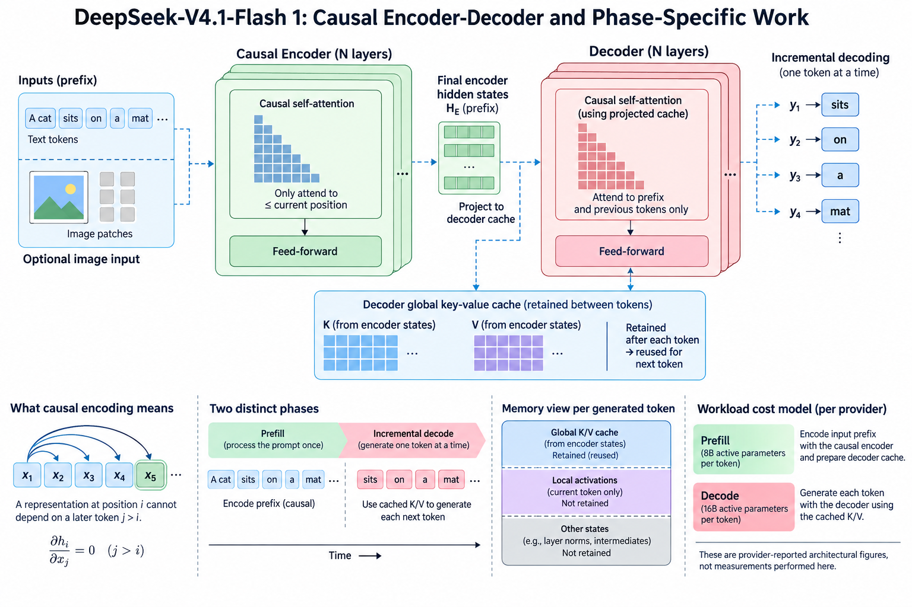
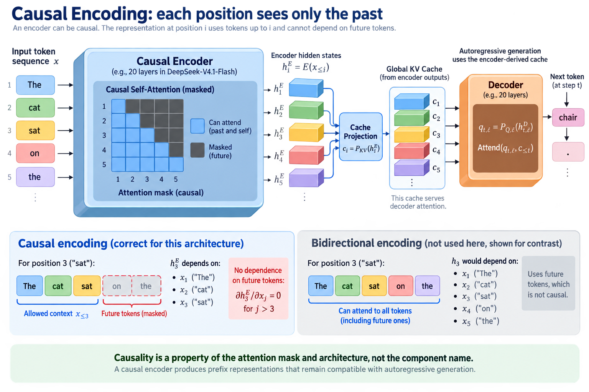
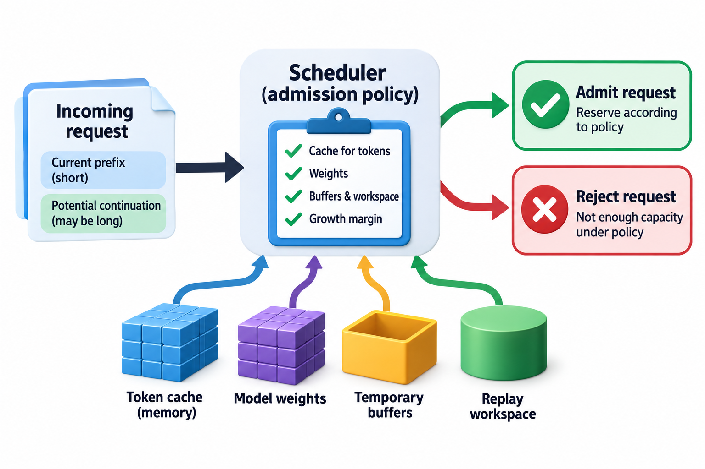

DeepSeek-V4.1-Flash's released model card describes a causal encoder-decoder architecture rather than a conventional stack in which every layer produces independent global key-value history from its own hidden states. The distinction matters for both state provenance and the distribution of work between prompt processing and token generation.

This article follows the official release card checked on September 13, 2026. The card reports 40 Transformer layers divided into a twenty-layer causal encoder and a twenty-layer decoder. It also reports 8 billion active parameters per token during prefill and 16 billion during decode. These are provider-reported architectural figures, not measurements performed here.

## 1. Clarify what causal encoding means

*Overview of the article’s core mechanism. The following sections explain the objects, relationships, equations, assumptions, and worked examples shown here.*

An encoder does not necessarily imply unrestricted bidirectional attention. The word describes a role in this architecture, while causality describes which information a representation may use. A causal representation for position i cannot depend on a later token that was unavailable at that step.

$$
h_i^{E}=E(x_{\le i}),\qquad
\frac{\partial h_i^{E}}{\partial x_j}=0\quad\text{for disallowed future }j>i.
$$

The derivative notation expresses the intended dependency restriction, not a requirement to calculate those derivatives in serving. Masks, recurrence rules, and architectural operations must jointly enforce the restriction. A component's name alone is not evidence about its attention mask.

This distinction lets a causal encoder process prefix representations that remain compatible with autoregressive generation. It also prevents an incorrect analogy with a translation encoder that can freely inspect an entire source sequence.

## 2. Follow global state provenance

The official card states that decoder global key-value cache is projected from final encoder hidden states rather than derived from each decoder layer's own hidden states. That changes the source representation underlying the decoder's global memory.

A conceptual notation separates encoder representation, cache projection, and decoder query:

$$
c_i=P_{KV}(h_i^{E}),\qquad
q_{t,\ell}=P_{Q,\ell}(h_{t,\ell}^{D}),\qquad
u_{t,\ell}=\operatorname{Attend}(q_{t,\ell},c_{\le t}).
$$

This is explanatory notation, not a complete specification of CSA2 or the released tensor shapes. The actual model includes sharing, indexing, positional structure, and other components discussed in later articles. Do not infer independent projected copies for every decoder layer from this schematic.

The key point is ownership: global memory comes from encoder outputs. A serving system must preserve the representation and metadata required by that path rather than treating the cache as an ordinary per-decoder-layer self-attention allocation.

## 3. Separate prompt processing and generation

Prefill processes input tokens and establishes state for generation. Decode processes newly generated tokens and produces subsequent predictions. The card's reported active-parameter figures indicate different phase-specific paths, but active parameters do not fully specify operation counts or elapsed time.

Input-heavy requests can spend much of their work establishing a long prefix and produce a relatively short answer. Output-heavy requests generate many new tokens. The same architecture can have different practical advantages across those populations.

Record input and output token counts separately in a benchmark. A single total-token throughput can hide whether the improvement occurs in prompt processing or generation. The release card's rationale emphasizes input-heavy agentic workloads; evaluate that rationale under the actual request distribution.

## 4. Derive a workload cost model

Let n_in and n_out be input and output token counts. Let a_p and a_d represent average phase-specific costs per token under a fixed setup, with H covering request overhead. A simple first-order model is:

$$
C_{\mathrm{request}}\approx n_{\mathrm{in}}a_p+n_{\mathrm{out}}a_d+H.
$$

The coefficients can stand for measured device time or another defined cost, but their unit must be consistent. They need not remain constant with context length, batch size, or routing distribution. The formula organizes accounting rather than asserting perfectly linear hardware behavior.

For illustrative coefficients of 1 unit for input and two for output, a ten-thousand-token prompt with a hundred-token response spends most of its modeled work in prefill. A hundred-token prompt with ten thousand generated tokens is dominated by decode. These examples explain why a phase-specific change needs a workload description.

## 5. Interpret active counts carefully

The card reports a 552-billion-parameter backbone MoE and also lists Engram conditional memory with 196 billion parameters. Do not add these figures without an explicit consistent accounting statement about inclusion. Total backbone, conditional memory, and active parameters can refer to different populations.

Within the MoE layers, the card lists 1 shared expert and 384 routed experts, activating 6 routed experts per token. Routing determines selected work but does not remove all expert weights from storage. Memory planning must use the actual assigned weight representation and placement.

Reported phase-active counts are informative about conditional paths. They are not a universal substitute for arithmetic accounting because projections, attention history, sparsity, and representation precision affect the number and cost of operations.

## 6. Preserve local and global state distinctions

The release combines global-memory mechanisms with sliding-window attention and bounded replay. Global cache and local recent-token state have different roles. An estimate that merges them into one undifferentiated key-value number can hide the actual persistence policy.

The card reports global cache at eight hundred ninety bytes per token and describes a separate reduction in persistent cache through bounded replay. These numbers have different baselines and scopes. The second and third case studies explain the distinctions; this article uses them only to identify separate state categories.

List which state remains in device memory during an active request, which state is persisted across inactivity, and which state can be reconstructed. Temporary replay workspace also belongs in peak-memory planning even if it does not belong in the persistent-byte figure.

## 7. Derive prefix reuse conditions

A cached prefix is valid only if it was produced by compatible inputs and execution semantics. Encoder-derived global state depends on model weights, token sequence, image embeddings where present, positional policy, and relevant representation settings.

$$
\mathrm{reuseValid}\Rightarrow
\mathrm{samePrefixInputs}\land\mathrm{compatibleWeights}\land
\mathrm{compatiblePositions}\land\mathrm{compatibleStateFormat}.
$$

The implication lists necessary conditions rather than a complete universal cache-key algorithm. Quantization scales, sparse-index metadata, and implementation version can introduce further requirements. An identical visible text string is not enough when hidden multimodal inputs or configuration differ.

A robust serving implementation associates cache entries with a versioned state contract. Changes to the architecture or stored representation should invalidate incompatible entries rather than relying on accidental tensor-shape compatibility.

## 8. Follow image inputs into the encoder

The card describes a vision encoder using two-dimensional rotary positioning and three-by-three pixel-unshuffle downsampling, followed by a two-layer MLP projector. Its embeddings are processed jointly with text from the start of language-model pretraining.

This means that global state can depend on visual as well as textual representations. An image's resolution and preprocessing determine its token representation, so prompt length cannot always be estimated from text alone. The model's multimodal input pipeline belongs in the capacity and latency description.

Do not treat the vision encoder as a purely decorative preprocessing step. Its output influences the causal language computation. Prefix reuse must account for the actual image representation and preprocessing contract, including ordering among text and visual inputs.

## 9. Examine other components without conflating them

The card lists Single-Pass mHC residual-stream mixing, Engram token-based conditional memory, and DSpark speculative decoding. Each changes another aspect of execution. They should not all be attributed to the causal encoder-decoder division.

Residual mixing affects the path through which representations combine. Conditional memory adds sparsely accessed learned storage. Speculative decoding changes how candidate tokens are proposed and verified. An end-to-end result involving all three cannot isolate the CED contribution without further experiments.

Use component-level evidence where available and keep missing disclosure explicit. An official feature list establishes that components are present; it does not establish their independent percentage contribution to latency or quality.

## 10. Build a phase-aware benchmark

Measure prefill duration, time to first token, decode token intervals, total completion time, and relevant memory separately. Use a request distribution with defined input lengths, output lengths, multimodal composition, and concurrency.

Record the released checkpoint, serving implementation, numerical representation, device topology, and cache policy. A comparison using another backend or cache configuration can be valuable, but it becomes a system comparison rather than a controlled architecture experiment.

Provider-reported benchmark charts retain their provenance. This article does not reproduce them as independent verification. A useful local result would include both workload controls and enough phase evidence to assess the claimed mechanism.

## 11. Validate causal and cache handoffs

A small reference test can compare processing a complete sequence with processing a prefix followed by cached extensions. The newly produced outputs should agree within the implementation's numerical contract. That comparison exercises encoder-derived state, positions, and phase handoff.

To test causality, change a future token and verify that earlier representations or outputs remain unaffected under the defined mask. For multimodal inputs, apply the same dependency reasoning to their actual position placement. The test must respect the model's input serialization.

Also test cache invalidation across changed weights, representation formats, and position settings. A correctly sized but incompatible cache can silently change predictions. Tensor shape is only one aspect of validity.

## 12. Understand the limits of the simple cost model

The per-token coefficients in the request equation can vary with batching and context. A long prefix changes attention and indexing work. Small decode batches can expose launch or communication latency, while larger groups can improve expert matrix utilization.

A more useful empirical model can stratify coefficients by phase, context bucket, and concurrency. Preserve uncertainty and tail behavior instead of reporting one coefficient with unwarranted precision. The goal is to predict the intended workload, not to give architecture names permanent cost constants.

When another component becomes the bottleneck, reducing selected parameter work may produce only a modest request-level gain. Profile the system before translating a parameter-activity statement into a latency forecast.

## 13. Keep the release evidence reproducible

Store the model-card revision or retrieval date alongside the configuration. The analysis here follows the published DeepSeek-V4.1-Flash card, not an assumed relationship to older DeepSeek generations. Similar terminology can conceal revised cache structures and layer roles.

No model weights were executed or device benchmarks performed for this article. The derivations are original explanatory models based on the disclosed architecture. Their purpose is to make phase work, cache provenance, and workload assumptions explicit enough for further measurement.

The causal encoder-decoder design is therefore best evaluated through the path from input representation to global state and generated-token work. That path provides a concrete infrastructure interpretation while leaving undisclosed implementation details and unmeasured performance open.

## 14. Separate a capacity claim from an admission policy

Knowing the cache bytes per token helps estimate how many active requests fit, but it does not decide which requests should be admitted. The serving system also needs weights, temporary buffers, replay workspace, and a margin for variable request growth. A request with a short current prefix can later produce a long continuation, so admission based only on current cache allocation can overcommit future capacity.

Define whether the scheduler reserves maximum continuation space, uses incremental allocation, or evicts inactive state under a documented policy. Each choice affects latency and failure behavior. Encoder-derived state and bounded replay can change the cost of eviction and restoration, but they do not remove the need for an admission rule.

A workload review should connect architectural byte estimates to the actual scheduler: what state is retained, when it is evicted, and what work is needed to resume. That connection makes a memory-efficiency claim relevant to concurrency rather than leaving it as an isolated per-token ratio.

## Sources

- [Official DeepSeek-V4.1-Flash model card](https://huggingface.co/deepseek-ai/DeepSeek-V4.1-Flash).
- [DeepSeek API documentation](https://api-docs.deepseek.com/).
