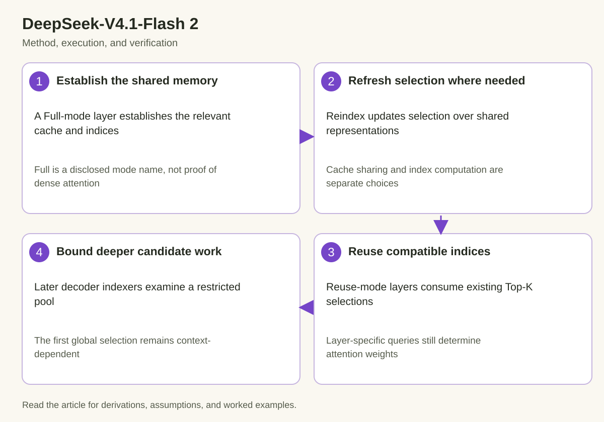

Compressed Sparse Attention 2 in DeepSeek-V4.1-Flash combines several ideas that should be analyzed separately. Layers can share representations, some layers recompute sparse indices, and other layers reuse earlier selections. The decoder also restricts later indexing to a candidate pool established by an earlier layer. These choices affect storage and search work in different ways.

The official release card names 3 static modes: Full, Reindex, and Reuse. It says these modes share main KV and indexer K across layers and reuse Top-K sparse-attention indices. The card does not provide every tensor shape or scheduling detail in its overview. This article derives the disclosed mechanism's implications without inventing those missing details.

## 1. Separate representation, selection, and weighting

*The diagram connects the mechanism to its execution and verification. The derivation below defines the quantities and assumptions.*

Attention needs a representation of historical content, a policy describing which positions are eligible, and weights over those positions. Dense attention makes the full permitted history eligible. Sparse attention selects a smaller set according to another mechanism.

$$
S_{t,\ell}=\operatorname{Select}_{\ell}(q^{I}_{t,\ell},K^{I}),\qquad
u_{t,\ell}=\sum_{i\in S_{t,\ell}}a_{t,i,\ell}v_i.
$$

The superscript I identifies indexer representations in this explanatory notation. Main attention representations need not be identical to indexer representations. Selecting an index and calculating its attention weight are different operations, even if both use learned projections.

Reusing an index set therefore does not force identical outputs across layers. Layer-specific queries or other transformations can produce different weights over the same selected positions. Conversely, refreshing weights does not mean the layer refreshed the candidate search.

## 2. Interpret mode names carefully

The Full-mode name should be treated as a name in the released design. It is not enough evidence to assert that the layer performs ordinary dense global attention over every token. The release describes a sparse-attention mechanism and uses Full to distinguish a mode responsible for establishing relevant state and selection.

Reindex and Reuse indicate different treatment of sparse selection over shared state in the card's overview. Their exact ownership, operation order, and tensor boundaries require the released implementation or further documentation. Avoid filling those gaps from older CSA versions or similarly named mechanisms.

An architecture review can still explain the fundamental separation: sharing cached representations saves repeated state, while reusing selections avoids repeated indexing work. These are independent savings that should not be multiplied blindly into a performance claim.

## 3. Derive cross-layer storage sharing

Suppose L layers would otherwise retain independent history of B_tok bytes per token. If a group of g layers can use a shared compatible representation, its main-state storage can approach a shared allocation plus group-specific side state rather than g complete copies.

$$
M_{\mathrm{independent}}=L n B_{\mathrm{tok}},\qquad
M_{\mathrm{shared}}\approx\frac{L}{g}nB_{\mathrm{tok}}+M_{\mathrm{side}}.
$$

This is a hypothetical grouping model, not a disclosure of the release's group size. Side state can include indices, positional information, and layer-specific data. The exact cache figure must come from the actual released representation, not a guessed g.

Sharing requires that the consuming layers are trained to use the common representation. Arbitrarily pointing several independent Transformer layers at the same cache does not preserve their original computation. The storage opportunity comes from the architecture's parameterization.

## 4. Separate main KV and indexer K

The card explicitly distinguishes main KV from indexer K. Main state supplies the content used by attention; indexer state supports selecting relevant positions. Their dimensions, precision, and sharing policies can differ.

A capacity estimate should count both when both remain stored. A statement about compressed main cache does not automatically cover all indexing metadata. Likewise, sparse selection indices can grow with active query positions or layers even when the underlying representation is shared.

The execution system must preserve association between an index and its logical token position. Paging, eviction, or block compaction can change physical addresses without changing logical positions. Address translation and selection metadata must remain compatible.

## 5. Derive hierarchical candidate cost

The card states that the decoder's later indexing layers restrict their search to a candidate pool constructed by the first Full-mode layer. Let n be history length, C be pool size, and R be the number of later indexers. A simple linear-scan cost model becomes:

$$
T_{\mathrm{index}}\approx a n+R b C,
$$

where a and b represent per-candidate costs in a fixed setup. Compared with every indexer scanning n positions, deeper work can be bounded by C when the pool is bounded. The first selection still depends on the global history in this model.

This distinction prevents a false claim of completely context-independent indexing. The card's statement concerns deeper indexer cost. Overall request work still includes the initial selection, attention over chosen content, other layers, and phase-specific operations.

## 6. Work through candidate restriction

For an illustrative history of 100,000 positions, suppose an initial indexer produces a pool of 1,024 candidates and 7 later indexers examine that pool. A naive candidate-count comparison is 100,000 plus 7 times 1,024 versus 8 times 100,000. These are hypothetical counts, not the model's published settings or hardware timings.

The calculation explains how repeated global search can become repeated bounded search. It also exposes the quality tradeoff: a position missing from the initial pool cannot be recovered by a later indexer restricted to that pool. Candidate recall becomes a property of the hierarchy.

Increasing pool size can improve opportunity for retrieval while increasing deeper work and metadata. The appropriate value requires training and evaluation evidence. A mathematical reduction in scanned candidates alone does not establish acceptable long-context behavior.

## 7. Distinguish candidate recall and final attention

An indexer is a retrieval gate. Its pool needs to contain positions useful to later computations. The final attention weights then decide how strongly selected values contribute. A poor candidate pool can limit the result even if the attention kernel perfectly implements its weighted sum.

One diagnostic measure is the fraction of a reference set retained by the candidate pool:

$$
\operatorname{Recall}(S,R)=\frac{|S\cap R|}{|R|}.
$$

Here R is a explicitly defined reference set, not necessarily an objectively correct set for every language task. A dense-attention top-score set can be a diagnostic reference but does not by itself establish downstream quality. Behavioral evaluation remains necessary.

Measure retrieval properties across context lengths, distractor distributions, and required relationships. An average recall can hide rare failures important to an application.

## 8. Explain index reuse across depth

Index reuse means that a layer consumes an earlier selection instead of repeating the selection procedure. Its benefit depends on how often selection would otherwise be computed and how much that computation costs.

Reuse also constrains flexibility. A later layer cannot select a position outside the reused set unless another documented path permits it. The model must learn to use the available selection policy. Treat that constraint as part of the trained architecture rather than an execution-only optimization with guaranteed unchanged quality.

Different weights over the reused positions still allow different outputs. This is analogous to several queries reading the same stored key-value basis: common eligible positions do not imply identical relevance distributions.

## 9. Track the metadata lifetime

Selection indices are state with a lifetime. They must remain available until every consuming layer has finished. An asynchronous implementation cannot recycle their buffer merely because the producing indexer has returned.

$$
\mathrm{indexPublish}\prec\mathrm{consumerRead},\qquad
\mathrm{lastConsumerDone}\prec\mathrm{indexBufferReuse}.
$$

These relations describe required handoffs, not a specific GPU synchronization primitive. The implementation must establish them under the correct scope and execution order. The same ownership reasoning applies to shared main cache and indexer representations.

If cache pages move or are restored, verify whether stored indices are logical positions or physical references. Reinterpreting one as the other can select wrong content while keeping index values within a superficially valid range.

## 10. Preserve causal eligibility

Sparse selection cannot grant access to disallowed future positions. The candidate search and attention stage must both respect sequence identity and causality. An indexer's high score for a future position is irrelevant if that position is not eligible.

Packed batches and multimodal serialization add boundaries. Candidate metadata must belong to the correct sequence and input ordering. A sparse mask that works for a single unpadded sequence may fail when several examples share storage.

Test empty or very short histories, partial pages, repeated tokens, and phase transitions. If a selected set contains fewer valid positions than its storage capacity, define how the kernel represents and masks unused entries.

## 11. Measure the hierarchy directly

Profile initial indexing, deeper indexing, sparse attention, and other substantial components separately. Compare candidate counts and bytes read with elapsed time. Reduced scan population can still encounter small-kernel overhead or poor memory locality.

Use context sweeps and a defined batch distribution. If deeper cost is intended to remain bounded with context, examine its measured trend separately from the initial indexer. An aggregate time can conceal the intended bound because another component grows.

Record the checkpoint, backend, cache representation, and any pool settings actually disclosed or configured. No timings in this article are presented as device measurements.

## 12. Validate the sparse execution path

A small reference can materialize selected positions, calculate their attention scores, and combine values. Compare it with the optimized gather and attention implementation. Use distinct values by logical position to expose incorrect translation or duplicated selections.

Validate selection separately from attention arithmetic. A correct weighted sum over the wrong positions is still a model error. Test index reuse and reindex transitions according to the implementation's supported mode sequence.

For end-to-end quality, use tasks requiring distant retrieval and combinations of facts. Candidate-count reduction is a system metric; language behavior establishes whether the trained hierarchy remains useful.

## 13. Keep reported cache reductions scoped

The release card reports 890 bytes per token for global cache and a roughly 4-fold reduction relative to DeepSeek-V4-Flash. It separately discusses persistent-cache reduction through bounded replay. Do not attribute the latter ratio solely to CSA2 sharing or multiply the ratios as if they shared one denominator.

This case study establishes the disclosed division of representation sharing, selection refresh, selection reuse, and hierarchical restriction. Missing dimensions or implementation details remain missing. The next article examines numerical cache representation and replay as distinct mechanisms.

## 14. Account for selection storage

Candidate reduction creates metadata as well as savings. If a selected set holds K position identifiers and each identifier occupies b bytes, a simple storage term is K times b for each independently retained set. The number of sets depends on query positions, batches, and sharing across layers. That term can be modest beside content state, but it should not disappear from the accounting.

An implementation may also need temporary score buffers, sort or selection workspace, and page-translation information. Those allocations can affect peak memory during prefill even when the persistent cache remains compact. Separate persistent state from transient workspace instead of comparing a persistent figure from one design with a peak figure from another.

For a reproducible review, identify the owner and last consumer of each selection buffer. Determine whether reuse shares the exact stored index array or reconstructs an equivalent logical set. Both can implement a similar architectural policy, but their memory and synchronization costs differ. Inspect the actual backend before predicting the cost.

Finally, test duplicate indices and unused entries under the supported contract. Duplicates can change the weighted sum if treated as separate positions, while an unused entry can accidentally point to valid content. The selection representation is therefore part of correctness, not merely a bookkeeping detail beside the attention equation.

## Sources

- [Official DeepSeek-V4.1-Flash model card](https://huggingface.co/deepseek-ai/DeepSeek-V4.1-Flash).
