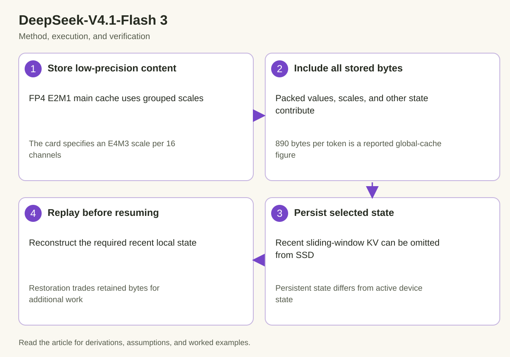

DeepSeek-V4.1-Flash's model card reports FP4 main key-value caching and a bounded replay mechanism for sliding-window attention state. Both reduce memory-related costs, but they operate on different representations and lifetimes. FP4 changes stored numerical content. Replay changes which state must remain persisted when a request is inactive.

The card reports 890 bytes per token for global cache, roughly 1/4 of DeepSeek-V4-Flash's corresponding figure. It separately reports a persistent cache footprint roughly 1/8 of that earlier model through bounded replay. These ratios have distinct scopes. Multiplying them without a common denominator would produce an unsupported memory claim.

## 1. Read the numerical format precisely

*The diagram connects the mechanism to its execution and verification. The derivation below defines the quantities and assumptions.*

The released overview specifies FP4 E2M1 for main cache and an E4M3 scale for each group of 16 channels. E2M1 describes a compact floating-point representation, while the group scale extends the range available to a collection of values. The exact encoding and rounding behavior belong to the implementation's numerical contract.

A representative reconstruction is a quantized code interpreted in the FP4 format and multiplied by its stored group scale:

$$
\widehat x_i=s_g\,\operatorname{decode}_{\mathrm{E2M1}}(q_i),\qquad i\in g.
$$

This equation explains the role of scaling without prescribing a particular scale-selection algorithm. The model card's scale format does not by itself disclose clipping, rounding, handling of nonfinite values, or every layout detail. Do not invent those settings from the format name.

## 2. Calculate scale overhead

For 16 values stored at 4 bits each, packed value data occupies 8 bytes. An 8-bit E4M3 scale adds another byte, so this simple group uses 9 bytes before other overhead. The effective storage is 4.5 bits per value under these assumptions.

$$
B_{\mathrm{group}}=16\frac{4}{8}+1=9\ \mathrm{bytes},\qquad
b_{\mathrm{effective}}=\frac{8B_{\mathrm{group}}}{16}=4.5.
$$

This is a representation calculation, not the complete model-cache figure. Alignment, padding, positional components, indexer state, and other metadata can add bytes. A statement that every cached element consumes exactly half a byte would omit the scale contribution.

The reported 890-byte global figure must be treated as a release claim about its actual aggregate state. The overview alone does not provide enough complete tensor-layout information to independently derive that precise number from the group formula.

## 3. Explain grouped quantization error

Values in one group share a scale. A large-magnitude value can influence the representable range for smaller values in that group. Scale selection therefore creates a tradeoff between clipping large values and preserving resolution for small ones.

Let the reconstruction error be delta x. A downstream linear projection transforms that error, and an attention score can amplify it depending on the query direction. Measuring code error alone is not enough to establish language-model behavior.

$$
\Delta y=W\Delta x,\qquad
\|\Delta y\|\le\|W\|\,\|\Delta x\|.
$$

The norm bound is diagnostic and can be loose. It explains why projected error depends on both stored error and learned weights. Attention normalization, value reconstruction, and later layers introduce further effects. Evaluate the actual model path under its chosen cache representation.

## 4. Separate weights and cache precision

Quantizing expert weights and quantizing key-value state are different changes. Weight values are learned and relatively fixed during inference. Cache values depend on each request and grow or evolve as tokens are processed.

A format validated for weights does not automatically establish a suitable policy for request-dependent activations. Their distributions, outliers, reuse patterns, and quality sensitivity differ. Keep the cache precision attached to the cache metric instead of borrowing a weight-memory figure.

Likewise, an execution kernel may accumulate in a higher precision after decoding low-precision data. Stored precision and arithmetic precision should be reported separately. An FP4 cache does not imply that every attention operation uses FP4 accumulation.

## 5. Define sliding-window state

Sliding-window attention retains or uses recent positions according to the model's window policy. Let the window contain w tokens. A local key-value state can therefore be bounded in length even when the full request history is much longer.

The card's bounded replay reconstructs missing sliding-window state by replaying only the recent n_win tokens, avoiding persistence of that local KV state to SSD. This relies on the released computation's reconstruction policy. It should not be generalized into a claim that any Transformer layer's state can be rebuilt from a short suffix without other retained information.

Global state remains another category. A recent window cannot replace every long-range representation needed by the model. The replay strategy must retain or restore all other inputs required to reproduce the local state.

## 6. Derive persistence and restoration costs

Let G be the bytes of global state that remain persisted, W the local state omitted through replay, and R the replay work needed on resumption. A simplified comparison is:

$$
M_{\mathrm{persist,full}}=G+W,\qquad
M_{\mathrm{persist,replay}}\approx G+M_{\mathrm{replayInputs}},\qquad
T_{\mathrm{resume}}=T_{\mathrm{restore}}+T_R.
$$

Replay inputs can include recent tokens and other required metadata. Their bytes should not be assumed zero. The restoration equation includes both loading retained state and rebuilding omitted state.

The decision depends on inactivity duration, persistence bandwidth, expected resumption frequency, and latency requirements. A large storage reduction can be useful even if resumption becomes more expensive, but the tradeoff must be measured for the workload.

## 7. Work through an inactive request

Consider a request with a long history that pauses between agent actions. While active, it uses global memory and recent local state. On suspension, the serving system persists the designated global state and reconstruction inputs, while omitting local KV according to the supported policy.

On resumption, the system restores the retained state, replays the required recent tokens to rebuild local state, and only then proceeds with generation. The handoff must establish completion and compatibility before a decode step reads the rebuilt buffers.

If the request never resumes, replay work is never paid. If it resumes frequently after short pauses, repeated reconstruction can become material. These cases explain why inactive-request memory and active-request throughput should be evaluated separately rather than reduced to one compression percentage.

## 8. Preserve reconstruction identity

Replay must use compatible model weights, token sequence, multimodal representations where required, positions, and numerical settings. A changed checkpoint or preprocessing policy can make retained global state incompatible with rebuilt local state.

$$
\mathrm{replayState}=F_{\mathrm{local}}(\mathrm{recentInputs},\mathrm{retainedContext},\mathrm{configuration}).
$$

This explanatory function makes the dependencies explicit without claiming that the release uses one simple isolated local function. The actual state-generation graph determines which inputs and retained context are required.

A cache entry should carry a versioned representation contract. Resuming with correctly sized but incompatible tensors is not safe. The serving system must invalidate or reconstruct from a valid earlier boundary when compatibility fails.

## 9. Account for peak device memory

Persistent bytes describe what remains stored across inactivity. Active device memory includes restored global state, rebuilt local state, weights, temporary replay buffers, and workspace for generation. Peak memory can occur during replay or restoration rather than steady-state decode.

An admission policy should reserve or manage that peak. If many requests resume simultaneously, replay concurrency can create both memory pressure and compute contention. A system that fits many inactive entries may still need to stagger their resumption.

Measure allocated and reserved memory separately where the runtime exposes them. Allocator pools and temporary buffers can obscure how a state reduction affects observed device capacity. Report the actual quantity used in the claim.

## 10. Test the numerical cache path

Compare the intended high-precision reference with the quantized cache path on defined workloads. Examine output differences, nonfinite behavior, long-context retrieval, and task quality. Tests should exercise the actual grouping, scale representation, packing, and decoding.

Use values near scale boundaries, groups with outliers, small-magnitude values, and partial groups under the supported layout. A random average-error test can miss clipping or packing mistakes. Distinct channel patterns help expose nibble-order or group-association errors.

The format analysis here does not claim that a generic E2M1 implementation reproduces the released model. The trained checkpoint, cache policy, and backend together determine the supported behavior.

## 11. Test replay against uninterrupted execution

Run a small request uninterrupted and record the relevant state or outputs. Then suspend at the same boundary, persist only the supported state, restore and replay, and compare subsequent generation under a controlled configuration.

Exercise pauses at different positions, including histories shorter than the window and positions near its boundary. Verify that replay neither skips required recent tokens nor duplicates them in the logical state. Positional offsets must match the uninterrupted path.

Also test failure during persistence or restoration. A partially written entry must not appear complete to a resuming worker. Publication metadata should distinguish a valid snapshot from a reserved or interrupted one, using the storage system's actual atomicity guarantees.

## 12. Measure the relevant workload

Report persistent bytes, restore time, replay time, time to resumed first token, and subsequent decode latency separately. Include the distribution of pause durations and resumption rates. A memory optimization for agentic pauses may have little relevance to a continuous generation benchmark.

For quantization, record the exact cache representation and backend. For replay, record window policy and reconstruction boundary where disclosed. Keep the release's reported ratios attached to their original baseline rather than presenting them as independently measured results.

No model execution or GPU benchmark was performed for this article. The worked equations describe mechanisms and accounting. Production decisions require phase-specific measurement and quality validation under the intended numerical path.

## 13. Interpret the 2 reductions together

FP4 lowers bytes for a stored numerical representation. Bounded replay avoids persisting selected local state and rebuilds it when necessary. Their composition can improve inactive-state capacity, but the complete accounting must identify overlapping state categories and reconstruction inputs.

The official card's 890-byte global figure and roughly 1/8 persistent comparison are therefore complementary evidence with different labels. They should remain distinct in dashboards, article captions, and capacity models. This preserves the innovation's meaning while preventing an exaggerated aggregate compression claim.

## 14. Estimate when replay pays for itself

A simple economic model compares retained-storage cost with expected resumption work. Let an inactive request remain suspended for duration d, let the omitted local state contain W bytes, and let a defined storage cost rate be c per byte per unit time. The avoided retention cost is proportional to W times d times c. If resumption occurs with probability p and replay costs r in a consistently converted cost unit, the expected reconstruction cost is p times r.

This model requires a common unit before comparing terms. Device time, SSD bytes, and monetary cost are not directly interchangeable. A deployment can assign an explicit accounting rate or instead treat storage capacity and resume latency as separate constraints. The latter is often clearer when a latency objective is strict.

The model explains the role of pause duration: longer inactivity makes retained-state reduction more valuable, while frequent resumption makes repeated replay more important. It does not establish an optimal threshold without measured costs and the actual request distribution. A scheduler can evaluate several inactivity thresholds and report both capacity and resumed-request tail latency.

Replay also uses resources shared with active requests. Its direct duration is only part of the effect if it delays unrelated decode work. Measure concurrent behavior and consider staggering restoration rather than assuming every suspended request can resume at once. Conversely, spare compute during a quiet period can make reconstruction less disruptive.

Finally keep failure behavior visible. If insufficient memory prevents restoration, the system needs a defined retry, eviction, or recomputation policy. A persistence optimization becomes useful infrastructure only when the request lifecycle remains correct and its latency consequences are understood.

## Sources

- [Official DeepSeek-V4.1-Flash model card](https://huggingface.co/deepseek-ai/DeepSeek-V4.1-Flash).
