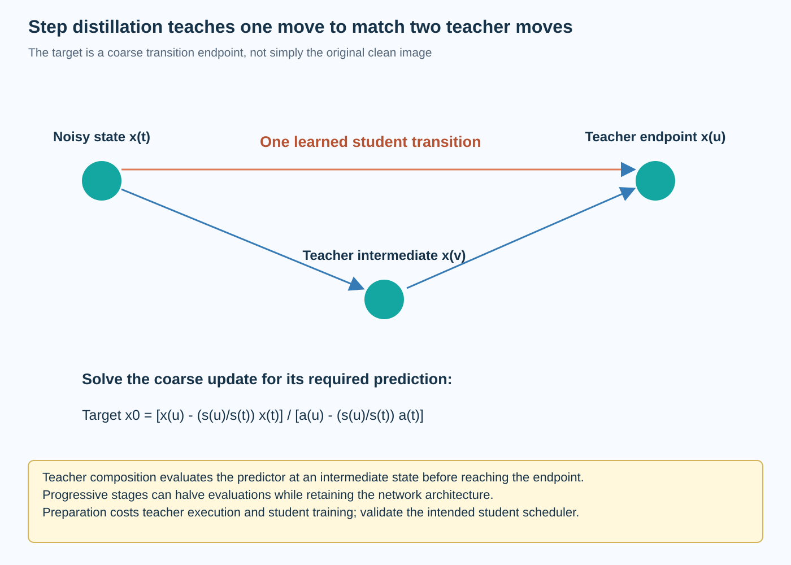

Step distillation trains a diffusion predictor to make larger useful moves during generation. Instead of changing only the numerical solver, it changes the model so that a shorter trajectory can approximate a slower teacher. The repeated inference work can shrink, while teacher execution and student training move cost into preparation.

Progressive distillation provides a concrete example: one student update is trained to match 2 teacher updates, and the process can repeat to reduce the required step count. This article derives that target and explains why it differs from ordinary image reconstruction or classifier distillation. The numerical examples are illustrative, not measured generation results.

*An original conceptual illustration. Numerical plots and examples are illustrative unless explicitly identified as measured evidence.*

## 1. Separate model and sampler changes

A training-free sampler uses the existing predictor with another supported integration rule or timestep schedule. Step distillation changes predictor parameters using a teacher trajectory as supervision.

The two interventions can be compared, but their preparation costs differ. A solver change can require validation without student training, while distillation adds teacher evaluations, optimization, and checkpoint management.

Also preserve the intended inference scheduler. A student trained to make a particular coarse transition should not be treated as interchangeable with every generic many-step predictor. Its useful behavior belongs to a model-and-sampler pair with documented noise levels, conditioning, and guidance.

## 2. Define the noise-level notation

Write a corrupted state using signal amplitude a_t and noise amplitude s_t. This notation uses amplitudes rather than variances.

$$
x_t=a_t x_0+s_t\epsilon.
$$

For a variance-preserving schedule, the amplitudes satisfy a_t squared plus s_t squared equal to 1. Other formulations can use another schedule while preserving an appropriate predictor conversion.

The ordering of t depends on the corruption convention. In this article, u denotes a less noisy level reached from t during generation. Record actual scheduler coefficients instead of inferring them from labels such as early or late, which can be reversed between implementations.

## 3. Express one deterministic update

Suppose the model predicts a clean sample x_hat at state x_t. Rearranging the corruption relationship gives a corresponding noise estimate. A deterministic DDIM-style update reuses that pair at the next selected level.

$$
\widehat\epsilon=\frac{x_t-a_t\widehat x_0}{s_t},\qquad x_u=a_u\widehat x_0+s_u\widehat\epsilon.
$$

This expression assumes nonzero s_t and the stated deterministic setting. Endpoint and stochastic variants need their documented policies.

The update combines a predicted clean direction with the current residual. It is not simply replacing x_t with the teacher's final image. That structure makes it possible to solve for the clean prediction required to reach a teacher-defined endpoint in one step.

## 4. Rearrange the coarse transition

Substituting the inferred noise into the update gives an affine expression in the model's clean prediction.

$$
x_u=\frac{s_u}{s_t}x_t+\left(a_u-\frac{s_u}{s_t}a_t\right)\widehat x_0.
$$

The coefficient multiplying x_hat depends on the two selected noise levels. A coarse move changes that coefficient and therefore changes the prediction needed to land at a particular endpoint.

This identity is exact for the stated update in real arithmetic. It does not establish that a finite student can learn every target perfectly. It supplies the numerical interface for defining supervision, while training and evaluation determine the approximation achieved by the student.

## 5. Construct the teacher endpoint

Starting from x_t, run 2 teacher updates through an intermediate level v to reach u. The second prediction is conditioned on the intermediate state produced by the first update.

$$
x_v=\Phi_{t\to v}^{\mathrm{teacher}}(x_t),\qquad x_u^{\mathrm{teacher}}=\Phi_{v\to u}^{\mathrm{teacher}}(x_v).
$$

The composition is generally not equivalent to evaluating the teacher only once at x_t. The predictor is nonlinear and the second state differs.

Teacher parameters, conditioning, schedule, and numerical policy determine the endpoint. Under a deterministic teacher trajectory, that endpoint is fixed for a given starting state and condition. This creates a target for learning a larger student transition rather than an ambiguous attempt to recover one unknown original image.

## 6. Derive the distillation target

Solve the coarse affine transition for the clean prediction that would reach the teacher endpoint in one student update.

$$
\widetilde x_0=\frac{x_u^{\mathrm{teacher}}-(s_u/s_t)x_t}{a_u-(s_u/s_t)a_t}.
$$

The denominator must be valid under the selected schedule. Near-degenerate coefficients can create numerical sensitivity, so follow the method's timestep and parameterization policies.

The target depends on the teacher's composed transition, not only on the original clean training sample. Progressive distillation uses this distinction to teach a student the behavior needed for a coarser generation path. A direct loss against x_0 would define a different estimation task.

## 7. Work through a scalar target

Take illustrative amplitudes a_t equal to 0.6 and s_t equal to 0.8. At the target level, let a_u equal to 0.8 and s_u equal to 0.6. These pairs each satisfy the variance-preserving amplitude identity.

Suppose the initial scalar state is 0.2 and the composed teacher endpoint is 0.5. The scale ratio is 0.75, and the target denominator is 0.35. The derived clean-prediction target is therefore 1.

Substituting that target into the coarse update gives 0.15 plus 0.35, or 0.5, exactly under the stated arithmetic. The example verifies target inversion; it is not an image-quality result or proof that a trained student will reproduce the teacher on every input.

## 8. Define a training objective

A student clean predictor can minimize squared error to the teacher-derived target, with a timestep-dependent weight under a chosen recipe.

$$
\mathcal L_{\mathrm{distill}}=\mathbb E\left[w(t)\|\widehat x_{0,\theta}(x_t,t)-\widetilde x_0(x_t,t)\|_2^2\right].
$$

The target is treated as fixed with respect to student updates in the teacher-student procedure considered here. Teacher evaluation should not accidentally retain an unnecessary training graph.

Prediction type and weighting matter. The progressive-distillation paper discusses parameterization and stability choices. A schematic MSE illustrates the supervision, but reproducing the method requires its full documented training and scheduler contract rather than only this generic expression.

## 9. Explain the progressive stages

A teacher requiring 2N steps can train a student intended for N steps. The student can then become the next teacher, and another stage can target N divided by 2 under a compatible schedule.

This repeated halving connects each coarse model to an already useful finer trajectory. The original method initializes the student from the teacher under its architecture and training design.

Errors can accumulate across stages, and the very-few-step regime imposes a demanding approximation. Evaluate each stage rather than assuming successful halving at one budget guarantees equal quality at every later budget. Preserve checkpoint lineage and the target schedule with the final artifact.

## 10. Distinguish step count from network size

A step-distilled model can keep the same architecture as its teacher while using fewer evaluations. Its parameter count and single-evaluation cost can therefore remain similar even when complete generation becomes cheaper.

This is different from distilling into a smaller network. The two can be combined, but then the experiment changes both predictor capacity and trajectory length.

Report network evaluations, model bytes, peak allocation, and end-to-end time separately. Calling a model smaller because it uses fewer steps confuses architectural storage with repeated computation. The relevant efficiency mechanism here is a shorter useful generation path supported by learned coarse transitions.

## 11. Include guidance in the contract

Guidance changes the predictor used by the sampler. Distillation can incorporate a chosen guidance policy or otherwise require a documented supported range. A student is not automatically compatible with arbitrary guidance scales absent evidence.

If the teacher endpoint uses conditional and unconditional evaluations, count both in preparation. If the deployed student avoids some repeated guidance work, verify that behavior in the actual inference path.

Compare quality under the intended condition fidelity and diversity requirements. A faster configuration that silently changes guidance can answer a different generation question. Store prompts, conditioning encoders, scale conventions, and sampler settings alongside the step-distilled checkpoint.

## 12. Account for preparation cost

Each target can require multiple teacher predictions, and each training stage adds optimization work. Total preparation includes data handling, teacher evaluation, student training, stage validation, and export.

$$
C_{\mathrm{prep}}\approx\sum_k\left(C_{\mathrm{teacher\ targets},k}+C_{\mathrm{student\ training},k}+C_{\mathrm{validation},k}\right).
$$

The units should be consistent and include discarded or failed work when it materially affects the resource claim. Shared targets can be reused, while online targets trade storage for repeated teacher execution.

A widely reused generator can amortize this preparation over many outputs. A one-off deployment may prefer a verified training-free solver. Compare the phases explicitly instead of presenting reduced inference evaluations as a complete lifecycle cost calculation.

## 13. Compare with strong sampler baselines

Evaluate the original model with a supported efficient solver at several network-evaluation budgets. Compare the step-distilled student under its intended scheduler, not only against an unnecessarily long or weak teacher baseline.

Use consistent conditions, resolution, output counts, and quality implementation. Record whether architecture, numerical precision, or conditioning also changes. Include preparation cost when the decision concerns total resource use.

No diffusion training run or GPU benchmark was executed for this article. Its target inversion and cost equations are explanatory. The primary papers provide empirical evidence under their settings; a new artifact needs its own quality-resource measurements.

## 14. Relate consistency and distributional approaches

Consistency models and distribution-matching distillation provide related ways to learn efficient generation, but they define different supervision and optimization problems. Consistency learning connects points on suitable trajectories, while distributional methods target generated-distribution properties under their formulations.

Do not label every few-step generator as progressive distillation. The teacher interface, loss, scheduler, and preparation procedure determine the actual mechanism.

Compare these approaches through the information transferred and the deployment contract. A low evaluation count is a useful outcome, but it does not explain how the predictor learned it or whether the same quality, diversity, and conditioning requirements are preserved.

## 15. Validate the transition numerically

A tiny scalar or matrix example can verify the composed teacher endpoint and target inversion. Substituting the derived target into the coarse update should reproduce that endpoint under appropriate numerical tolerance.

Check schedule indexing, predictor conversion, denominator handling, and teacher freeze status. Verify that the deployment uses the student schedule rather than accidentally retaining the teacher's finer grid.

Then evaluate held-out conditions and complete generation. A low training target loss does not establish identical images, diversity, or condition fidelity. The local transition objective supplies a useful learning mechanism, while task evidence determines whether the shorter trajectory is acceptable.

## 16. Choose the operating point from evidence

Step distillation shifts work from repeated generation into preparation and learning. Its central innovation is a teacher-derived coarse transition target that changes what the predictor must estimate at each noise level.

Select the step budget using a quality-resource frontier under the intended conditions. Retain the network architecture, scheduler, guidance policy, numerical format, and preparation lineage with the artifact.

This makes fewer-step generation understandable as a specific statistical and numerical system. It also clarifies the next deployment experiment: measure whether the reduced repeated work improves complete latency and throughput after fixed encoding, decoding, and service overhead are included.

## 17. Inspect failure cases at very low budgets

A coarse student can preserve broad composition while losing fine detail, or follow common conditions while failing unusual combinations. Inspect a documented held-out prompt population rather than only visually attractive outputs. Record whether failures concern condition fidelity, artifacts, diversity, or another task requirement.

Compare these cases with the teacher and a training-free sampler under similar resource budgets. The comparison helps distinguish limitations of the learned coarse transition from limitations already present in the teacher. It also guides the next preparation stage: more examples, a different loss or parameterization, or a less aggressive evaluation budget can address different observed problems.

## Sources

- [Progressive Distillation for Fast Sampling of Diffusion Models](https://arxiv.org/abs/2202.00512).
- [Denoising Diffusion Implicit Models](https://arxiv.org/abs/2010.02502).
- [Consistency Models](https://arxiv.org/abs/2303.01469).
- [One-step Diffusion with Distribution Matching Distillation](https://arxiv.org/abs/2311.18828).
