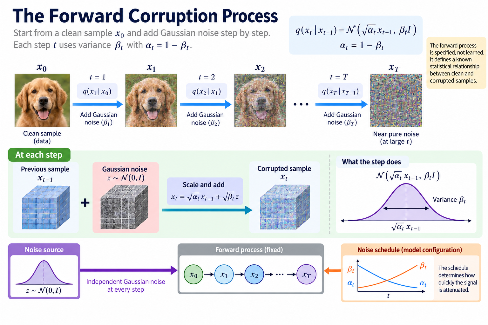
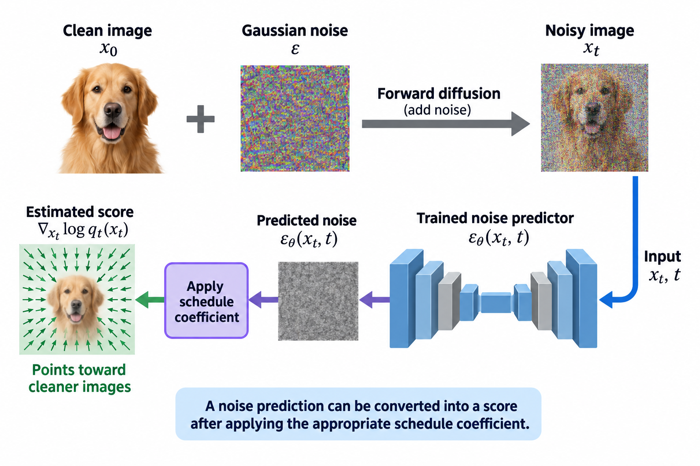

A diffusion model learns to reverse a process that gradually corrupts data with noise. The training task often looks like noise prediction, while generation repeatedly applies a learned denoising rule. The connection between those phases comes from the probabilistic forward process and its reverse-time approximation.

This article derives the core Gaussian identities behind denoising diffusion probabilistic models. It explains why noise prediction is meaningful, how it relates to a variational objective, and which cost terms matter for efficient generation. The image examples are conceptual; no diffusion training or GPU benchmark is reported here.

*An original conceptual illustration. Numerical plots and examples are illustrative unless explicitly identified as measured evidence.*

## 1. Define the forward corruption process

Let x_0 denote a clean data sample. A discrete forward process adds Gaussian noise over steps indexed by t. Each step uses a variance beta_t, with alpha_t defined as one minus beta_t.

$$
q(x_t\mid x_{t-1})=\mathcal N\left(\sqrt{\alpha_t}x_{t-1},\beta_t I\right),\qquad \alpha_t=1-\beta_t.
$$

The schedule determines how quickly signal is attenuated. Valid variance choices and timestep conventions belong in the model configuration.

The forward process is specified rather than learned in the basic formulation considered here. It gives a known statistical relationship between clean and corrupted samples, which makes it possible to construct training examples and derive useful posterior distributions.

## 2. Derive direct sampling at a timestep

Define cumulative alpha_bar_t as the product of alpha values through step t. Composing Gaussian transitions gives a closed-form marginal conditioned on the clean sample.

$$
x_t=\sqrt{\bar\alpha_t}x_0+\sqrt{1-\bar\alpha_t}\,\epsilon,\qquad \epsilon\sim\mathcal N(0,I).
$$

This lets training sample a timestep directly without simulating every earlier corruption step. The resulting example has a clean signal component and a noise component with known coefficients.

As alpha_bar decreases, the signal contribution shrinks. The relationship concerns the chosen forward process; it does not imply that a trained reverse model can perfectly reconstruct every sample after severe corruption. Learning and generation introduce additional approximation.

## 3. Work through signal and noise

Suppose alpha_bar at one illustrative timestep is 0.64. The clean-signal coefficient is 0.8, and the noise coefficient is 0.6. A scalar clean value of 1 with sampled noise negative 0.5 produces a corrupted value of 0.5.

If alpha_bar is instead 0.01, the clean coefficient is 0.1 and the noise coefficient is approximately 0.995. The same clean value contributes much less to the observation.

These values explain the algebra and are not images generated by a trained model. Across many samples, the Gaussian noise distribution remains essential to the probabilistic construction. One particular noise realization should not be interpreted as the expected appearance or quality of every corrupted sample.

## 4. Define the learned reverse transition

The reverse model approximates a transition from a noisier state to a less noisy one. A common discrete formulation uses a Gaussian whose mean is produced by a neural network and whose variance follows a chosen policy.

$$
p_{\theta}(x_{t-1}\mid x_t)=\mathcal N\left(\mu_{\theta}(x_t,t),\sigma_t^2 I\right).
$$

The network receives the timestep so that it can distinguish noise regimes. Conditioning information, such as text, can also enter the prediction interface in conditional models.

A Gaussian transition is a modeling approximation for the reverse process. Its suitability depends on schedule and discretization. The basic equation should not be expanded into a claim that every diffusion architecture uses the same learned variance or predictor parameterization.

## 5. Derive the conditional posterior variance

Conditioning on both x_t and x_0 gives a tractable Gaussian posterior for the preceding state under the forward process. Its variance is:

$$
\widetilde\beta_t=\frac{1-\bar\alpha_{t-1}}{1-\bar\alpha_t}\beta_t.
$$

This posterior supplies a target for reverse-transition learning in the variational derivation. The clean sample is available during training but not during ordinary generation.

Timestep endpoints require the documented model convention. The final reconstruction term and any stochastic terminal handling should not be treated as identical to every interior transition. Preserve those distinctions when translating the probability model into a sampler or loss implementation.

## 6. Parameterize the mean with predicted noise

A learned noise predictor epsilon_theta can express the reverse mean under the standard DDPM parameterization.

$$
\mu_{\theta}(x_t,t)=\frac1{\sqrt{\alpha_t}}\left(x_t-\frac{\beta_t}{\sqrt{1-\bar\alpha_t}}\epsilon_{\theta}(x_t,t)\right).
$$

The predictor estimates the noise component associated with the corrupted input and timestep. This converts a network output into a transition mean using known schedule coefficients.

Orientation and endpoint coefficients matter numerically. A mismatch between the trained prediction type and the sampler's interpretation can produce invalid generation even when tensor dimensions match. Record whether the model predicts noise, clean samples, velocity, or another documented quantity.

## 7. Explain the simple noise loss

The commonly used simplified training loss samples a clean example, a timestep, and Gaussian noise, then compares the prediction with that noise realization.

$$
\mathcal L_{\mathrm{simple}}=\mathbb E_{x_0,t,\epsilon}\left[\|\epsilon-\epsilon_{\theta}(x_t,t)\|_2^2\right].
$$

The reduction over dimensions and sampling distribution over t affect loss scale and emphasis. State those choices rather than assuming every mean-squared-error implementation gives the same objective.

The optimal predictor for a fixed corrupted input under squared error is a conditional expectation, not necessarily the exact noise that produced every possible underlying clean sample. Corruption can make the inverse problem ambiguous. This statistical interpretation is central to understanding what the network learns.

## 8. Connect MSE to conditional estimation

For a random target epsilon and observation x_t, minimizing expected squared error gives the conditional mean under the relevant training distribution.

$$
f^*(x_t,t)=\mathbb E[\epsilon\mid x_t,t].
$$

The expectation reflects both the clean-data distribution and the forward noise process. A finite network and finite training procedure approximate that optimum.

This explains why noise prediction contains information about the data distribution rather than merely learning to output arbitrary Gaussian samples. The network must use the corrupted observation and timestep to infer a denoising direction. Changing the training population changes that inference task and therefore the learned generative behavior.

## 9. Relate the loss to the variational bound

The DDPM derivation decomposes a variational objective into transition KL terms and endpoint contributions. With a specified reverse variance, a transition mean-matching term becomes a weighted noise-prediction error.

For an interior step, a representative coefficient under the stated parameterization is:

$$
w_t=\frac{\beta_t^2}{2\sigma_t^2\alpha_t(1-\bar\alpha_t)}.
$$

The simple loss does not retain every original timestep coefficient. That change alters the weighting of noise regimes and belongs to the method's training design.

Keep the exact bound and the simplified objective distinct. A useful empirical training objective can be motivated by the probability model without being numerically identical to its complete likelihood bound.

## 10. Recover an estimated clean sample

The noise parameterization gives an estimated clean sample by rearranging the direct corruption equation.

$$
\widehat x_0=\frac{x_t-\sqrt{1-\bar\alpha_t}\,\epsilon_{\theta}(x_t,t)}{\sqrt{\bar\alpha_t}}.
$$

At high noise, a small alpha_bar denominator can amplify prediction error. Numerical policies such as clipping or thresholding must follow the trained model and sampler rather than being inserted without evaluation.

The estimated clean sample is useful inside several samplers and alternative predictor conversions. It is still an estimate conditioned on the noisy observation. It should not be interpreted as guaranteed recovery of the particular training example that would have generated that observation.

## 11. Understand conditioning and guidance

Conditional generation supplies information c alongside x_t and t. The predictor learns how denoising should depend on that condition under the training population.

Classifier-free guidance combines conditional and unconditional predictions under a chosen convention. A representative noise-prediction expression is:

$$
\epsilon_{\mathrm{guided}}=\epsilon_u+g(\epsilon_c-\epsilon_u).
$$

The guidance scale g changes the prediction direction and can affect both quality and diversity. It also changes execution cost when conditional and unconditional predictions require additional work.

Record whether the two evaluations are batched, fused, or performed separately. A nominal sampling-step count does not fully describe network evaluations under guidance. The same output budget and guidance policy are needed for fair resource comparisons.

## 12. Separate training and sampling schedules

Training samples noise levels from a defined schedule. Generation selects a sequence of reverse updates and may use a different solver or subset of timesteps supported by the model.

Fewer sampling steps can reduce network evaluations, but they increase approximation demands on the solver and predictor. A scheduler change must preserve the model's prediction-type and noise-level interface.

Do not infer that a model trained with many timesteps requires every one at inference, or that any arbitrary subset will preserve quality. The next article explains deterministic and stochastic sampling through differential equations and numerical integration.

## 13. Account for the generation pipeline

A conditional image system can include tokenization, text encoding, repeated denoising, a latent decoder, and postprocessing. The denoiser is often important, but its fraction of total execution must be measured.

Resolution changes tensor sizes, while guidance and sampling policy change network evaluations. A model can also operate in a compressed latent space rather than directly on pixels. That introduces an encoder-decoder interface and its own quality and cost terms.

Report the actual architecture and pipeline rather than treating diffusion as one network call. A theoretical reduction in denoising work cannot establish the same total speedup when fixed stages remain.

## 14. Validate the numerical identities

A tiny example can verify direct corruption against repeated Gaussian composition statistically. Another can reconstruct x_0 exactly when supplied the known sampled noise under wider-precision arithmetic.

Check schedule indexing, alpha products, predictor conversion, and endpoint policies. These tests reveal interface mistakes before expensive generation evaluation.

Then compare a trained artifact using held-out task and perceptual evidence under a documented seed, condition, resolution, guidance, and sampling policy. No trained-model execution was performed here. Algebraic correctness and generation quality are different evidence levels and should remain separate.

## 15. Connect theory to efficient generation

Noise prediction turns a known corruption process into a learnable estimation task. The probabilistic derivation explains its target, while the sampler converts predictions into a sequence of reverse updates.

Efficiency can come from fewer evaluations, a cheaper denoiser, reduced numerical storage, or a more efficient execution path. Each changes a different part of the system and can affect quality differently.

Choose an intervention from the measured bottleneck and preserve the complete numerical contract. Understanding the forward process, predictor type, and reverse update is necessary before comparing samplers or distilling generation into fewer steps. That mechanism provides a foundation for the remaining articles in this series.

## 16. Relate noise prediction to the score

The score is the gradient of a log probability density with respect to its input. For the conditional Gaussian forward marginal, differentiating its log density gives a direction toward the clean-signal component. Averaging over the unknown clean sample connects the marginal score to the conditional expected noise.

$$
\nabla_{x_t}\log q_t(x_t)=-\frac{\mathbb E[\epsilon\mid x_t,t]}{\sqrt{1-\bar\alpha_t}}.
$$

This identity uses the stated Gaussian corruption and appropriate regularity conditions. A trained noise predictor can therefore parameterize an estimated score after applying the schedule coefficient. The scale matters: a noise prediction and a score are related quantities, not interchangeable arrays without conversion.

The connection becomes useful for continuous-time sampling, where score estimates enter a reverse stochastic differential equation or a probability-flow ordinary differential equation. It also explains why the predictor depends on noise level. Different corruption levels induce different marginal densities and gradients.

For a diagnostic, differentiate a simple one-dimensional Gaussian log density analytically and compare the corresponding noise-based expression under the same variance. This verifies the sign and coefficient in a controlled case. A learned score on real images remains an approximation that requires generation evaluation.

The score interpretation does not make every integration rule safe or accurate. The solver must use the correct drift, noise scale, and time convention. These interfaces connect the statistical training objective to the numerical sampling method discussed next.

## Sources

- [Denoising Diffusion Probabilistic Models](https://arxiv.org/abs/2006.11239).
- [Improved Denoising Diffusion Probabilistic Models](https://arxiv.org/abs/2102.09672).
- [Classifier-Free Diffusion Guidance](https://arxiv.org/abs/2207.12598).
- [High-Resolution Image Synthesis with Latent Diffusion Models](https://arxiv.org/abs/2112.10752).
