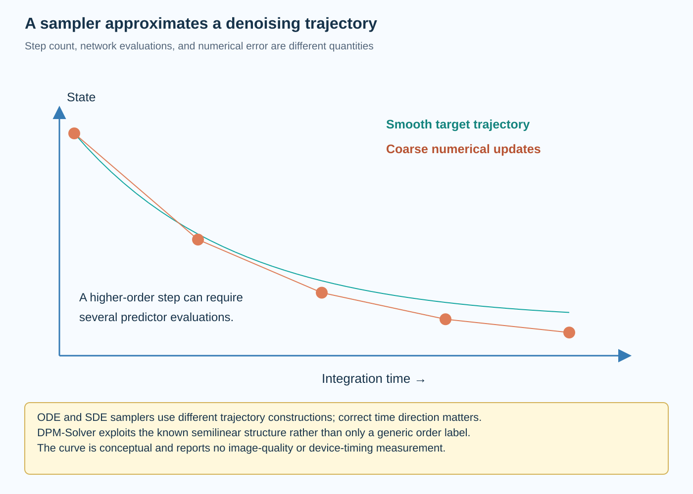
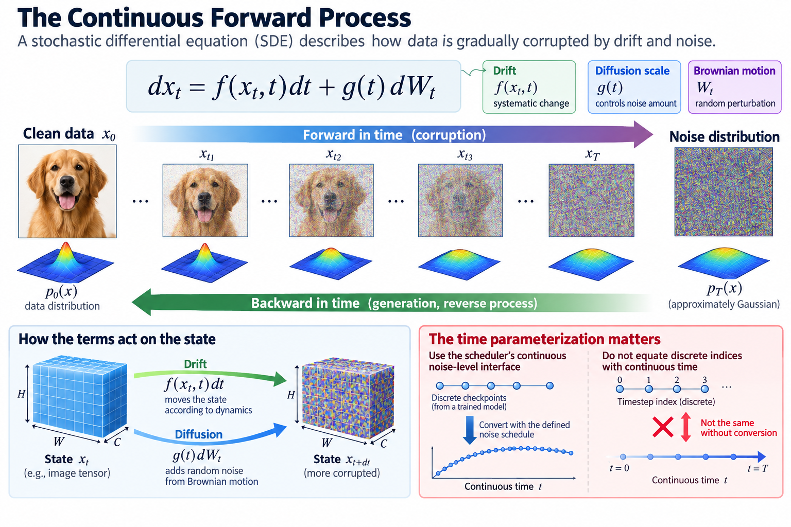

A diffusion sampler turns a learned prediction into a numerical trajectory from noise toward data. Fewer updates can reduce generation work, but the chosen solver must remain compatible with the model's noise schedule and prediction type. Counting steps without counting network evaluations or evaluating quality gives an incomplete efficiency claim.

This article connects discrete denoising to stochastic and ordinary differential equations. It derives simple integration rules, explains the structural innovation in DPM-Solver, and develops a fair comparison protocol. The plotted trajectories are conceptual; no trained diffusion model or GPU benchmark was executed here.

*An original conceptual illustration. Numerical plots and examples are illustrative unless explicitly identified as measured evidence.*

## 1. Define the continuous forward process

A broad continuous-time formulation describes a state x_t with drift f and scalar diffusion scale g. Brownian motion W_t introduces stochastic noise.

$$
dx_t=f(x_t,t)\,dt+g(t)\,dW_t.
$$

The drift and diffusion define how the data distribution evolves toward a noise distribution. Time runs forward for corruption and backward for generation under the corresponding reverse construction.

The coefficient convention matters. A discrete checkpoint can be used through an appropriate continuous noise-level interface, but an arbitrary time mapping can change the numerical problem. Preserve the scheduler's definitions and model conditioning rather than identifying timestep indices with continuous time without conversion.

## 2. Introduce the reverse-time SDE

Under the standard regularity conditions, the reverse stochastic equation uses the score of the time-dependent marginal density p_t. Written with time integrated backward, its drift contains the score correction:

$$
dx_t=\left[f(x_t,t)-g(t)^2\nabla_x\log p_t(x_t)\right]dt+g(t)\,d\bar W_t.
$$

The backward-time Brownian term follows the reverse process convention. Sign handling depends on the direction used by an implementation.

A trained network estimates the score directly or through a converted noise prediction. That estimate is not exact, so the sampler combines statistical model error with numerical integration error. Reducing integration error alone cannot repair every limitation of the learned predictor.

## 3. Define the probability-flow ODE

The associated probability-flow ordinary differential equation uses half the stochastic score correction and removes the Brownian term.

$$
\frac{dx_t}{dt}=f(x_t,t)-\tfrac12 g(t)^2\nabla_x\log p_t(x_t).
$$

With the exact score and the stated assumptions, this ODE shares the time-dependent marginal distributions of the forward SDE. That is a distributional statement, not equality of individual stochastic and deterministic trajectories.

Generation can integrate the ODE backward from a noise sample. Deterministic here means no additional Brownian sampling during the trajectory under a fixed initial state and condition. Different initial noise still produces different outputs, and finite-precision execution can introduce implementation variability.

## 4. Convert predictor types correctly

For a variance-preserving Gaussian corruption, a noise predictor maps to a score after division by the appropriate noise standard deviation and a negative sign.

$$
s_{\theta}(x_t,t)=-\frac{\epsilon_{\theta}(x_t,t)}{\sqrt{1-\bar\alpha_t}}.
$$

This expression uses the discrete marginal notation established in the previous article. Other schedules and parameterizations need their documented conversion.

A solver expecting clean-sample prediction cannot consume noise prediction unchanged. Likewise, guidance expressed in one parameterization must be translated consistently. Verify conversions on tiny known examples before attributing poor generation to the solver's order or step count.

## 5. Derive an Euler update

Write the ODE drift as F(x,t). A first-order Euler update advances the state by the current drift multiplied by a signed timestep h.

$$
x_{n+1}=x_n+hF(x_n,t_n).
$$

When integrating backward, h is negative under this time convention. An implementation that instead uses an increasing reverse-time variable needs the corresponding transformed drift.

Euler is easy to understand and uses one drift evaluation per update. Its accuracy depends on step size and smoothness. A coarse update can depart substantially from the intended trajectory, especially where the drift changes rapidly. The simple rule is a baseline for understanding more specialized samplers.

## 6. Explain higher-order evaluation cost

A second-order explicit trapezoidal method first predicts an endpoint with Euler, then evaluates the drift there and averages the two slopes.

$$
\widetilde x=x_n+hF(x_n,t_n),\qquad x_{n+1}=x_n+\tfrac h2\left[F(x_n,t_n)+F(\widetilde x,t_n+h)\right].
$$

This generic method illustrates how higher order can require more network evaluations per step. It is not the exact formula for every diffusion scheduler with a similar name.

Under suitable assumptions, improved local accuracy can justify larger steps. But fewer steps do not automatically mean fewer evaluations or lower wall time. Report network evaluations and complete runtime alongside the integration rule and timestep schedule.

## 7. Work through a scalar trajectory

Consider the illustrative ODE dx/dt equal to negative x, starting at 1. Its exact forward solution at time 1 is approximately 0.3679. Two Euler steps of size 0.5 produce 0.25.

Two explicit trapezoidal steps with that size produce approximately 0.3906, using 4 drift evaluations rather than 2. The example shows a cost-accuracy tradeoff on a known smooth problem.

It does not establish the same ordering for a learned diffusion drift under guidance and a particular schedule. Use the scalar problem to verify numerical implementation and error behavior, then evaluate trained-model generation under the intended conditions.

## 8. Distinguish DDIM's deterministic path

DDIM introduces a family of sampling processes compatible with the studied diffusion training formulation. Its deterministic setting follows an update using estimated clean content and noise at selected levels.

The key point is that changing the inference trajectory need not require retraining the original denoiser under every supported setting. The predictor still needs a compatible schedule and parameterization.

Do not equate every deterministic sampler with DDIM, or assume any arbitrary skipping pattern preserves quality. A deterministic initial-noise-to-output mapping describes one property of execution, while integration accuracy and task quality describe different properties. Preserve the exact update and stochasticity parameter in experiment metadata.

## 9. Explain DPM-Solver's structural innovation

DPM-Solver examines the semilinear structure of the diffusion ODE. It handles the linear component analytically and approximates a transformed integral involving the neural prediction, rather than applying only a generic black-box integrator.

That separation can reduce discretization error in the known linear part and focus numerical approximation on the learned nonlinear contribution. The paper develops different orders and step strategies under its formulation.

The innovation is structural, not merely a larger order label. Implement the paper or a verified scheduler's exact coefficients, time variable, and predictor assumptions. A generic Runge-Kutta update does not reproduce DPM-Solver simply because both solve an ODE.

## 10. Understand log signal-to-noise coordinates

For a marginal x_t equal to alpha(t) times clean data plus sigma(t) times noise, a useful coordinate is the logarithm of the signal-to-noise amplitude ratio.

$$
\lambda(t)=\log\frac{\alpha(t)}{\sigma(t)}.
$$

This differs by a factor of 2 from the log ratio of signal and noise variances. State the convention to avoid scheduler coefficient mistakes.

A solver can organize steps in this coordinate because the noise schedule's geometry matters to approximation. Uniform steps in an index, continuous time, or log ratio are different choices. Compare them under the actual model rather than assuming a uniform grid is uniform in every meaningful noise quantity.

## 11. Count function evaluations explicitly

Let NFE denote neural predictor evaluations. A generation cost model separates their cost from fixed pipeline stages and scheduler overhead.

$$
T_{\mathrm{generation}}\approx\sum_{j=1}^{\mathrm{NFE}}T_{\mathrm{network},j}+T_{\mathrm{fixed}}+T_{\mathrm{scheduler}}.
$$

Network time can vary with numerical path, batch, or conditioning. A multistep method can reuse previous predictions, while a multistage method can require several predictions for one reported update.

Classifier-free guidance can add conditional and unconditional work. Batched evaluation changes wall time without changing the number of conceptual predictions. Report the convention used for NFE and the complete runtime so that comparisons remain interpretable.

## 12. Include adaptive-step limitations

Adaptive solvers use error estimates to choose steps under a tolerance. They can spend more work where the trajectory is difficult and less where it is smooth.

The estimated error usually concerns numerical integration under the learned drift, not a direct perceptual-quality guarantee. A small solver error can coexist with model error or inadequate conditioning.

Adaptive counts can also vary across samples and interact with batching. Measure the intended execution policy rather than extrapolating from one easy trajectory. Record tolerance, minimum steps, maximum evaluations, and any fallback behavior when those settings define the operating envelope.

## 13. Compare stochastic and deterministic sampling fairly

A stochastic trajectory and a deterministic probability-flow trajectory can generate different individual outputs from related starting conditions. Their distributional quality should be assessed with the task's appropriate evidence.

Keep conditioning, guidance, resolution, initial-noise policy, and output count documented. Use paired seeds for diagnostics where useful, while recognizing that identical seeds do not make different algorithms' outputs the same sample.

Measure diversity and condition fidelity when they matter. A speed comparison that silently changes guidance or evaluates only selected attractive outputs can confound the solver's contribution. The full generation population and selection policy belong in the experiment record.

## 14. Separate solver order from practical quality

Convergence order describes how numerical error scales with step size under specified assumptions. A learned drift, discrete training schedule, guidance, thresholding, and very few steps can affect whether the asymptotic regime is relevant.

Higher order can therefore be valuable without always winning at every budget. Additional stages can cost more, and stability or predictor limitations can dominate at coarse steps.

Evaluate several supported operating points rather than declaring a universal winner from one order number. Plot quality against evaluations and measured runtime, preserving the backend and pipeline. The useful outcome is a frontier under the intended task, not a ranking detached from its workload.

## 15. Verify the sampler interface

Use a simple analytic ODE to check time direction, evaluation count, and numerical error. Test predictor conversion with known clean data and noise under the scheduler's coefficients.

Inspect endpoint handling and any thresholding. Verify the model receives the noise-level representation it was trained to interpret. These checks catch numerical contract mistakes before expensive image evaluation.

No trained diffusion artifact was executed for this article. Its scalar trajectory and equations are explanatory. The primary sources provide their own sampling experiments; a new deployment requires quality and runtime evidence from its actual model, scheduler, and numerical configuration.

## 16. Choose from the whole cost-quality frontier

Sampling efficiency is a numerical and systems problem. A specialized solver can reduce required evaluations, while a faster kernel reduces each evaluation's cost. Fixed encoding and decoding stages remain, and guidance can alter the repeated work.

Begin with a verified scheduler and a clear quality target. Compare supported step grids, orders, and evaluation budgets under consistent conditions. Retain the accepted configuration and its operating envelope with the artifact.

This distinguishes training-free solver changes from step-distilled models discussed next. Both can reduce generation work, but they modify different parts of the statistical and numerical system and need different preparation accounting.

## 17. Separate predictor error from integration error

Suppose the implemented drift differs from an ideal drift by a bounded perturbation, and the ideal drift is Lipschitz in the state over the region being integrated. A trajectory-error bound then depends on both that perturbation and the interval length, with amplification controlled by the Lipschitz behavior. Smaller solver steps address discretization error but leave the drift perturbation itself.

This explains a practical plateau: increasing evaluations can eventually produce little quality improvement if the learned predictor or conditioning is the main limitation. Conversely, a strong predictor can still suffer under an incompatible coarse integration rule.

Inspect quality across several evaluation budgets and compare supported solvers. The shape of that curve helps identify whether more numerical work is useful. It is not a formal guarantee for a neural image generator, but it gives a mechanistic explanation for why solver accuracy and learned-model quality should be reported as distinct sources of approximation.

## Sources

- [Score-Based Generative Modeling through Stochastic Differential Equations](https://arxiv.org/abs/2011.13456).
- [Denoising Diffusion Implicit Models](https://arxiv.org/abs/2010.02502).
- [DPM-Solver](https://arxiv.org/abs/2206.00927).
- [Denoising Diffusion Probabilistic Models](https://arxiv.org/abs/2006.11239).
