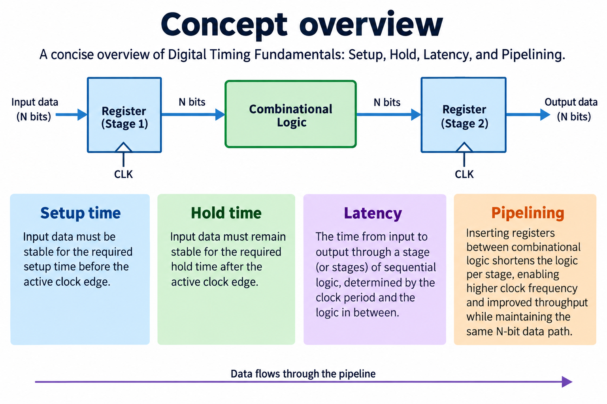
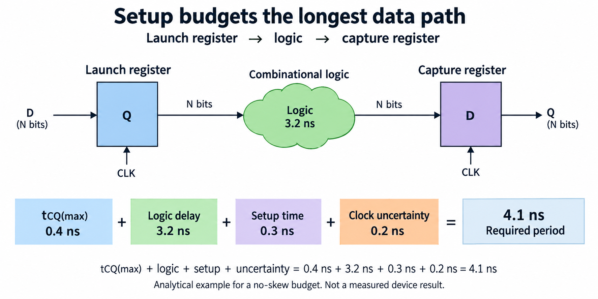
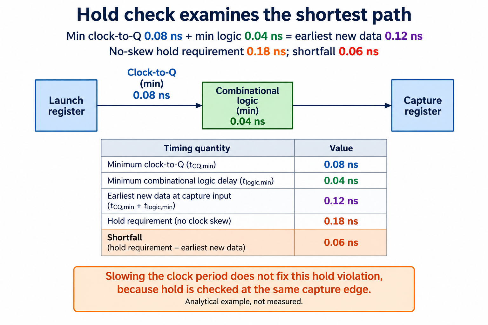
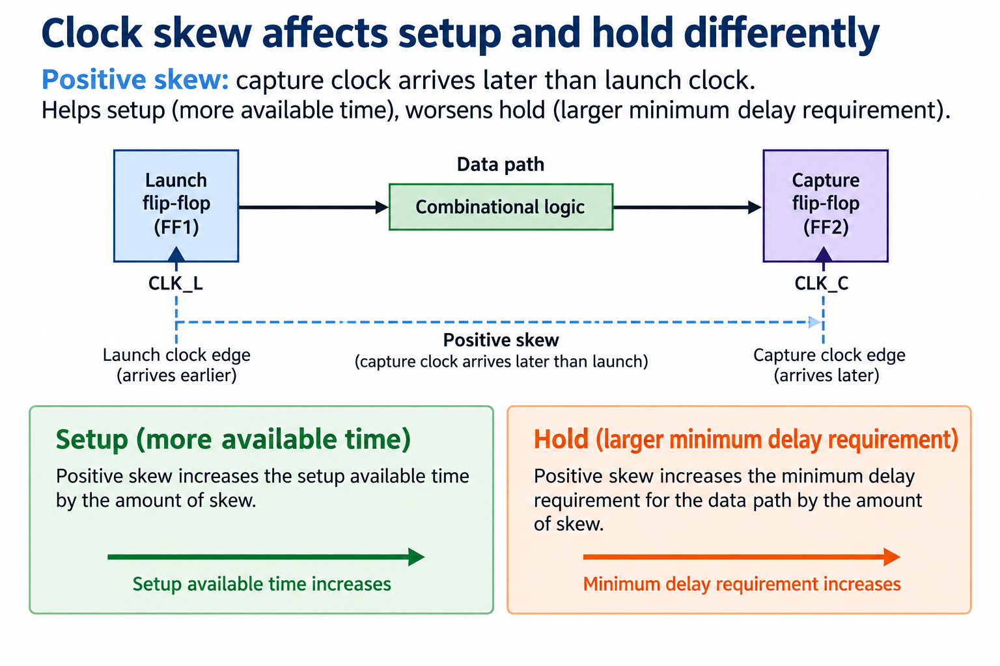
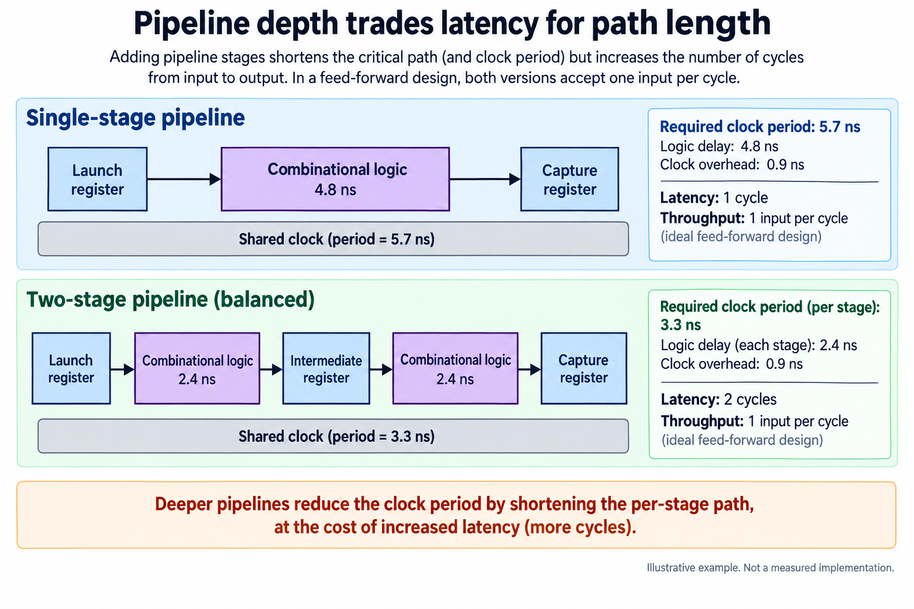
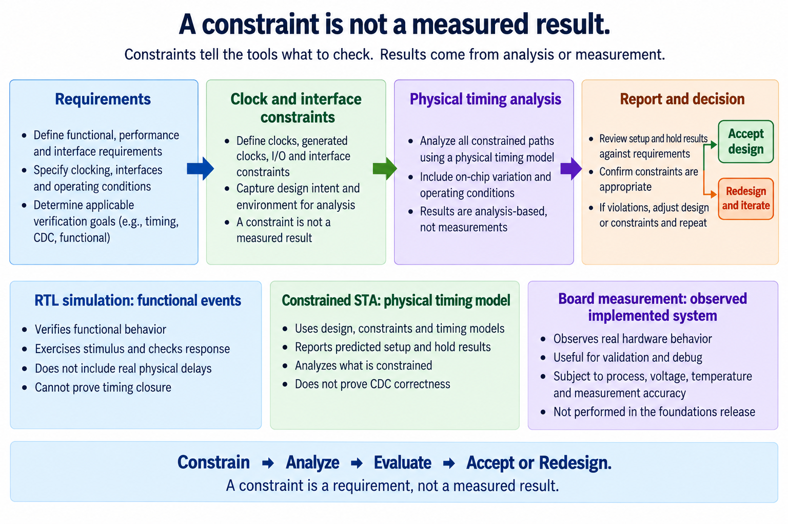

## Overview

Digital timing connects an edge-level RTL model to the arrival times of real signals. The overview separates the functional transition rule from implementation constraints and timing evidence. A simulator can show which value a register should capture; static timing analysis asks whether data reaches that register within the required physical window under the constrained implementation.

Read the [RTL simulation lesson](/blog/rtl-simulation-testbenches-self-checks-waveforms/) first. Here the circuits remain small: a launch register, combinational logic, and a capture register. The examples use illustrative delays stated in nanoseconds. They are analytical calculations, not synthesis reports, measured FPGA frequencies, or guarantees for a selected device.

The article introduces setup, hold, clock skew, and the distinction between pipeline latency and acceptance rate. These concepts explain why adding registers may shorten a logic path while increasing the number of cycles before a result appears. They also explain why slowing a clock can address some setup problems without solving a same-edge hold failure.

The [foundations lab](/labs/fpga-fundamentals/foundations-lab.zip) checks the arithmetic of the stated budgets. It does not run Vivado, constrain a board, place and route a design, or measure a clock. Treat those checks as a way to inspect the reasoning before moving to physical tools. The key learning objective is knowing which timing question is being asked and what evidence would answer it.

## Deep dive

### Setup budgets the longest data path

The [Computation Structures sequential-logic notes](https://computationstructures.org/notes/sequential_logic/notes.html) explain the stable-input windows and clocked delays used in this model. The setup figure follows the longest relevant data path from a launch register through logic to a capture register. After the launch edge, the source output takes clock-to-Q time to change. The logic and routing take additional time to deliver the new value. The receiving register requires that value to be stable before its capture edge by at least the setup requirement. A stated uncertainty allowance reserves additional margin.

In the illustrative no-skew budget, maximum clock-to-Q is 0.4 nanoseconds, logic-and-routing delay is 3.2 nanoseconds, setup requirement is 0.3 nanoseconds, and uncertainty is 0.2 nanoseconds. Their sum is 4.1 nanoseconds. Under this deliberately simplified model, the period must be at least that sum. Every number belongs to the example, rather than a particular FPGA measurement.

If a target period were 4.0 nanoseconds under these assumptions, the available period would be 0.1 nanoseconds shorter than the required budget. That is a setup shortfall in the model. Increasing the period to 4.5 nanoseconds would provide 0.4 nanoseconds of model margin. Actual timing tools use implementation data and clock relationships, not these invented teaching delays.

The path boundary matters. An input arriving from a board connector needs an external timing model and input-delay constraints. A generated clock needs its documented relationship to the source clock. A register-to-register sum cannot be pasted onto every path category without adjusting the model. Begin by identifying the launch and capture events and the assumptions about their clock relationship.

Routing is part of the path. An RTL expression with a short source description can route through physically long or congested connections. Fan-out, placement, resource selection, and device operating conditions influence implementation analysis. Source line count is not a timing estimate. A physical tool report must identify the actual path and the constraints under which it was analyzed.

The useful beginner habit is to account for every budget term before discussing frequency. Ask what each delay represents, whether it is a maximum or minimum quantity, and whether uncertainty or skew has already been included. Double-counting a margin and omitting a delay are both possible mistakes. The lab verifies the sum, while a later physical flow must supply real values and reports.

### Hold checks the shortest path

Hold checks the earliest arrival of new data around the receiving register's current capture edge. It asks whether the previously needed value remains stable long enough after that event. This is a shortest-path question, distinct from setup's longest-path question. The figure uses abstract timing windows to avoid implying a fixed waveform for an unspecified implementation.

In the no-skew example, minimum clock-to-Q is 0.08 nanoseconds and minimum logic-and-routing delay is 0.04 nanoseconds. New data can therefore arrive after 0.12 nanoseconds. The receiving hold requirement is 0.18 nanoseconds, so the model has a 0.06-nanosecond shortfall. These minimum quantities should not be replaced with the maximum delays from the setup example.

Making the clock period longer does not fix this same-edge comparison. The new data is still allowed to arrive too soon after the current capture event. Delaying the next edge addresses a different interval. Appropriate physical fixes can involve additional data-path delay or changes to clock relationships, subject to the selected implementation tool and device constraints. The foundations lab does not perform such a fix.

A path can therefore pass setup and fail hold, or the reverse. Optimizing only for a shorter data path may improve setup while reducing hold margin. Timing closure needs both analyses and any additional relevant checks. Reporting one favorable number without the other can misrepresent whether the implementation is acceptable.

Reset paths and independent-clock transfers introduce other considerations, so do not treat the teaching inequality as a complete signoff checklist. The [AMD constraints guide](https://docs.amd.com/r/en-US/ug903-vivado-using-constraints/Asynchronous-Clock-Domain-Crossings) explains why asynchronous crossings need appropriate handling rather than an ordinary synchronous relationship. The next foundations article introduces those crossing contracts.

For a hand calculation, write the earliest data arrival and the required stable interval in separate columns, with their reference edge stated. Subtract the requirement from the arrival under the example's sign convention. A negative result indicates that the new data may arrive too early. Keeping units and reference events visible prevents the common mistake of comparing a minimum path with a full cycle period and calling that a hold check.

### Skew affects setup and hold differently

Clock skew is the difference between clock arrival times at the relevant registers. Here positive skew means the capture clock arrives later than the launch clock. With this definition, later capture gives data more time before the next setup deadline. The same later current capture event can require old data to remain stable longer relative to the source's newly launched data, worsening hold.

The direction must be defined before using a sign. Different reports and explanations may express a relationship using different reference conventions. A statement that skew helps timing is incomplete unless it specifies which check and which direction. The figure deliberately separates setup and hold effects under one stated positive-skew definition.

For an illustrative setup calculation, adding 0.1 nanoseconds of positive capture-later skew to the earlier no-skew model increases the available setup interval by 0.1 nanoseconds. For the simplified hold comparison, it increases the required minimum data delay by that amount. These examples explain the direction; they are not predictions of a clock-tree implementation.

Skew is not necessarily a design knob that can be changed independently of everything else. Clock distribution, placement, routing, generated-clock relationships, and tool modeling all matter. A physically implemented design needs timing analysis under its actual clocks and constraints. A hand-tuned diagram cannot establish that the relevant clock arrivals exist or remain acceptable across conditions.

Uncertainty is also distinct from skew. In a simplified teaching budget, uncertainty reserves margin for specified variations or modeling concerns. A physical timing flow defines how its uncertainty and clock effects are represented. Do not add a report's already accounted clock contribution again in a separate manual calculation without checking the definitions.

When reading a path report, identify the launch clock, capture clock, related events, and sign convention. Then check whether the path is being evaluated as a maximum-delay setup path or a minimum-delay hold path. That reading method is more durable than memorizing that a later edge is always good or always bad. The same physical relationship can have opposite consequences for two necessary timing checks.

### Pipeline depth trades latency for path length

The pipeline comparison starts with an illustrative 4.8-nanosecond combinational path and 0.9 nanoseconds of combined per-stage overhead. A one-stage register-to-register budget therefore requires 5.7 nanoseconds. Dividing the logic evenly into two stages gives 2.4 nanoseconds of logic per stage; adding the same stated overhead to each yields 3.3 nanoseconds per stage. These are analytic examples, not routed results.

The new register increases latency measured in cycles. Under the stated feed-forward interface, the original arrangement takes one stage to carry an accepted input to its output register, while the pipelined arrangement takes two stages. Both may accept a new independent input every cycle once their control supports it. Cycle latency and input acceptance rate are separate quantities.

Latency in absolute time also needs a clock period. Two cycles at a shorter period need not equal one cycle at the previous period. In a real design, the selected clock, valid signaling, output protocol, and stalls determine what a user observes. A comparison that reports only pipeline depth or only a modeled path delay cannot establish end-to-end latency.

Balanced logic is an assumption in this example. If one stage contains most of the delay, that stage still sets the required period. Additional registers also have resource and clocking costs, and their placement can affect routing. A pipeline is useful when its partition respects dependencies and preserves the intended transaction relationship, not merely when register count increases.

Control must accompany data. If a valid flag identifies a meaningful value, it must be delayed with the corresponding payload. If the output can stall, the pipeline needs a defined retention or backpressure protocol. The foundations two-register lab has no ready/valid stream interface; the [accelerator project's streaming lesson](/blog/fpga-ai-stream-1-ready-valid-interfaces/) develops that additional contract.

Check a pipeline with multiple consecutive values. A single isolated input cannot establish whether the design accepts new work each cycle or aligns its output correctly. The simulation lesson's old-state table gives the basic method. Physical timing analysis then evaluates the implemented stages under constraints. Together they address behavioral alignment and path feasibility without confusing either one with a board throughput measurement.

### A constraint is not a measured result

The final figure connects requirements to clocks and interface constraints, physical analysis, and an acceptance decision. A constraint states the timing environment and intended requirements. It is not itself evidence that the design meets them. A requested period becomes meaningful only when the implementation is analyzed under that model and its reports are reviewed.

Different evidence answers different questions. RTL simulation checks transitions and arithmetic under an event model. Constrained static timing analysis evaluates modeled physical paths. A board measurement observes an implemented system under stated operating conditions. Passing one stage does not authorize a claim that the other stages ran. The foundations release supplies simulation and analytical checks only.

Missing constraints can hide uncertainty rather than resolve it. An external input without a specified arrival relationship may not be analyzed as the designer expects. An independent-clock crossing cannot be made safe merely by removing its path from synchronous timing checks. The [AMD asynchronous-crossing guidance](https://docs.amd.com/r/en-US/ug903-vivado-using-constraints/Asynchronous-Clock-Domain-Crossings) distinguishes relevant constraints and mechanisms.

Exceptions such as false paths or multicycle paths require an architectural justification. A path should not be excluded simply because it fails. A multicycle relationship must match the actual capture protocol, including the corresponding hold interpretation. These are implementation-flow subjects; the beginner course introduces the reason to scrutinize an exception without pretending to perform physical signoff.

A useful implementation record identifies the target part, clocks, external interface assumptions, tool version, constrained path coverage, and relevant reports. If a design later reaches a board, also record its clock source, reset setup, transaction test, and measurement method. Such evidence is reviewable; a sentence saying timing looks good is not.

For now, rerun the lab's setup, hold, and pipeline budget checks and explain what each number assumes. Then read the clock-domain-crossing article before connecting independently clocked modules. This progression moves from understandable timing models to transfer protocols and eventually physical verification, while keeping the limits of each teaching artifact clear.

## Conclusion

Setup checks the longest path before a capture deadline; hold checks the shortest path around a current capture event. Positive capture-later skew helps setup and hurts hold under the stated convention. Pipelining can shorten logic paths while adding cycle latency, and it needs data-control alignment to preserve the interface contract.

The article's nanosecond values are illustrative budgets, checked analytically in the lab. They do not report a measured FPGA clock or completed timing closure. A physical implementation needs a selected target, complete constraints, reviewed reports, and any board evidence appropriate to its claims.

Continue with [clock-domain crossings](/blog/clock-domain-crossings-synchronizers-safe-transfers/). Independent clocks change the transfer problem: a normal synchronous setup budget is no longer enough. Understanding that boundary prevents a functionally clean RTL connection from being mistaken for a safe physical interface.

### Sources

- [AMD asynchronous clock-domain constraints](https://docs.amd.com/r/en-US/ug903-vivado-using-constraints/Asynchronous-Clock-Domain-Crossings)
- [Computation Structures: sequential logic](https://computationstructures.org/notes/sequential_logic/notes.html)
