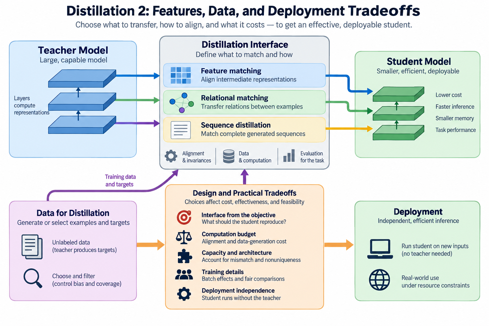
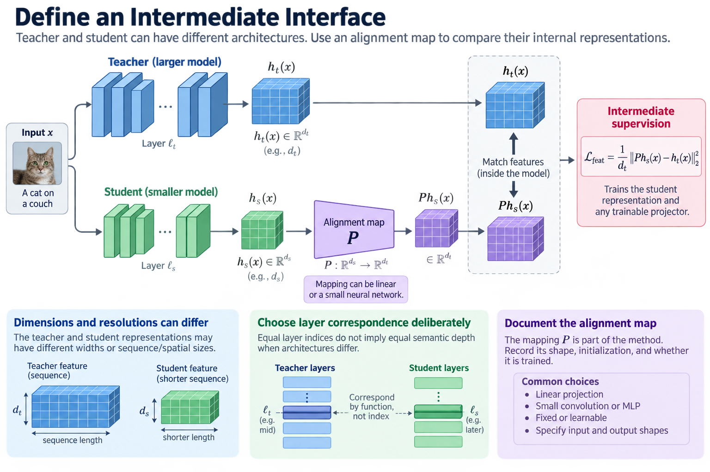
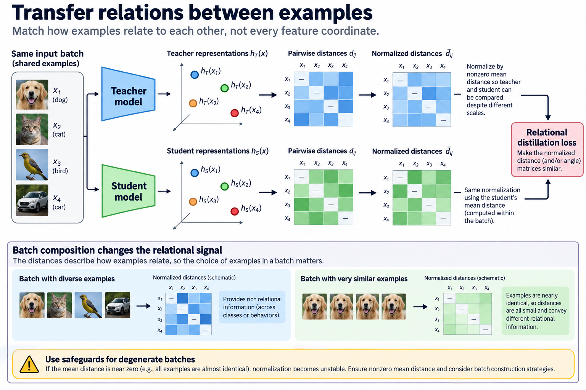
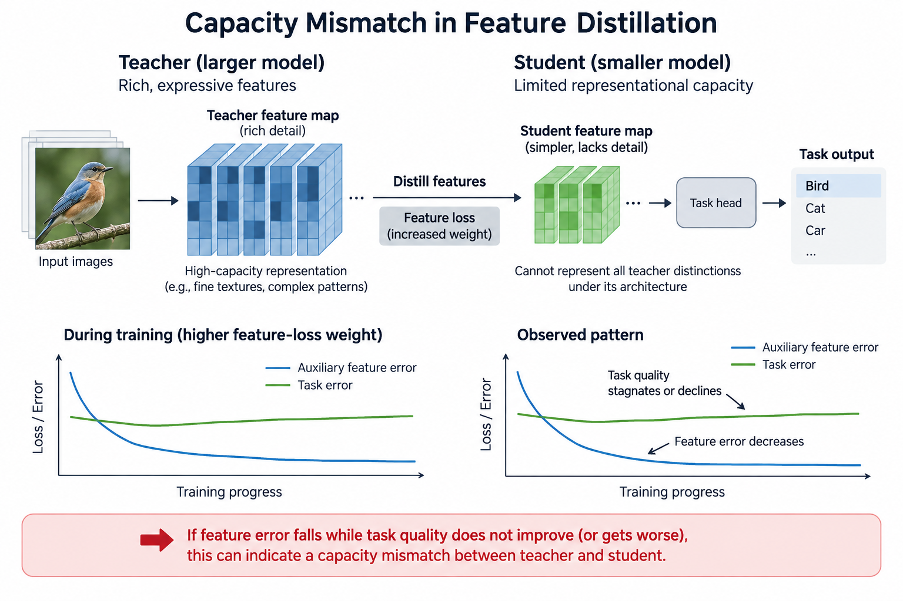
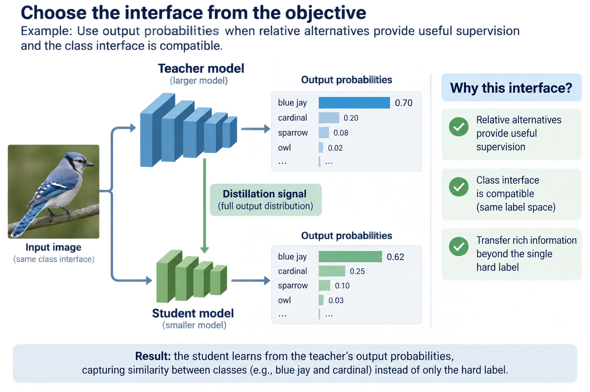
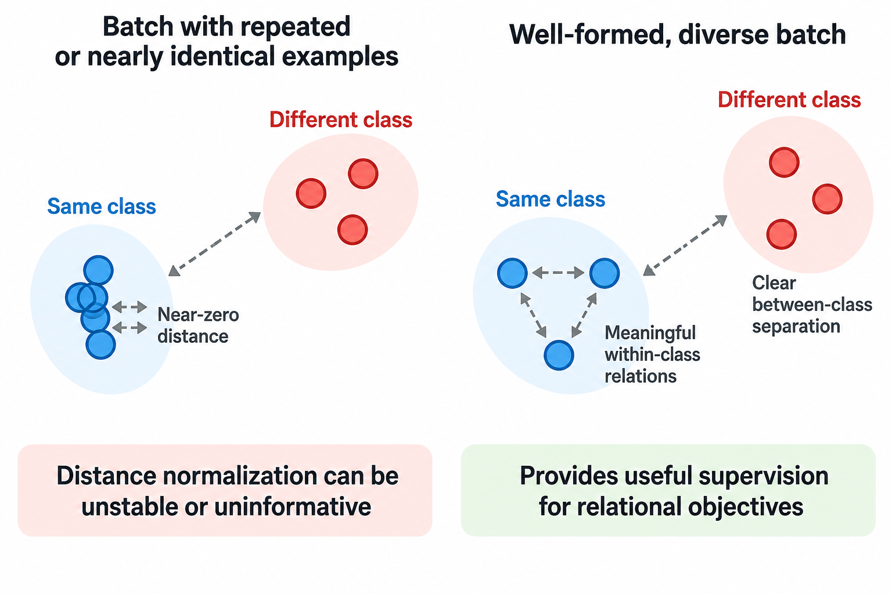

## Overview

Matching teacher probabilities is one way to distill a model. Another transfers intermediate representations, relations between examples, or complete generated sequences. These objectives expose different information and cost different amounts to prepare. The central design question: what should a constrained student reproduce to improve the task that matters?

Feature matching does not require the student to become an exact internal copy. Different architectures can represent the same decision in different coordinates. A useful distillation interface therefore specifies alignment, invariances, data, and evaluation. This article connects those theoretical choices to an efficient deployable student.

*An original conceptual illustration. Numerical plots and examples are illustrative unless explicitly identified as measured evidence.*

## Deep dive

### 1. Define an intermediate interface

Let h_t(x) be a teacher representation and h_s(x) the student representation for input x. Their dimensions and spatial or sequence resolutions can differ. When direct comparison is not meaningful, introduce an alignment map P.

$$
h_t(x)\in\mathbb R^{d_t},\quad h_s(x)\in\mathbb R^{d_s},\qquad P:\mathbb R^{d_s}\rightarrow\mathbb R^{d_t}.
$$

FitNets introduced intermediate hints and a mapping to support thinner students. The broader mechanism is supervision inside the model, not only at its final predictions.

Choose the layer correspondence deliberately. Equal layer indices do not mean equal semantic depth when teacher and student architectures differ. The mapping is part of the method: document its shapes, initialization, and training status.

### 2. Write a feature reconstruction objective

A simple aligned feature loss uses squared distance, normalized here by teacher feature width. Its gradient trains both the student representation and any trainable projector.

$$
\mathcal L_{\mathrm{feat}}=\frac1{d_t}\|P h_s(x)-h_t(x)\|_2^2.
$$

The normalization makes the convention explicit; implementations can reduce differently. The loss scale affects how it combines with task supervision, so record whether reductions average across dimensions, examples, or positions.

A small feature error is a local achievement. It does not guarantee equal final outputs, and high-magnitude coordinates can dominate it. Inspect the feature distribution and the downstream task. Do not read the reconstruction number as a complete quality measure.

### 3. Recognize representation nonuniqueness

Transform a hidden representation by an invertible matrix R and the next linear layer by its inverse. The composed real-number function can stay the same even though the hidden coordinates differ.

$$
W h=(W R^{-1})(R h).
$$

This shows why raw feature equality is stronger than functional equivalence. Two useful models can encode similar information in rotated or rescaled coordinate systems. An alignment projector can absorb some of those differences, but its capacity and constraints matter.

On the other side, a very powerful projector can fit teacher features while leaving the student poorly prepared for the task. Feature matching should support learning. It should not become an auxiliary network that solves the comparison on its own, independent of useful student behavior.

### 4. Compare normalized features

Normalizing representations focuses a loss on direction rather than unrestricted magnitude. A small positive epsilon stabilizes the denominator under the chosen implementation.

$$
\widetilde h=\frac{h}{\|h\|_2+\varepsilon},\qquad \mathcal L_{\mathrm{direction}}=\|\widetilde {P h_s}-\widetilde h_t\|_2^2.
$$

This changes the objective. Magnitude can carry useful confidence or activation information, so removing it is an invariance choice, not an automatic improvement. Near-zero vectors also need a defined policy.

When the choice is uncertain, evaluate normalized and unnormalized objectives under the same student and data budget. Check whether one objective makes the representation comparison easier while weakening downstream quality. A convenient similarity score is no substitute for the application objective.

### 5. Transfer relations between examples

Relational knowledge distillation compares structure across a set of representations. Its primary paper develops distance-wise and angle-wise objectives. The idea is to preserve how examples relate, rather than force every feature coordinate to match.

For example, define pairwise distances within a minibatch and normalize them by a nonzero mean distance. Teacher and student can then compare relative geometry despite different overall scales.

$$
d_{ij}(h)=\|h(x_i)-h(x_j)\|_2,\qquad \bar d_{ij}=\frac{d_{ij}}{\operatorname{mean}_{a\ne b}d_{ab}}.
$$

This illustrative definition needs safeguards for degenerate batches. It also makes batch composition part of the supervision. A batch of nearly identical examples carries different relational information than one spanning several classes or behaviors.

### 6. Work through geometric invariance

Take 3 illustrative teacher points: the origin, a point one unit along the first axis, and a point one unit along the second. Translate and rotate all 3 points to produce student points. The pairwise distances stay identical while the raw coordinate differences can be large.

A distance-based objective treats these configurations as equivalent. Uniform scaling also disappears after the chosen distance normalization. That can be useful when architectures use different feature coordinates.

The same invariance can hide distinctions an application needs. Preserving pairwise distances alone does not force identical classification heads or confidence. Combine appropriate task supervision and evaluate the final student. The geometric example shows what the loss ignores as well as what it keeps.

### 7. Budget the alignment computation

A dense linear projector from width d_s to d_t holds d_s times d_t weights, plus a bias if used. Several intermediate matches can add real training computation and activation storage.

$$
N_P=d_s d_t,\qquad C_P\approx2N d_s d_t
$$

The compute estimate uses N compared representations and counts a multiply-add as 2 floating-point operations. It excludes backward work and memory traffic. Actual preparation cost also depends on the teacher and how features are captured.

A projector used only for training can be removed from the deployed student. Verify that removal in the exported graph. If inference still needs the teacher or the alignment network, the deployment claim must include those components, not just the student backbone.

### 8. Distill complete sequences

Sequence-level distillation uses teacher-produced outputs as training targets. For an autoregressive student, a selected teacher sequence y_star defines an ordinary conditional negative log-likelihood objective.

$$
\mathcal L_{\mathrm{seq}}=-\sum_{u=1}^{|y_*|}\log p_s(y_{*,u}\mid x,y_{*,<u}).
$$

This differs from comparing every teacher token distribution. The selected sequence collapses a distribution of possible outputs into one target, which affects diversity and ambiguity.

The original sequence-level work studied sequence-to-sequence learning. Before applying the same mechanism elsewhere, check the task and generation policy. A beam-selected translation, a sampled response, and a filtered reasoning trace are different supervision populations. Keep that provenance.

### 9. Understand target-selection bias

Teacher generation depends on prompts, decoding, length limits, sampling, and filtering. Those choices decide what the student sees. A target set can overrepresent polished short answers or drop difficult cases a quality filter rejected.

Data filtering can help, but it changes the training distribution. Record rejection rates and inspect which populations disappear. A student trained only on teacher successes has not learned how to recover from every failure it may hit in deployment.

Also separate teacher correctness from target fluency. Fluent generated text can contain errors. Evaluate targets with task-appropriate evidence when available, and keep independent labels or references for final evaluation. The student can reproduce a consistent error pattern with high likelihood.

### 10. Model the data-generation cost

Let N be the number of prompts, c_t their average teacher-generation cost, and c_v the average verification cost. A simple preparation estimate adds those costs to student training.

$$
C_{\mathrm{prep}}\approx N(c_t+c_v)+C_{\mathrm{student\ training}}.
$$

The units must agree: device time, monetary cost, energy, or another chosen resource. Include retries, discarded targets, and storage when they matter. Counting only accepted outputs understates generation effort when filtering is aggressive.

The deployment savings must justify this preparation under the expected reuse. A frequently deployed student can amortize a large teacher-generation phase; a one-off task may not. Report preparation and inference separately so readers can apply their own reuse assumptions.

### 11. Control task and data comparisons

Compare distillation variants on the same student architecture and evaluation setup. If one variant uses much more generated data, its improvement cannot be credited to feature or sequence supervision alone.

Useful ablations separate hard targets, soft probabilities, feature losses, and relational losses when those components are combined. Keep training budgets explicit. Equal epoch counts do not mean equal processed examples or equal teacher computation.

Select methods on a validation population and reserve independent evaluation for the final artifact. Repeated selection against one test benchmark can overfit the distillation recipe, even when the student weights never train directly on those benchmark labels.

### 12. Inspect capacity mismatch

A teacher can learn distinctions that a smaller student cannot represent under its architecture. Raising the feature-loss weight then forces an unfavorable compromise with the task objective.

Watch for training that lowers auxiliary feature error while task quality stalls or drops. That pattern can point to a poor layer correspondence, a weak projector design, incompatible capacity, or the wrong supervision population. It should trigger a concrete diagnostic, not an unexplained larger loss weight.

Intermediate supervision can also make optimization easier without requiring an exact teacher representation. Pick interfaces that preserve task-relevant information and let the student keep its own efficient structure. Judge an architecture-specific mapping by what it teaches and what it costs.

### 13. Check inference independence

The final student should have a clearly defined inference graph. Confirm which training-only modules were removed, which parameters were kept, and whether preprocessing still depends on a teacher-derived service.

Measure the exported artifact on the intended backend. Fewer parameters can coexist with unfavorable matrix shapes or extra activation traffic. Report latency and throughput under a documented workload, alongside memory and task quality.

No student training or GPU execution was performed for this article. The equations and geometric examples are explanatory. The primary papers carry their own experimental evidence under their stated tasks; a new deployment needs measurements of its actual student and numerical policy.

### 14. Choose the interface from the objective

Use output probabilities when relative alternatives supply useful supervision and the class interface is compatible. Use intermediate hints when a justified alignment can improve representation learning. Use relational objectives when preserving geometry means more than matching coordinates. Use generated sequences when the task benefits from selected teacher outputs and their distribution is understood.

These options can be combined, but each component adds assumptions and preparation work. Start with a transparent baseline and add supervision that fixes an observed limitation.

The most useful explanation of distillation names the information transferred, the invariances imposed, the data that carries it, and the student execution that follows. That connects statistical learning to efficiency without treating teacher imitation as an automatic guarantee of quality or speed.

### 15. Examine batch effects in relational learning

Pairwise objectives can involve a quadratic number of pairs in the minibatch, and angle-based comparisons can involve more expensive tuple construction. Practical methods sample or organize these relations to control preparation cost. Document the selected relation population, because it decides which geometry the student is pushed to preserve.

A batch with repeated or nearly identical examples can make distance normalization unstable or uninformative. A batch of unrelated examples can emphasize broad separation while missing fine distinctions within a class. These are statistical properties of the supervision, not mere implementation details.

For a diagnostic, build a small batch with known distances, verify the normalization and zero-distance policy, and compare the loss after translation, rotation, and scaling. Then inspect batches sampled from the actual training data. The synthetic geometry tests correctness; the real population tests whether the objective carries useful information.

## Conclusion

Do not read a low relational loss as assurance that the student preserves every teacher behavior. The loss only constrains selected relations under selected inputs. Independent task evaluation stays necessary, especially when the deployed distribution differs from the data used to create teacher features.

### Sources

- [FitNets: Hints for Thin Deep Nets](https://arxiv.org/abs/1412.6550).
- [Relational Knowledge Distillation](https://arxiv.org/abs/1904.05068).
- [Sequence-Level Knowledge Distillation](https://arxiv.org/abs/1606.07947).
- [Contrastive Representation Distillation](https://arxiv.org/abs/1910.10699).
