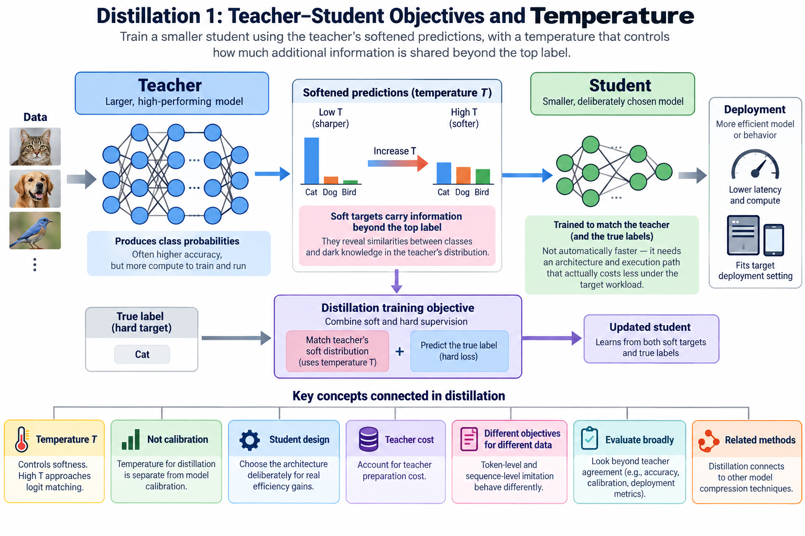
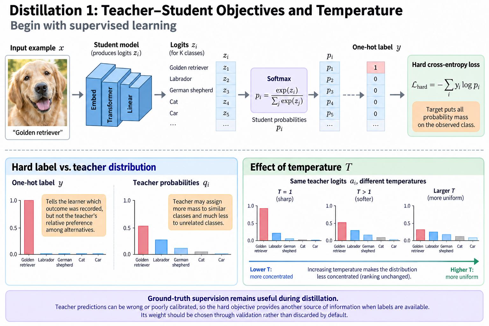
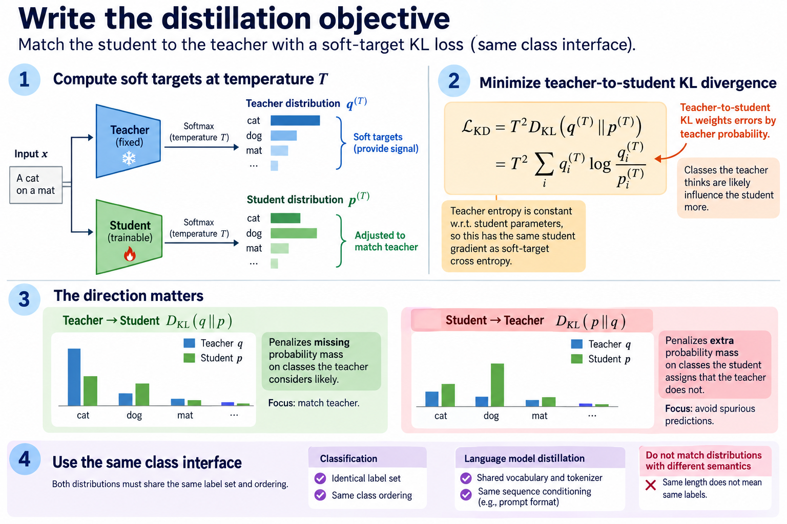
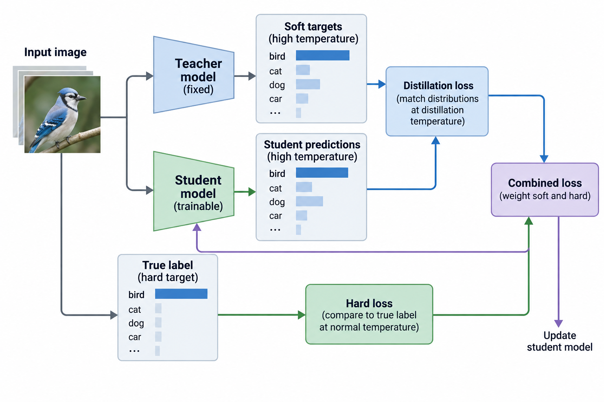
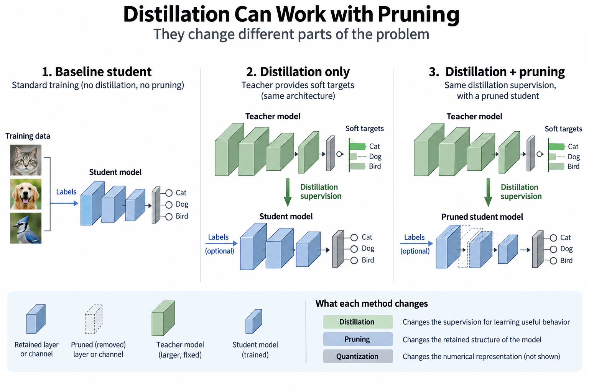
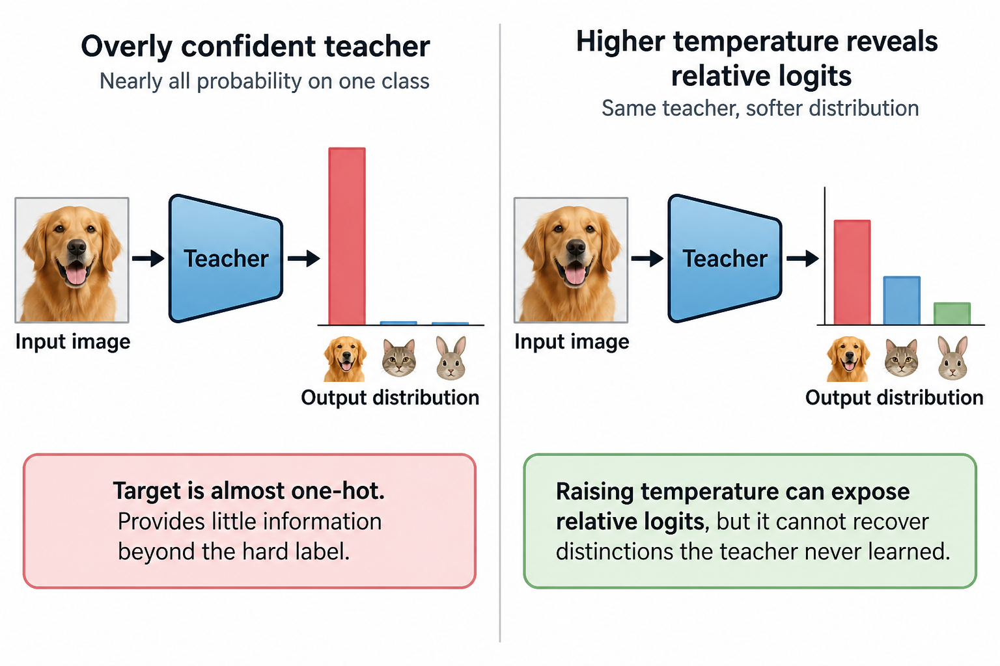

## Overview

Knowledge distillation trains a student using information produced by a teacher. The efficiency benefit comes from changing the deployed model or its behavior while moving extra work into preparation. A student is not automatically faster because its training objective mentions a teacher. It needs an architecture and execution path that actually cost less under the target workload.

The classical formulation uses softened class probabilities, and this article derives the temperature-dependent objective and its gradient, explains what information the soft distribution adds, and connects those choices to calibration, data, and deployment evidence. The same language is often applied to language-model imitation, but token-level and sequence-level objectives have different statistical effects.

*An original conceptual illustration. Numerical plots and examples are illustrative unless explicitly identified as measured evidence.*

## Deep dive

### 1. Begin with supervised learning

For a classification example x, a student produces logits z_i for K classes. Softmax turns them into a probability distribution. A one-hot label y gives the standard cross-entropy objective.

$$
p_i=\frac{\exp(z_i)}{\sum_j\exp(z_j)},\qquad \mathcal L_{\mathrm{hard}}=-\sum_i y_i\log p_i.
$$

For one observed label the target puts all probability mass on that class, which tells the learner which outcome was recorded but says nothing about the teacher's relative preference among the other K minus 1 alternatives.

The hard objective stays useful during distillation, because teacher predictions can be wrong or poorly calibrated and ground-truth supervision is a second source of information when labels exist, so choose its weight through validation instead of discarding it by default.

### 2. Define teacher and student distributions

Let a_i be teacher logits and z_i student logits. A positive temperature T softens both distributions by dividing the logits before softmax, and T equal to 1 recovers the ordinary softmax.

$$
q_i^{(T)}=\frac{\exp(a_i/T)}{\sum_j\exp(a_j/T)},\qquad p_i^{(T)}=\frac{\exp(z_i/T)}{\sum_j\exp(z_j/T)}.
$$

Raising the temperature spreads a finite logit vector's distribution out without changing the ordering of the logits, and the softened distribution can expose relative probabilities that are numerically tiny at temperature 1.

The teacher is normally fixed for the student training considered here, so store 4 settings, its checkpoint, preprocessing, inference precision, and target-generation policy, because those settings define the supervision and you need them to interpret the resulting student.

### 3. Interpret information beyond the top label

Suppose the correct class is a dog breed. A teacher might put most of its remaining mass on similar breeds and much less on unrelated vehicles. The one-hot target has no such pattern. The soft target encodes a learned relationship among the other K minus 1 alternatives for this input.

This information is conditional on the teacher and the data population. It can reflect useful structure, but it can also reflect systematic errors. Calling it knowledge does not prove every probability difference is worth reproducing.

Inspect examples where the teacher is uncertain and where it conflicts with labels, since a student with limited capacity may benefit from some distinctions and fail to reproduce others, which makes distillation a constrained learning problem rather than a lossless transfer of the teacher's internal computation.

### 4. Write the distillation objective

A standard soft-target loss minimizes the teacher-to-student KL divergence between the 2 softened distributions. The teacher entropy is constant with respect to student parameters, so minimizing it gives the same student gradient as soft-target cross entropy.

$$
\mathcal L_{\mathrm{KD}}=T^2 D_{\mathrm{KL}}\!\left(q^{(T)}\Vert p^{(T)}\right)=T^2\sum_i q_i^{(T)}\log\frac{q_i^{(T)}}{p_i^{(T)}}.
$$

The direction matters. Teacher-to-student KL weights errors by teacher probability. Swap the distributions and you get a different objective with different penalties for missing or extra probability mass.

Both distributions must share the class interface, which in classification usually means the same label set and ordering, while language-model distillation adds 3 more concerns: vocabulary, tokenizer, and sequence conditioning. Probability vectors with different semantics cannot be matched just because they have similar lengths.

### 5. Derive the logit gradient

Differentiating soft-target cross entropy through temperature-scaled softmax introduces a factor of one over T. With the customary T squared multiplier, the gradient is:

$$
\frac{\partial\mathcal L_{\mathrm{KD}}}{\partial z_i}=T\left(p_i^{(T)}-q_i^{(T)}\right).
$$

At high temperature the probability difference itself scales approximately as one over T under the relevant expansion, so without compensation the gradient would shrink approximately as one over T squared, and the multiplier is what keeps the soft objective's scale comparable as temperature varies.

This is an asymptotic explanation, not a claim that every temperature optimizes the same way. Softmax is nonlinear, and the probability structure changes with T. Validate temperature and the mixture weight together under the actual training setup.

### 6. Connect high temperature to logit matching

Softmax does not change when you add the same constant to every logit, so center teacher and student logits by subtracting their means, and if the centered magnitudes are small compared with T a first-order expansion gives:

$$
p_i^{(T)}\approx\frac1K+\frac{z_i-\bar z}{KT},\qquad q_i^{(T)}\approx\frac1K+\frac{a_i-\bar a}{KT}.
$$

The scaled gradient then roughly tracks differences between centered logits around the shared 1-over-K baseline. This links high-temperature distillation to matching relative logit values rather than arbitrary absolute offsets.

The approximation only holds in its regime. Do not apply it to a sharply concentrated distribution just because a paper discusses temperature. Inspect logit magnitudes and use the exact softmax objective in the implementation. The expansion explains behavior; it does not replace the numerical calculation.

### 7. Combine soft and hard supervision

A common training objective mixes soft-target distillation with ordinary labeled cross entropy, where the hard loss uses the usual temperature of 1 while the soft loss compares teacher and student at the chosen distillation temperature.

$$
\mathcal L=(1-\lambda)\mathcal L_{\mathrm{hard}}+\lambda\mathcal L_{\mathrm{KD}},\qquad 0\le\lambda\le1.
$$

The weight lambda, which runs from 0 to 1, sets how much training follows each information source under this convention, and papers and libraries sometimes name the opposite mixture coefficient, so record the actual expression rather than just a parameter name.

If labels are unavailable, training can use teacher supervision alone, but that changes the evidence and the failure risks, so evaluate against an independent target population: a student that reproduces a teacher's calibration-set answers has shown imitation on those examples, not generalization.

### 8. Work through soft targets

Take an illustrative 3-class teacher distribution at a selected temperature: 0.7, 0.2, and 0.1. Suppose the student predicts 0.5, 0.3, and 0.2 at the same temperature. The soft-target cross entropy is approximately 0.958 nats.

The one-hot loss for class 1 would instead be approximately 0.693 nats. These are different objectives. A smaller value does not mean a better student. The soft loss puts weight on all 3 classes.

With temperature 2 and the T squared convention the logit-gradient components are approximately negative 0.4, positive 0.2, and positive 0.2, so gradient descent raises the first logit relative to the others, and the example illustrates the derivative without containing any measured model performance.

### 9. Keep temperature separate from calibration

Temperature that softens distillation targets is a training-design choice. Temperature scaling that calibrates a classifier is fitted to align confidence with observed correctness. The algebra looks similar, but those 2 uses differ in objective and in data role.

A teacher's softened target does not become calibrated by dividing its logits by T. Matching that target does not give the student reliable confidence estimates either. If the application uses probabilities for decisions, assess calibration separately.

Use a held-out calibration population and appropriate metrics, where reliability diagrams can reveal structured errors that a single summary hides, and keep the task context in view: confidence about a classification label differs from probabilities over language tokens or over the correctness of a complete generated answer.

### 10. Choose the student architecture deliberately

A student can cut 1 of 3 things, depth, width, or token count, or some other expensive component, and each change trades capacity against execution, but parameter count alone does not set runtime, because matrix shapes, memory traffic, and backend support also matter.

The teacher's computational strategy need not fit the student architecture. A smaller network can approximate outputs while representing features differently. Intermediate-feature losses can give extra guidance, but they add alignment choices covered in the companion article.

Start with a student that already has a plausible efficient execution path, because distillation should improve its quality under that design and cannot turn unsupported operations or unfavorable kernel shapes into an efficient deployment by transferring more supervision.

### 11. Account for teacher preparation cost

Generating soft targets costs 3 things, teacher inference, storage, and data processing, and online targets avoid storing every distribution but add teacher computation during training, while offline targets can be reused but take space and tie the dataset to one teacher configuration.

For a large vocabulary, storing a full probability vector per token can be expensive, and truncating to selected probabilities changes the supervision interface, because a normalized top-k distribution throws away the omitted mass unless the objective explicitly accounts for it.

Report the target representation and its precision. Quantizing stored probabilities or logits adds another approximation. Teacher evaluation, student training, and deployed student inference are 3 different cost phases. Account for them separately.

### 12. Understand token-level imitation

For an autoregressive model, token-level distillation compares conditional distributions under a context. The loss sums over positions, using the same conditioning policy for the 2 models when direct matching is intended.

Training under teacher-generated or ground-truth prefixes differs from evaluating under the student's own generated prefixes, and errors can pile up once the student leaves the training-context distribution, so matching local probabilities does not prove equal sequence-level behavior.

Vocabulary compatibility matters. Different tokenizations can force 1 of 2 remedies, a sequence-level objective or a documented mapping, instead of direct vector KL. Also preserve context truncation and special-token handling. Otherwise a seemingly simple probability-matching implementation compares different prediction tasks at the same array index.

### 13. Evaluate beyond teacher agreement

Measure student quality on the intended task, and compare against a student trained without distillation under a fair budget, because teacher agreement is a diagnostic rather than the deployment objective when the teacher can make mistakes.

Hold generation settings and the evaluation implementation fixed. A comparison with different output budgets confounds efficiency and quality. Include 2 kinds of case: the teacher succeeds but the student fails, and both fail for the same reason.

Measure the exported student on the target backend. Report 5 quantities with their workloads: preparation cost, resident bytes, latency, throughput, and task quality. No training run or GPU timing was performed for this article; the numerical examples explain the objective rather than establish acceleration.

### 14. Relate distillation to other compression methods

Distillation can go together with pruning or quantization because they change different parts of the problem: pruning changes the retained structure, quantization changes the numerical representation, and distillation changes the supervision for recovering or learning useful behavior.

A combined experiment needs an ablation that separates those contributions. Compare 3 conditions under consistent training and evaluation budgets when feasible: the chosen architecture without distillation, with distillation, and with the additional compression policy.

The resulting improvement belongs to the whole preparation and deployment configuration, so do not credit every gain to the teacher when the architecture, data volume, and optimization also changed, because mechanistic explanations and controlled comparisons say more than the label "distilled model" alone.

### 15. Diagnose an overly confident teacher

A teacher that puts nearly all mass on one class at the selected temperature adds little beyond the hard label, and raising temperature can expose relative logits but cannot recover distinctions the teacher never learned. Inspect the target entropy and how it varies across the training population before assuming the soft supervision is rich.

At the other extreme, very diffuse targets can give a constrained student weak task discrimination. The high-temperature logit-matching interpretation explains this limit, and validation decides whether the chosen softness improves the actual objective: temperature controls how teacher information is represented, and it is not a universal quality dial.

A useful diagnostic compares 3 things on the same student design and data budget, hard-label training, teacher argmax targets, and full soft targets, and the comparison asks whether the distribution beyond the top class adds measurable value while separating that contribution from simply getting more labeled examples via teacher predictions.

## Conclusion

Keep target generation reproducible, and report 3 things: the chosen mixture, the temperature, and the teacher checkpoint. Those concrete settings connect the theoretical gradient to the student artifact that will eventually be evaluated and deployed.

### Sources

- [Distilling the Knowledge in a Neural Network](https://arxiv.org/abs/1503.02531).
- [On Calibration of Modern Neural Networks](https://arxiv.org/abs/1706.04599).
- [Sequence-Level Knowledge Distillation](https://arxiv.org/abs/1606.07947).
- [FitNets: Hints for Thin Deep Nets](https://arxiv.org/abs/1412.6550).
