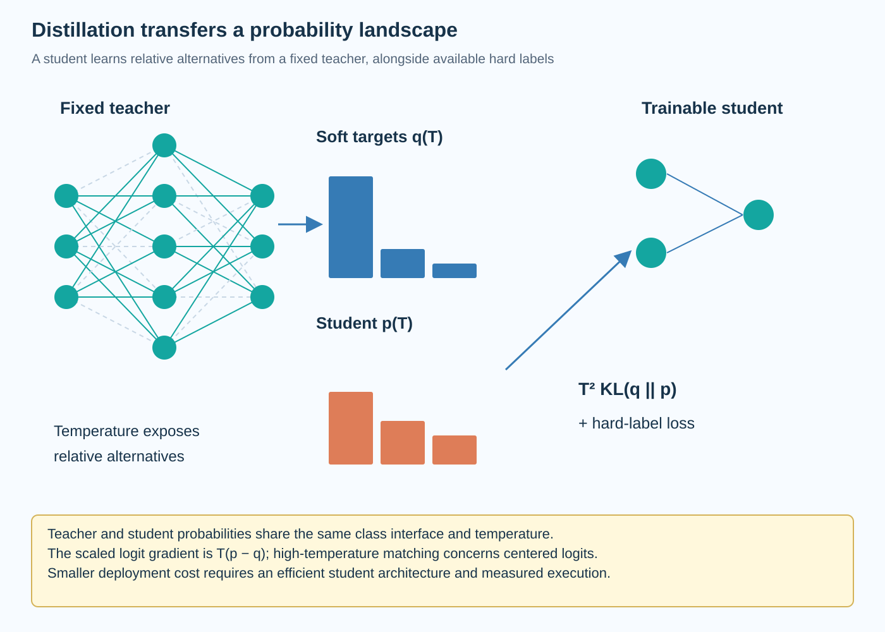

Knowledge distillation trains a student using information produced by a teacher. Its efficiency benefit comes from changing the deployed model or its behavior, while moving additional work into preparation. The student is not automatically faster because its training objective mentions a teacher. It needs an architecture and execution path that actually cost less under the target workload.

The classical formulation uses softened class probabilities. This article derives the temperature-dependent objective and its gradient, explains what information the soft distribution contributes, and connects those choices to calibration, data, and deployment evidence. The same language is often applied to language-model imitation, but token-level and sequence-level objectives have different statistical effects.

*An original conceptual illustration. Numerical plots and examples are illustrative unless explicitly identified as measured evidence.*

## 1. Begin with supervised learning

For a classification example x, a student produces logits z_i for K classes. Softmax transforms them into a probability distribution. A one-hot label y gives the standard cross-entropy objective.

$$
p_i=\frac{\exp(z_i)}{\sum_j\exp(z_j)},\qquad \mathcal L_{\mathrm{hard}}=-\sum_i y_i\log p_i.
$$

For one observed label, the target puts all probability mass on that class. This tells the learner which outcome was recorded but does not directly encode the teacher's relative preference among alternatives.

The hard objective remains useful during distillation. Teacher predictions can be wrong or poorly calibrated. Ground-truth supervision provides another source of information when labels are available, and its weight should be chosen through validation rather than discarded by default.

## 2. Define teacher and student distributions

Let a_i denote teacher logits and z_i student logits. A positive temperature T softens both distributions by dividing logits before applying softmax.

$$
q_i^{(T)}=\frac{\exp(a_i/T)}{\sum_j\exp(a_j/T)},\qquad p_i^{(T)}=\frac{\exp(z_i/T)}{\sum_j\exp(z_j/T)}.
$$

Increasing temperature makes a finite logit vector's distribution less concentrated. It does not change the ordering of its logits. The softened distribution can expose relative probabilities that are numerically tiny at the usual temperature.

The teacher is normally fixed for the student-training procedure considered here. Store its checkpoint, preprocessing, inference precision, and target-generation policy. Those settings define the supervision and are necessary to interpret the resulting student.

## 3. Interpret information beyond the top label

Suppose the correct class is a dog breed. A teacher might assign its remaining mass mostly to similar breeds, while assigning much less to unrelated vehicles. The one-hot target does not contain that pattern, whereas the soft target represents a learned relationship among alternatives for this input.

This information is conditional on the teacher and data population. It can reflect useful structure, but it can also reflect systematic errors. Calling it knowledge does not establish that every probability difference is worth reproducing.

Inspect examples where the teacher is uncertain and where it conflicts with labels. A student with limited capacity may benefit from some distinctions while failing to reproduce others. Distillation is a constrained learning problem, not a lossless transfer of the teacher's internal computation.

## 4. Write the distillation objective

A standard soft-target loss minimizes teacher-to-student KL divergence. The teacher entropy is constant with respect to student parameters, so minimizing it has the same student gradient as soft-target cross entropy.

$$
\mathcal L_{\mathrm{KD}}=T^2 D_{\mathrm{KL}}\!\left(q^{(T)}\Vert p^{(T)}\right)=T^2\sum_i q_i^{(T)}\log\frac{q_i^{(T)}}{p_i^{(T)}}.
$$

The direction matters. Teacher-to-student KL weights errors by teacher probability. Reversing the distributions defines another objective and changes how missing or extra probability mass is penalized.

Both distributions must share the class interface. In classification that usually means the same label set and ordering. Language-model distillation requires additional attention to vocabulary, tokenizer, and sequence conditioning. Probability vectors with different semantics cannot be matched directly merely because they have similar lengths.

## 5. Derive the logit gradient

Differentiating soft-target cross entropy through temperature-scaled softmax introduces a factor of one over T. Including the customary T squared multiplier gives the gradient below.

$$
\frac{\partial\mathcal L_{\mathrm{KD}}}{\partial z_i}=T\left(p_i^{(T)}-q_i^{(T)}\right).
$$

At high temperature, the probability difference itself scales approximately as one over T under the relevant expansion. Without compensation, the gradient would shrink approximately as one over T squared. The multiplier helps keep the soft objective's scale comparable while temperature is varied.

This is an asymptotic explanation, not a claim that every temperature produces identical optimization. Softmax is nonlinear, and the probability structure changes with T. Validate temperature and the mixture weight together under the actual training setup.

## 6. Connect high temperature to logit matching

Softmax is invariant to adding the same constant to every logit. Center teacher and student logits by subtracting their respective means. If their centered magnitudes are small compared with T, a first-order expansion gives:

$$
p_i^{(T)}\approx\frac1K+\frac{z_i-\bar z}{KT},\qquad q_i^{(T)}\approx\frac1K+\frac{a_i-\bar a}{KT}.
$$

The scaled gradient then approximately tracks differences between centered logits. This connects high-temperature distillation to matching relative logit values rather than arbitrary absolute offsets.

The approximation has a regime of validity. It should not be applied to a sharply concentrated distribution simply because a paper discusses temperature. Inspect logit magnitudes and use the exact softmax objective in the implementation. The expansion explains behavior; it does not replace the numerical calculation.

## 7. Combine soft and hard supervision

A common training objective mixes soft-target distillation with ordinary labeled cross entropy. The hard loss uses the usual temperature of 1, while the soft loss compares teacher and student at the chosen distillation temperature.

$$
\mathcal L=(1-\lambda)\mathcal L_{\mathrm{hard}}+\lambda\mathcal L_{\mathrm{KD}},\qquad 0\le\lambda\le1.
$$

The weight lambda determines how much the training follows each information source under this convention. Papers and libraries sometimes name the opposite mixture coefficient. Record the actual expression rather than relying on a parameter name.

If labels are unavailable, training can use teacher supervision alone, but that changes the evidence and failure risks. Evaluate against an independent target population. A student that reproduces a teacher's calibration-set answers has demonstrated imitation on those examples, not necessarily generalization.

## 8. Work through soft targets

Consider an illustrative 3-class teacher distribution at a selected temperature: 0.7, 0.2, and 0.1. Suppose the student predicts 0.5, 0.3, and 0.2 at the same temperature. The soft-target cross entropy is approximately 0.958 nats.

The one-hot loss for class 1 would instead be approximately 0.693 nats. These numbers are different objectives and should not be compared as if a smaller value necessarily represents a better student. The soft loss assigns weight to all 3 classes.

With temperature 2 and the T squared convention, the logit-gradient components are approximately negative 0.4, positive 0.2, and positive 0.2. Gradient descent raises the first logit relative to the others. The example illustrates the derivative; it contains no measured model performance.

## 9. Keep temperature separate from calibration

Temperature used to soften distillation targets is a training-design choice. Temperature scaling used to calibrate a classifier is fitted to improve the relationship between confidence and observed correctness. Their algebra can look similar while their objectives and data roles differ.

A teacher's softened target does not automatically become calibrated. Nor does matching that target guarantee that the student has reliable confidence estimates after training. Assess calibration separately if the application uses probabilities for decisions.

Use a held-out calibration population and appropriate metrics. Reliability diagrams can reveal structured errors that a single summary obscures. Preserve the task context: confidence about a classification label differs from probabilities over language tokens or correctness of a complete generated answer.

## 10. Choose the student architecture deliberately

A student can reduce depth, width, token count, or another expensive component. Each change creates a capacity and execution tradeoff. Parameter count alone does not determine runtime because matrix shapes, memory traffic, and backend support also matter.

The teacher's computational strategy need not fit the student architecture. A smaller network can approximate outputs while representing features differently. Intermediate-feature losses can provide additional guidance, but they introduce alignment choices discussed in the companion article.

Start with a student that already has a plausible efficient execution path. Distillation should improve its quality under that design. It cannot turn unsupported operations or unfavorable kernel shapes into an efficient deployment merely by transferring more supervision.

## 11. Account for teacher preparation cost

Generating soft targets costs teacher inference, storage, and data processing. Online targets avoid storing every distribution but add teacher computation during training. Offline targets can be reused but consume space and tie the dataset to a specific teacher configuration.

For a large vocabulary, storing a full probability vector per token can be expensive. Truncating to selected probabilities changes the supervision interface. A normalized top-k distribution discards the omitted mass unless the objective explicitly accounts for it.

Report the target representation and its precision. Quantizing stored probabilities or logits can introduce another approximation. Teacher evaluation, student training, and deployed student inference belong to different cost phases and should be accounted for separately.

## 12. Understand token-level imitation

For an autoregressive model, token-level distillation compares conditional distributions under a context. The loss aggregates over positions, using the same conditioning policy for teacher and student when direct matching is intended.

Training under teacher-generated or ground-truth prefixes differs from evaluating under the student's own generated prefixes. Errors can accumulate once the student leaves the training-context distribution. Matching local probabilities does not establish equal sequence-level behavior.

Vocabulary compatibility matters. Different tokenizations can require sequence-level objectives or a documented mapping instead of direct vector KL. Also preserve context truncation and special-token handling. Otherwise an apparently simple probability-matching implementation can compare different prediction tasks at the same array index.

## 13. Evaluate beyond teacher agreement

Measure student quality against the intended task and compare with a student trained without distillation under a fair budget. Teacher agreement is a diagnostic, but it is not the deployment objective when the teacher can make mistakes.

Hold generation settings and evaluation implementation fixed. A comparison with different output budgets can confound efficiency and quality. Include cases where the teacher succeeds but the student fails, and cases where both fail for the same reason.

Measure the exported student on the target backend. Report preparation cost, resident bytes, latency, throughput, and task quality with their workloads. No training run or GPU timing was performed for this article; the numerical examples explain the objective rather than establish acceleration.

## 14. Relate distillation to other compression methods

Distillation can accompany pruning or quantization because those methods change different parts of the problem. Pruning changes the retained structure; quantization changes numerical representation; distillation changes supervision for recovering or learning useful behavior.

A combined experiment needs an ablation that separates those contributions. Compare the chosen architecture without distillation, with distillation, and with the additional compression policy under consistent training and evaluation budgets when feasible.

The resulting improvement belongs to the whole preparation and deployment configuration. Avoid attributing every gain to the teacher when architecture, data volume, and optimization also changed. Mechanistic explanations and controlled comparisons make the efficiency claim more informative than a label such as distilled model alone.

## 15. Diagnose an overly confident teacher

A teacher that assigns nearly all mass to one class at the selected temperature supplies little information beyond the hard label. Raising temperature can expose relative logits, but it cannot recover distinctions the teacher never learned. Inspect the target entropy and its variation across the training population before assuming that soft supervision is rich.

Conversely, extremely diffuse targets can provide weak task discrimination for a constrained student. The high-temperature logit-matching interpretation helps explain this limit, while validation determines whether the chosen softness improves the actual objective. Temperature is therefore a control on the representation of teacher information, not a universal quality dial.

A useful diagnostic compares hard-label training, teacher argmax targets, and full soft targets on the same student design and data budget. The comparison asks whether the distribution beyond the top class contributes measurable value. It also distinguishes that contribution from simply obtaining additional labeled examples through teacher predictions.

Maintain reproducible target generation and report the chosen mixture, temperature, and teacher checkpoint. Those concrete settings connect the theoretical gradient to the student artifact that will eventually be evaluated and deployed.

## Sources

- [Distilling the Knowledge in a Neural Network](https://arxiv.org/abs/1503.02531).
- [On Calibration of Modern Neural Networks](https://arxiv.org/abs/1706.04599).
- [Sequence-Level Knowledge Distillation](https://arxiv.org/abs/1606.07947).
- [FitNets: Hints for Thin Deep Nets](https://arxiv.org/abs/1412.6550).
