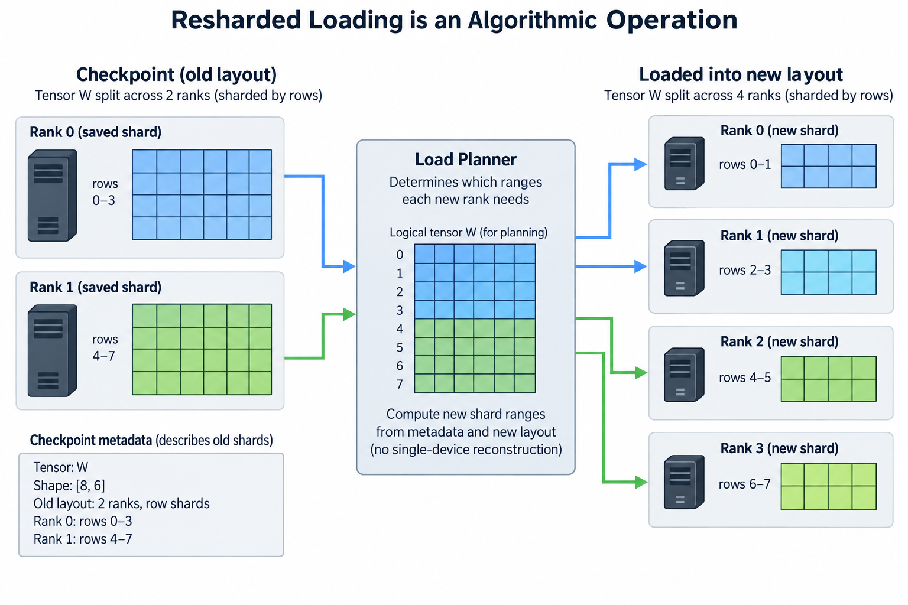

## Overview

A training cluster can display high GPU utilization while making little durable progress, and 3 mistakes produce that outcome: if checkpoints take too long they repeatedly interrupt computation, if they are too infrequent failures discard many completed steps, and if recovery is never tested a directory full of files can turn out not to contain a usable continuation of the training job.

So distributed checkpointing is part of performance engineering, not only a reliability feature. It defines what work survives, how much service time saving consumes, and how quickly the job returns to useful training after an interruption, so the right metric includes checkpoint and recovery costs alongside ordinary step throughput.

We will define the state needed for a meaningful restart, derive a simplified checkpoint interval, and examine asynchronous saving and resharded loading. The reliability calculations assume a stationary failure process and are illustrative, so actual intervals should use observed job-level behavior and storage performance under the intended workload.

## Deep dive

### 1. Define the training point being preserved

A model-weight checkpoint is useful for inference or evaluation, but continuing training usually needs 4 more pieces of state: the optimizer needs its moments and other persistent values, the learning-rate scheduler needs its position, mixed-precision machinery may keep scaling state, and the loop needs its optimizer-step count and accumulation position.

Random-number state can matter for dropout and sampling. The input pipeline needs enough information to reconstruct data progress, depending on the dataset, shuffling strategy, and reproducibility target. Some systems can restart with a valid but not exactly identical future sample stream; that should be documented rather than silently described as bitwise continuation.

The checkpoint also needs enough configuration and version information to interpret tensor shapes, numerical representations, and distributed ownership, because a shard without its layout metadata may not be enough to reconstruct the logical model, and a collection of independently captured ranks can describe different training points if saving is not coordinated correctly.

Choose a clear capture boundary, such as immediately after a completed optimizer update. Capturing in the middle of accumulation requires preserving the partial gradients and loop state consistently. The simplest supported boundary is often better than a more flexible boundary whose recovery semantics are not understood.

### 2. Sharded state should not require an impossible gather

A fully sharded training job can hold state that no single GPU can materialize completely. Gathering all parameters and optimizer tensors onto rank 0 just to save them can recreate the original capacity problem. Distributed writers instead save local shards alongside metadata describing their logical ownership.

PyTorch Distributed Checkpoint supports parallel save and load and documents load-time resharding. That capability depends on supported representations and planners; it does not mean arbitrary compatibility across every optimizer, framework, or historical checkpoint format.

The storage path includes 4 stages: metadata operations, local serialization or staging, shard writes, and final completion signaling. If many ranks write simultaneously, shared storage targets or network paths can limit aggregate throughput, so individual-device write rates do not add without bound.

Count 2 numbers, logical checkpoint bytes and actual physical bytes written. Replicated tensors, duplicated metadata, format overhead, and compression can change the relationship. A filesystem reporting a large directory size and a network reporting transferred bytes may use different conventions, so compare measurements under defined units.

### 3. Derive a simple checkpoint interval

Let I be useful compute time between checkpoints, C the blocking checkpoint cost, tau the mean time between job-level interruptions, and R the average recovery cost. Under the kind of simplified independent, stationary failure model Young analyzed, expected waste can be approximated by

$$
W(I)\approx\frac{C}{I}+\frac{I}{2\tau}+\frac{R}{\tau}.
$$

The 1st term is checkpoint overhead, the 2nd assumes a failure loses about half an interval on average, and the 3rd accounts for time spent recovering. The approximation assumes the costs are relatively small and does not describe every failure distribution or asynchronous schedule.

Differentiating the interval-dependent terms gives

$$
I_{\mathrm{opt}}\approx\sqrt{2C\tau}.
$$

The result is a useful planning baseline: faster checkpointing allows more frequent saves, while more reliable jobs justify longer intervals. It stops being an optimal policy in 4 situations, when failure risk changes over time, when planned preemptions are announced, when checkpoint bandwidth varies, or when the job is nearly finished.

Use the job-level interruption interval, not an unrelated component reliability number. If 1 device failure stops a large gang-scheduled job, the effective job failure process can differ greatly from the reliability of 1 GPU. Shared power, networking, and software failures also violate naive independence assumptions.

### 4. Work a checkpoint-cost example

Suppose a blocking checkpoint costs 30 seconds, average job interruption time is 7200 seconds, and recovery costs 45 seconds. The simplified optimal interval is the square root of 432,000, about 657 seconds, or about 11 minutes of useful computation.

At that interval, checkpoint overhead is about 30 divided by 657, or 4.6%. Expected lost work is about 657 divided by 14,400, also 4.6%. Recovery contributes 45 divided by 7200, or 0.625%. Total approximate waste is therefore about 9.8%.

These values are hypothetical and show the model’s sensitivity. Reducing checkpoint cost to 5 seconds changes the interval estimate to about 268 seconds. Although saves become more frequent, the combined checkpoint and lost-work terms shrink. So the speed of the storage path affects durable training goodput.

A long interval chosen only to minimize visible save stalls can produce worse expected progress when failures are common, while a very short interval chosen only to minimize lost steps can use too much storage service. Justify the interval with both measured checkpoint behavior and a documented interruption model.

### 5. Asynchronous saving separates capture from persistence

An asynchronous checkpoint can copy or stage a consistent state and write it while training resumes. This reduces the visibly blocking interval, but the background work still uses host memory, storage bandwidth, and potentially network or device-transfer resources.

A returned handle or queued request is not necessarily a durable checkpoint. Define 3 separate timestamps, one for capture completion, one for background write completion, and one for committed recoverability according to the storage and framework guarantees. The job must know which checkpoint is safe to use after an interruption.

If training mutates tensors while the writer still reads them, saving can capture inconsistent values unless staging or another ownership mechanism prevents the race. A background writer holding references to live mutable tensors is not automatically a correct asynchronous checkpoint implementation.

Limit the number of outstanding saves. If checkpoint production runs faster than the writer can persist them, queues and staging buffers grow, which can use up host capacity and turn an apparently asynchronous feature into an eventual stall. Backpressure is part of the scheduling design, not evidence that asynchronous saving failed conceptually.

### 6. Measure background contention, not only blocking time

A checkpoint writer can compete with 3 other consumers of storage and host resources: the training input pipeline, optimizer offload, and other jobs. Training step time may increase during background writes even when no explicit save barrier appears in the GPU trace.

Measure ordinary steps and checkpoint-overlapping steps separately, then evaluate progress across the full interval. If compute-only step time is T_0 and background periods produce slower T_1, the difference belongs in the checkpoint cost model. Counting only the short staging pause understates the performance impact.

So the relevant checkpoint cost for interval planning is an effective lost-progress contribution, not necessarily the writer’s wall-clock duration. A writer can take 60 seconds in the background while costing much less than 60 seconds of useful training, or it can heavily interfere with another critical service.

Capture host-memory peaks and queue depth alongside bandwidth. Staging large optimizer state can exceed available DRAM even when GPU memory is comfortable. The worst-case supported checkpoint path should be part of capacity testing for a long-running job.

### 7. Resharded loading is an algorithmic operation

Loading a checkpoint into a different rank layout requires mapping logical tensors to new owners. Metadata describes the old shards; the load planner determines which ranges each new rank needs. Supported systems can avoid reconstructing every complete tensor on 1 device.

A changed layout can also change process-group definitions, optimizer partitioning, and local buffer sizes, and successful tensor loading does not guarantee the subsequent distributed computation is valid, because the new training configuration must satisfy shape, divisibility, and collective-ordering requirements.

Test the exact layout changes that operations will support, such as restarting with a different data-sharding degree. Do not generalize 1 successful resharding test to arbitrary tensor or pipeline partitions, optimizer formats, or software migrations. Compatibility is a specific capability with documented limits.

A useful recovery test loads the checkpoint, checks the logical training position and tensor values, executes forward and backward, and completes an optimizer update. This checks more than file readability. Include the longest supported input shape when that path can recreate memory peaks absent from a small test.

### 8. Make incomplete checkpoints distinguishable

A checkpoint should have a clear completion or commit convention, since readers must be able to distinguish a fully written state from a partially created directory left by interruption, and atomicity depends on the storage and writer design, so a filename or timestamp alone is not a proof of consistency.

Keep metadata and shard references coherent. Check that the expected objects exist and can be interpreted before advertising a checkpoint as recoverable. Checksums or format-specific validation can help detect corruption, but they do not prove that all ranks captured the same logical training point.

Retention policies should keep 2 or more known-good checkpoints, so that an incomplete or unusable newest save is survivable. The right number depends on storage capacity, write cost, and operational requirements. Test recovery from an older completed checkpoint as well as from the latest one.

Treat cleanup and lifecycle separately from training performance. Removing obsolete state should not race with a writer or reader still using it, so operational policies need explicit ownership and completion signals, just as device buffers do in an asynchronous compute schedule.

### 9. Evaluate durable training goodput

Raw tokens per second counts useful computation while the job is active. Durable progress over an observation interval also accounts for 4 further costs: checkpoint stalls, background slowdown, lost work, and recovery. A simple empirical metric divides retained useful training tokens by elapsed wall-clock time.

Choose the retention definition carefully. Tokens computed and later replayed after rollback should not be counted twice as durable progress. If a recovery intentionally changes the data stream, explain how the training position and useful-work accounting are reconstructed.

Run failure-injection tests in an appropriate disposable training environment before relying on the recovery path. Exercise interruption at 2 moments, during computation and during checkpoint writing, then verify the selected completed checkpoint and continued optimizer updates. A successful steady-state benchmark cannot prove failure behavior it never exercised.

Keep recovery results with the training configuration. Record 6 facts: checkpoint format, storage backend, software versions, rank layout, capture boundary, and supported restart scenarios. The method should remain reviewable when a later change affects optimizer state or distributed ownership.

## Conclusion

A recoverable checkpoint represents 1 consistent training point, including the state needed to continue the intended update sequence. Distributed writers preserve sharded ownership; asynchronous saving separates capture from durable completion but adds background resource costs.

Choose intervals using measured effective save cost and job-level interruption behavior, verify loading and a subsequent update, and report durable useful progress across failures. Checkpoint engineering improves the training result by preserving work, not just by producing files faster.

### Sources

- [PyTorch Distributed Checkpoint](https://docs.pytorch.org/docs/stable/distributed.checkpoint.html): parallel save/load, planners, and resharding.
- [PyTorch asynchronous checkpoint recipe](https://docs.pytorch.org/tutorials/recipes/distributed_async_checkpoint_recipe.html): staging, asynchronous writes, and memory considerations.
- [Young, A First Order Approximation to the Optimum Checkpoint Interval](https://doi.org/10.1145/361147.361115): checkpoint interval model.
- [Daly, A Higher Order Estimate of the Optimum Checkpoint Interval for Restart Dumps](https://doi.org/10.1016/j.future.2004.11.016): refined restart interval analysis.
