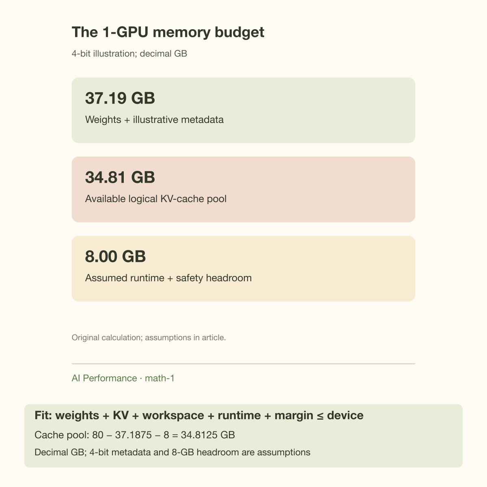
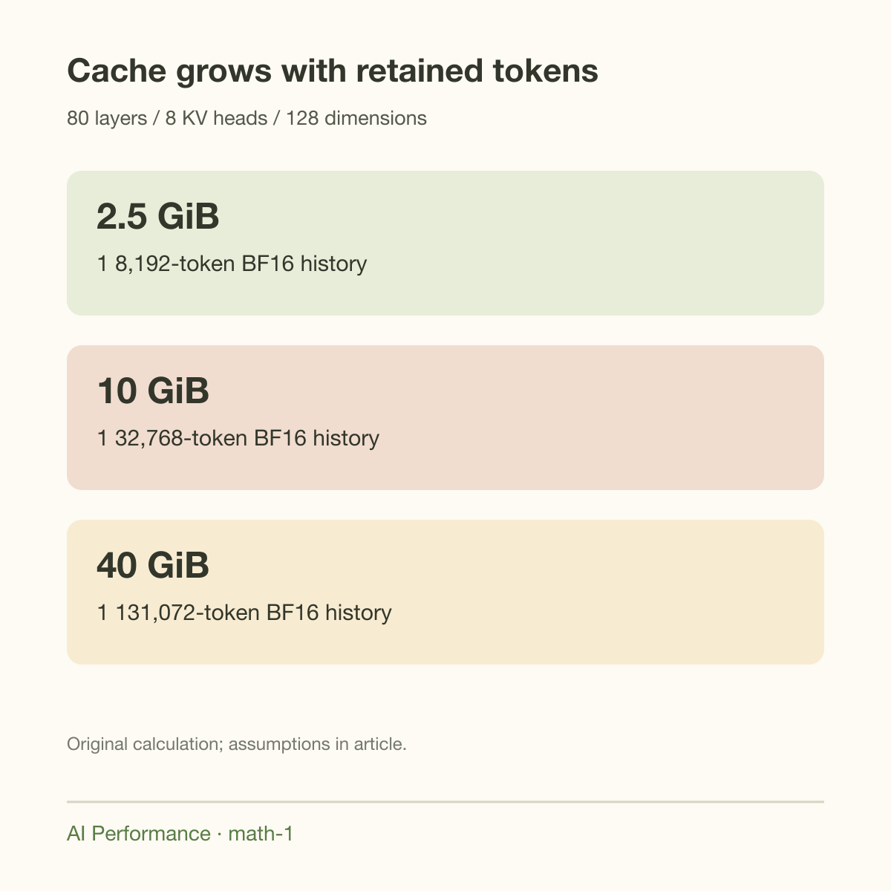
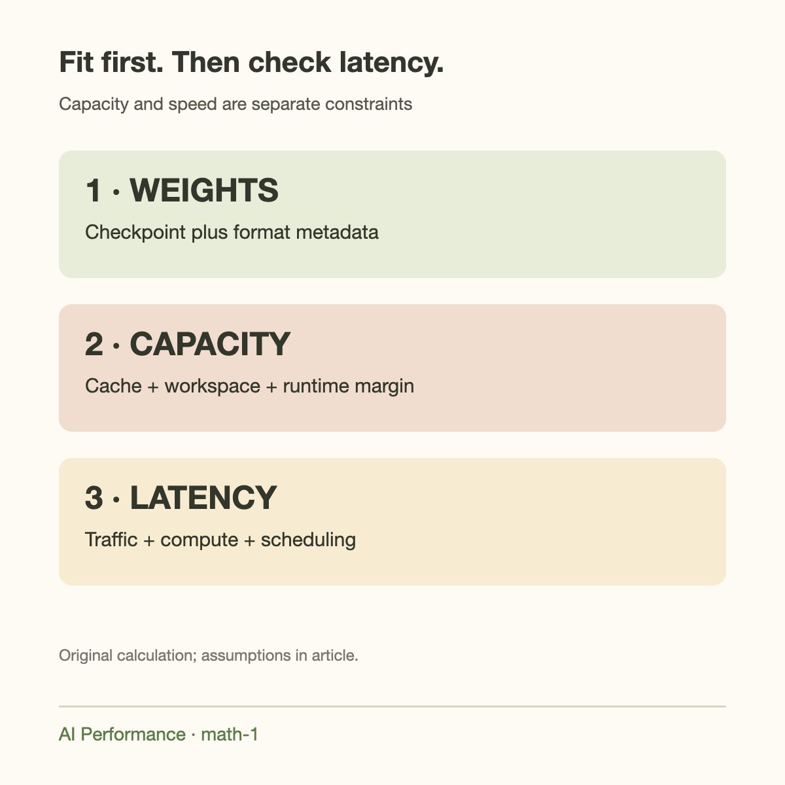

140 billion bytes is the approximate weight footprint of a 70-billion-parameter model stored in BF16. An H100 SXM is specified with 80 GB of GPU memory. Before considering a single prompt, the unquantized model already exceeds 1 GPU's capacity.

The interesting question begins after that obvious comparison. 4-bit weights appear to reduce the footprint to 35 billion bytes, leaving room for inference. Does that mean a long-context server will run comfortably? Only if the remaining memory covers the key-value cache, quantization metadata, temporary workspaces, and the serving engine's reservations. A model that loads successfully can still fail when the first large request arrives.

This article builds an explicit memory model rather than treating parameter count as a deployment specification. We use a Llama-3.1-70B-like dense decoder and distinguish rounded estimates from exact allocation measurements. Meta's model card identifies the 70B model as a grouped-query-attention model with a 128k context window; its public SKU registry gives the dimensions needed for the cache calculation. NVIDIA's H100 specification supplies the hardware capacity. The arithmetic below is an engineering estimate, not a benchmark or a guarantee for a particular checkpoint.

## Define the deployment before counting bytes

Specify the checkpoint, weight representation, cache representation, GPU variant, and maximum concurrent requests. “70B on H100” omits almost every variable that controls the answer. H100 SXM and H100 NVL have different capacities. A 4-bit checkpoint with BF16 cache has a very different budget from a BF16 checkpoint with an 8-bit cache.

We will use 70 billion parameters as a rounded count, 80 decoder layers, 8 key-value heads, and a head dimension of 128. There are 64 query heads in the configuration, but those do not imply 64 independently stored key-value heads. This distinction is the main reason the cache is smaller than a naive hidden-size estimate suggests.

For transparent arithmetic, define 1 GB as $$10^9$$ bytes and 1 GiB as $$2^{30}$$ bytes. We conservatively model the advertised 80 GB as $$80\times10^9$$ bytes; inspect your actual device's reported allocation capacity before deploying. Frameworks often print binary units while product specifications use a GB label. Mixing those conventions can make several gigabytes seem to appear or disappear.

## The complete budget

A useful first-order inequality is

$$
M_{\mathrm{weights}}+M_{\mathrm{KV}}+M_{\mathrm{workspace}}+M_{\mathrm{runtime}}+M_{\mathrm{margin}}\le M_{\mathrm{device}}.
$$

Each term represents a different mechanism. Weights hold learned parameters. KV cache stores attention state for active token histories. Workspace includes temporary tensors and kernel scratch memory, with prefill often setting a larger peak than decode. Runtime memory includes engine structures, graph captures, and allocator reservations. Margin protects against workload changes and imperfect estimates.

Do not sum allocated memory and reserved memory blindly. A caching allocator can reserve a block containing already allocated tensors; counting both duplicates the same bytes. Similarly, a serving engine may preallocate its cache pool during startup, so the apparent “free memory” after loading is not necessarily available for unrelated tensors.



## Weight precision gives a lower bound

For $$P$$ parameters and $$b_w$$ bytes per parameter,

$$
M_w=P b_w.
$$

With $$P=70\times10^9$$, BF16 gives $$140$$ GB, an 8-bit representation gives $$70$$ GB, and a packed 4-bit representation gives $$35$$ GB. These figures count payload only. Quantization is a representation with structure, not simply a smaller scalar type that every tensor automatically uses.

Suppose each group of 128 weights has 1 FP16 scale and 1 FP16 0 point. 4 metadata bytes per group add

$$
M_{\mathrm{meta}}=\frac{P}{128}\times4=2.1875\ \mathrm{GB}.
$$

The effective storage becomes $$0.53125$$ bytes per weight, or $$4.25$$ bits, before unquantized tensors and alignment. A symmetric scheme that omits 0 points has different overhead. A real format might store other metadata or group weights along particular tensor dimensions. This example illustrates how to read a format; it does not claim that every 4-bit checkpoint uses this layout.

At 8 bits, the rounded 70 GB payload leaves only 10 GB under our conservative capacity convention. Even if the weights load, that is a small pool for cache and peak workspace. At 4 bits, the illustrative 37.1875 GB payload-plus-metadata leaves much more room. Memory feasibility improves, but quality and kernel performance still require validation.

## Derive KV bytes per token

For each decoder layer, a cached token stores a key vector and a value vector for every KV head. If $$L$$ is the layer count, $$H_{kv}$$ the KV-head count, $$d$$ the head dimension, and $$b_{kv}$$ the bytes per cached element,

$$
c_{kv}=2 L H_{kv} d b_{kv}.
$$

For our geometry with a 2-byte cache,

$$
c_{kv}=2\times80\times8\times128\times2
=327{,}680\ \mathrm{bytes/token}.
$$

That is 320 KiB per retained token. A request with 8,192 cached tokens uses 2.5 GiB of logical cache. At 32,768 tokens it uses 10 GiB. At 131,072 tokens it uses 40 GiB. These are token-state payloads before block rounding or cache-management overhead.

The cache counts prompt tokens plus generated tokens retained in the context, not just the output. A request with an 8,000-token prompt and 192 generated tokens reaches the same 8,192-token calculation. During generation, its cache continues to grow unless the attention mechanism or serving policy discards old state.

For several independent requests with retained lengths $$S_i$$, sum their lengths:

$$
M_{KV}=c_{kv}\sum_i S_i.
$$

Shared-prefix caching can reduce physical duplication, but it must actually be supported and active. Merely receiving similar prompts does not entitle a capacity calculator to subtract their prefixes.



## A worked 1-GPU budget

Assume our illustrative 4-bit format uses 37.1875 GB for weights and metadata. Reserve 8 GB for runtime, workspace, and safety margin. That reservation is a planning assumption, not a universal engine requirement. Measure it with representative prefill and decode workloads.

The remaining logical cache budget is

$$
M_{KV,\mathrm{available}}=80-37.1875-8=34.8125\ \mathrm{GB}.
$$

Divide by the per-token cache footprint:

$$
T_{\mathrm{total}}=\left\lfloor\frac{34.8125\times10^9}{327{,}680}\right\rfloor
=106{,}239\ \mathrm{tokens}.
$$

That pool can hold about 12 independent 8,192-token histories, because 12 require 30 GiB, approximately 32.21 GB. 13 require approximately 34.90 GB and exceed the pool. 3 32,768-token histories also require 30 GiB. 1 full 131,072-token history requires approximately 42.95 GB and does not fit this budget.

Thus “the model fits” and “the maximum advertised context fits” produce different answers. The 4-bit model fits under these assumptions, but a full 128k request with BF16 cache does not. An 8-bit cache would halve the logical payload, provided the engine and hardware support the chosen representation and quality remains acceptable. That is a separate design decision, not an automatic consequence of quantizing weights.

## Going deeper: peak memory differs from steady memory

Prefill evaluates many prompt positions together. Depending on attention implementation, chunk size, and graph policy, its transient tensors may be much larger than those needed by 1 decode step. A startup memory estimate that exercises only short prompts can miss the true peak. Chunked prefill may reduce temporary allocation requirements while introducing scheduling tradeoffs.

A paged cache allocates token state in fixed-size blocks. If each block holds $$q$$ tokens, an independent request needs $$q\lceil S/q\rceil$$ token slots. For a 16-token block and an 8,193-token history, the engine needs 8,208 logical slots. 1 request's rounding is small; thousands of short requests can collectively waste significant capacity. Paged allocation reduces fragmentation relative to large contiguous reservations, but it does not erase the underlying per-token state.

CUDA graph capture may retain memory for several supported batch shapes. Different engines handle those pools differently. Quantized GEMMs may need dequantization or staging workspaces, although optimized kernels need not expand the entire model to BF16 at once. Inspect the actual execution path before assuming either 0 workspace or a full unquantized duplicate.

Finally, memory capacity and memory traffic are separate. A cache can fit while long-context decode becomes too slow because attention reads substantial history on every step. The next GPU Math articles develop that bandwidth limit. A useful deployment must meet both capacity and latency requirements.

Admission should reserve intended growth rather than only current cache length. For block size q, per-token cache c_kv, prompt lengths S_i, and admitted output allowances G_i, a conservative unshared commitment is

$$
M_{\mathrm{committed}}=c_{\mathrm{kv}}\sum_i q\left\lceil\frac{S_i+G_i}{q}\right\rceil.
$$

The equation assumes all allowed output tokens remain in full attention and does not subtract speculative prefix reuse. With q equal to 16, a request beginning at 8192 prompt tokens and permitted 1024 output tokens commits 9216 slots, or 2.8125 GiB at 320 KiB per slot. 12 such requests require 33.75 GiB, approximately 36.24 GB, exceeding the earlier 34.8125-GB cache pool even though 12 prompt-only histories fit.

A static output allowance protects accepted requests but can leave unused cache capacity when outputs finish early. Dynamic admission can improve packing, at the cost of handling growth and preemption explicitly. Document that policy alongside the precision and context envelope. The innovation in paging is allocating state incrementally and predictably; the remaining responsibility is ensuring simultaneously accepted requests do not grow into an impossible budget.

## What multiple GPUs change

Tensor parallelism can distribute weight matrices across devices. With 2 GPUs, an idealized BF16 weight shard is 70 GB per GPU, but that leaves little room on an 80 GB device. 4 GPUs produce 35 GB weight shards before metadata and replicated tensors, leaving a more useful cache budget.

KV state does not always shard in precisely the same ratio as weights. With 8 KV heads, a head-sharded implementation may distribute them cleanly across a suitable tensor-parallel degree. Beyond that, heads may be replicated or other partitioning strategies may apply. Check the serving engine's implementation rather than dividing every term by the GPU count.

Communication buffers also consume memory, and collectives introduce time. CPU offload can make a workload addressable without keeping all parameters in HBM, but it changes the bandwidth path. A capacity success achieved through a much slower link can become a latency failure. “Runs without an allocation error” is a weaker criterion than “serves the required traffic.”

## Measure the budget systematically

Begin with exact checkpoint tensor sizes and quantization metadata. Record GPU memory before engine initialization, after loading, after graph capture, and during the largest planned prefill. Avoid interpreting a single framework metric as total device usage; compare allocator statistics with device-level readings.

Exercise at least a long single request, the maximum concurrent short-request batch, and a mixed-length workload. The sum of cached lengths often governs payload, but the scheduling path can produce different workspace peaks for those cases. Include generated-token growth rather than stopping the measurement immediately after prompt ingestion.

Then repeat with the actual production cache dtype, graph settings, and memory-utilization configuration. A changed engine flag can alter reservations without changing the mathematical model. Keep the estimate alongside the measurement so discrepancies identify a missing term rather than becoming an unexplained safety percentage.

## Common misconceptions

**4-bit weights imply a 4-bit cache.** Weight tensors and attention state have independent representations. Our example deliberately combines 4-bit weights with a 2-byte cache, a common kind of mixed budget. Verify both settings separately.

**Grouped-query attention changes the number of query heads.** Queries still have their own heads; several share a key-value head. Cache storage uses KV heads. Using 64 rather than 8 here overestimates payload eightfold, turning 40 GiB into 320 GiB at full context.

**Available memory after loading is the request budget.** Runtime reservations and peak workspaces may not yet have occurred. Conversely, an engine may already have reserved a cache pool. Interpret the measurement in the engine's allocation lifecycle.

**The advertised context window is a memory guarantee.** It describes supported positional length and model behavior. It does not promise that every precision, device, and concurrency configuration can hold that length.

## Reproduce the arithmetic

```python
parameters = 70_000_000_000
weight_bytes = parameters * (0.5 + 4 / 128)
kv_bytes_per_token = 2 * 80 * 8 * 128 * 2
capacity = 80_000_000_000
headroom = 8_000_000_000
cache_pool = capacity - weight_bytes - headroom
print(weight_bytes / 1e9)             # 37.1875 GB
print(kv_bytes_per_token)              # 327680 bytes
print(int(cache_pool // kv_bytes_per_token))
print(131072 * kv_bytes_per_token / 2**30)  # 40 GiB
```

Replace the rounded parameter count with the checkpoint's actual tensor count. Replace the illustrative metadata term with the format's exact layout. Replace capacity and headroom with measurements. The script's value is its explicit assumptions, not the apparent precision of the final integer.



## Takeaway

A BF16 70B model cannot fit its approximate 140 GB weights on 1 80 GB H100 SXM. 4-bit storage can make 1-GPU inference feasible, but the cache determines which workloads remain feasible. In our worked budget, 12 8k histories fit while 1 full 128k BF16-cache history does not.

Use this budget before provisioning, then validate peak memory under the actual server configuration. Continue with [the bandwidth ceiling](../theoretical-tokens-per-second-from-bandwidth/) and [128k KV-cache math](../how-much-kv-cache-for-128k-context/) to understand why fitting the model is only the first step.


After estimating capacity, validate the intended engine rather than loading a bare checkpoint alone. Warmup can allocate additional buffers, and captured execution paths may reserve memory for several shapes. Increase concurrency gradually while recording both allocated and reserved memory. Test the largest admitted prompt and output budget together, since separate tests can miss their combined footprint. If the system only fits by removing all operating margin, lower the request budget or change the configuration before production use. The useful result is a documented stable envelope: precision, context limit, concurrency, engine version, and the memory observed under that envelope.

## Sources

- [NVIDIA H100 specifications](https://www.nvidia.com/en-us/data-center/h100/): capacity and variant distinctions.
- [Meta Llama 3.1 model card](https://huggingface.co/meta-llama/Llama-3.1-70B-Instruct): model family, context window, and grouped-query attention.
- [Meta model SKU registry](https://github.com/meta-llama/llama-models/blob/main/models/sku_list.py): decoder geometry.
- [vLLM paged-attention design](https://docs.vllm.ai/en/latest/design/paged_attention/): block-based cache representation.
