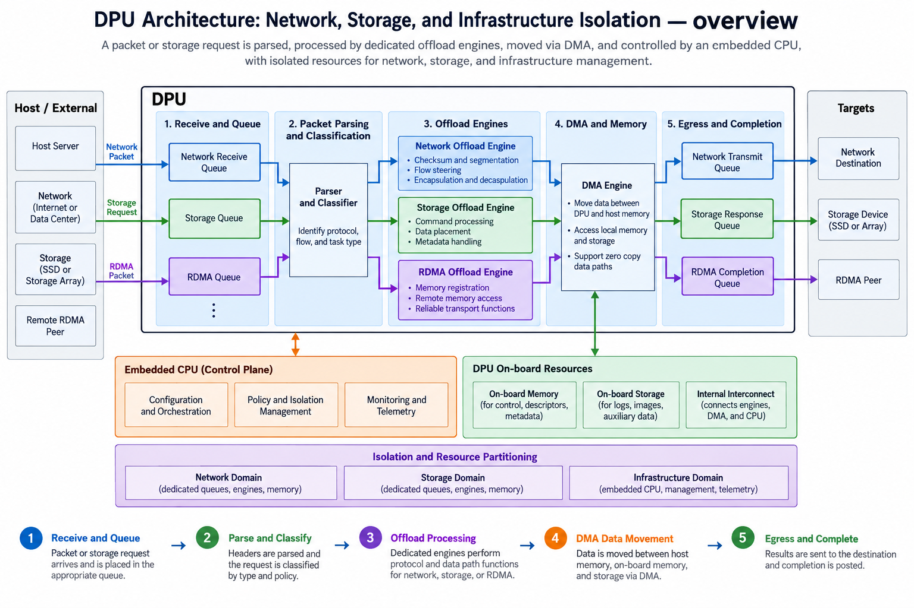
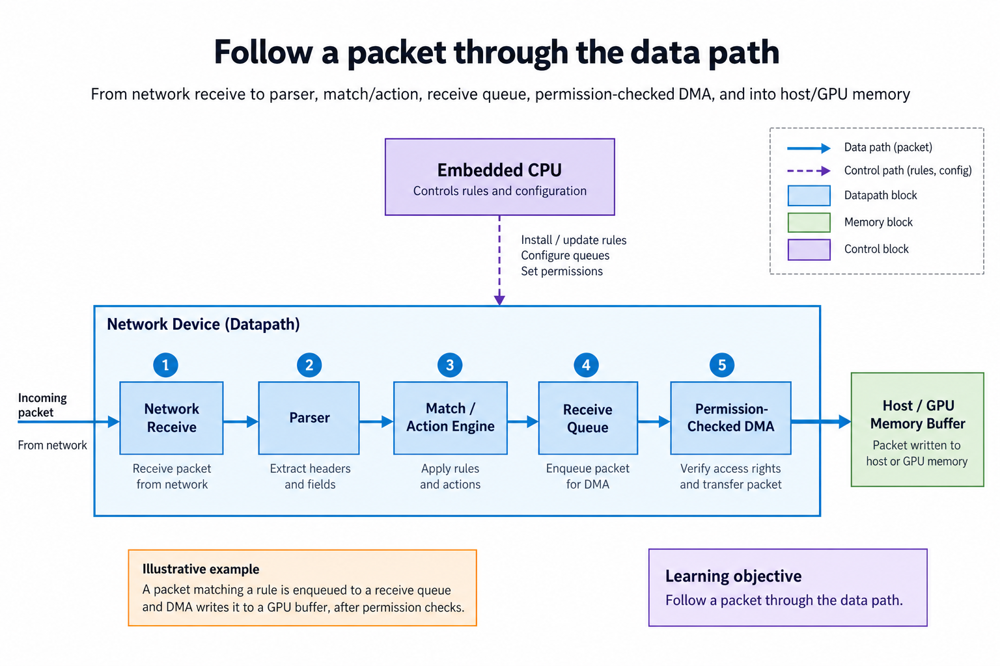
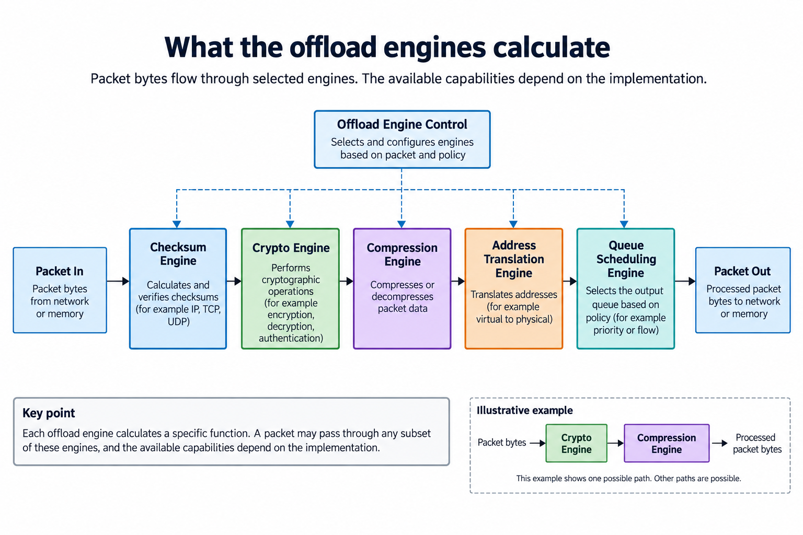
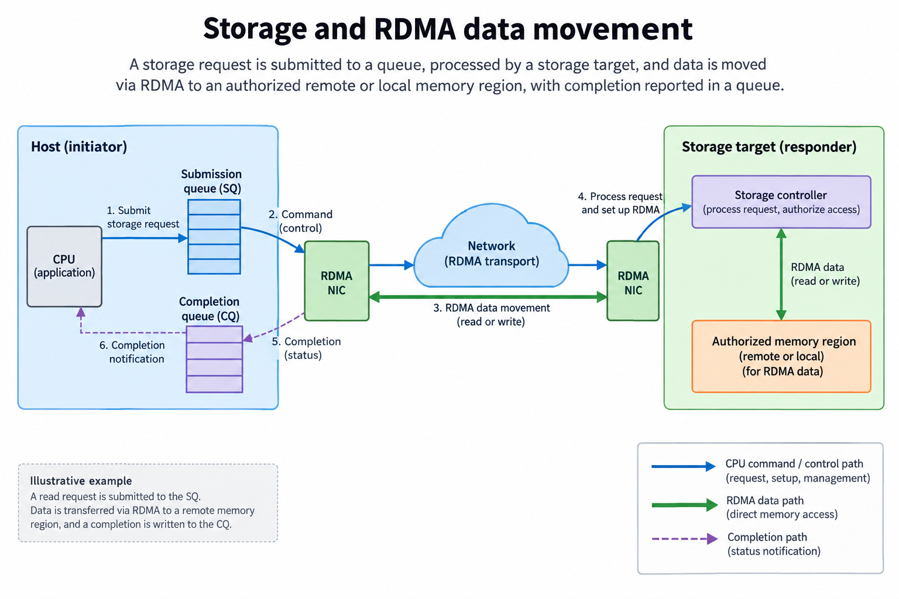
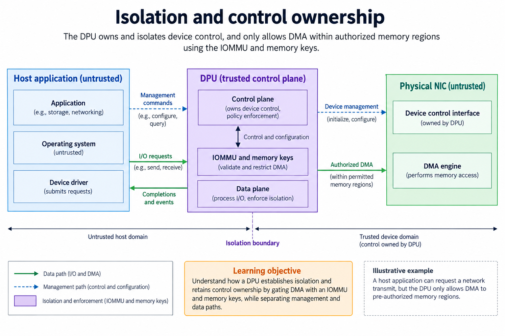

## Overview

A data processing unit, or DPU, is an infrastructure processor that combines network-facing data paths, programmable control and selected offload engines. It calculates and transforms packet or storage data, manages queues and moves authorized bytes between memories. This differs from a GPU or TPU's primary matrix execution path. A DPU can assist an AI system without being the device that performs its neural-network multiplication.

The overview separates solid data-path arrows from management decisions. A host submits work and consumes results; the DPU's control software configures behavior; the NIC and offload logic execute supported operations. Which capabilities exist, and which software owns them, depends on the product and operating mode. “DPU” is a category rather than a universal instruction set.

This article follows one packet and one storage transfer to explain what work is calculated, where it occurs and why the separation can matter to an AI cluster. Examples are illustrative budgets, not measurements. The dated product snapshot is 2026-09-13; the principles also apply to related SmartNIC designs when their documented capabilities match.

## Deep dive

### Follow a packet through the data path

The packet figure starts with a physical receive event, then follows parsing, classification, queue selection and DMA. A parser identifies fields such as protocol headers. A match/action stage applies configured rules. Queue logic selects the destination stream and manages descriptors. DMA transfers payload into an authorized memory region, after which a completion tells software what became available.

These stages perform different calculations. Parsing extracts fields at defined offsets and validates lengths. Classification compares those fields with rules or lookup tables. Address generation combines a descriptor's buffer location with an offset. Queue scheduling selects among pending requests under the implemented policy. None of these operations requires a large dense matrix multiplication merely because the packet belongs to an AI workload.

A packet's arrival does not establish that an application may immediately read a complete tensor. Software must observe the correct completion and any required memory-ordering guarantees. Truncated packets, malformed headers, unsupported encapsulation and exhausted queues need documented error behavior. If a parser trusts a length before validating bounds, it can create incorrect downstream addresses.

For an illustrative packet-rate budget, take a 100-Gb/s stream and 1,500-byte payloads. Dividing $$100\times10^9$$ bits/s by $$1,500\times8$$ bits gives approximately 8.33 million payloads/s, or 120 ns of average payload serialization time. Ethernet headers, preamble, gaps and other overhead reduce the attainable packet rate for that payload convention. This is not a full wire-rate calculation or a device specification.

That budget illustrates why a CPU-only per-packet path can be expensive: software has limited time to inspect, schedule and move each item. Hardware pipelines can process supported regular stages while programmable CPUs handle exceptions and management. [NVIDIA's DPU platform description](https://www.nvidia.com/en-us/networking/products/data-processing-unit/) presents network, storage and security offload as infrastructure responsibilities. The particular parser stages and budget here are an independent explanatory model.

### What the offload engines calculate

The engine figure lists several transformations separately because their algorithms and cost differ. A checksum accumulates information over bytes according to a protocol-defined rule. Cryptography implements a specified cipher, authentication or related primitive. Compression encodes repeated structure under a supported format. Address translation and access checks determine where a transfer may go. Queue scheduling decides when competing work proceeds.

Some stages can be pipelined on streaming bytes; others require message boundaries, state or metadata. An encryption engine must follow the algorithm's nonce, key and authentication requirements. A compression engine's output length depends on the input and format. A fixed payload cannot be assumed to compress by a constant factor. The controller needs to handle incompressible data and reserve enough destination capacity.

Offload moves an operation to another engine; it does not remove its dependencies. Keys still need provisioning, rules need management, and applications must agree on formats. If an unsupported packet reaches an exception path, embedded software or the host may handle it. The exception rate affects the complete system even when the regular fast path remains efficient.

Suppose a hypothetical storage service receives 10 GB/s of uncompressed data and the selected compression method produces 0.6 output bytes per input byte for one measured dataset. Its resulting payload stream would be 6 GB/s before framing. This scenario needs both a compressor capable of the input rate and a destination capable of the output rate. It is invalid to infer either from the compression ratio alone, and a different dataset may yield a different ratio.

NVIDIA's [BlueField-4 announcement](https://blogs.nvidia.com/blog/bluefield-4-ai-factory/) describes a product combining networking and programmable infrastructure processing. Use that as a dated example, not evidence that every DPU has its exact CPU, link rate or engines. A correct architecture explanation begins with supported transformations and their data contracts, then asks whether offloading them reduces host work or improves isolation for the intended application.

### Storage and RDMA data movement

The storage figure distinguishes a command from its payload. Software submits a request describing data and a destination. Transport logic communicates with another endpoint or storage resource. A memory operation moves bytes, and completion reports the result. Remote direct memory access, or RDMA, can avoid repeated CPU copying for a supported path, but it still uses queues, descriptors, permissions and synchronization.

A remote memory operation requires an authorized region and the appropriate access credentials or keys under the implementation. “Direct” does not mean unrestricted. The receiving side must know which buffers exist, how long they remain valid and when they can be reused. A buffer that is deregistered or reassigned while a request is outstanding creates a lifetime problem.

For an illustrative tensor transfer, 16 MiB contains 16,777,216 bytes. At a sustained 25 GB/s payload rate, serialization alone requires about 0.671 ms. Add request startup, queueing, transport processing and completion visibility to obtain a realistic transfer model. A link's nominal bit rate is not the same as this sustained payload rate. An operation split across several requests can also pay repeated overhead.

The storage path may include integrity checks, encryption, compression or namespace translation. Whether those functions execute on the DPU depends on the actual stack. Storage semantics still govern durability, ordering and failures. A successful local DMA is not automatically proof that a remote durable write completed.

AI systems benefit when input loading, checkpoints or distributed memory movement consume substantial host resources. The benefit depends on workload placement and software integration: a computation-bound matrix kernel will not necessarily speed up when storage handling is offloaded. Measure host CPU load, delivered bytes, queue latency and end-to-end completion separately. The DPU's contribution should be stated in the metric it changes, rather than being converted into an unsupported neural-network throughput claim.

### Isolation and control ownership

The isolation figure places a trust boundary around infrastructure ownership and shows permission checks on data movement. A DPU with an independently managed control environment can separate selected network/storage administration from host application execution. That design is useful when the host may run tenant workloads, while infrastructure services require a different owner and lifecycle.

The boundary is a system property, not an automatic consequence of adding a chip. Firmware, boot configuration, management access, IOMMU mappings, memory registration, keys and software permissions all contribute. A host-controllable configuration can weaken the intended separation. A privileged management path needs its own authentication and update policy.

Separate the control plane from the data plane. The control plane decides rules, allocates resources and provisions credentials. The data plane processes packets and transfers under those rules. A dashed arrow in the figure represents configuration rather than payload. This avoids the misleading impression that an embedded CPU copies every byte itself.

An IOMMU can translate and constrain device memory access according to configured mappings. RDMA memory keys supply another form of authorization in the applicable transport. Neither mechanism alone establishes every property of tenant isolation. Their scopes differ, and the platform must prevent an untrusted owner from simply changing the relevant configuration.

A useful review traces 4 questions: who can install a rule, who can access the buffer, who observes completion, and who can reset or update the device. Then test failures such as invalid descriptors, disallowed regions, queue exhaustion and recovery after reset. These checks support an explanation of infrastructure processing without assuming proprietary enforcement details. They also connect to the FPGA project's [command validation](/blog/fpga-ai-control-1-command-registers-and-scheduling/) and DMA models, where address bounds and completion are explicit parts of correctness.

### Build a complete service budget

A service with a fast packet path can still be constrained by memory writes, descriptor updates or its exception handler. Budget the entire path with the same unit convention. If incoming traffic is 20 GB/s but the destination permits only 12 GB/s of sustained writes, a queue absorbs the difference only temporarily. A 1-GB free buffer fills in $$1/(20-12)=0.125$$ seconds under this simplified constant-rate model. More buffering changes the time until backpressure; it does not fix the steady-state mismatch.

Record payload bytes separately from wire bytes and descriptor traffic. A multiport device's aggregate rate is different from one flow's usable rate. Some workloads have many small messages, where per-request processing dominates, while others have large contiguous transfers. Keep these distributions in a benchmark rather than replacing them with one average size. The result explains whether the bottleneck is packet rate, payload bandwidth, queue management or downstream storage, and therefore which offload capability is relevant.

### A worked engineering decision

Consider a storage request traveling from a remote client to a host application. The data path may include packet reception, transport handling, access control, encryption, DMA and a storage protocol. Moving 1 stage onto a DPU changes where work occurs, but does not automatically remove every copy, context switch or synchronization point. Draw the actual request and response path, including where ownership changes and where the host is allowed to consume the data.

Then classify each stage. Header matching may use a lookup or match/action pipeline; encryption may use a dedicated engine; general policy logic may run on embedded cores; tensor computation remains an independent question. Calling all of these “AI compute” obscures which resource is busy. A request rate and a cryptographic byte rate are also different metrics, with different packet-size and batching assumptions.

For an offload experiment, retain the same security policy and observable application behavior on the baseline host path and the offloaded path. Measure end-to-end latency and host resources, not just accelerator engine activity. Count additional data movement, queue depth and completion processing. Small requests may be dominated by setup, while large streams may emphasize sustained byte processing. Failure and retry behavior must preserve the same correctness and isolation contract.

Finally, ask whether removing host infrastructure work frees a useful resource for the application. If the host already waits on another bottleneck, freeing CPU cycles may improve capacity or isolation without reducing individual inference latency. Report that result precisely. The DPU's architectural value lies in placing infrastructure processing at the data boundary, with capabilities and isolation rules determined by the concrete system.

## Conclusion

A DPU calculates on infrastructure data: headers, descriptors, bytes, addresses and queue state. Its architecture combines regular offload pipelines with programmable control and memory movement. That role complements the GPU/TPU rather than duplicating their matrix datapaths.

To assess a DPU for an AI system, follow a representative request from submission through authorized transfer to completion. Identify the operations actually offloaded and the software that owns their configuration. Then measure delivered bytes, host work and completion latency under the intended failure behavior. A processor label or nominal network rate cannot replace that trace.

### Sources

- [NVIDIA data processing unit platform](https://www.nvidia.com/en-us/networking/products/data-processing-unit/)
- [BlueField-4 announcement](https://blogs.nvidia.com/blog/bluefield-4-ai-factory/)
