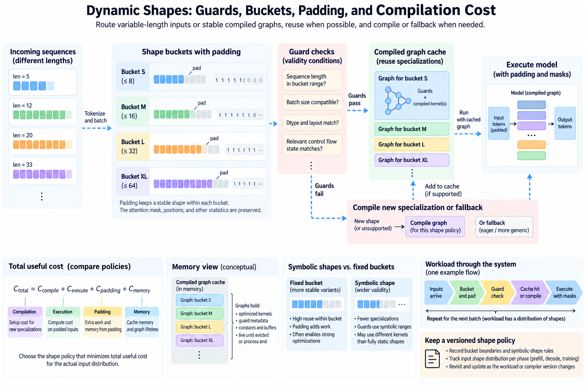
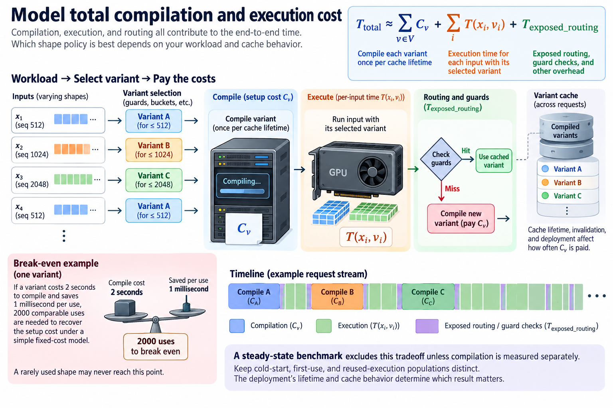

A compiled model can be fast for one input shape and expensive across a changing workload. New sizes can trigger specialization, guard checks, compilation, or different kernels. Padding can improve reuse of a stable shape but adds work and memory. Symbolic shapes can widen a variant's validity while changing the optimizations available to it.

The useful question is not whether dynamic shapes are good or bad. It is which shape policy minimizes total useful cost for the actual input distribution while preserving semantics and service objectives. Compilation, execution, padding, and memory belong in the same comparison.

We will derive these costs and explain guard behavior, bucketing, and measurement. Numerical examples are illustrative. Current PyTorch compiler documentation defines available controls and symbolic-shape behavior for the installed version.

## 1. Describe the whole specialization population

*Overview of the article’s core mechanism. The following sections explain the objects, relationships, equations, assumptions, and worked examples shown here.*

Record changing batch sizes, sequence lengths, feature widths, layouts, dtypes, and relevant branch behavior. A workload that varies only sequence length differs from one that also changes tensor strides and Python control state.

Preserve the frequency of each region of the population. A frequently reused shape can amortize compilation, while a rare shape can pay setup for little execution. Maximum shape alone does not reveal the operating cost.

Different phases can have different populations. Prefill sees varying prompt lengths, while decode may use small query lengths with changing cache state and active batch. Training can vary packed sequence composition or microbatch structure. A single generic shape policy can fit one phase poorly.

Keep the required output semantics explicit. Padding, packing, or changing a branch can alter masks, normalization, loss denominators, or sample coverage. Faster execution of a different population is not an equivalent implementation comparison.

Several specialization axes can combine. A simplified policy with 3 batch choices, 4 sequence buckets, and 2 layout cases has 24 possible combinations before dtype or branch differences. That is a potential space, not a claim that the compiler must create 24 independent variants. Symbolic reuse and shared paths can reduce it, while other assumptions can enlarge it. Record the combinations actually encountered and their frequencies. A policy that looks inexpensive when considering only sequence buckets can retain much more setup and memory when the full population is included.

## 2. Understand guards as validity conditions

A compiled variant is valid under conditions represented by its guards and specialization. A guard can depend on shape, dtype, layout, object state, or other supported assumptions. When those assumptions do not hold, the system must follow its supported fallback or compilation behavior.

A guard miss is different from a graph break. The former concerns reusing a compiled variant under changed conditions. The latter concerns a boundary where captured execution is separated or cannot continue as one graph under the integration's rules.

Inspect compiler diagnostics when investigating recompilation. Do not infer the cause solely from a changing dimension. A different stride, scalar condition, or surrounding Python object can invalidate reuse even when tensor sizes look similar.

Record the actual variants and why they are used. A configuration requesting dynamic execution does not establish that every relevant assumption became symbolic or that no specialization remains. Current supported behavior determines the executed result.

## 3. Model total compilation and execution cost

Let V be compiled variants, C_v their setup costs, and T(x_i,v_i) the execution time for input i using its selected variant. A simplified workload budget is

$$
T_{\mathrm{total}}\approx\sum_{v\in V}C_v+\sum_iT(x_i,v_i)+T_{\mathrm{exposed\ routing}}.
$$

The expression assumes compilation costs are included once per relevant cache lifetime. Repeated processes, cache invalidation, or remote deployment can change that lifetime. Overlap can also change exposed setup, so measure the actual service path.

For an illustrative variant costing 2 seconds to compile and saving 1 millisecond per use, 2000 comparable uses are needed to recover the setup cost under a simple fixed-cost model. A rarely used shape may never reach that point.

A steady-state benchmark excludes this tradeoff unless compilation is measured separately. Keep cold-start, first-use, and reused-execution populations distinct. The deployment's lifetime and cache behavior determine which result matters.

## 4. Symbolic shapes widen reuse but do not promise identical kernels

Symbolic dimensions let supported compiled execution represent a range of sizes instead of specializing every size independently. The compiler still needs valid relationships, bounds, and operations, and some optimizations depend on known dimensions.

A wider validity range can reduce variant count and setup. It can also select a different kernel or retain runtime checks. Neither outcome is universally better; measure representative shapes and the total workload.

Use current public compiler controls and diagnostics rather than copying internal settings from another release. Default automatic behavior, explicit dynamic requests, and dimension annotations have their documented semantics. Preserve the exact configuration with results.

Data-dependent control flow is a separate issue from symbolic tensor dimensions. A branch determined by tensor values can require different support from a branch determined by size. Do not expect dynamic shape handling alone to make arbitrary Python logic one reusable graph.

## 5. Bucketing trades more stable variants for padding

A bucket policy maps actual length L to a supported padded length B(L) at least as large as L. It can make kernels, graph replay, and memory plans more regular, but padded positions must be masked correctly and still can consume resources.

For approximately linear work, a first-order overhead factor is

$$
R_{\mathrm{linear}}\approx B(L)/L.
$$

For dense full attention during prefill, the score-pair population can scale quadratically:

$$
R_{\mathrm{attention}}\approx B(L)^2/L^2.
$$

These ratios are logical work estimates, not exact runtime predictions. Kernel efficiency can improve at a larger bucket, and sparse or hybrid attention has different work. The calculation identifies a cost to measure rather than declaring padding always slower.

For illustrative L=410 and bucket 512, linear work grows by about 24.9%, while the dense pair count grows by about 55.9%. A modest length increase can therefore have a larger attention cost than a linear-layer estimate suggests.

## 6. Derive a geometric-bucket tradeoff

If successive bucket boundaries grow by ratio r, a length just above the lower boundary can be padded by almost r. The corresponding dense-attention pair overhead can approach r squared.

To keep this simplified quadratic overhead below an allowed factor a, choose

$$
r\le\sqrt a.
$$

For a=1.25, r is at most about 1.118 under the model. Finer buckets reduce worst-case padding but increase shape variants and potentially setup or cache storage. A power-of-2 policy is simple but can have much larger worst-case logical padding.

The approximate number of geometric intervals covering lengths from L_min to L_max is the ceiling of log(L_max divided by L_min) divided by log(r). Actual endpoints and inclusive buckets need a defined implementation, especially at the maximum supported length.

Choose using the observed distribution rather than only a worst-case bound. A workload concentrated near a few lengths may prefer explicit buckets, while a broad distribution may benefit from more symbolic reuse. Count memory and compile lifetime alongside padding work.

## 7. Preserve masks, positions, and statistics

Padded tokens must not contribute where the original operation excludes them. Attention masks, position identifiers, loss masks, and normalization counts can each need adjustment. A kernel running a larger tensor does not automatically preserve the original result.

For a mean over valid elements, divide by the valid population rather than the padded width. For causal attention, logical positions must include any existing prefix or packed-sequence boundaries. A local padded row index is not always the correct sequence position.

Packing multiple sequences can reduce padding but introduces boundaries and indexing. Tokens from different sequences must not attend to each other unless the method explicitly permits it. The performance comparison should include the layout and mask construction cost.

Verify outputs for several actual lengths within each bucket, including the boundaries. A test using only a length exactly equal to the bucket never exercises the padding semantics that the policy introduced.

Causal attention has about L times L plus 1 divided by 2 allowed pairs, and an optimized kernel may avoid some masked tiles. Padding therefore does not necessarily execute the full dense square implied by a simple tensor shape. Decode has a different query population again. Keep the pair-count estimate as a logical bound or approximation and identify the actual backend work. Cache reservations should also distinguish true logical sequence positions from unused physical capacity, so a bucketed allocation does not accidentally make invalid positions visible to attention.

## 8. Budget memory and graph lifetime

Padding expands activations, temporary buffers, and sometimes cache reservations. Graph or variant-specific buffers can also retain capacity. A policy that minimizes compile time can increase memory enough to reduce feasible batch or concurrency.

A simple retained-buffer budget is

$$
M_{\mathrm{retained}}\approx\sum_{v\in V}M_v,
$$

when variants keep distinct buffers. Actual sharing and lifetime can reduce that sum, so inspect the implementation rather than assuming independence. Device peak and retained capacity answer different questions.

For an illustrative 8 variants each retaining 200 MiB independently, the total is 1.5625 GiB. That capacity belongs in the deployment comparison even if one variant's kernel is fast. Reusing buffers requires the appropriate execution and ownership contract.

Measure dynamic concurrency too. Several shape populations active together can raise lifetime overlap and pressure differently from a sequential sweep. Preserve the admitted workload when comparing policies.

## 9. Benchmark the distribution rather than one shape

Replay representative shape frequencies with fixed useful work and output requirements. Record variant count, guard misses, compilation, kernel selection, memory, and latency. Include both cold and warmed deployment cases where relevant.

Compare symbolic, specialized, and bucketed policies under the same population. A maximum-shape-only benchmark can overstate padding efficiency or miss rare-shape compile stalls. A fully warmed sweep can hide first-use costs clients encounter.

Inspect why a candidate wins. It may reduce compilation, improve kernel efficiency, reduce padding, or change memory and concurrency. Keep these mechanisms separate in the report so the result can be reproduced after a workload shift.

For an illustrative workload with 90% of requests near length 512 and 10% spread broadly, a stable 512 bucket plus a wider reusable fallback may deserve comparison with a uniform policy. This is a candidate experiment, not a universal recommendation. The rare population's latency and compile behavior still need observation.

## 10. Keep the shape policy versioned

Record bucket boundaries, symbolic dimensions, compiler controls, cache lifetime, supported layouts, masks, and workload frequencies. Include first-use timestamps so compile stalls can be correlated with the requests that actually encountered them. Revisit after model or kernel changes because the execution and memory tradeoff can shift.

A faster compute kernel can make compilation or routing more visible. A different attention architecture can change the padding model. A larger cache or batch requirement can make retained variant buffers infeasible. The policy should follow the current workload rather than an old benchmark winner.

Preserve small semantic tests and representative performance cases for regression. They should detect changed guards, variant proliferation, incorrect padding, and useful workload slowdown without mirroring incidental compiler internals.

Dynamic-shape engineering is a balance between validity range, specialization, padding, and lifetime. Guards define reuse, buckets define added work, and compilation defines setup. Choose the policy that delivers correct useful execution across the actual distribution with a feasible memory and latency budget.

## Sources

- [PyTorch dynamic shapes documentation](https://docs.pytorch.org/docs/stable/torch.compiler_dynamic_shapes.html).
- [PyTorch compiler documentation](https://docs.pytorch.org/docs/stable/torch.compiler.html).
- [PyTorch benchmarking utilities](https://docs.pytorch.org/docs/stable/benchmark_utils.html).
