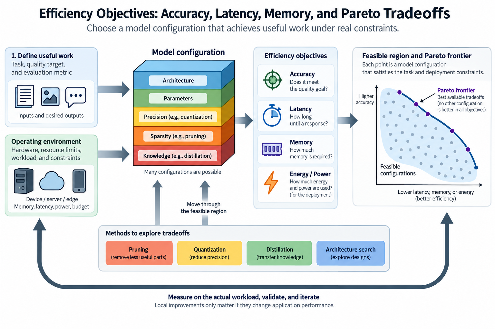
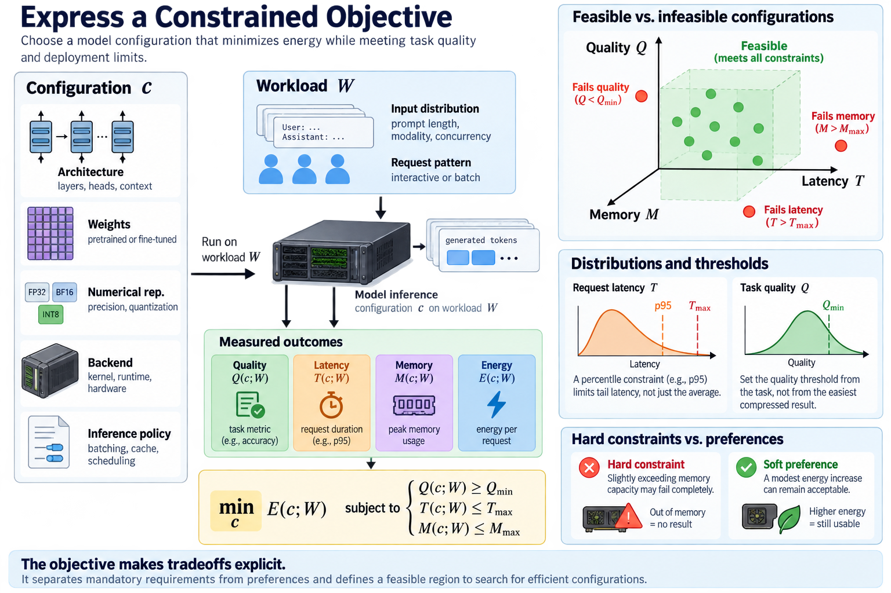
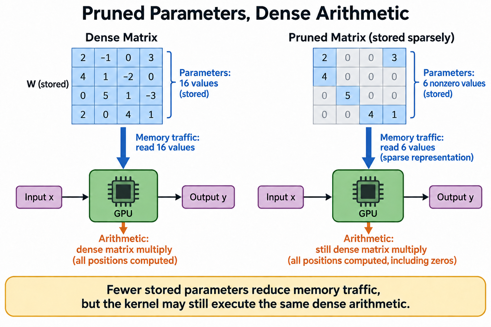
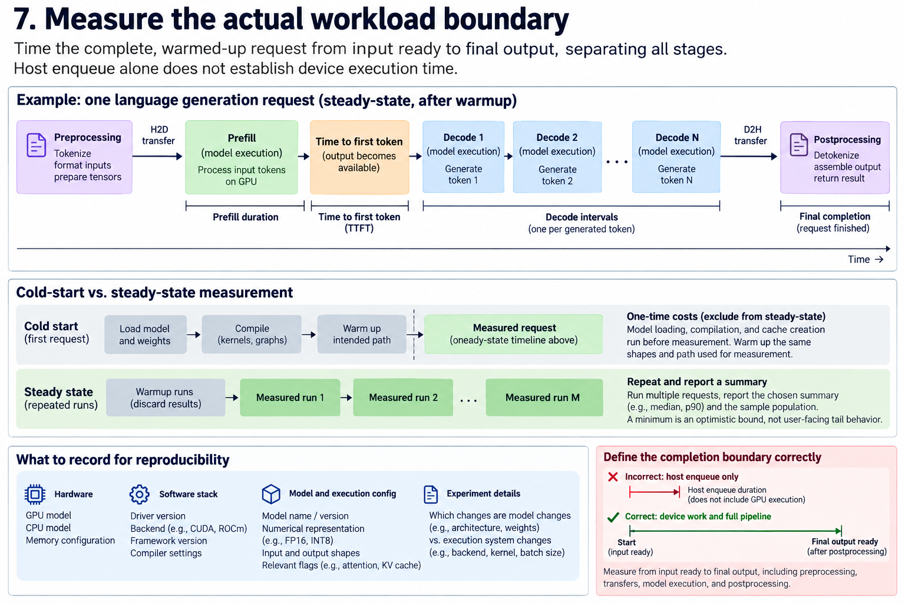
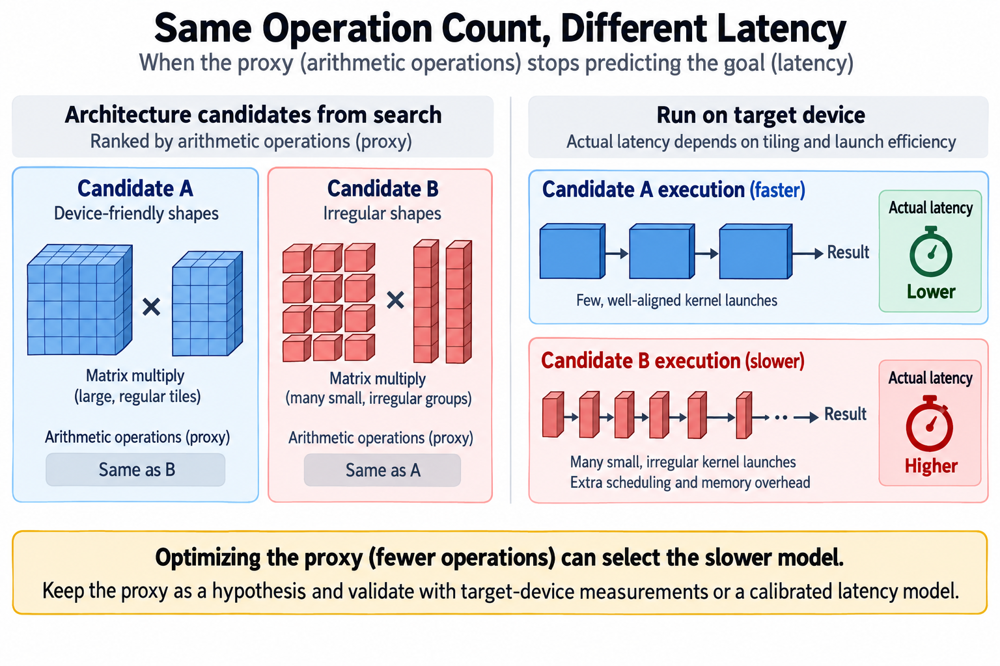

## Overview

An efficient model is useful only in relation to a task and an operating environment. A smaller checkpoint can run slower, a lower arithmetic count can increase memory traffic, and a faster isolated kernel can leave request latency unchanged. Efficiency therefore starts with an explicit objective, not a favorite compression technique.

This article connects model quality, resource constraints, and experimental evidence. The central picture is a feasible region: the set of configurations that meet the task and deployment requirements, with a frontier of the best available tradeoffs. Pruning, quantization, distillation, and architecture search become ways to move through that region, not interchangeable recipes for making a model small.

*An original conceptual illustration. Numerical plots and examples are illustrative unless explicitly identified as measured evidence.*

## Deep dive

### 1. Define useful work before counting resources

Write down what the model must accomplish. A classifier may need a specified accuracy on a defined population. A language system may need independently checked answers under a token budget. An image generator may need quality and diversity under a supported resolution and sampling policy. These task contracts are different.

The resource boundary also needs a definition. Checkpoint bytes, peak device allocation, energy, monetary cost, and request duration are related but not equivalent. An offline batch job can favor throughput, while an interactive application can favor a strict completion deadline. Optimizing the wrong quantity can produce an attractive benchmark that does not help the application.

Keep the input distribution visible. Prompt length, image resolution, audio duration, concurrency, and generated-token count can change the limiting resource. A measurement at one shape is evidence for that operating point, not a permanent property of the model family.

### 2. Express a constrained objective

Let c describe a configuration including architecture, weights, numerical representation, backend, and inference policy. Let Q measure task quality, T request duration, M peak memory, and E energy under workload W. A representative deployment objective minimizes energy while preserving quality and capacity limits:

$$
\min_c E(c;W)\quad\text{subject to}\quad
Q(c;W)\ge Q_{\min},\ T(c;W)\le T_{\max},\ M(c;W)\le M_{\max}.
$$

The equation is a way to state the problem, not an instruction to run one particular optimizer. Some quantities are distributions, and a latency constraint may apply to a defined percentile. The chosen quality threshold must come from the task rather than from whichever compressed result is easiest to publish.

Hard constraints differ from preferences. A configuration that slightly exceeds memory capacity may fail completely, while a modest energy increase can remain acceptable. Combining everything into one score can hide such distinctions unless the weights and feasibility rules are explicit.

### 3. Understand Pareto dominance

Suppose several configurations meet mandatory requirements. One dominates another if it is no worse on every compared objective and strictly better on at least one. The nondominated configurations form a Pareto frontier. A point on that frontier is not automatically the right deployment choice; it still leaves a tradeoff the application has to judge.

For illustrative configurations, A has quality 0.92, latency 20 milliseconds, and memory 4 gigabytes. B has quality 0.92, latency 25 milliseconds, and memory 5 gigabytes. A dominates B under those metrics. C has quality 0.94, latency 30 milliseconds, and memory 4 gigabytes, so neither A nor C dominates the other.

The example assumes the measured quantities are certain enough to compare. If confidence intervals overlap, the claim of strict improvement can be weak. If the workload or precision differs, the points do not belong on the same controlled frontier without identifying that difference.

### 4. Separate parameters, arithmetic, and traffic

Parameter count describes learned storage under a counting convention. Arithmetic count describes operations for a defined execution path. Memory traffic describes bytes moved through particular interfaces. Latency follows the critical path under actual resources and scheduling. None is a universal replacement for the others.

A pruned matrix can have fewer nonzero values while using a kernel that still executes dense arithmetic. A sparse representation can save payload bytes but introduce index traffic and irregular access. A quantized checkpoint can require decoding and higher-precision accumulation. The relevant comparison is the complete supported path.

The roofline model gives a useful first approximation. With arithmetic F, transferred bytes B, peak compute P, and bandwidth beta, ideal execution is bounded below by the larger of compute time and transfer time:

$$
T\ge\max\left(\frac{F}{P},\frac{B}{\beta}\right).
$$

Actual execution can be slower because of launches, dependencies, contention, or poor utilization. The bound explains why reducing F may have little effect when B divided by bandwidth dominates.

### 5. Connect local optimization to application time

Let fraction f of baseline duration belong to the component being improved, and let its local speedup be s. Under a fixed workload and unchanged other costs, Amdahl-style accounting gives:

$$
S_{\mathrm{application}}\approx\frac{1}{(1-f)+f/s}.
$$

If an expert matrix operation occupies 20 percent of request time and becomes twice as fast, the ideal request gain is only about 1.11 times. That is a schedule calculation, not a measured result. It explains why a sound local optimization can have a modest user-visible effect.

The assumptions matter. Compression can change several components at once, including cache capacity, batching, and communication. In that case, measure the new pipeline instead of crediting the whole gain to one local speedup. Conversely, a capacity improvement can open up a different concurrency region even if isolated latency barely changes.

### 6. Use quality measurements with uncertainty

A finite evaluation set estimates behavior on a population. For N independently sampled classification trials with s successes, a Bernoulli likelihood has maximum-likelihood estimate s divided by N. A beta prior yields a beta posterior and makes prior influence explicit.

$$
L(p)\propto p^s(1-p)^{N-s},\qquad
\widehat p_{MLE}=\frac{s}{N},\qquad
p\mid s\sim\operatorname{Beta}(a+s,b+N-s).
$$

This model does not claim every benchmark task is independent or every quality measure is Bernoulli. Correlated variants and distribution shift can break that simple interpretation. Use a metric and uncertainty method that fit the actual task population.

A compressed model that passes a small sample is not proven equal to its baseline. Define an acceptable quality difference before evaluation, preserve held-out data, and examine important subgroups. An average can hide a failure mode that matters disproportionately to the deployment.

### 7. Measure the actual workload boundary

Include preprocessing, transfers, model execution, and postprocessing when they belong to the request. Separate cold-start compilation from steady-state operation. For language generation, distinguish prefill, time to first token, decode intervals, and final completion. For diffusion, include the actual number of model evaluations and guidance policy.

Warm up the intended path and use a valid completion boundary for device work. Host enqueue duration alone does not establish GPU execution time. Repeat measurements and report the chosen summary and sample population. A minimum can describe an optimistic execution but rarely describes user-facing tail behavior.

Record hardware, driver, backend, numerical representation, shapes, and relevant configuration. A result without this context is hard to reproduce or interpret after a software update. The experiment should make clear which changes belong to the model and which belong to the execution system.

### 8. Distinguish energy, power, and duration

Energy integrates power over time. Lower instantaneous power does not always reduce energy if the run lasts much longer. A power cap can improve efficiency or hurt useful throughput depending on the operating region and task constraints.

$$
E=\int_0^T P(t)\,dt,\qquad
\eta=\frac{\mathrm{useful\ completed\ work}}{E}.
$$

Specify whether energy covers the accelerator alone, the host, or the complete facility. Measurement intervals and idle allocation also matter. Comparing a device-only figure with a whole-system figure is not a controlled efficiency comparison.

Useful work must satisfy the task contract. Counting generated tokens as useful when answers fail verification can reward waste. Likewise, an image benchmark should not improve apparent efficiency by silently lowering the requested resolution or quality policy. Keep the numerator connected to the application.

### 9. Build a controlled configuration table

Start with a reproducible baseline. Change one mechanism when diagnosing its effect: a pruning pattern, quantization policy, adapter rank, or architecture shape. Keep input population, inference budget, and correctness tolerance fixed unless the change explicitly involves them.

Record both theoretical and measured quantities. Theoretical parameter bytes explain capacity hypotheses. Measured peak allocation includes workspace and allocator behavior. Arithmetic estimates explain expected compute changes. Timings establish the actual execution result. Discrepancies between them are useful evidence about the limiting resource.

Do not drop slower or lower-quality candidates from the record just because they complicate the story. Their failure helps define the frontier and explains which tradeoff the chosen configuration makes. A transparent experiment is more valuable than a single unexplained speedup.

### 10. Work through a deployment choice

Suppose an application requires quality at least 0.90, latency at most 25 milliseconds, and memory at most 4 gigabytes. Candidate A has quality 0.92, latency 20 milliseconds, and memory 4 gigabytes. Candidate B has quality 0.91, latency 18 milliseconds, and memory 3 gigabytes. Candidate C has quality 0.95, latency 30 milliseconds, and memory 4 gigabytes.

A and B are feasible, while C violates the latency constraint despite its higher quality. If the application values lower latency and memory after reaching the quality threshold, B can be preferable. If a quality margin matters more, A can remain attractive. The decision follows the stated contract rather than a universal claim that the smallest model wins.

Now suppose B's quality estimate has wide uncertainty because it was tested on very few cases. The experiment has not yet established adequate quality evidence. More independent evaluation may be needed before choosing it. Resource gains do not make up for an unverified task requirement.

### 11. Plan the compression sequence

Pruning removes selected structure, quantization changes numerical storage, distillation trains another model, and low-rank adaptation changes which updates are learned. Architecture design changes shapes and computation. These interventions interact, so evaluate them in an order that reflects their dependencies.

A practical sequence establishes the task and baseline, applies one supported transformation, validates semantics and quality, measures deployment behavior, and then combines compatible transformations. A transformation that helps in isolation can interact poorly with another precision or sparse-kernel choice.

Preserve artifacts and configuration so the result can be revisited. No device benchmark was performed for this article; numerical examples are illustrative. Its purpose is to supply the objective framework used throughout the series: define useful work, identify constraints, calculate likely resource effects, and verify the complete deployed path.

### 12. Avoid optimizing a proxy after it stops predicting the goal

A proxy metric is useful when it predicts the quantity that matters. Parameter count can predict storage, and arithmetic count can predict compute pressure under suitable kernels. Their value weakens when representation overhead, bandwidth, or scheduling changes. Keep the proxy as a hypothesis you check against the actual objective.

Consider an architecture search using arithmetic operations as its latency proxy. Two candidates can have equal operations but very different matrix shapes. One may align well with a device's supported tiles, while another creates small irregular groups and extra launches. A search ranking by operations alone can therefore favor the slower candidate. Target-device measurements or a validated latency model can improve the ranking.

The same issue arises with quality proxies. Calibration reconstruction error can help choose a quantization policy, but it does not prove downstream task quality. A layer with small average reconstruction error can still affect a sensitive decision. Keep a held-out task evaluation after selecting the policy rather than treating calibration as the final test.

## Conclusion

A useful review records where each proxy is used and how it was validated. If the deployment changes device, compiler, precision, or workload, revisit that relationship. The saved artifact should include both proxy predictions and actual outcomes. This lets a future reader tell a failed cost model from a failed optimization method. It also keeps an outdated proxy from quietly becoming the application objective.

### Sources

- [Roofline: An Insightful Visual Performance Model for Multicore Architectures](https://doi.org/10.1145/1498765.1498785).
- [Validity of the Single Processor Approach to Achieving Large Scale Computing Capabilities](https://doi.org/10.1145/1465482.1465560).
- [Hardware-aware model profiling and design spaces](https://arxiv.org/abs/2109.12426).
