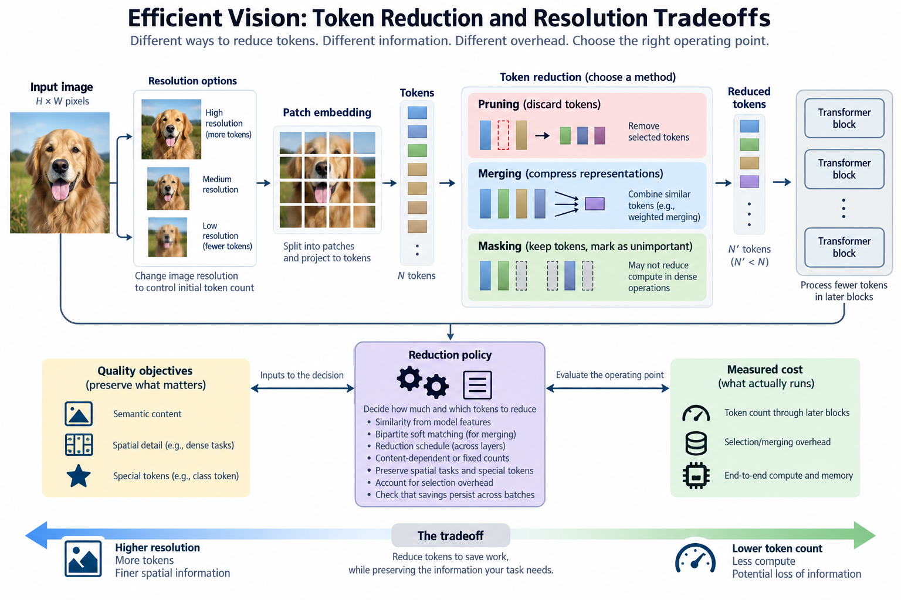
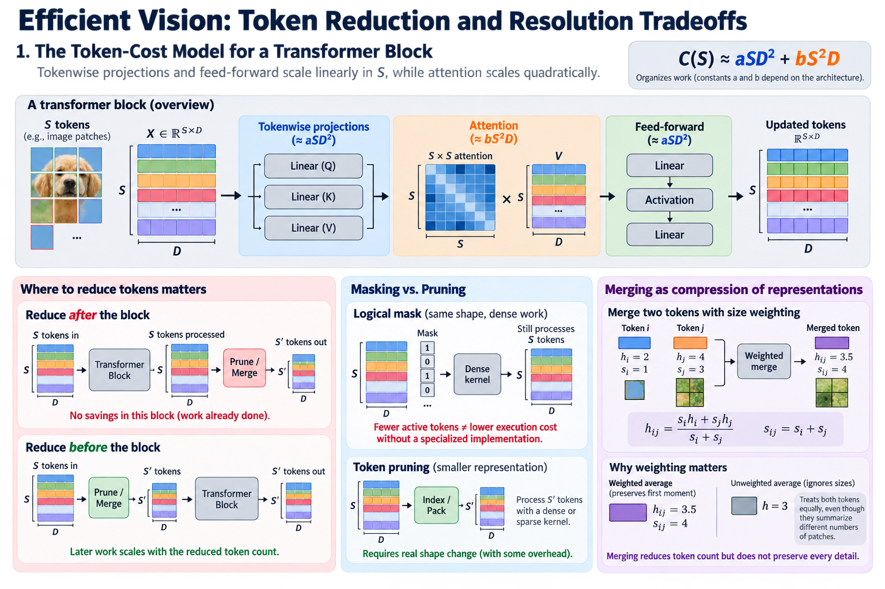
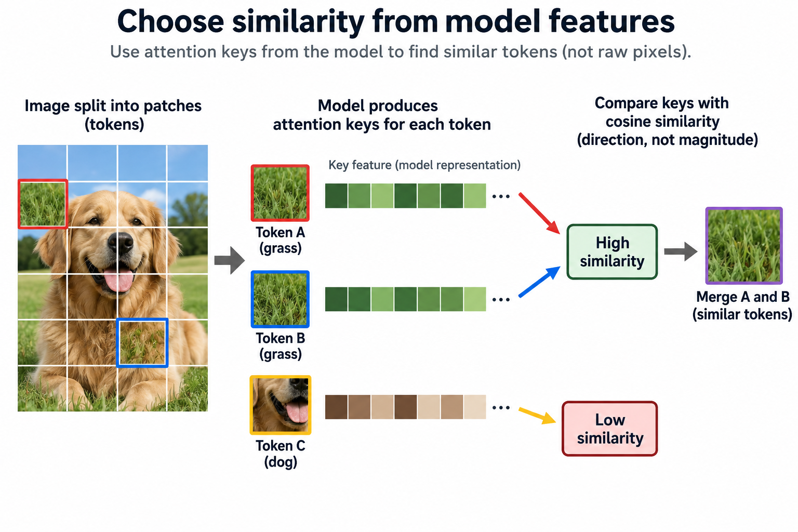
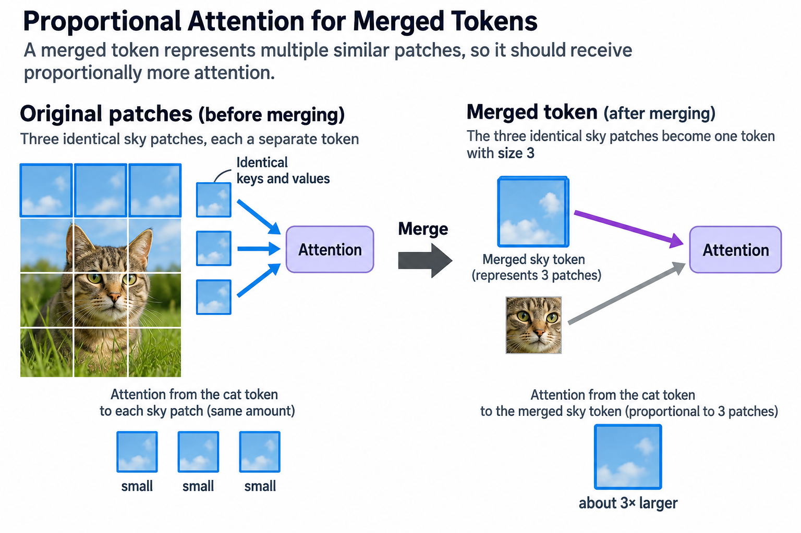
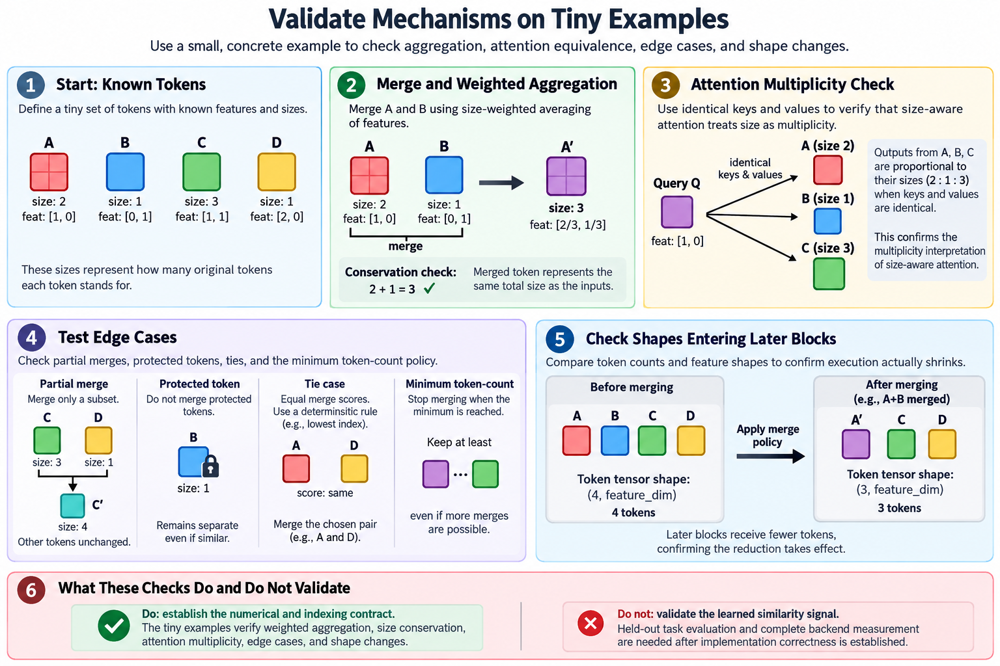
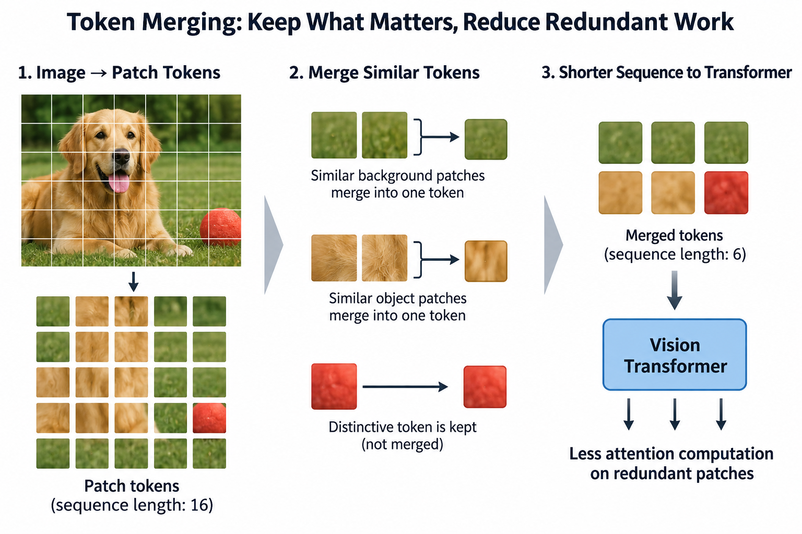
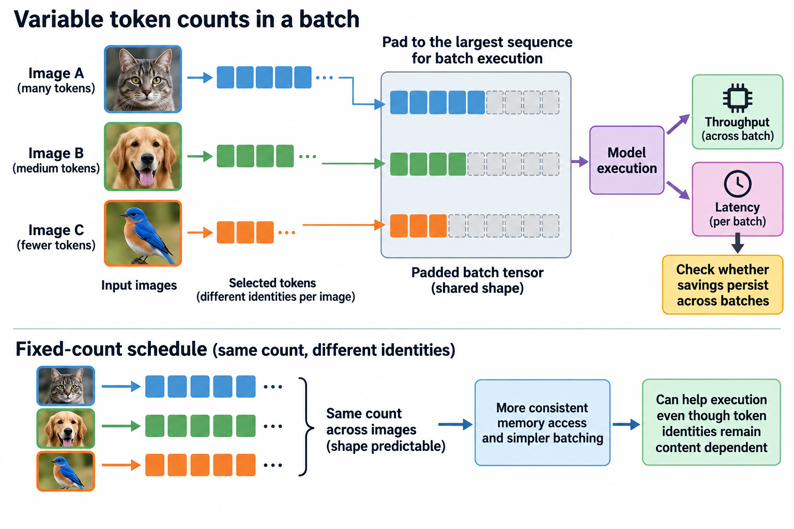

## Overview

Efficient vision can cut the number of tokens that later transformer blocks process in 3 ways: pruning discards selected tokens, merging combines representations, and changing resolution alters the image information before embedding. All three reduce work through token count, but they preserve different information and create different execution overhead.

The useful design connects a reduction policy to quality and measured cost, because a mask alone does not necessarily shrink a dense operation and a clever similarity algorithm can eat the savings it was supposed to create, so this article derives the major tradeoffs and explains Token Merging as a concrete mechanism.

*An original conceptual illustration. Numerical plots and examples are illustrative unless explicitly identified as measured evidence.*

## Deep dive

### 1. Begin with the token-cost model

For a common dense transformer block with sequence length S and width D, tokenwise projections and feed-forward work scale roughly linearly in S, while pairwise attention scales quadratically.

$$
C(S)\approx aSD^2+bS^2D.
$$

Constants a and b depend on the actual architecture and counting convention. The expression organizes work; it does not predict device latency exactly.

Reducing S can therefore affect several components, not only attention. The reduction point matters: removing tokens after a block cannot save work that block already did. Count the sequence length at each layer, and include the selection or merging operation itself.

### 2. Distinguish pruning from masking

Token pruning selects a retained subset. A logical mask can express that subset while leaving tensors at their original dimensions. A generic dense kernel can still do nearly the same work under that arrangement.

To reduce execution, the implementation needs an effective smaller representation or a supported kernel that skips the masked work. Index selection, packing, and output correspondence can add overhead.

Inspect the actual graph and shapes after reduction. A method reporting fewer active tokens has established semantics, not automatically lower latency. Weight sparsity has the same split: removing information mathematically and avoiding physical work are separate implementation achievements.

### 3. Explain merging as compression of representations

Merging combines several token features into one representative. Let h_i and h_j be token features, with positive sizes s_i and s_j saying how many original patches each summarizes.

$$
h_{ij}=\frac{s_i h_i+s_j h_j}{s_i+s_j},\qquad s_{ij}=s_i+s_j.
$$

A size-weighted average preserves the weighted first moment of the combined features. It does not preserve every distinction between the original patches, and it is not the same as running the unchanged transformer on both tokens.

The merge should use a similarity measure that fits the representation and task. Averaging unrelated regions can destroy useful boundaries. Keeping token-size metadata also matters: it changes how later operations interpret a token that stands for several patches.

### 4. Work through weighted merging

Take two illustrative scalar token features: value 2 representing one patch and value 4 representing 3 patches. Their weighted merge is 3.5 and has size 4.

An unweighted average would be 3. That treats the two tokens as equally sized despite their different provenance. Under this simplified arithmetic, repeated weighted merging preserves the same aggregate first moment no matter how the groups are combined.

That property does not establish task equivalence. Nonlinear operations before or after merging can respond differently to individual features. The example shows why size tracking matters after earlier merges. Quality evaluation decides whether the combined representation stays useful.

### 5. Choose similarity from model features

Token Merging, or ToMe, compares tokens using attention-key information under its studied setup. The paper examines feature choices and cosine similarity rather than assuming raw patch pixels are the best matching representation.

$$
\operatorname{sim}(k_i,k_j)=\frac{k_i^\top k_j}{\|k_i\|_2\|k_j\|_2}.
$$

The implementation must define a zero-norm policy. Cosine similarity looks at direction and ignores overall magnitude, which is a representation choice with its own assumptions.

Attention keys already encode information the transformer uses for compatibility. Reusing them gives a practical matching signal. Keep that signal attached to the method and model; it does not prove that every high-similarity pair is interchangeable for all downstream tasks.

### 6. Explain bipartite soft matching

ToMe splits tokens into 2 sets and lets tokens in one set pick similar destinations in the other. It keeps a selected number of high-similarity connections, merges the connected features, and combines the resulting token sets.

The design avoids an iterative procedure that finds one global pair, recomputes, and repeats. It supports a more parallel matching operation under the paper's algorithm.

Bipartite does not mean each destination receives only one source under this soft-matching construction. Follow the actual aggregation procedure when several sources connect to one destination. Protect special tokens per the model interface, and record the reduction count and layer placement.

### 7. Understand proportional attention

A merged token can stand for several original patches. If those patches had identical keys and values, their repeated contribution in a softmax denominator would be proportional to their count.

An illustrative size-aware logit correction adds log s_j to the score for key j:

$$
A_{ij}=\operatorname{softmax}_j\left(\frac{q_i^\top k_j}{\sqrt{d_h}}+\log s_j\right).
$$

The duplicate-token thought experiment explains the multiplicity factor, because exp(log s_j) equals s_j. Real merged tokens are usually not identical, so this is not a proof of exact equivalence after arbitrary averaging.

ToMe studies proportional attention and how it interacts with model training. Keep the implementation convention and the evaluated model conditions. Do not claim the correction always improves every architecture.

### 8. Choose the reduction schedule

Let S_l be the sequence length entering layer l. A schedule can remove a fixed count or a fraction at selected layers, subject to protected tokens and a minimum viable representation.

$$
C_{\mathrm{total}}\approx\sum_l\left(a_lS_lD_l^2+b_lS_l^2D_l\right)+C_{\mathrm{reduction}}.
$$

Early reduction saves work in more later blocks, but it acts on less-developed features and can remove information before useful representations form. Later reduction keeps more early processing while saving less total work.

A fixed count differs from a ratio. ToMe's described reduction parameter is a count under its procedure. Record the schedule precisely so readers can reproduce the sequence lengths and the cost model.

### 9. Compare content-dependent and fixed counts

Selecting different token identities for each image is content dependent even when the output count is fixed. Letting the count itself vary adds another execution dimension.

Variable counts can give difficult inputs more work, but batching can then require padding or specialized ragged execution. Under a padded path, the batch cost follows its largest sample, not the mean retained count.

Measure the actual service distribution and batching policy. A single-image token reduction result does not establish sustained throughput with heterogeneous requests. Dynamic information selection and predictable execution can be balanced, but the tradeoff needs backend evidence.

### 10. Include selection overhead

Similarity computation, sorting, gathering, aggregation, and metadata updates all cost resources. An efficient reduction mechanism should cost less than the later work it avoids under the target shapes.

$$
\Delta T\approx T_{\mathrm{saved\ later\ work}}-T_{\mathrm{selection}}-T_{\mathrm{packing}}.
$$

The terms can overlap or fuse in an actual implementation, so this is a conceptual accounting model. It makes the acceptance hypothesis explicit.

Small token sequences leave little work to save. Large sequences can make pairwise selection expensive. Use the actual algorithm's complexity and measurements. A mathematically aggressive reduction can be a bad deal in practice if the selection path becomes the new bottleneck.

### 11. Distinguish resolution reduction

Resizing an image before embedding cuts the initial patch count and all downstream work. It also changes pixel information before the model can identify useful regions.

Token selection operates on learned representations and can use content after some processing. It may preserve important regions better, but it pays that earlier processing and selection cost.

Compare both strategies under the same task and preprocessing conventions. A smaller image can be a strong simple baseline. Do not skip it just because a learned reduction method sounds more sophisticated. Quality-resource evidence decides whether the extra mechanism adds value.

### 12. Preserve spatial tasks and special tokens

Classification can pool a reduced representation. Detection or segmentation may need location correspondence. When tokens merge or disappear, store or reconstruct the mapping the output head requires.

Special tokens can carry class or other task roles. Treating them as ordinary merge candidates can break the model's intended interface. Verify the exact protection policy; not every sequence entry is interchangeable.

Inspect small objects, thin boundaries, and visually similar neighboring regions. Those cases can expose information loss that aggregate metrics hide. A merging method that preserves classification accuracy has not proved itself for every dense-prediction task.

### 13. Validate mechanisms on tiny examples

Use known token features and sizes to verify weighted aggregation. Check that the total represented size is conserved under the stated merge policy. Build identical keys and values to verify the multiplicity interpretation of size-aware attention.

Then test partial merges, protected tokens, ties, and the minimum token-count policy. Compare the shapes entering later blocks to confirm that execution actually shrinks.

These checks establish the numerical and indexing contract. They do not validate the learned similarity signal on real images. Held-out task evaluation and complete backend measurement provide that evidence once implementation correctness is established.

### 14. Evaluate the complete operating point

Report model revision, input resolution, patch count, reduction schedule, protected tokens, numerical policy, backend, device, batch, and quality. Include reduction overhead and peak allocation in the complete resource results.

Compare with an unchanged model and a relevant resolution baseline. If recovery training is used, record its data and preparation budget. Otherwise a quality improvement can reflect the extra training rather than the reduction mechanism.

No image-model run or GPU timing was performed for this article. The scalar merge and cost equations are illustrative. Primary papers provide evidence under their tasks; a new deployment needs measurements of its actual reduced graph.

### 15. Interpret the useful design choice

Pruning, merging, and resolution changes reduce work by preserving different information. The right policy follows the task's spatial needs and the measured bottleneck. It also depends on whether the backend benefits from a smaller fixed sequence, supports dynamic counts, and can run selection efficiently.

A practical token-reduction method needs both a representation criterion and an execution-conscious algorithm. A similarity score alone is not enough, and a fast gather that removes important content fails on quality.

Keep the mechanism visible: which tokens combine or disappear, how size and position are handled, where sequence length changes, and what later work is avoided. That makes the quality-resource tradeoff understandable, instead of reducing it to a retained-token percentage.

### 16. Check whether savings persist across batches

A reduction policy can look good for one image and interact badly with a larger batch. Gathering different token identities per sample changes memory access patterns, and a variable count can force padding to the largest sequence. Compare the saved mathematical work with actual batch execution.

Measure several representative batch sizes on the deployment backend. Record whether the algorithm keeps the same count across images and whether any sorting or packing creates temporary allocations. Inspect both throughput and latency; one does not scale directly from the other.

## Conclusion

If a method changes only token identities while keeping counts fixed, shape predictability can help execution even though the representation stays content dependent. That distinction is useful when reading dynamic methods. It also explains why a fixed-count schedule can be an engineering advantage without claiming that every image needs exactly the same information budget.

### Sources

- [Token Merging: Your ViT But Faster](https://arxiv.org/abs/2210.09461).
- [DynamicViT: Efficient Vision Transformers with Dynamic Token Sparsification](https://arxiv.org/abs/2106.02034).
- [An Image is Worth 16x16 Words](https://arxiv.org/abs/2010.11929).
