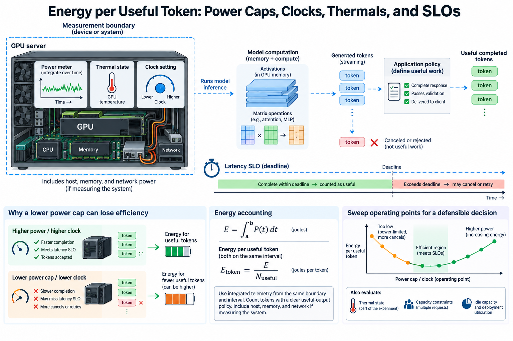
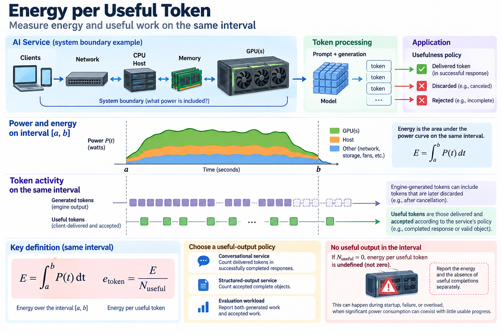
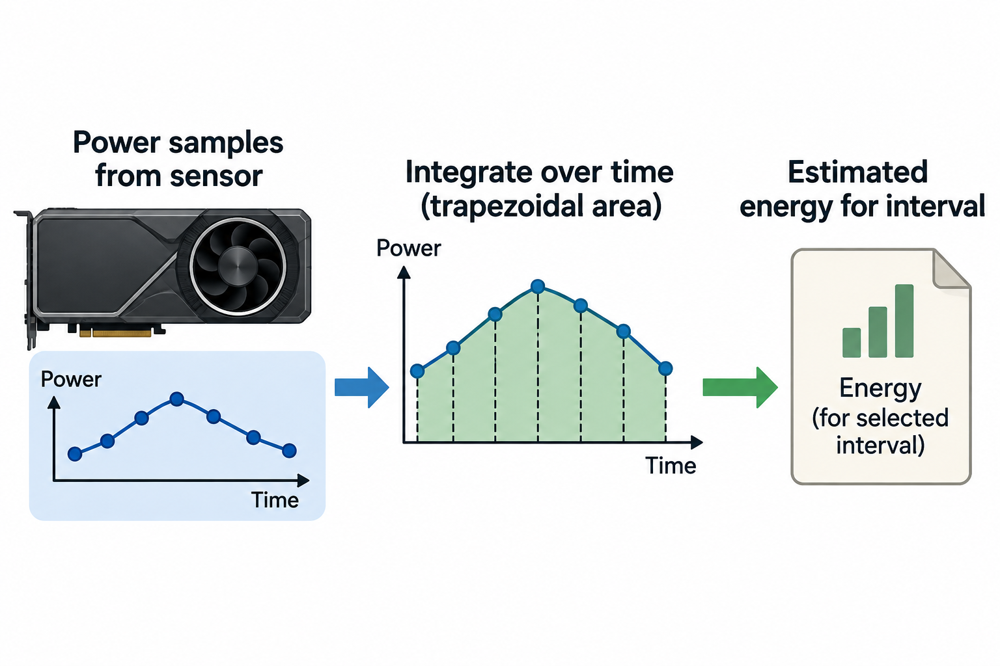
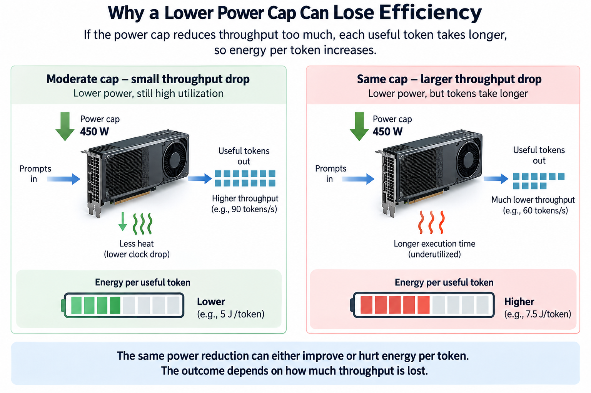

## Overview

Reducing a GPU's reported power does not necessarily reduce the energy required to serve a request. If computation takes longer, the device draws power for more time. The host and network also remain active. If a slower operating point causes clients to cancel or retry, the service can consume more energy per useful answer despite a lower instantaneous wattage.

Energy engineering therefore needs a denominator tied to useful work and a measurement boundary tied to the power being integrated. The relevant question is how many accepted outputs the system produces for its energy expenditure while satisfying latency and capacity requirements.

We will derive the basic accounting, examine power caps and clocks, and build an experiment that distinguishes an efficient operating point from a merely low-power one. All numerical examples are illustrative calculations. Available telemetry and control behavior vary by GPU, driver, platform, and deployment permissions.

## Deep dive

### 1. Define energy and useful work on the same interval

Power is an instantaneous rate of energy consumption. For an observation interval from time a to time b, energy is the integral of measured power. If N_useful is the number of qualifying output tokens delivered during that interval, define

$$
E=\int_a^b P(t)\,dt,\qquad e_{\mathrm{token}}=E/N_{\mathrm{useful}}.
$$

Power in watts and time in seconds produce joules. Joules per token is meaningful only if the token population is defined. A raw engine-generated token counter can include responses discarded after cancellation. A client-delivered token counter can include incomplete objects the application rejects.

Choose a useful-output policy suited to the service. A conversational service may count delivered tokens in successfully completed responses. A structured-output service may count accepted complete objects instead. An evaluation workload can report both generated work and accepted work to make the difference visible.

If no useful output completes in the interval, energy per useful token is undefined rather than zero. Report the energy and the absence of useful completions separately. This case is important during startup, failure, or overload, when considerable power consumption can coexist with little usable progress.

### 2. State whether the boundary is a device or a system

GPU telemetry measures a device-level quantity whose exact scope depends on the sensor and platform. It does not generally represent the total electricity used by CPUs, memory, storage, networking, fans, and facility infrastructure. A device-only result should be labeled accordingly.

For several devices and separately measured host components, a simplified system boundary is

$$
E_{\mathrm{system}}=\int_a^b\left(\sum_i P_{\mathrm{GPU},i}(t)+P_{\mathrm{host}}(t)+P_{\mathrm{other}}(t)\right)dt.
$$

Avoid adding overlapping measurements. A rack power meter may already include the GPUs and host, so summing its reading with device power double-counts part of the system. Conversely, adding only GPU sensors omits the host. Draw the accounting boundary before collecting measurements.

Specify whether the denominator is aggregate useful output across all devices or one request's output. A continuously batched engine shares execution among requests, making exact per-request energy attribution difficult. Aggregate workload energy is usually easier to measure defensibly than assigning each concurrent request a fraction of every device sample.

Wall-level energy includes conversion losses and additional components that software telemetry may not see. Either boundary can support useful comparisons if it remains consistent across alternatives. Do not compare a device-only baseline with a wall-measured candidate and attribute the entire difference to an algorithm.

### 3. Integrate telemetry rather than averaging mismatched counters

Suppose samples provide power P_i at times t_i. A trapezoidal estimate is

$$
\widehat E=\sum_i\frac{P_i+P_{i+1}}{2}(t_{i+1}-t_i).
$$

The estimate requires correctly ordered timestamps and a sampling rate adequate for the workload. A short kernel can finish between coarse samples, and a sensor may report a time-averaged quantity. Increasing polling frequency cannot necessarily reveal changes faster than the underlying sensor updates.

Where a supported cumulative energy counter is available, its difference over a defined interval can provide another measurement path. Verify units, supported hardware, counter reset behavior, and the documented meaning. NVIDIA's management documentation distinguishes multiple power-related fields; identical-looking chart labels should not be assumed to represent the same quantity.

Align the energy interval with the output-count interval. If energy includes warmup but useful tokens exclude it, the result intentionally includes startup overhead. If you want steady-state efficiency, remove both startup energy and startup work consistently. Report cold-start and steady-state cases separately when both matter.

Repeat measurements and inspect variation. Preserve raw timestamps and samples so another reviewer can reconstruct the integral and confirm the selected measurement window. Power sampling, thermal conditions, batch composition, and background activity can change results. An apparent improvement smaller than the measurement variation should not be presented as a reliable ranking.

### 4. Derive why a lower power cap can lose efficiency

For approximately constant average power P and useful throughput G over a steady interval, the energy per useful token simplifies to

$$
e_{\mathrm{token}}\approx P/G.
$$

Consider an illustrative baseline using 600 W and producing 100 useful tokens per second. Its device energy is 6 J per token. A capped alternative using 450 W and producing 90 useful tokens per second reaches 5 J per token. If throughput instead falls to 60 tokens per second, the result becomes 7.5 J per token.

The power decrease is the same in both capped examples, but the throughput response determines the energy outcome. Including a constant 200 W host contribution changes the respective system values to 8, about 7.22, and about 10.83 J per token. Slower execution prolongs host energy expenditure as well.

This model assumes stable useful throughput and average power. During queue growth or changing concurrency, a simple ratio can conceal an infeasible operating point. Verify that arrivals, admitted work, and useful completions are consistent with the capacity requirement before ranking the alternatives.

### 5. Connect clock sensitivity to the actual bottleneck

A workload's response to power and clock controls depends on its limiting resources. A compute-heavy prefill can respond differently from cache-intensive decode. Memory bandwidth, matrix arithmetic, launch overhead, and CPU scheduling do not all scale with the same device clock.

A simple bottleneck model is

$$
t\gtrsim\max(F/C_{\mathrm{eff}},D/B_{\mathrm{eff}})+t_{\mathrm{exposed\ overhead}},
$$

where F is arithmetic work, D is relevant transferred bytes, C_eff is achieved compute rate, and B_eff is achieved bandwidth. The model omits detailed pipeline interactions but helps identify which measured quantity should move when a control changes.

If decode is primarily limited by memory movement, reducing compute capability may initially have little effect on useful throughput. However, shared resources and voltage-frequency policies can couple effects, so that outcome is a hypothesis to test. A device's power cap does not guarantee a fixed independent change in one performance resource.

Inspect both phase timing and achieved throughput during a sweep. If prefill slows significantly while decode remains stable, a mixed workload's first-token objective may become the binding constraint. The energy-efficient point for one phase is not automatically the efficient point for a service processing both.

### 6. Thermal state is part of the experiment

A short benchmark can begin on a cool device and complete before reaching the temperature and clock behavior seen in production. A long sustained workload can encounter different cooling conditions, fan behavior, and thermal limits. Compare candidates after a documented stabilization period.

Record observed temperatures, clocks, power, and supported throttle or event indicators. A configured clock target is different from the clock actually maintained. If one candidate encounters thermal limiting and another does not, the result includes that system response rather than only the nominal configuration.

Keep ambient and neighboring-load conditions as consistent as practical. Shared chassis cooling and dense accelerator placement can make one device's thermal behavior depend on others. A single isolated accelerator experiment does not establish the operating point for a fully populated server.

Do not disable protective behavior to obtain an attractive benchmark. The intended deployment's normal supported controls provide the relevant feasibility boundary. An efficient configuration must remain stable under the duration and environmental conditions expected by the service.

### 7. Compare energy under latency and capacity constraints

An operating point is feasible only if it meets the required service outcomes. Let G_min be required useful throughput and L_max the applicable latency objective. A simplified selection problem is

$$
\min_x e_{\mathrm{useful}}(x)\quad\text{subject to}\quad G(x)\ge G_{\min},\quad L(x)\le L_{\max}.
$$

The control vector x may include power cap, batching policy, concurrency, and model execution configuration. Specify which latency statistic is constrained, such as p99 first-token latency for a request class. A mean latency constraint does not establish acceptable streaming gaps or tail behavior.

Batching can improve device efficiency by increasing work per execution interval, but it can also increase waiting time. An energy measurement at a large batch is useful only if the service can operate at that batch while satisfying its objective. Include scheduler waiting time, not only active GPU duration.

Plot or tabulate the feasible alternatives together. Some configurations consume less energy but cannot supply the demand; others have more headroom at a higher energy cost. A frontier of feasible choices is more informative than declaring one globally optimal power setting without workload context.

### 8. Include idle capacity and deployment utilization

A benchmark with continuously busy devices can omit much of a real deployment's energy use. Replicas kept warm for redundancy or bursts draw power while handling little useful traffic. Their energy belongs in a deployment-level calculation even if a saturated-kernel benchmark excludes it.

Let f be the fraction of an interval spent in a simplified active state. With active power P_active and idle power P_idle, average device power is approximately f times P_active plus one minus f times P_idle. Useful throughput also depends on when and how efficiently active work runs.

Reducing replica count can improve utilization and aggregate energy efficiency while reducing failure headroom or increasing queueing. Autoscaling and admission policies therefore interact with device tuning. Evaluate them at the service level rather than treating every unused accelerator as avoidable without considering the capacity requirement.

For variable demand, integrate over representative periods instead of extrapolating from a single saturated minute. Report the demand distribution, scaling policy, and warm-capacity assumptions. The same model and kernel can have very different deployment energy per useful response under different traffic patterns.

### 9. Build a sweep that produces a defensible decision

Use the same model, prompt distribution, output policy, hardware boundary, and measurement method for each candidate. Record the applied controls and observed operating state. Warm up execution, stabilize thermal behavior, and measure long enough to include representative batching and response completions.

For each point, report useful output, energy, throughput, first-token latency, streaming gaps, completion outcomes, and observed power and clocks. Repeat selected points to assess variation, especially near the feasibility boundary. Mark points that violate objectives rather than letting them win the energy ranking silently.

Use profiles only after the measurements reveal a question, such as why one cap changes prefill more than decode. The profile can identify resource sensitivity, while the service experiment establishes the net result. Keep mathematical estimates separate from observed numbers in the report.

## Conclusion

Energy per useful output joins hardware behavior to the service's purpose. Power caps, clocks, and cooling are controls; accepted work and latency are outcomes. A sound choice reduces the integrated energy required for those outcomes at a feasible operating point, with a consistent measurement boundary and enough evidence to reproduce the comparison.

### Sources

- [NVIDIA System Management Interface documentation](https://docs.nvidia.com/deploy/nvidia-smi/index.html).
- [NVIDIA Management Library API reference](https://docs.nvidia.com/deploy/nvml-api/).
- [NVIDIA DCGM documentation](https://docs.nvidia.com/datacenter/dcgm/latest/).
