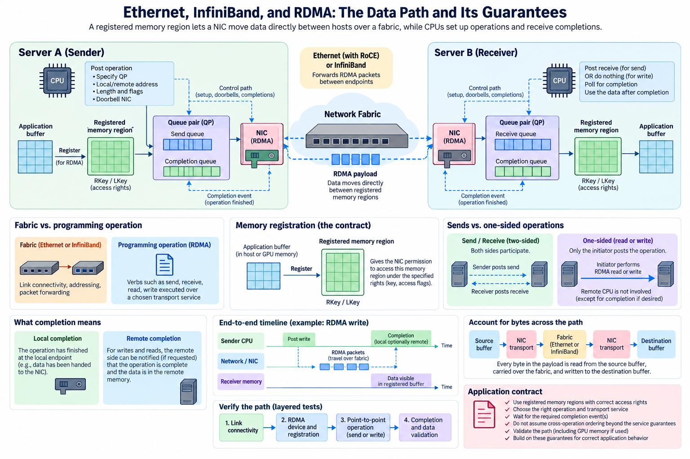
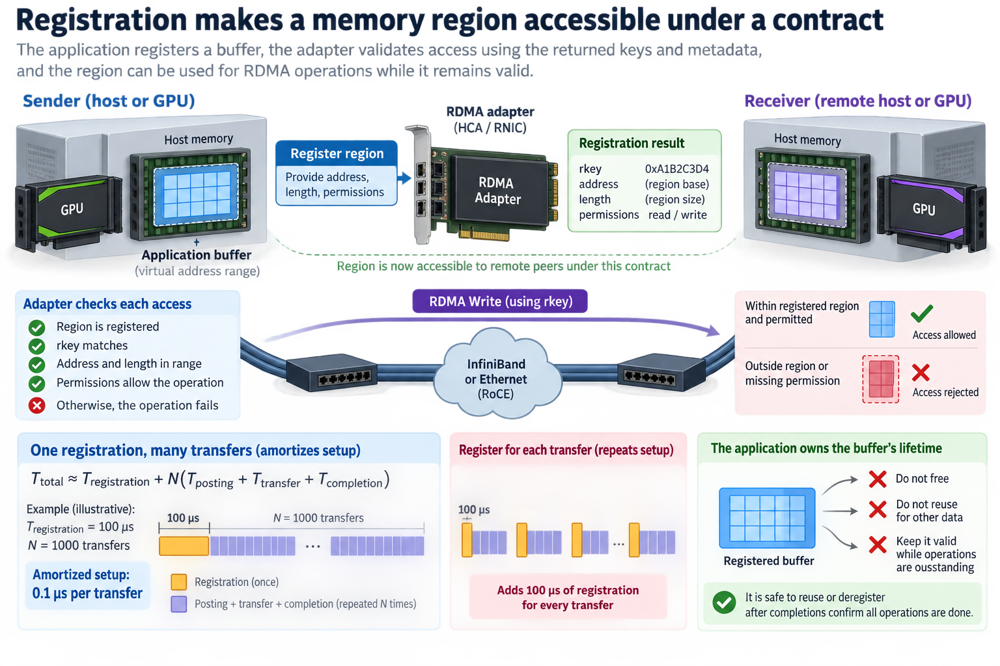
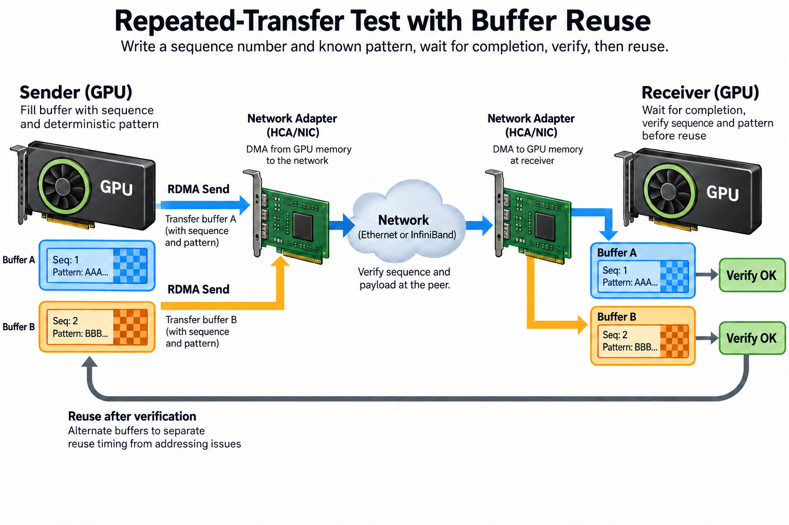

Ethernet, InfiniBand, and RDMA are often presented as interchangeable choices for an AI cluster. That framing mixes different layers. Ethernet and InfiniBand describe networking technologies and fabrics. Remote direct memory access describes communication semantics that allow supported adapters to access registered memory with less per-transfer involvement from a remote CPU. RDMA can operate over InfiniBand and over Ethernet through supported transports such as RoCE.

Understanding the layers matters because bandwidth, reliability, ordering, and memory visibility are different properties. A link can be fast while an application uses a poor staging path. A reliable transport can deliver bytes correctly while the application launches a consumer before those bytes are safe to use.

We will trace the host-buffer data path, connect it to GPU memory, and define the guarantees an application must verify. The numerical examples are explanatory calculations. Specific capabilities depend on the adapter, transport, driver, runtime, and platform.

## 1. Distinguish a fabric from a programming operation

*Overview of the article’s core mechanism. The following sections explain the objects, relationships, equations, assumptions, and worked examples shown here.*

An Ethernet fabric supplies packet forwarding and link connectivity. IP and transport layers add addressing and communication behavior above it. RoCE provides an RDMA-capable path on supported Ethernet infrastructure; the deployment also needs the appropriate adapter and network configuration.

InfiniBand combines a specialized fabric with defined addressing and transport capabilities. Its presence does not remove the need to inspect application process placement, buffer ownership, and communication-library behavior. Neither technology guarantees that a framework automatically uses the best available device path.

At the programming layer, verbs describe operations such as posting sends, receives, reads, and writes. The transport service selected for those operations supplies particular reliability and ordering behavior. The application must understand the service actually in use rather than borrowing assumptions from another queue-pair type.

Keep a diagram of the layers beside performance measurements: application operation, communication library, RDMA interface, adapter, link, and switches. An observation at one layer does not establish the implementation at every other layer. Packet counters can show network activity without proving a direct GPU-memory path.

## 2. Registration makes a memory region accessible under a contract

An RDMA operation does not normally accept an arbitrary virtual address and make it universally reachable. Memory registration associates a supported region with the adapter's access machinery and permissions. The resulting keys and metadata participate in validating access to that region.

The application still owns the buffer's lifetime. It cannot free or reuse memory while outstanding operations depend on it. Registration can also have nontrivial setup cost, making repeated registration of short-lived buffers expensive relative to the transfer itself.

A simplified repeated-transfer cost is

$$
T_{\mathrm{total}}\approx T_{\mathrm{registration}}+N\left(T_{\mathrm{posting}}+T_{\mathrm{transfer}}+T_{\mathrm{completion}}\right).
$$

The expression assumes one registration reused for N transfers and no overlap among the listed costs. Real implementations can cache registration and pipeline operations. The model identifies which fixed work can be amortized, not an exact schedule for every adapter.

For an illustrative registration cost of 100 microseconds and 1000 transfers, the amortized setup is 0.1 microseconds per transfer. Registering separately for each transfer would instead add 100 microseconds each time. These values are assumptions, but the distinction explains why allocator and buffer-reuse behavior can matter in network benchmarks.

## 3. Sends and one-sided operations have different participation rules

A send operation delivers data through a corresponding receive path. The receiver must have the appropriate resources and protocol state available. The application or communication library arranges these resources and determines how completed messages reach consumers.

An RDMA write targets an accessible remote memory region using the required addressing and access information. An RDMA read retrieves data from such a region. These operations reduce the remote CPU's involvement in moving the payload, but they do not eliminate remote coordination about where data belongs and when it can be consumed.

One-sided describes the data operation, not the entire distributed protocol. The participants still exchange region information, manage lifetimes, enforce ownership, and signal higher-level progress. A remote buffer can contain newly delivered bytes without the receiving application knowing that a complete logical message is ready.

Choose the operation based on the protocol's requirements. A library can combine one-sided data movement with separate notification messages or other synchronization. Measuring the payload alone excludes that control path, so an application-level latency budget should include the signaling required for safe use.

## 4. Completion is an event with a particular scope

A completion queue reports events defined by the operation and transport. A local completion can indicate that local resources are no longer needed by a completed operation under its contract. It should not be casually interpreted as proof that a remote application has consumed the data.

Remote arrival, remote notification, memory visibility, and consumer execution are separate milestones. The protocol must connect them appropriately. If the producer overwrites a buffer when only posting has finished, or the consumer reads before the relevant completion and visibility conditions, a fast transfer can become a data race.

Draw an ownership timeline: prepare the buffer, post work, wait for the required event, transfer ownership, and permit reuse. The critical rule is that ownership changes only at a supported synchronization boundary. Hardware efficiency does not relax that rule.

Batching and unsignaled operations can reduce completion-processing overhead in supported designs, but they require careful accounting of outstanding work and reclamation. A benchmark that minimizes notifications may measure a useful transport capability without implementing the full ownership protocol needed by a production application.

## 5. Reliable delivery does not imply arbitrary cross-operation ordering

A reliable transport can retry and preserve specified ordering properties within its supported scope. That does not establish a global order across all queue pairs, devices, streams, or memory consumers. The scope of each guarantee should be explicit in the application design.

For example, a notification issued through a different path cannot automatically be assumed to follow every payload write merely because both operations originate from one process. The protocol needs an ordering mechanism that covers the paths and operations it uses.

Do not turn a transport guarantee into a language-level memory guarantee without the required integration. CPU threads, compiler transformations, device execution, and adapter DMA each have their own synchronization rules. The communication library's supported API is often the appropriate boundary at which these details are coordinated.

When debugging corruption, inspect the order of posting, completion processing, notification, consumer launch, and buffer reuse. A payload checksum after a forced synchronization can distinguish a data-transfer problem from an early-consumer problem, though the synchronization may hide the original timing race.

## 6. GPU memory adds a second execution domain

GPUDirect RDMA allows supported network and other PCIe devices to access supported GPU memory paths without the traditional host staging sequence. The platform requires compatible hardware and software, and the physical GPU-to-adapter path can constrain support and performance.

Direct access is not a blanket promise of coherence with arbitrary running GPU kernels. NVIDIA's GPUDirect RDMA documentation describes ordering and synchronization requirements around device memory. An application must use a supported coordination path before GPU work consumes externally written data.

A staged path can be modeled as GPU-to-host movement, network transfer, and host-to-GPU movement. If those stages are strictly serial for payload n, a simple budget is

$$
T_{\mathrm{staged}}\approx\alpha_{\mathrm{staged}}+n/B_{\mathrm{D2H}}+n/B_{\mathrm{network}}+n/B_{\mathrm{H2D}}.
$$

A direct path avoids those explicit staging copies, but still includes its own startup, interface, and synchronization costs. Chunk pipelines can overlap stages, so the serial sum is not always the observed time. Measure the actual schedule rather than treating direct access as a fixed multiplicative speedup.

## 7. Account for bytes across the entire path

For an illustrative 16 MiB payload, two staging copies add 32 MiB of logical host-device movement beyond the network payload. Repeated across many ranks and steps, that traffic can stress interfaces and host memory even if the external fabric has spare capacity.

A simplified path bottleneck bound is

$$
T\ge\max_j D_j/B_j,
$$

where D_j is required traffic over resource j and B_j its available bandwidth. This bound captures pipelined resource demand but excludes startup and dependency delays. The same payload can generate different D_j values on staged and direct paths.

Measure host memory traffic, adapter counters, and device transfer events alongside network throughput. A slow external-link measurement can originate from an internal bottleneck feeding the adapter. Conversely, a direct path can remain limited by an oversubscribed switch cut or competing traffic outside the server.

Use compatible units and distinguish payload from physical transport bytes. Headers, retransmissions, and control messages can increase link traffic without increasing useful application payload. Useful throughput and wire utilization therefore need not move together.

## 8. Verify the path through a layered test sequence

Start with device and driver discovery, registration support, and a simple correctness transfer using the intended memory type. Next test representative message sizes between the actual GPU-adapter pairs. Then run the collective or application protocol with its real completion and notification behavior.

Inspect communication-library diagnostics to identify the selected transport and any fallback. Logs should be interpreted with benchmark behavior and counters; one configuration flag does not prove that every exchange used the requested path. Preserve versions and topology in the record.

Exercise buffer reuse, cancellation, and repeated transfers to expose lifetime problems. A single successful transfer into a never-reused buffer is a weak correctness test for a high-throughput system. Include direction changes and concurrency where the production protocol uses them.

During investigation, change one layer at a time. Comparing host buffers with GPU buffers can reveal device-path issues. Comparing local and cross-node tests can reveal fabric issues. Comparing serialized and overlapped consumers can reveal synchronization issues. These comparisons narrow the hypothesis instead of turning every poor result into a generic RDMA problem.

A useful repeated-transfer test writes a sequence number and a deterministic payload pattern, waits through the supported completion and consumer path, and verifies both before reusing the region. Alternating buffers can distinguish reuse timing from basic addressing mistakes. Introduce enough repetitions and concurrency to exercise outstanding operations rather than only an empty queue. Record the first failing sequence, operation order, and ownership transitions. This evidence is more diagnostic than a final checksum alone, because it identifies which logical transfer the consumer believed was ready when corruption appeared.

## 9. Connect guarantees to a reproducible application contract

Document the memory type, registration lifetime, selected operation, transport service, completion scope, notification mechanism, and consumer synchronization. This record is as important as the adapter rate because it defines what makes the delivered data safe to use.

Separate correctness tests from throughput tests, while ensuring that the throughput path retains the same essential guarantees. Removing required synchronization can make a benchmark faster while invalidating the application. Adding unnecessary global synchronization can hide available overlap and exaggerate transport latency.

Recheck the contract after changes to drivers, allocation strategies, communication libraries, and process placement. The supported device-memory path and its registration behavior can change even when the network hardware remains identical.

The central distinction is between moving bytes and transferring safe ownership. Ethernet or InfiniBand supplies the fabric, RDMA supplies supported memory-access operations, and the application supplies the protocol that connects completion to consumption. Performance engineering succeeds when all 3 layers are measured without weakening their correctness contract.

## Sources

- [NVIDIA GPUDirect RDMA documentation](https://docs.nvidia.com/cuda/gpudirect-rdma/index.html).
- [Linux RDMA core implementation](https://github.com/linux-rdma/rdma-core).
- [NCCL troubleshooting and transport guidance](https://docs.nvidia.com/deeplearning/nccl/user-guide/docs/troubleshooting.html).
