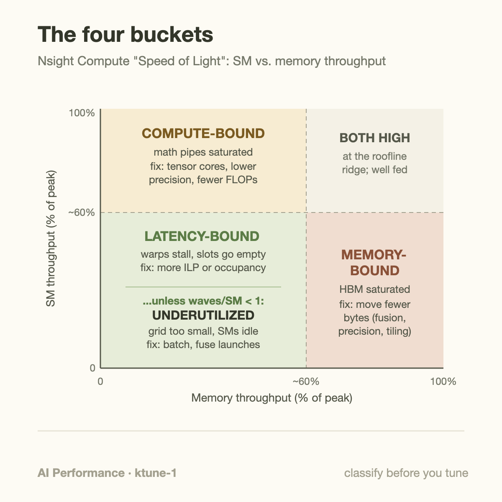
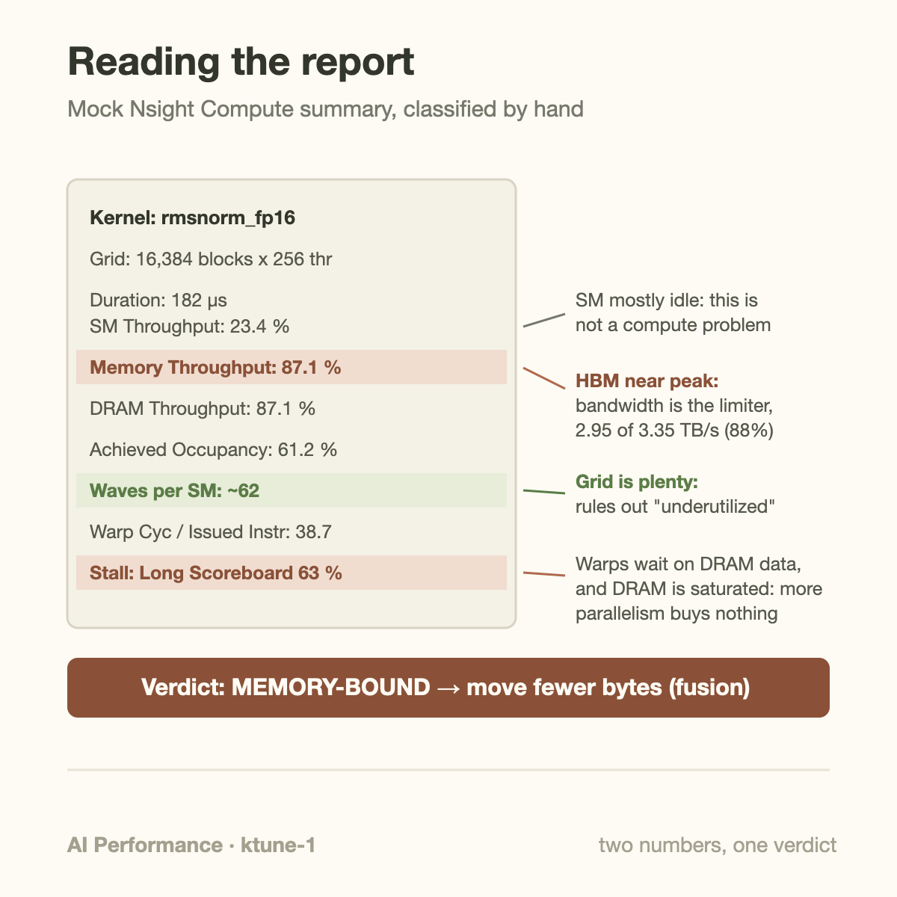
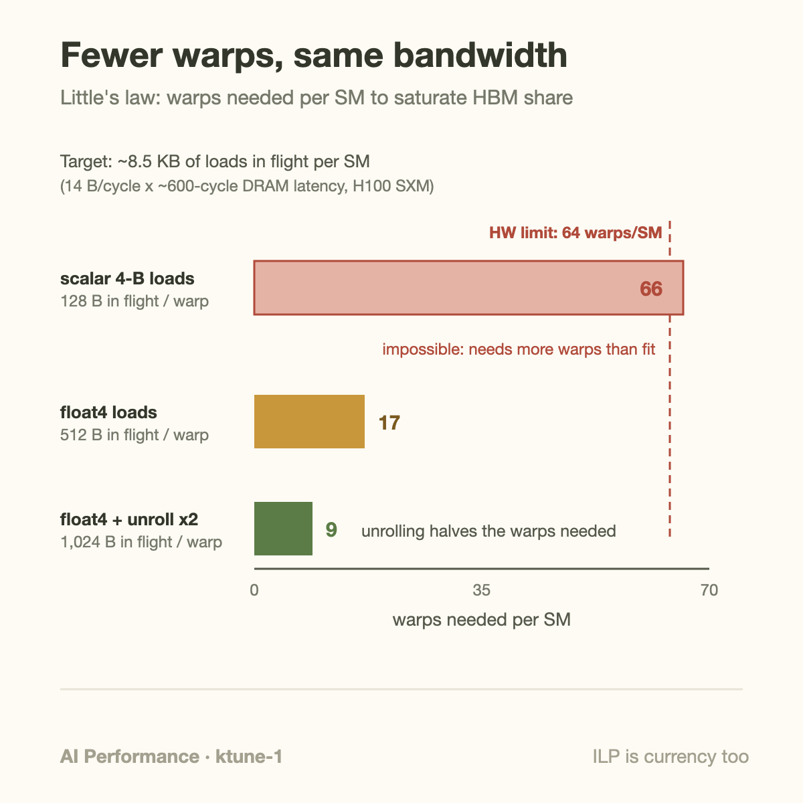

Nsight Compute will happily print more than 100 metrics for a single kernel launch. You need 3 of them to make the first, most important call: **Compute (SM) Throughput**, **Memory Throughput**, and the top **warp stall reason**. Those 3 numbers provide a useful first-pass grouping for slow kernels into 1 of 4 buckets, and each bucket has its own family of fixes. Apply a fix from the wrong bucket and you can spend a week making a kernel more elegant without making it 1 microsecond faster.

This article is that taxonomy: what the 4 buckets are, what each one looks like in a profile, and a worked example where we classify a kernel by hand from a mock Nsight summary and pick the matching fix.

## The 2 percentages that decide everything

Nsight Compute's report opens with a section called *GPU Speed of Light Throughput*. It condenses the whole kernel into 2 headline percentages:

- **Compute (SM) Throughput**: how busy the most-utilized compute pipeline was, as a fraction of its theoretical peak. If your FP32 units issued work 23% of the cycles they could have, this reads 23%.
- **Memory Throughput**: the same idea for the memory system, taken over DRAM, L2, and L1/shared paths, reporting the most-saturated 1. If HBM moved 87% of the bytes it theoretically could have in that time window, this reads 87%.

NVIDIA's kernel profiling guide gives the reading rule: a value above roughly 80% means that resource is the limiter, and both values below roughly 60% mean the kernel has a *latency* problem, not a throughput problem. The hardware had capacity to spare on both sides and the kernel failed to feed it.

That rule already splits the world into 3 regions. The fourth bucket hides inside the "both low" region, and 1 extra number from the *Launch Statistics* section separates it out: **waves per SM**, the grid size divided by how many blocks the GPU can run at once. Here is the full decision procedure.

**1. Underutilized: the launch is too small.** Both throughputs are low, and waves per SM is below 1. You launched 32 blocks on an H100 that has 132 SMs; 100 SMs never received any work. Nsight literally warns you about this ("the grid for this launch is configured to execute only N blocks..."). No amount of kernel-level tuning helps a kernel that most of the chip never runs. The fixes live outside the kernel: batch more work into 1 launch, fuse several small launches, use a persistent grid, or overlap many small kernels with streams or CUDA Graphs. This case is embarrassingly common in inference at low batch sizes, where decode-step kernels launch thousands of tiny grids per token.

**2. Latency-bound: warps exist but stall.** Both throughputs are low, yet waves per SM says the grid was plenty big. The tell is in the *Warp State Statistics* section: **Warp Cycles Per Issued Instruction** is high (each warp sat for tens of cycles between instructions), and the top stall reasons are things like *Long Scoreboard* (waiting for data to return from global memory) or *Wait* (waiting on a fixed-latency dependency chain) or *Barrier* (waiting at `__syncthreads()`). The scheduler had issue slots free and nothing eligible to issue. Fixes: give each SM more independent work in flight, either by raising occupancy (cut register or shared-memory use so more warps fit) or by raising instruction-level parallelism within each warp (unrolling, wider vectorized loads, shorter dependency chains, `cp.async` to overlap copies with compute).

**3. Memory-bound: the byte pump is at its limit.** Memory Throughput is high, 80%+, while SM Throughput idles. The stall profile again shows Long Scoreboard, but the interpretation flips: warps wait on memory *because memory is saturated*, so adding parallelism buys nothing. You are at the roofline's slanted section. The only fixes that matter reduce bytes moved: kernel fusion so intermediate tensors never round-trip through HBM, lower-precision storage, coalesced access patterns, shared-memory tiling for reuse. This is where most LLM inference kernels live, which is exactly the argument made in [the memory wall article](/blog/the-memory-wall-latency-numbers/).

**4. Compute-bound: the math units are the limit.** SM Throughput is high, and stalls skew toward *Math Pipe Throttle* or *Not Selected* (the warp was ready, another warp got the slot). This is where you want big GEMMs to be. Fixes are about cheaper math: route work to tensor cores, drop precision, or change the algorithm to do fewer FLOPs. If you are compute-bound on tensor cores at high utilization, congratulations, you are done; buy more GPUs.



## Worked example: classify this kernel

Here is a mock Nsight Compute summary of the kind you will actually stare at. The kernel is an RMSNorm over FP16 activations, hidden size 8,192, on 16,384 rows (batch × sequence), running on an H100 SXM (132 SMs, 3.35 TB/s HBM3, 67 TFLOPS FP32 per NVIDIA's datasheet):

```
Kernel: rmsnorm_fp16        Grid: 16,384 blocks   Block: 256 threads
Duration:                       182 µs
Compute (SM) Throughput:        23.4 %
Memory Throughput:              87.1 %
DRAM Throughput:                87.1 %
Achieved Occupancy:             61.2 %
Waves Per SM:                   ~62
Warp Cycles Per Issued Instr:   38.7
Top stall: Long Scoreboard      (63 % of stall cycles)
L2 Hit Rate:                    31 %
```

Walk the decision procedure. Both throughputs low? No, memory is at 87%. So this is neither underutilized nor latency-bound; it is memory-bound, full stop. But it is worth verifying the profiler's claim by hand, because the arithmetic is the part that transfers to every kernel you will ever tune.

**Bytes moved.** The kernel reads each FP16 element once and writes each once: 16,384 × 8,192 × 2 bytes × 2 passes ≈ 537 MB. (The 16 KB gain vector is noise.)

**Achieved bandwidth.** 537 MB in 182 µs is 2.95 TB/s, which is 88% of the H100's 3.35 TB/s. That matches the reported 87% almost exactly, which tells you something important: there is no waste to squeeze out of the access pattern. The kernel already streams at close to hardware peak.

**FLOPs.** RMSNorm does roughly 4 FLOPs per element (square-and-accumulate for the reduction, then a multiply by the reciprocal root and a multiply by the gain): about 0.54 GFLOP total, which over 182 µs is 2.9 TFLOPS, or 4% of FP32 peak. Consistent with the 23% SM number once you add address math and instruction overhead.

**Arithmetic intensity.** 4 FLOPs per 4 bytes of traffic is 1 FLOP/byte. The H100's FP32 ridge point is 67 TFLOPS ÷ 3.35 TB/s = 20 FLOP/byte. We are a factor of 20 below the ridge. No micro-optimization changes that; only changing how many bytes move does.

**The matching fix.** Fusion. Suppose the next op in the graph is a residual add. Unfused, that is a second full pass: read the normalized tensor (268 MB), read the residual (268 MB), write the sum (268 MB), so the pair of kernels moves 537 + 805 = 1,342 MB. Fused into 1 kernel, the intermediate never touches HBM: read x, read residual, write out, 805 MB total. That is 40% less traffic, and for a bandwidth-saturated kernel, 40% less traffic offers up to 40% less memory-service time when other costs remain unchanged. Nothing about the inner loop changed. The win came entirely from refusing to move a tensor 2 times.

1 counterfactual to sharpen the method: suppose the same kernel had reported SM 23% and Memory 31%. Then the procedure sends you to Launch Statistics. Waves per SM ≈ 62 means the grid was plenty, so it would be a candidate for latency or dependency limits, and the 38.7 warp cycles per issued instruction becomes the number to attack.



## Going deeper: Little's law, and why unrolling can halve the warps you need

The latency-bound bucket deserves one more level of mechanism, because the standard reflex ("raise occupancy") is only half the toolbox.

Latency hiding is governed by Little's law: to sustain a throughput, you must keep *concurrency = throughput × latency* in flight. Put numbers on it for 1 H100 SM. The SM's fair share of HBM bandwidth is 3.35 TB/s ÷ 132 ≈ 25 GB/s, which at a 1.8 GHz SM clock is about 14 bytes per cycle. With an effective DRAM latency around 600 cycles, each SM must keep roughly 14 × 600 ≈ 8.5 KB of loads in flight at all times just to keep its share of the memory system busy.

Now count what a warp contributes. A warp of 32 threads each issuing a 4-byte load puts 128 bytes in flight. If each warp has 1 load outstanding at a time, you need 8,500 ÷ 128 ≈ 66 warps per SM. An H100 SM tops out at 64 resident warps. You *cannot* hide DRAM latency this way even at 100% occupancy, which is why naive scalar-load kernels plateau well below peak bandwidth.

2 levers fix it, and both raise bytes-in-flight *per warp* instead of raising warp count:

- **Vectorize.** A `float4` load moves 16 bytes per thread, 512 per warp. Now 17 warps suffice.
- **Unroll.** Unroll the loop by 2 so each warp issues 2 *independent* loads back to back before waiting on either. In-flight bytes per warp double to 1,024, and about 9 warps suffice. The unroll halved the warps needed.

This is the observation Vasily Volkov made famous in his GTC 2010 talk "Better Performance at Lower Occupancy": instruction-level parallelism and thread-level parallelism are interchangeable currencies for latency hiding, and ILP can be cheaper, but additional live values also consume registers and may reduce residency. A kernel at 25% occupancy with 4 independent loads per warp can offer comparable independent work to 1 at 100% occupancy with 1.



The arithmetic behind that diagnosis should use measured traffic at the same memory boundary as the bandwidth ceiling:

$$
\beta_{\mathrm{achieved}}=\frac{D_{\mathrm{HBM}}}{t},\qquad
I_{\mathrm{HBM}}=\frac{F}{D_{\mathrm{HBM}}},\qquad
N_{\mathrm{loads}}q\gtrsim\beta_{\mathrm{SM}}\ell.
$$

D is HBM bytes, t elapsed kernel time, F executed floating-point work, q bytes delivered by an independent load, and ell the assumed memory-return latency. The last relation is a concurrency estimate from Little's law, not a guarantee of saturation. In the RMSNorm example, 537 million bytes divided by 182 microseconds gives 2.95 trillion bytes per second. Fusion reduces the pair's traffic from 1342 to 805 MB, a theoretical reduction of 40.0% before new instruction or resource costs.

At 25 GB/s per SM and 340 nanoseconds latency, approximately 8500 bytes must be outstanding. Loads delivering 128 bytes per warp need roughly 67 independent warp loads; 512-byte loads need 17. Vectorization changes the payload per issued load, while unrolling changes the number of independent loads. Check alignment, register growth, and spills after either change. If measured HBM traffic rises through spilling, the apparent latency-hiding improvement can defeat itself.

## Common misconceptions

**"Low achieved occupancy means the kernel is slow."** Occupancy is a means, not an end: it is 1 of 2 ways to buy latency hiding, and the profile above shows the other 1. Well-tuned GEMMs routinely run at 25 to 50% occupancy while saturating tensor cores, because each warp carries huge ILP and register-heavy tiles. If Speed of Light already shows a resource above 80%, raising occupancy changes nothing except perhaps making things worse by shrinking per-thread registers. Diagnose first; occupancy is a lever for exactly 1 bucket (latency-bound), not a score.

**"nvidia-smi says 95% GPU utilization, so we must be compute-bound."** `nvidia-smi`'s utilization metric only measures the fraction of time *at least 1 kernel was resident on the device*. A kernel occupying a single SM out of 132, stalled on memory the whole time, reads as 100% utilized. It cannot distinguish any of the 4 buckets, and it says nothing about useful work, which is the same trap at cluster scale that the [goodput article](/blog/goodput-vs-utilization/) covers. Classification requires per-kernel counters, meaning Nsight Compute or equivalent CUPTI metrics, not the device-level gauge.

**"Memory-bound is a dead end; only faster HBM helps."** Memory-bound means the *byte count* is your budget, and byte counts are very negotiable. The worked example cut 40% of traffic with 1 fusion. FlashAttention (Dao et al., 2022) is the canonical existence proof at scale: attention was memory-bound on materializing the N×N score matrix, and tiling it through on-chip SRAM so those scores never touch HBM sped up attention several-fold on the same hardware, with the memory hierarchy itself unchanged. When a kernel is memory-bound, the question is not "how do I get more bandwidth" but "which of these bytes did I never need to move?"

## Where this fits in the bigger picture

The 4 buckets are really a roofline model read off a profiler. Underutilized and latency-bound kernels sit *below* the roofline (the hardware could go faster at this arithmetic intensity); memory-bound and compute-bound kernels sit *on* it, on the slanted and flat sections respectively. The fix hierarchy follows the same order you should apply it: first fill the machine, then hide latency, then move fewer bytes, then do less math.

It also explains why so much of modern inference engineering is fusion and precision work rather than clever arithmetic: at decode time, almost everything is in bucket 3, a consequence of [DRAM physics that no cache can fully paper over](/blog/from-dram-to-hbm/). The most commercially visible kernel work of the last 2 years, [DeepSeek's DeepGEMM and the kernels behind their pricing](/blog/when-a-kernel-cuts-api-prices/), is bucket-3 and bucket-4 engineering executed unusually well. And when we evaluate whether LLMs can write kernels, as in [a year of KernelBench results](/blog/a-year-of-kernelbench/), the honest scoring rubric is exactly this taxonomy: did the generated kernel land in the right bucket, and did it apply the matching fix?

The taxonomy is also a communication tool. "The kernel is slow" starts a debate; "it's at 87% of DRAM speed-of-light with 1 FLOP/byte, so we fuse or we ship it" ends 1.

## Takeaway

- Classify before you tune: 2 Speed-of-Light percentages plus waves-per-SM sort any kernel into underutilized, latency-bound, memory-bound, or compute-bound, and each bucket has a disjoint fix family.
- Verify the profiler by hand: bytes ÷ time vs. peak bandwidth, and FLOPs ÷ bytes vs. the ridge point. If achieved bandwidth is already near peak, only moving fewer bytes (fusion, precision, layout) can help.
- Latency hiding obeys Little's law, and ILP is interchangeable with occupancy: vectorized loads and a 2× unroll can cut the warps needed to saturate bandwidth from 66 to 9 on an H100 SM.

## Sources

- NVIDIA, *Nsight Compute Kernel Profiling Guide* (Speed of Light, warp stall reasons) — https://docs.nvidia.com/nsight-compute/ProfilingGuide/index.html
- NVIDIA, *CUDA C++ Best Practices Guide* — https://docs.nvidia.com/cuda/cuda-c-best-practices-guide/
- NVIDIA, H100 Tensor Core GPU specifications — https://www.nvidia.com/en-us/data-center/h100/
- Vasily Volkov, "Better Performance at Lower Occupancy," GTC 2010; and *Understanding Latency Hiding on GPUs*, PhD thesis, UC Berkeley, 2016.
- Tri Dao et al., "FlashAttention: Fast and Memory-Efficient Exact Attention with IO-Awareness" — https://arxiv.org/abs/2205.14135

*Part of the [GPU Programming & Performance](/series/gpu-performance/) learning path. Browse its published articles by topic.*
