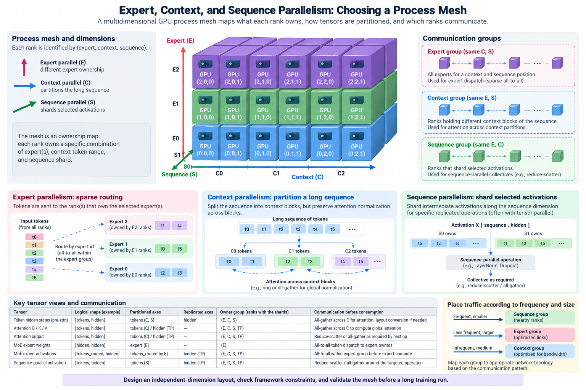
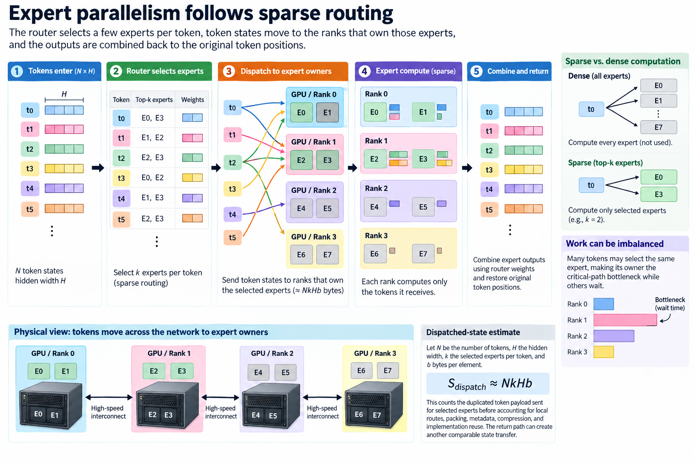
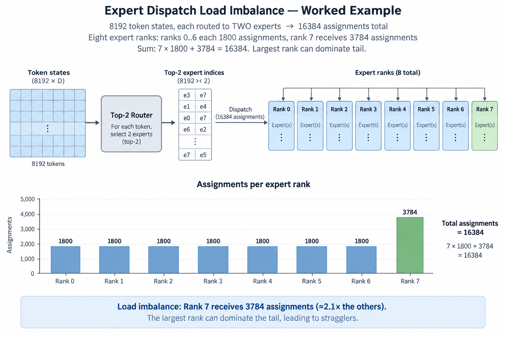
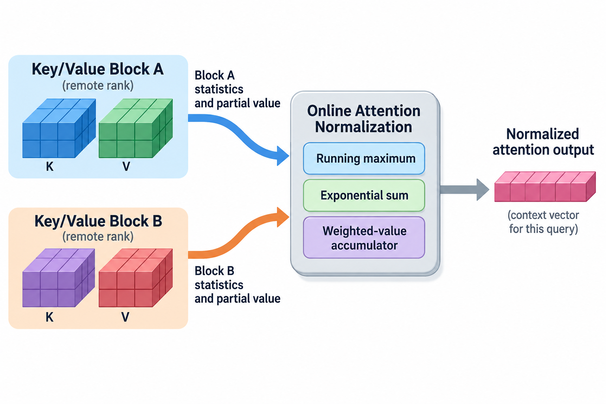

## Overview

Large-model training uses several parallelism techniques that sound similar because all of them distribute tensors across GPUs, and 3 of them come up constantly: expert parallelism distributes sparse expert computation, context parallelism distributes long sequences while preserving the attention computation, and sequence parallelism reduces replicated activation work and storage around selected tensor-parallel operations.

These techniques address different bottlenecks. Adding them to a training configuration without specifying process groups can double-count resources, create unsupported combinations, or move communication onto expensive links. The right starting point is not a list of parallelism degrees. It is a description of which logical values each rank owns and which other values each operation needs.

This article connects the 3 mechanisms to memory, arithmetic, and communication models. Implementation terminology varies, so we will distinguish the underlying partition from a framework option with a similar name. Worked layouts are illustrative; check them against the constraints of the training stack being used.

## Deep dive

### 1. Treat the process mesh as an ownership map

A process mesh organizes ranks along dimensions corresponding to parts of the computation, and 5 of those dimensions appear in practice: data parallelism assigns different examples to groups, tensor parallelism partitions operations, pipeline parallelism assigns layer ranges, context parallelism can assign sequence positions, and expert parallelism assigns expert ownership while routing token states to the appropriate owners.

Not every named dimension is independent: an expert-parallel group can be formed by factoring part of a data-parallel group, sequence parallelism is often coupled to a tensor-parallel layout rather than adding another independently multiplied set of ranks, and frameworks constrain which group sizes and combinations are valid.

Write a table for each tensor with 5 columns: its logical shape, partitioned axes, replicated axes, owner group, and communication required before consumption. A hidden-state tensor may be token-sharded in one part of the block and feature-sharded in another. The conversion between those layouts is part of the cost model.

This ownership table also helps diagnose correctness: a local result is not necessarily the complete logical result, a reduction across an already replicated axis can count values multiple times, and a missing gather can supply a downstream operation with only part of the sequence or feature dimension it expects.

### 2. Expert parallelism follows sparse routing

A mixture-of-experts layer usually routes each token to a selected subset of experts. The router chooses expert identities and weights, token states move to ranks owning those experts, and the resulting outputs are combined for the original token positions. Sparse activation reduces the expert arithmetic performed per token relative to evaluating every expert.

It does not remove the need to store the total expert parameter set across the deployment. Nor does it guarantee balanced work. If too many tokens pick 1 expert or 1 rank, that owner can become the critical-path bottleneck while other owners wait.

Let N be the number of token states entering a layer, H the hidden width, k the selected experts per token, and b bytes per transferred element. A raw dispatched-state estimate is

$$
S_{\mathrm{dispatch}}\approx NkHb.
$$

This counts duplicated token payload sent for selected experts before accounting for local routes, packing, metadata, compression, and implementation reuse. The return path can create a 2nd comparable state transfer. Actual inter-rank bytes depend on which selected experts are local and how tokens are aggregated.

### 3. Work an expert-dispatch example

Suppose a microbatch contains 8192 token states with H equal to 4096, k equal to 2, and 2-byte elements. The raw selected-expert payload is 134,217,728 bytes, or 128 MiB. If half the routes are local in a particular placement, the remote payload under that simplified assumption falls to about 64 MiB.

The average payload is only one part of the problem. Imagine 8 expert ranks receiving token assignments with counts 900, 900, 900, 900, 900, 900, 900, and 1892. The largest rank receives more than twice the work of most others. So an all-to-all or expert-compute phase can finish at the slowest owner rather than at the mean assignment count.

A diagnostic imbalance ratio is maximum assigned work divided by average assigned work, and the rank holding 1892 assignments above is exactly what it catches. Count actual expert arithmetic or token shapes when expert costs are unequal. Token count alone is not enough if some expert groups use different dimensions or capacities.

Capacity limits and routing policies can limit how many assignments an expert processes, dropping or rerouting overflow changes the model computation and training behavior, and load-balancing objectives also affect routing. Performance analysis must state those choices rather than presenting a capacity cap as a communication-only optimization.

### 4. Context parallelism partitions a long sequence

Full attention for each query position depends on the relevant key and value positions across the sequence, so partitioning query positions among context ranks reduces the local query set while the mathematical operation still needs remote K/V information whenever attention spans those positions.

An implementation can exchange K/V blocks, use ring-style schedules, or apply another supported communication pattern. The partitioned queries accumulate attention contributions with numerically stable normalization across the visited key blocks. A causal mask must preserve the permitted history for each query.

For batch B, sequence length L, and hidden width H, splitting positions over c context ranks reduces 1 local hidden-state tensor from BLH elements to about BLH divided by c. That does not divide every activation or parameter object by c. Replicated state, remote block buffers, and operation-specific saved tensors remain.

Attention arithmetic can partition across queries, but load balance depends on masking and the assignment of positions. A naive causal partition can give later-query ranks more permitted key positions than earlier-query ranks. Framework schedules can distribute positions to reduce such imbalance; inspect the actual sequence mapping rather than assuming equal token counts guarantee equal work.

### 5. Preserve attention normalization across blocks

A query processing several key blocks cannot independently normalize each block and then simply add their outputs. Softmax normalization must refer to the complete permitted key set. An online attention calculation keeps 3 running values: a maximum, an exponential sum, and a weighted-value accumulator.

For existing maximum m and sum l, and a new block with maximum m_b and sum l_b, the merged normalization state includes

$$
m'=\max(m,m_b),
\qquad
l'=e^{m-m'}l+e^{m_b-m'}l_b.
$$

The weighted-value accumulator gets the corresponding rescaling. This is the same numerical principle FlashAttention uses for tiled exact attention, now applied while key/value blocks may arrive from remote ranks. It explains why context partitioning needs more than placing independent attention calls on sequence chunks.

The formula assumes block statistics are computed over the allowed keys with the appropriate attention scaling and mask. Empty or fully masked blocks need valid handling, and numerical representation and reduction order can affect floating-point differences without changing the intended mathematical operation.

This normalization story is an excellent correctness test. Compare a small partitioned attention example against a full reference with the same mask and representation. Include causal boundaries, unequal sequence lengths, and queries whose allowed key sets span 2 or more owners.

### 6. Sequence parallelism targets selected replicated operations

In tensor-parallel training, some operations naturally partition feature dimensions while other operations such as normalization or dropout can keep replicated activation work. Sequence parallelism can partition those token-axis operations and connect layouts with 2 collectives, reduce-scatter and all-gather.

The term does not always mean distributing full long-context attention over an independent sequence group. Its meaning depends on the framework. In Megatron-style usage, it is tied to tensor-parallel operation layouts and can reduce activation storage that would otherwise be replicated across tensor ranks.

A local normalization operation over hidden features needs the complete feature vector for each token it owns, so if features are partitioned instead, the implementation needs a different distributed normalization rule. Identify where the activation layout changes so each operation gets the shape its mathematical definition requires.

So the benefit is selective: it can reduce particular activations and associated work, but it does not automatically shard all saved tensors or total training state. Use the ownership table to count which objects actually change and which collectives supply the next layout.

### 7. Work a consistent independent-dimension layout

Suppose a training layout uses data degree d equal to 2, tensor degree t equal to 4, pipeline degree p equal to 4, and context degree c equal to 2, with these dimensions independent. The total rank count is

$$
W=d\,t\,p\,c=64.
$$

A token microbatch is split across context ranks, operations are split across tensor ranks, and layer ranges are assigned to pipeline stages. Only the data dimension, d equal to 2 here, represents independent examples in the simple global-batch count. Multiplying the effective training batch by every device dimension would overstate useful work.

If an expert group is factored from an existing dimension, multiplying those 64 ranks by an expert degree is wrong. If a framework instead defines an independent expert dimension, its rank accounting and data ownership differ. The launch configuration must make this distinction explicit.

Check divisibility constraints for 5 quantities: hidden widths, head counts, expert counts, sequence partitions, and stage assignments. A mathematically plausible group factorization can still be unsupported by an implementation. Validate the selected mesh with the exact model configuration and installed software versions.

### 8. Place traffic according to frequency and size

Tensor and sequence-layout collectives can occur repeatedly within blocks, expert dispatch and combine can involve large all-to-all traffic and irregular destination load, context schedules exchange attention state, and pipeline boundaries move activations and gradients between layer stages. These 4 traffic types can share physical links.

Place the most latency-sensitive frequent groups within fast local domains where feasible. Evaluate expert and context placement using actual payload sizes and simultaneous traffic. A placement that minimizes 1 group’s communication can force another group to cross a slower boundary.

Benchmark groups with representative message sizes and rank maps, record achieved aggregate bandwidth, and also record slowest-rank completion, startup-sensitive regimes, and overlap effects, because a high-bandwidth all-to-all benchmark with uniform traffic may not reproduce a skewed routing distribution from the real model.

Profile compute and communication together. Extra buffering used for overlap can increase the activation peak. A communication kernel can use execution or memory resources also needed by expert computation. The complete step time and the useful-token throughput remain the 2 primary performance outcomes.

### 9. Validate the mesh before a long training run

Start with a manageable reference model and 1 update whose objective is understood. Compare partitioned outputs, gradients, and parameter updates under supported numerical tolerances. Check masking, routing assignments, loss weighting, and accumulation counts independently where possible.

Log group membership and tensor shapes at layout boundaries. Confirm that every rank participates in compatible collective ordering. Include 3 edge cases: empty expert assignments, uneven valid-token counts, and the longest admitted context. These cases can expose assumptions hidden by a uniform synthetic input.

Then measure per-rank peak memory, stage imbalance, expert assignment distribution, context communication, and complete optimizer-step time, keeping the model objective and useful token count fixed for an initial layout comparison. Document any batch or precision changes needed to make a larger configuration feasible.

Treat the chosen process mesh as a versioned part of the training method. Changing a model’s head count, expert count, sequence policy, or kernel implementation can change both valid partitions and their best physical placement. A mesh is an execution design with explicit assumptions, not just a convenient arrangement of rank numbers.

## Conclusion

Expert parallelism routes sparse computation to expert owners, context parallelism partitions long-sequence attention while exchanging the state needed for the complete result, and sequence parallelism shards selected token-axis activation operations around compatible layouts.

Define ownership, layout conversions, and process groups before counting memory or ranks. Then verify the mathematical result and measure the simultaneous communication program. Clear distinctions between these mechanisms prevent misleading batch counts, impossible meshes, and performance diagnoses based on the wrong collective.

### Sources

- [Megatron Core context parallelism](https://docs.nvidia.com/megatron-core/developer-guide/latest/user-guide/features/context_parallel.html): long-sequence partitioning and communication.
- [Megatron Core MoE documentation](https://docs.nvidia.com/megatron-core/developer-guide/latest/apidocs/core/core.transformer.moe.token_dispatcher.html): expert groups, dispatch, and supported parallel configurations.
- [Korthikanti et al., Reducing Activation Recomputation in Large Transformer Models](https://arxiv.org/abs/2205.05198): sequence-parallel activation partitioning.
- [Dao et al., FlashAttention](https://arxiv.org/abs/2205.14135): online normalization for exact tiled attention.
