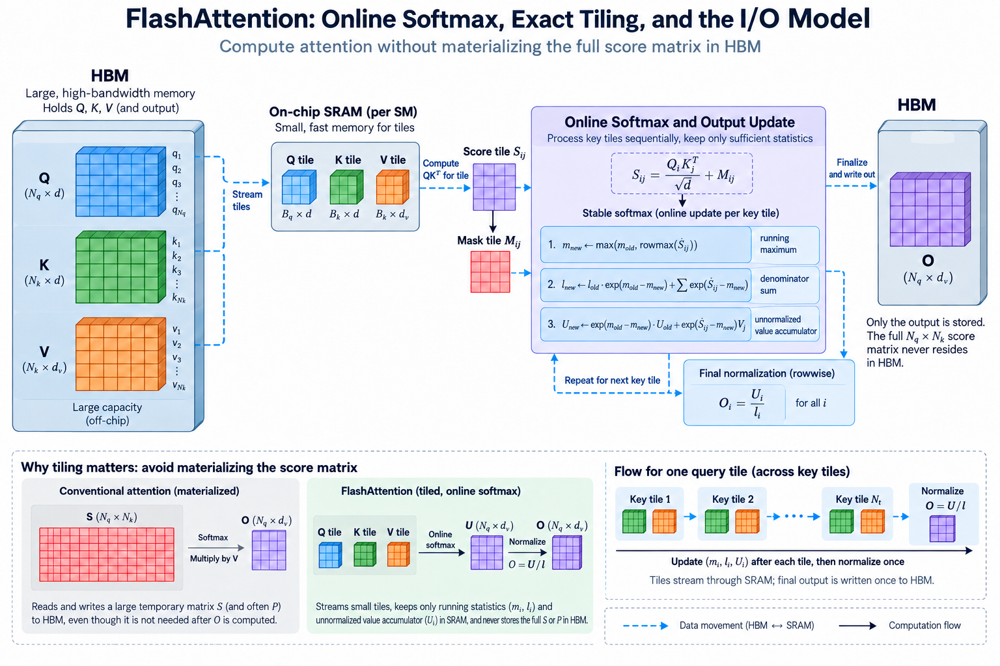
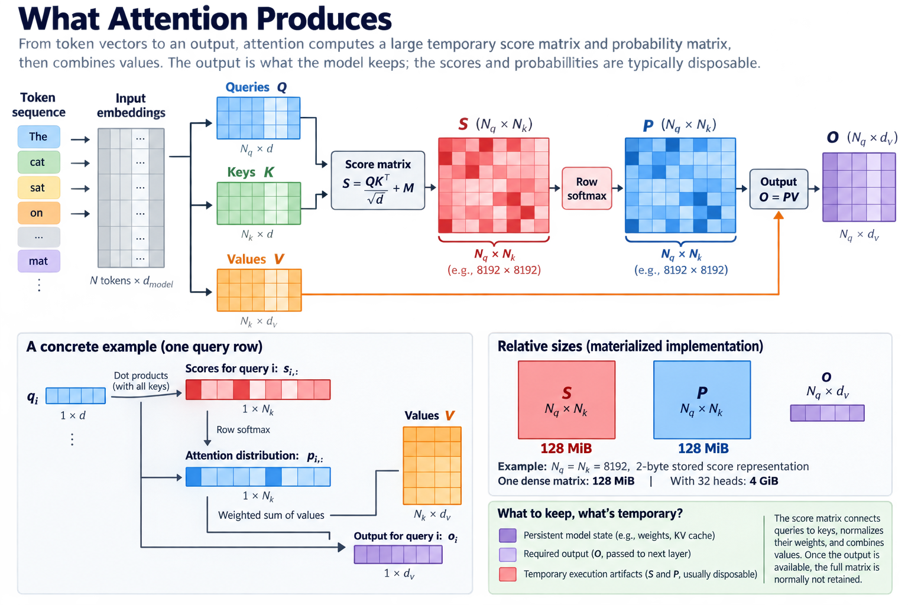
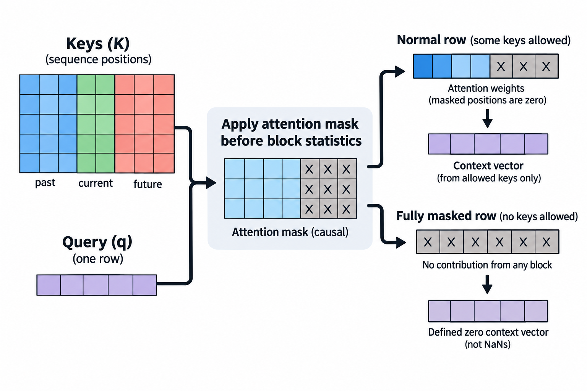
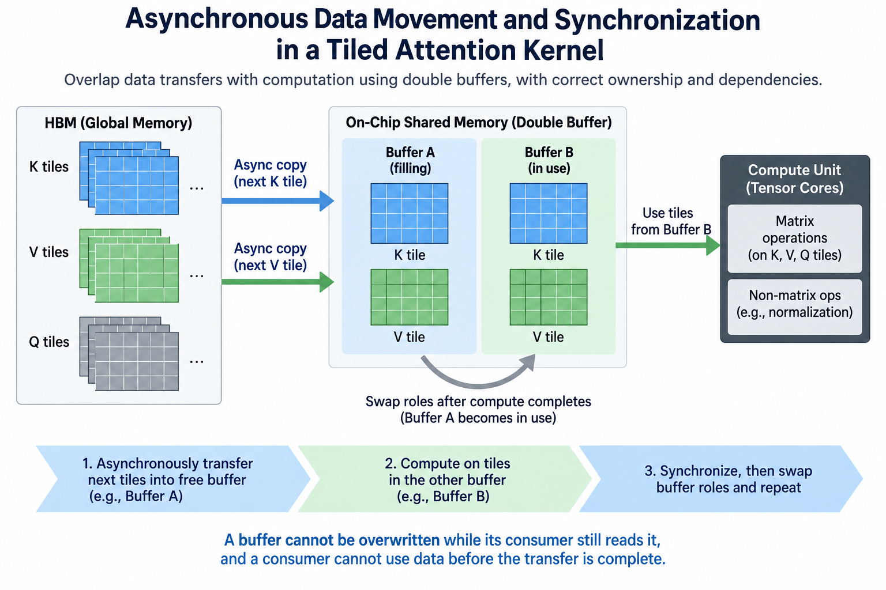

## Overview

An attention layer can spend substantial time moving a matrix that the rest of the model never needs to retain. The score matrix exists to connect queries to keys, normalize their weights, and combine values. Once the output is available, the full matrix is normally disposable. The FlashAttention kernel changes the execution schedule so this temporary object does not have to travel repeatedly through GPU high-bandwidth memory.

The mathematical attention function remains the reference. The innovation in FlashAttention is an algorithm that respects the memory hierarchy: compute small blocks, preserve sufficient normalization statistics, and carry a partial output forward. This article derives those statistics, connects them to memory traffic, and explains how to evaluate the resulting kernel in a serving workload.

All numerical examples are capacity calculations or illustrative timing scenarios. They are not benchmark results for a particular GPU. Exact attention here means the same mathematical operation, subject to floating-point rounding, rather than guaranteed bitwise equality with every reference implementation.

## Deep dive

### 1. Start with the objects that attention actually produces

For 1 attention head, let Q contain N_q query vectors, K contain N_k key vectors, and V contain N_k value vectors. Query and key width is d; value width is d_v. A conventional formulation is

$$
S=QK^\top/\sqrt{d}+M,\qquad P=\operatorname{softmax}_{\mathrm{row}}(S),\qquad O=PV.
$$

The mask M excludes disallowed query-key pairs, usually by adding negative infinity before normalization. O has N_q rows and d_v columns, while S and P each have N_q by N_k entries. Those 2 matrices may be much larger than the output, particularly during long-sequence prefill.

Consider N_q=N_k=8192 and a 2-byte stored score representation. One dense matrix occupies 128 MiB. With 32 heads, that becomes 4 GiB before accounting for probabilities, other activations, and the output. The calculation describes a materialized implementation; optimized attention need not allocate this object.

The 2 matrix products perform useful arithmetic, but storing their connecting matrix introduces a separate cost. A kernel that improves arithmetic throughput while still writing and reading huge intermediates can leave the main bottleneck intact. Begin performance analysis by identifying which tensors are persistent model state, required outputs, and temporary execution artifacts.

### 2. Stable softmax creates a dependency across key blocks

For a single query row, write its allowed scores as s_j. Numerically stable softmax subtracts the largest score before exponentiation. Its weighted value result is

$$
m=\max_j s_j,\qquad l=\sum_j e^{s_j-m},\qquad u=\sum_j e^{s_j-m}v_j,\qquad o=u/l.
$$

The 2 scalars m and l summarize the row, while u and o are value-width vectors. Subtracting m prevents large positive scores from overflowing their exponentials. It does not change the normalized result because the common exponential factor cancels.

A straightforward tiled implementation encounters a problem: after processing the first key block, a later block may contain a larger maximum, and the earlier exponentials were scaled using the earlier maximum, so adding the new block without correcting the previous state would combine quantities expressed at 2 different scales and produce an incorrect answer.

The dependency is manageable because the complete history can be summarized by only the 3 quantities m, l, and u. We do not need to retain every old probability. We need a rule for changing the scale of the historical sum and output accumulator when the reference maximum changes.

### 3. Derive the online update rather than memorizing it

Suppose the processed blocks have the 3 statistics m, l, and u. A new block has scores t_j and values w_j. Compute its local maximum b, local exponential sum z, and local weighted sum r using b as the reference. The combined statistics are

$$
\begin{aligned}
m'&=\max(m,b),\\
a&=e^{m-m'},\qquad c=e^{b-m'},\\
l'&=a l+c z,\\
u'&=a u+c r.
\end{aligned}
$$

To see why, multiply each historical term by the scale correction. The product of exp(s_j minus m) and exp(m minus m prime) is exp(s_j minus m prime). The new block receives the same correction from its own reference maximum. Both groups now share 1 denominator scale.

For a small scalar-value example, let the first block contain score 0 with value 2. Its statistics are m=0, l=1, and u=2. Let the second block contain score log(3) with value 4. The new maximum is log(3), so the historical correction is 1/3. The combined denominator is 4/3, and the numerator is 14/3. The result is 3.5, matching weights 1/4 and 3/4.

A query tile performs this update independently for each of its rows. Vectorized matrix operations calculate many scores and weighted sums together, while per-row maxima and sums maintain normalization. The implementation can store a normalized partial output instead of u, but then its rescaling formula must include the 2 denominators, old and new, consistently.

### 4. Map sufficient statistics onto the GPU memory hierarchy

A tiled kernel loads 1 query block, streams key and value blocks, and computes each score tile in on-chip storage. It updates the row statistics and output accumulator before moving to the next key block. The temporary score tile is consumed where it is produced rather than becoming a full HBM allocation.

Tile dimensions interact with shared memory, registers, matrix instructions, and occupancy. A larger tile can improve reuse and reduce repeated loads, but its accumulators can also exhaust registers or reduce concurrent execution. There is no universally optimal tile size independent of head width, sequence length, hardware, and numerical representation.

The original FlashAttention work formalizes attention as an I/O-aware computation and analyzes traffic between HBM and on-chip memory. The practical engineering lesson is to model bytes at each level, not merely count logical tensor entries. Repeated key loads, cache hits, and accumulator spills can all change actual device traffic.

For training, avoiding a stored probability matrix changes backward execution too. The backward pass can reconstruct needed blocks from inputs and saved normalization information. This exchanges additional arithmetic for lower intermediate storage and traffic. A forward-only serving benchmark cannot establish the training benefit of that tradeoff.

### 5. Keep masks, precision, and empty rows in the correctness contract

Causal attention admits only keys at or before the query's logical position. During chunked prefill, query indices may start after an existing cache prefix, so local row number alone does not define the correct boundary. Padding, sliding windows, and packed sequences introduce additional distinctions between physical tensor position and logical sequence membership.

Apply the mask before calculating block statistics. Entirely masked blocks should contribute nothing, an entirely masked row requires defined behavior rather than an accidental negative-infinity subtraction that creates NaNs, and production implementations may restrict supported inputs or handle such rows specially, so the calling application must respect that contract.

Floating-point reduction order changes with tiling. Test outputs using suitable absolute and relative tolerances, and include large scores, long rows, and the supported data types. Compare against a higher-precision reference when investigating numerical errors, not only another optimized kernel with similar rounding behavior.

If dropout is part of training attention, recomputation must preserve the appropriate random decisions. Grouped-query attention also requires the correct mapping from query heads to shared key and value heads. These are semantic requirements around the kernel, not optional details that disappear because the central online-softmax equation is correct.

### 6. Distinguish prefill from decode before predicting speed

Prefill processes many query positions at once. It can expose large matrix products and substantial score-matrix traffic. Decode often processes 1 new query position per sequence against an existing key-value cache. Its arithmetic shape and opportunities for reuse are different, even when the underlying attention equation is unchanged.

A simple decode cache-read estimate for batch B, context L, H_kv key-value heads, head width d, and b bytes per cached element is

$$
D_{\mathrm{KV}}\approx 2BLH_{\mathrm{kv}}db.
$$

The factor 2 accounts for keys and values. The estimate assumes equal key and value width and excludes metadata, output writes, and rereads. With B=1, L=8192, H_kv=8, d=128, and b=2, the logical read is 32 MiB per layer. Sharing key-value heads changes this budget independently of whether score tiles are materialized.

A decode kernel may need to split a long sequence across execution units and combine partial softmax states afterward. The same merge rule enables this reduction, but extra partial-output storage and launch overhead affect performance. Conversely, a small sequence can provide too little work to occupy a large GPU. A prefill speedup should therefore never be copied directly into an inter-token-latency forecast.

### 7. Build an experiment that can explain its result

Record these 9 fields: query length, key length, batch size, query-head count, key-value-head count, head width, dtype, mask, and cache layout. Also record which backend actually executed. A high-level attention API can dispatch to different implementations depending on supported shapes and options, so an API name alone is insufficient evidence.

Warm up the chosen path, separate compilation from steady-state timing, and synchronize at the correct measurement boundary, then report distributions across repeated runs and include a correctness comparison before interpreting speed, because an unsupported mask or inadvertently different attention pattern can make a fast result meaningless.

Use profiling to inspect actual memory traffic, matrix-unit activity, occupancy, and launch gaps. Interpret the counters together: low memory bandwidth may indicate compute limitation, insufficient parallel work, or an inefficient access pattern. It does not automatically prove that the implementation has solved the I/O problem.

For serving, repeat the experiment under realistic concurrency and mixed prompt lengths. Measure time to first token, inter-token latency, total request latency, and useful throughput. Kernel measurements explain a mechanism; request measurements establish whether that mechanism matters to the service objective.

### 8. Translate the kernel improvement into a request budget

If attention consumes fraction f of a request's original execution time and its implementation becomes s times faster, the simplest fixed-workload speedup model is

$$
S_{\mathrm{request}}=\frac{1}{(1-f)+f/s}.
$$

For an illustrative f=0.4 and s=2, the request speedup is 1.25, not 2. The remaining computation still consumes 60% of the original time. The equation assumes the other components stay constant and ignores queueing, changed batching, and resource interactions.

Real services can gain additional capacity when lower memory usage allows larger batches or longer contexts. Those are 2 separate effects that require new workload measurements. Larger batches can improve throughput while hurting individual latency, and extra capacity can encourage admission of requests whose cache footprint shifts the bottleneck elsewhere.

Document both the direct kernel result and the resulting operating point. Readers should be able to distinguish saved attention time, reduced peak memory, increased batch capacity, and altered queueing. Combining them into a single unexplained speedup hides the method that an operator needs to reproduce.

### 9. Understand what later implementations are optimizing

After eliminating the large intermediate, execution scheduling still matters, because work partitioning across thread blocks and warps, non-matrix arithmetic, synchronization, and overlap between data movement and computation can all limit performance: those constraints explain why improved implementations of the same attention function can outperform an earlier tiled kernel.

Hardware-specific asynchronous movement and matrix instructions introduce ownership and synchronization requirements. A buffer cannot be overwritten while its consumer still reads it, and a consumer cannot use data before the transfer is complete. Faster pipelines remain correctness problems as well as throughput problems.

Choose an implementation based on supported semantics and measured performance on the target system. Keep a reproducible reference path for debugging. Architecture names and library defaults are useful starting points, but the decisive evidence is the executed kernel, its correctness, and its contribution to the intended workload.

## Conclusion

The central idea is reusable beyond attention: when an intermediate is large, ask whether a compact sufficient state can replace its materialization. Here a maximum, a denominator, and a weighted accumulator make that possible. Understanding their rescaling rule connects the mathematical method directly to the hardware behavior.

### Sources

- [FlashAttention: the original paper](https://arxiv.org/abs/2205.14135).
- [FlashAttention official implementation and supported features](https://github.com/Dao-AILab/flash-attention).
- [PyTorch scaled dot product attention documentation](https://docs.pytorch.org/docs/stable/generated/torch.nn.functional.scaled_dot_product_attention.html).
