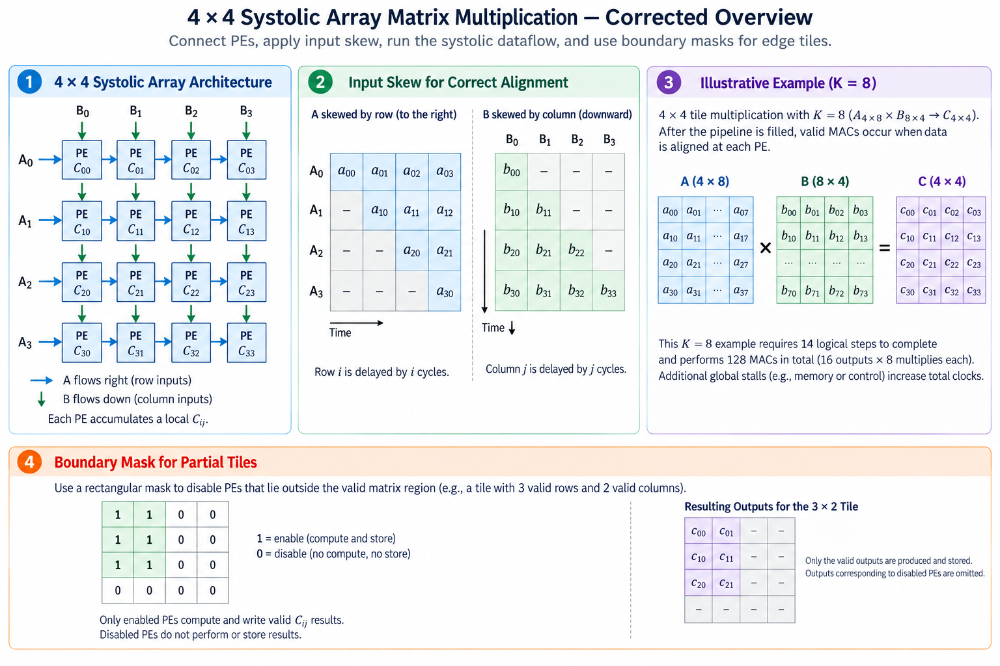
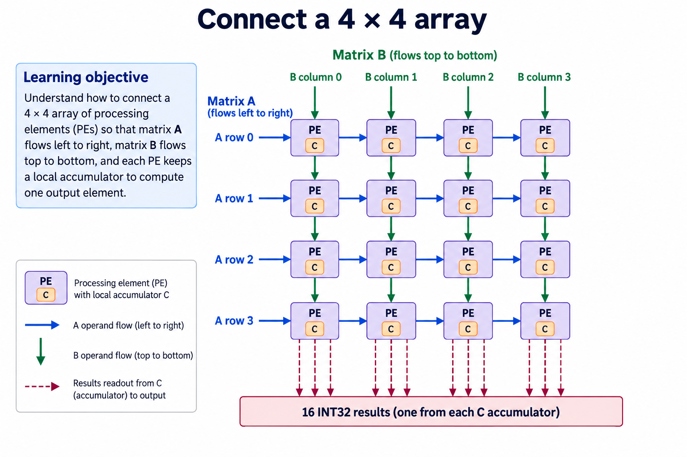
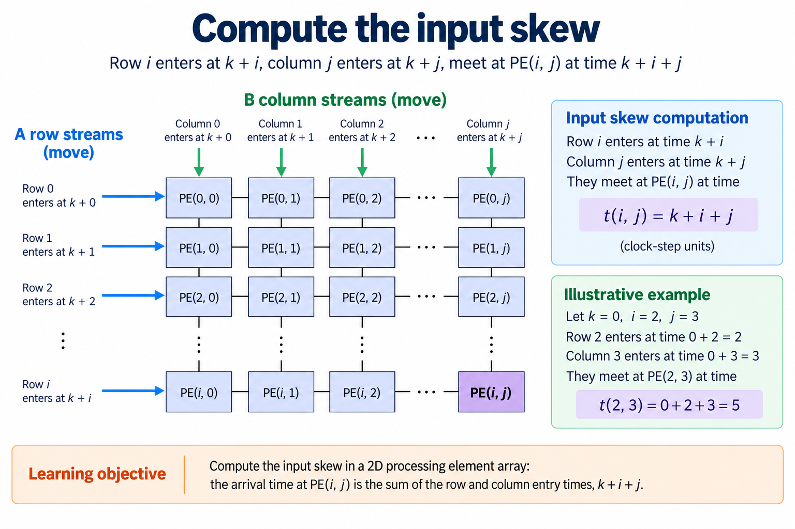
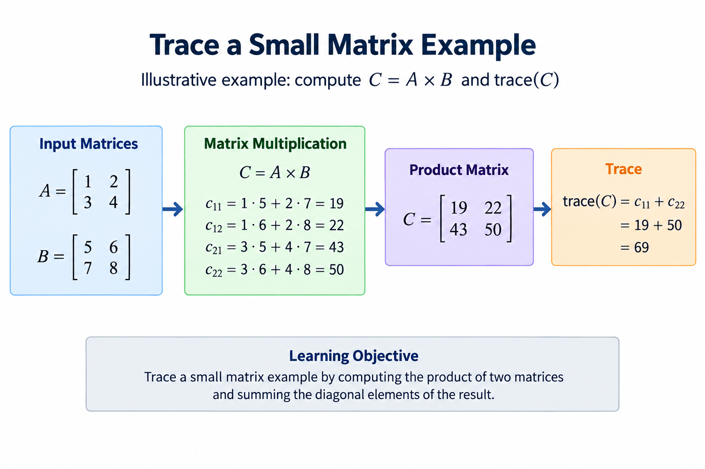
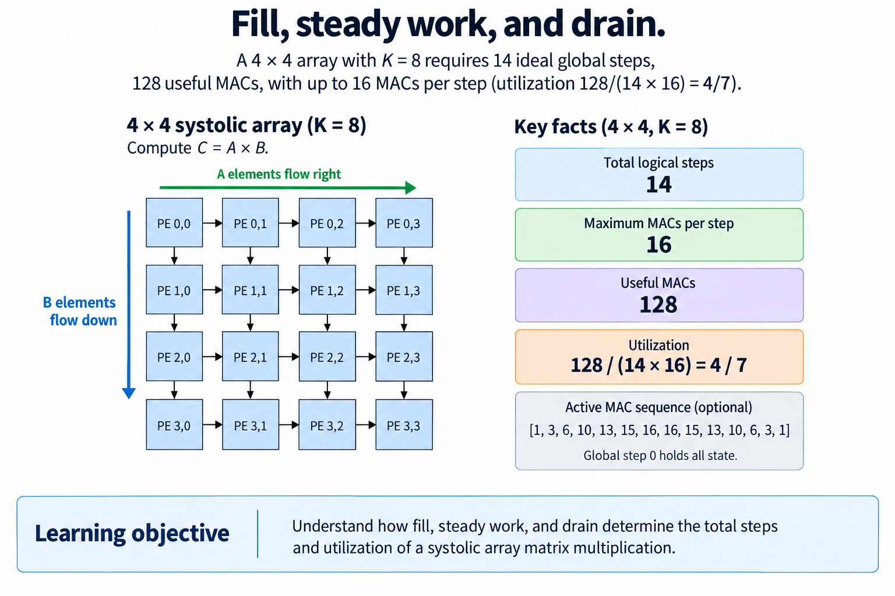
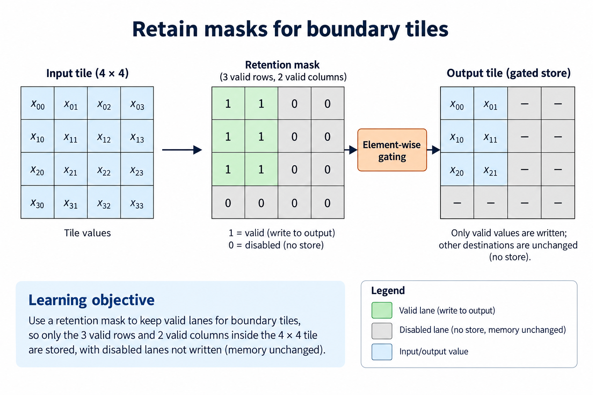
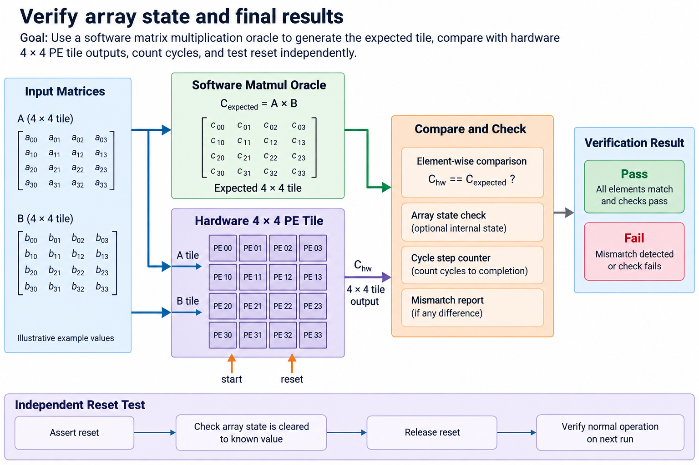

## Overview



This lesson extends one educational AI accelerator from its numerical specification toward verified RTL, FPGA integration and an ASIC implementation exercise. The overview shows this chapter's specific responsibility: Connect verified PEs and check operand skew, wavefronts and fill/drain cycles.

The shared project begins with signed INT8 operands and INT32 accumulation, grows into a 4×4 output-stationary array, and provides a verified host-loaded tile top. The larger tiled inference/transport examples are software models, while external bus, board and physical-design integration remain explicit exercises. Follow the evidence labels rather than treating every diagram as an executed hardware result.

Start after [Build a Processing Element: Local Accumulation and Operand Forwarding](/blog/fpga-ai-pe-1-build-a-processing-element/). Keep the previous fixture and source revision so this chapter's change can be checked independently.

## Deep dive

### Connect a 4×4 array



The grid figure connects 16 verified PEs. Each row forwards A values left-to-right; each column forwards B values top-to-bottom. The output associated with each cell remains in its local INT32 accumulator. The current implementation is output-stationary and globally stepped.

Packed boundary buses carry 4 signed bytes and 4 validity bits per operand direction. Each output occupies a 32-bit slice in row-major PE order. Flattening the result does not change its numerical meaning, but the host/testbench must use the same index convention.

The top-level source uses generate loops, not 16 hand-copied instances. This reduces wiring duplication while leaving the topology explicit. Parameterization describes R rows and C columns; the released test instance is 4×4. You still need to verify a changed parameter combination.

### Compute the input skew



The skew figure follows one reduction index. A[i,k] enters row i at logical step k+i. B[k,j] enters column j at k+j. After horizontal and vertical forwarding, they meet at PE(i,j) at k+i+j.

Keep logical steps separate from physical clocks. A global stall consumes a clock but not a wavefront step. The driver must hold the offered operands and masks when step is low; the array holds every state element. Advancing only the driver would skip a contribution.

The testbench uses different random signed values so mismatched k indices become visible. Constant-one inputs are useful for counting contributions, but cannot by themselves verify operand alignment.

### Trace a small matrix example



The checked matrix produces [[19,22],[43,50]] from [[1,2],[3,4]] and [[5,6],[7,8]]. PE(0,0) adds 5 then 14. PE(0,1) adds 6 then 16. PE(1,0) adds 15 then 28. PE(1,1) adds 18 then 32.

The software exercise records the active contributions at each logical step. Compare that trace with the RTL waveform's sampled products and sums. Different cells can finish at different steps, so a locally stable sum does not prove the whole output tile is complete.

The full-array oracle uses direct matrix multiplication. It checks final values independently of the systolic trace so a skew formula copied incorrectly into both driver and trace does not become the only reference.

### Fill, steady work, and drain



The utilization figure includes fill and drain. A 4×4 array with K=8 requires 14 ideal steps under the released skew convention. It performs 128 useful MACs against 224 potential cell-step slots, yielding 4/7, approximately 57.14%, in this analytical no-stall window.

That fraction is not a measured clock utilization, board throughput or energy efficiency. Physical stalls add clocks, masked boundary cells remove work, and load/store stages add system time. Increasing K amortizes fill/drain; tiny jobs do not use the array's potential capacity well.

Useful work counts only products required by the logical matrix. Multiplying zero padding is not additional useful work. The measurement lesson preserves this distinction when defining counters and timing windows.

### Retain masks for boundary tiles



The mask figure handles a tile with fewer than 4 valid rows or columns. The boundary driver sends invalid masks for absent operands. A PE with no valid pair contributes nothing, and the store stage writes only logical output elements.

Clearing the array before each independent tile prevents stale sums from a previous full tile. Across K chunks, however, the logical output must combine partial sums before its epilogue. Our software tiler adds independent chunk outputs in a wider reference context; a hardware scheduler must choose an equivalent storage strategy.

Test a 3-row,2-column tile with varied signed inputs. Verify valid results and inactive PE values. Masking input arithmetic alone does not guarantee safe output stores.

### Verify array state and final results



The verification figure records 40 RTL array cases with irregular dimensions and randomized global stalls. The harness also checks inactive result locations after clear. This provides evidence for the released 4×4 globally stepped topology.

Try altering a row skew by one step and rerun the small distinct-value fixture to observe the failure. Restore the correct skew before measuring. This controlled defect is more informative than changing several scheduling rules at once.

The finished block is an educational matrix engine, not a complete TPU or FPGA application. Memory loading, commands and a board shell remain separate integration layers. The next lessons add tiling and storage while retaining the same bit-accurate matrix contract.

### Run this lesson

Download the [accelerator lab](/labs/fpga-ai-chip/accelerator-lab.zip), extract it and run from its directory:

```sh
python3 lessons.py array-1
python3 -m unittest discover -s tests -v
```

The first command writes `reports/array-1.json`. Inspect its scope and result together. The second runs the independent numerical, addressing and scheduling checks. To reproduce RTL evidence, install Icarus Verilog 13.0 and run `python3 scripts/verify_top.py`; that also runs the block/array tests. These commands are software/RTL checks, not board measurements.

### Source: rtl/systolic_array.sv

This is the released executable source for this step. Preserve its stated protocol/width assumptions when adapting it.

```systemverilog
module systolic_array #(parameter R=4,C=4)(input logic clk,rst,clear,step,
 input logic [R*8-1:0] a_rows,input logic [C*8-1:0] b_cols,
 input logic [R-1:0] a_valid,input logic [C-1:0] b_valid,
 output wire [R*C*32-1:0] results);
 wire signed [7:0] ah[0:R-1][0:C],bv[0:R][0:C-1];
 wire va[0:R-1][0:C],vb[0:R][0:C-1];
 genvar i,j;
 generate for(i=0;i<R;i=i+1)begin:rows
  assign ah[i][0]=a_rows[i*8+:8];assign va[i][0]=a_valid[i];
  for(j=0;j<C;j=j+1)begin:cols
   pe cell_pe(.clk(clk),.rst(rst),.clear(clear),.step(step),
    .a_in(ah[i][j]),.b_in(bv[i][j]),.av_in(va[i][j]),.bv_in(vb[i][j]),
    .a_out(ah[i][j+1]),.b_out(bv[i+1][j]),.av_out(va[i][j+1]),.bv_out(vb[i+1][j]),
    .sum(results[(i*C+j)*32+:32]));
  end
 end
 for(j=0;j<C;j=j+1)begin:inputs_b
  assign bv[0][j]=b_cols[j*8+:8];assign vb[0][j]=b_valid[j];
 end endgenerate
endmodule
```

### Preserve the complete matrix operation

Keep logical dimensions separate from the physical array. The 4×4 engine computes tiles, while the software tiler covers larger matrices and K chunks. A boundary tile's inactive locations are not useful output elements. Masks and store bounds must preserve the allocated logical tensor even if the internal engine computes padded positions.

Initialize a new output reduction once, combine every required contribution, and apply bias/activation/conversion only at the specified final stage. ReLU does not distribute over partial sums. A premature quantization can also change rounding and cancellation. Use mixed-sign fixtures so these mistakes cannot hide behind positive-only inputs.

Count traffic at named boundaries. External tensor bytes, local RAM reads, register access and forwarded operands are different quantities. Reuse that avoids a host or external-memory load can still create heavy local traffic. A dataflow comparison needs the same shapes, types, numerical output and storage assumptions.

The direct matrix oracle remains independent of the systolic timing trace. Use the trace to debug alignment and the oracle to verify the final result. Global stalls consume clocks without changing logical step; maintain that distinction in both the driver and the array. Once the complete tile contract is correct, measure its useful work and integration overhead separately.

### A worked engineering decision

#### Derive an arrival instead of guessing a fill picture

For output C[i,j], product index k must meet at the corresponding PE. A[i,k] enters row i with delay i, then travels j PE hops. B[k,j] enters column j with delay j, then travels i hops. Both therefore reach the same PE at logical step k+i+j under the common stepping convention. This equality is the reason for skewing; simply sending every row and column at once would pair different k values away from the first PE.

Follow the bottom-right PE of a 4×4 tile. Its first k=0 pair arrives after the combined row/column skew of 6 logical positions, and its last K=8 pair has k=7. The complete array requires K+4+4-2=14 stepped updates under the released model's convention. A hold clock advances none of those positions. The integrated top adds clear and capture control edges outside that logical-step count, so do not describe 14 as complete host-command latency.

The active-MAC counts for the full K=8 tile are [1,3,6,10,13,15,16,16,15,13,10,6,3,1]. They sum to 128 useful contributions. The useful occupancy against 16 cells across 14 logical steps is 128/(16×14)=4/7. A chart showing all 16 cells active for most of 8 full steps would not match that ledger. Verify a figure's totals just as you verify a numerical output.

#### Collect every output-stationary sum

Each of the 16 PEs owns a distinct C[i,j]. Only A and B are forwarded through the grid; the local sum stays until the reduction is complete. Reading only the bottom row would lose 12 output elements. The educational array exposes a packed bus containing all local sums, and the integrated top captures that bus before reporting completion. The row/column coordinate belongs to the output element, not merely the forwarding lane at the boundary.

For a boundary tile with 3 valid rows and 2 valid columns, only 6 output destinations are logical elements. Internal padded cells may have zero or inactive state, but the external writer must omit invalid destinations rather than store zero outside the allocated tensor. A rectangular logical mask is determined by actual row and column bounds. A triangular decorative mask does not represent this example's valid region.

Use distinct source values to diagnose collection order. A matrix fixture whose rows and columns differ can reveal whether packed result fields were swapped, whether the writer uses the physical stride instead of logical stride, or whether only 1 row was captured. The direct matmul oracle provides expected C values; the timing trace helps locate which operand pair first diverged.

#### Keep global holds consistent across the whole grid

The array shares a global step. If a front-end cannot provide a required boundary operand, it can hold the entire wavefront while retaining its pending inputs. Every PE's forwarding registers, validity masks and sum must follow the same hold. Advancing only the boundary skew counters would change the pairing when computation resumes. The controller's logical-step count must also hold, or it could capture results too early.

The simulator inserts random hold clocks and compares completed tiles with the same independent numerical reference. A test that merely adds a fixed delay after the last input would not prove that the internal wavefront stayed aligned. Inspect accepted logical steps and masks in the trace, and compare final outputs for both unstalled and stalled sequences. The report records exercised stall clocks as evidence of the tested contract.

The simplicity has a cost: 1 blocked boundary can stall all 16 cells. More elaborate architectures can queue operands or overlap tiles, but they introduce additional lifetime and arbitration state. Evaluate those changes against useful completed matrix work, not just the number of PE boxes. A small globally stepped array is a reasonable teaching baseline because its timing can be derived and reproduced.

#### Separate array simulation from implementation capacity

A generate loop constructs the logical grid, but does not report achieved frequency, DSP use, wire congestion or buffer bandwidth. Those properties require a selected device and executed implementation flow. Clear/step fan-out, operand routing and a wide result bus can become physical constraints as the grid grows. Scaling from 4×4 to a larger array is therefore more than changing a parameter.

The next lessons retain this exact output-stationary baseline while studying reuse and software tiling. Preserve its complete numerical contract, timing convention and result order. A larger matrix can be decomposed into valid tiles, but the decomposition must carry every reduction chunk and respect boundary stores. The array is the verified local engine; the scheduler and memory path remain independently reviewable parts of the system.

## Conclusion

The outcome of this chapter is a concrete project artifact and a check whose scope is stated explicitly. Preserve numerical results, transaction ordering and lifetime rules as the design grows; optimize only after the baseline is correct. Next, [Weight-Stationary vs Output-Stationary: Make Reuse Explicit](/blog/fpga-ai-dataflow-1-weight-stationary-vs-output-stationary/) adds the next responsibility without changing the established contract.

### Sources

- [Original accelerator lab and verification evidence](https://chiaxinliang.github.io/labs/fpga-ai-chip/accelerator-lab.zip)
