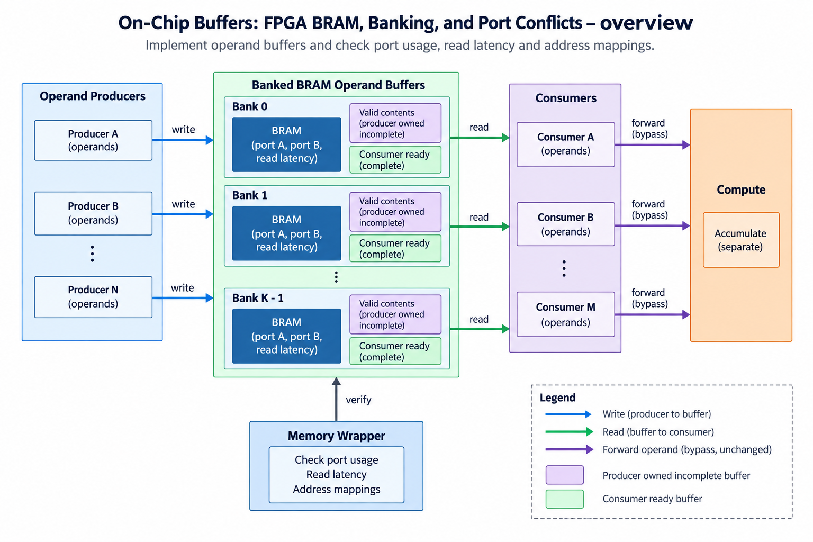
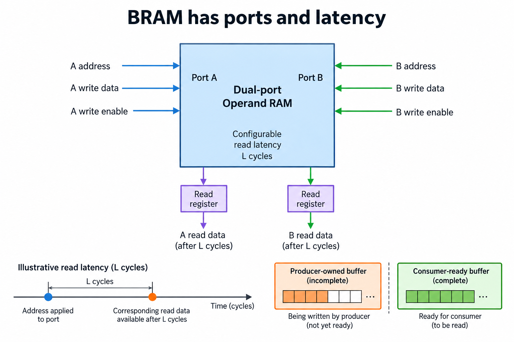
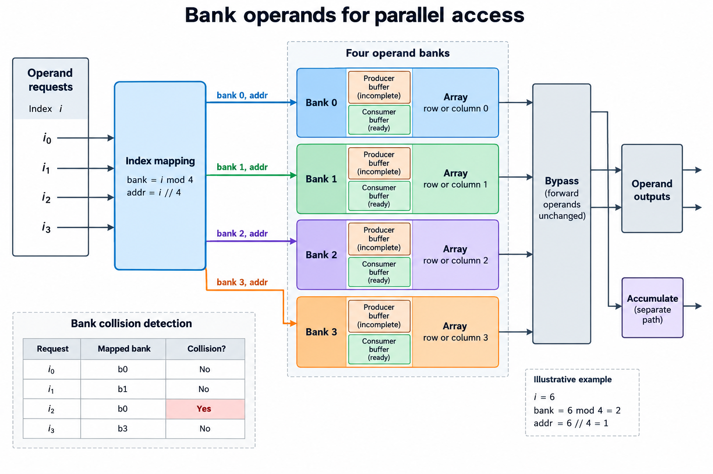
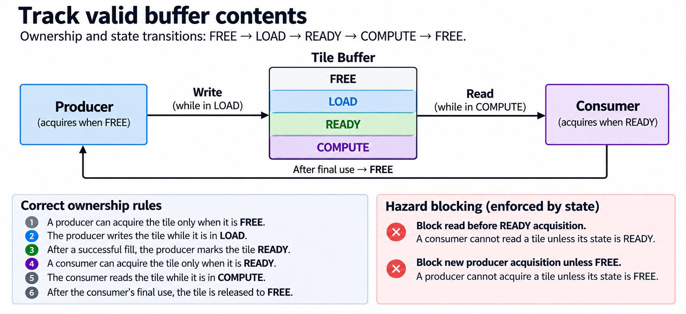
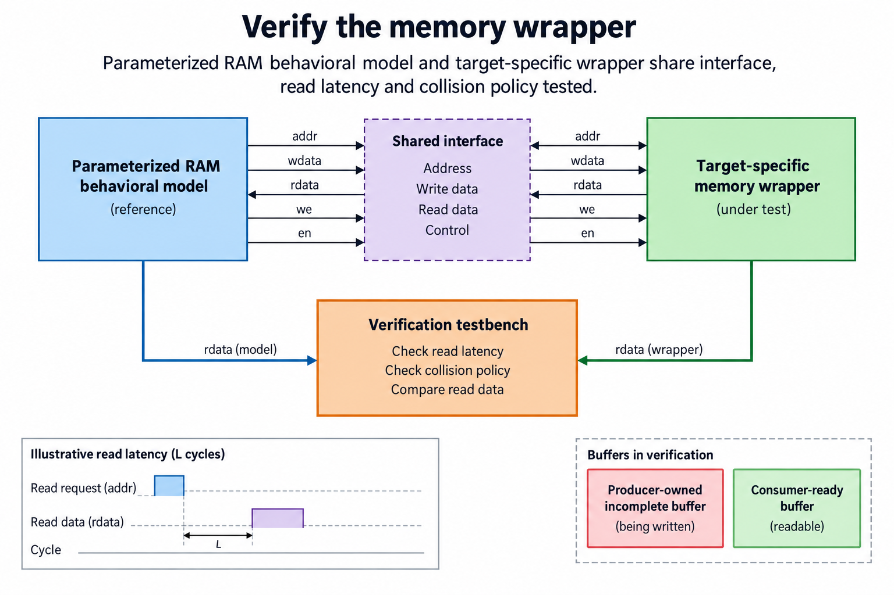

## Overview



This lesson extends one educational AI accelerator from its numerical specification toward verified RTL, FPGA integration and an ASIC implementation exercise. The overview shows this chapter's specific responsibility: Implement operand buffers and check port usage, read latency and address mappings.

The shared project begins with signed INT8 operands and INT32 accumulation, grows into a 4×4 output-stationary array, and provides a verified host-loaded tile top. The larger tiled inference/transport examples are software models, while external bus, board and physical-design integration remain explicit exercises. Follow the evidence labels rather than treating every diagram as an executed hardware result.

Start after [Finish the Operator: Bias, ReLU, and Requantization](/blog/fpga-ai-post-1-finish-the-operator/). Keep the previous fixture and source revision so this chapter's change can be checked independently.

## Deep dive

### BRAM has ports and latency



The RAM figure specifies a registered read and separate write/read addresses. Its behavioral model returns the previous value on a same-address read/write edge. This read-first policy is explicit; a selected FPGA primitive or ASIC macro may support a different behavior.

Memory contents are not reset in operand_ram.sv, so its 64 addresses hold whatever they held before. Control validity prevents reading an unfilled tile as valid data. Clearing an array sum does not initialize every operand address.

The registered output adds a latency that the operand scheduler must account for. A combinational Python list read is not a timing-equivalent RAM model, even when its values match.

### Bank operands for parallel access



The banking figure supplies separate operand lanes from independent banks or staged reads. A 4-row array can need several values each global step. One RAM port cannot produce an arbitrary number of distinct addresses at once.

Choose a bank function and local address mapping, then count simultaneous accesses. 2 requests mapping to the same bank may need serialization or another port. Padding a matrix can simplify indexing but changes storage/traffic.

Test pack/unpack mappings with distinct signed INT8 values. Repeated values can hide a swapped bank or row. Logical row-major storage and physical banked storage are separate layouts connected by explicit packing.

### Track valid buffer contents



The ownership figure moves a tile through 4 states: FREE, LOAD, READY and COMPUTE. The load producer must finish before readers use the tile. The compute consumer must finish before the next load overwrites it.

A valid bit is meaningful only with a lifetime contract. Set READY after successful fill completion, not after issuing the first write. Error/reset invalidates the tile so stale bytes are not consumed.

Double buffering adds a second owner-tracked buffer, not merely a second array of bytes. The next overlap lesson tests that load(i) cannot overwrite buffer(i-2) while its compute remains active.

### Verify the memory wrapper



The wrapper-verification figure compares the behavioral contract with a target-specific implementation. The shared RTL test writes a location, reads it after the registered latency, then exercises same-address read/write and verifies the old/new values at the correct edges.

When selecting BRAM or an ASIC macro, pin port width, depth, latency, enable and collision policy. Simulation, synthesis and timing models must describe compatible behavior. A black-box declaration that compiles is not proof of a usable memory implementation.

The released wrapper is an educational inference template. Physical integration and exact primitive mapping remain implementation checks. Read the generated resource report before claiming the memory became BRAM.

### Run this lesson

Download the [accelerator lab](/labs/fpga-ai-chip/accelerator-lab.zip), extract it and run from its directory:

```sh
python3 lessons.py buffer-1
python3 -m unittest discover -s tests -v
```

The first command writes `reports/buffer-1.json`. Inspect its scope and result together. The second runs the independent numerical, addressing and scheduling checks. To reproduce RTL evidence, install Icarus Verilog 13.0 and run `python3 scripts/verify_top.py`; that also runs the block/array tests. These commands are software/RTL checks, not board measurements.

### Source: rtl/operand_ram.sv

This is the released executable source for this step. Preserve its stated protocol/width assumptions when adapting it.

```systemverilog
module operand_ram #(parameter W=8,DEPTH=64,AW=$clog2(DEPTH))(
 input logic clk,wr_en,input logic [AW-1:0] wr_addr,rd_addr,
 input logic [W-1:0] wr_data,output logic [W-1:0] rd_data);
 logic [W-1:0] mem[0:DEPTH-1];
 // Registered read; same-address read/write returns the previous value.
 always_ff @(posedge clk)begin
  if(wr_en)mem[wr_addr]<=wr_data;
  rd_data<=mem[rd_addr];
 end
endmodule
```

### Verify ownership and completion, not only payload

A transfer request and a completed buffer are different states, so mark a tile READY only after the required bytes and response status are available, keep a COMPUTE buffer owned until its last use and only then permit refill, and note that the 2-buffer scheduler additionally prevents a load from overwriting the previous tile assigned to the same physical buffer.

Address calculations use bytes throughout the interface, and INT8 inputs and INT32 outputs have different element widths, so a correct index with the wrong multiplier still targets the wrong memory: validate dimensions, range, alignment and relevant overlap before issuing work, and the software model checks these preconditions and preserves memory when a command is rejected.

The integrated RTL top implements fixed on-chip operand storage, validated dimensions and a globally stepped tile controller. Its host-load port is deliberately simple and is not AXI, MMIO or external DMA. The functional command/memory model teaches a broader transport contract. Connecting a real bus requires its own request/response and ordering verification.

Completion means the declared output is usable under the selected interface. An issued store, a queue entry and a successful response may represent different milestones. Keep that event explicit in status and timing. Tests should cover delayed progress, invalid commands and reset/recovery as well as the uninterrupted numerical path.

### A worked engineering decision

#### Start from the accesses required by the array

A 4×4 array can need 4 A boundary operands and 4 B boundary operands on a useful logical step. Storage capacity alone does not establish that supply. List each requested address, which memory bank serves it, whether another request targets that bank, and when the returned data is available. An array declared in RTL can infer registers, distributed memory or a block resource depending on those accesses and the target tool.

The released operand_ram wrapper has 1 write interface and a registered read interface with documented behavioral collision semantics. It is not a universal dual-port BRAM primitive with arbitrary simultaneous accesses. The integrated top uses fixed banked behavioral operand storage for its host-loaded tile. Mapping that source to a target's physical RAM requires an executed synthesis report and may require a target-specific wrapper or rescheduling. The chapter's generic BRAM drawings explain possible resources rather than claiming the current source inferred a particular primitive.

Consider 4 addresses whose bank rule is index modulo 4. Consecutive indices 4,5,6,7 reach different banks, while 0,4,8,12 all reach bank 0. The latter stride can serialize accesses even though 4 banks exist. Record the row/column layout and actual index sequence before calling the memory “4-way parallel.” Padding or a different mapping can change collisions, but also changes host packing and address generation.

#### Align returned data with validity and control

A registered read returns data after the declared edge latency, so the address offered now and the data observed now need not describe the same request, which means you must carry an appropriate validity/tag or maintain a schedule that associates the returned operand with its logical row, column and reduction index. Feeding a new address's mask beside an old address's returned data can create numerically wrong pairs despite individually correct memory and multiplier blocks.

A directed fixture writes distinct values into several addresses, issues a known read sequence and compares after the defined latency. Include a same-address read/write edge to check the chosen read-first behavior. The old stored value is returned for that behavioral collision while the new value is written. Do not swap in a target macro with another collision policy without adapting or preserving the contract and checking the resulting timing.

Local reset does not clear memory contents in this wrapper. Validity and ownership must prevent uninitialized contents from becoming useful operands. A host-loaded top requires all needed operand locations to be written before starting the job. Resetting a controller does not establish that those bytes contain a legal matrix. Use an explicit preload sequence and document whether reset requires it to be repeated.

#### Treat ownership as a permission to access

FREE means a new producer may acquire a buffer. During LOAD, that producer owns it and can write its required bytes. Successful fill completion marks READY. A consumer then acquires the ready buffer and reads while COMPUTE, releasing FREE after its final use. The state transition is not a rule forbidding all writes during LOAD or all reads during COMPUTE; those are exactly the owner's required accesses.

Block a consumer from reading an incomplete LOAD buffer and block a producer from overwriting READY or COMPUTE data that remains needed. If an error interrupts filling, do not mark the buffer READY merely because some locations were written. Reset invalidates the declared ownership/state and requires the scheduler to establish a fresh usable buffer. These rules are independent of whether storage is implemented in BRAM, SRAM or registers.

Double buffering needs 2 such ownership records and 2 physical regions. A producer can fill the free next region while computation consumes the current region, but cannot advance to the following tile in the same region until the prior consumer releases it. The later overlap lesson computes that dependency explicitly. A convenient ping/pong label does not by itself prevent a write/read collision.

#### Preserve the wrapper when moving between targets

A memory abstraction should declare width, depth, read latency, enables, collision behavior and initialization assumptions. FPGA and ASIC wrappers can then present the same logical behavior while using different physical resources. A simulation model, synthesis view and timing model serve different purposes. Passing the behavioral simulation does not prove the selected macro's pins or timing constraints match the abstraction.

For a macro substitution, drive identical accepted read/write events into the behavioral reference and target wrapper, compare returned values at the declared latency, and check the documented collision cases. If the target has no matching read-first behavior, add control/storage to preserve it or explicitly change the interface and all consumers. Keep that choice reviewable; hiding a changed latency in a block named RAM makes array debugging much harder.

The supplied regression verifies the behavioral registered read and read-first fixture. No FPGA resource mapping or ASIC SRAM macro integration was executed in this release. The useful deliverable is an executable local contract and a method for checking target substitutions. Later implementation reports can provide physical evidence without changing the numerical and ownership rules.

Memory often determines whether a compute architecture can stay supplied, so the concrete design question is not just how many bytes fit, but whether the required owners can access the right values at the right events through available ports and latency, and writing that access ledger turns an on-chip buffer from a box in a figure into an implementable part of the accelerator.

## Conclusion

The outcome of this chapter is a concrete project artifact and a check whose scope is stated explicitly. Preserve numerical results, transaction ordering and lifetime rules as the design grows; optimize only after the baseline is correct. Next, [Move Tensors with DMA: Addresses, Bursts, and Bounds](/blog/fpga-ai-dma-1-move-tensors-with-dma/) adds the next responsibility without changing the established contract.

### Sources

- [Original accelerator lab and verification evidence](https://chiaxinliang.github.io/labs/fpga-ai-chip/accelerator-lab.zip)
