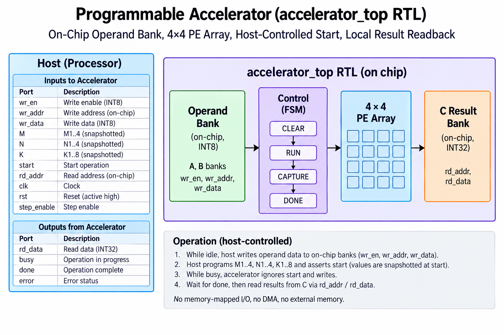
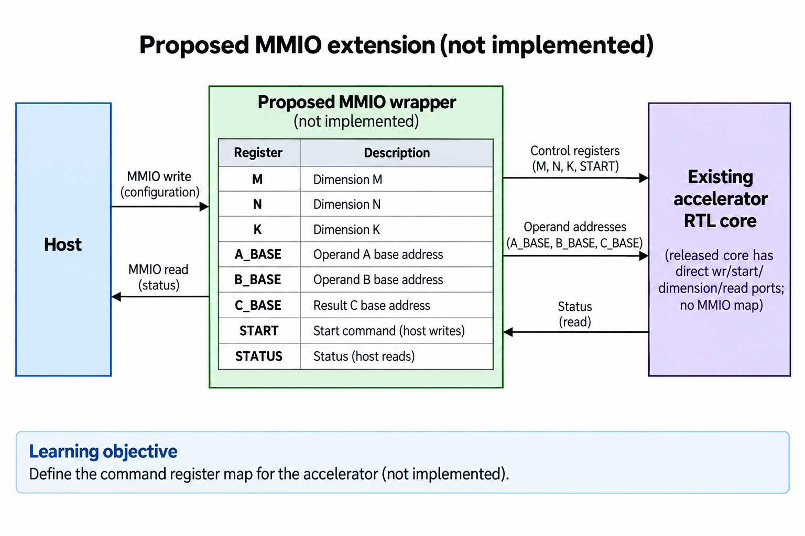
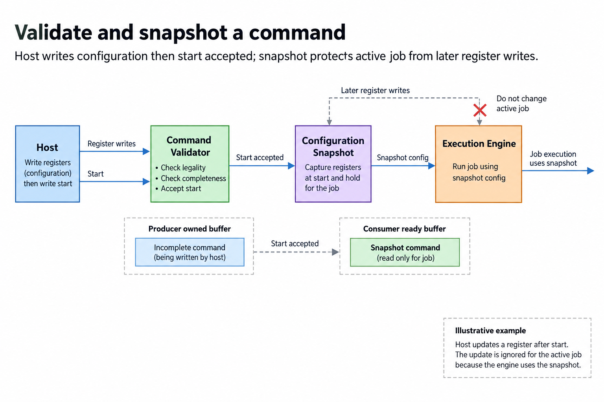
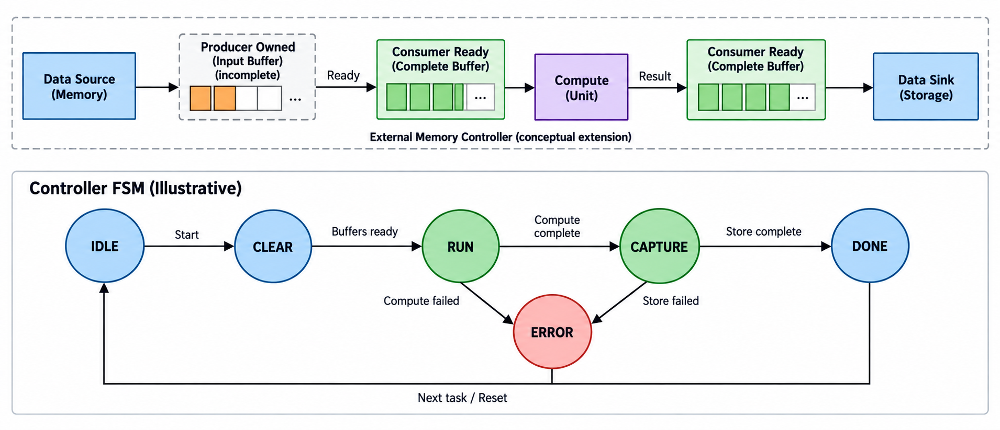
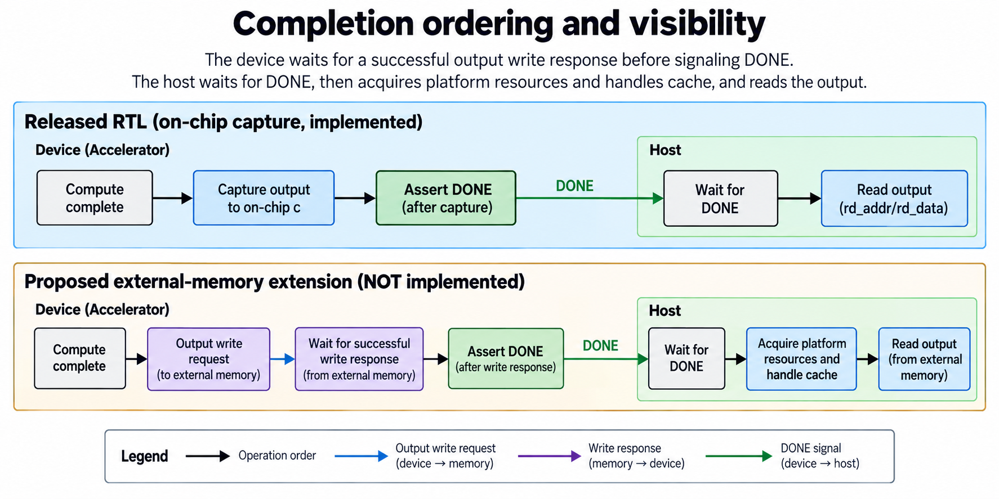
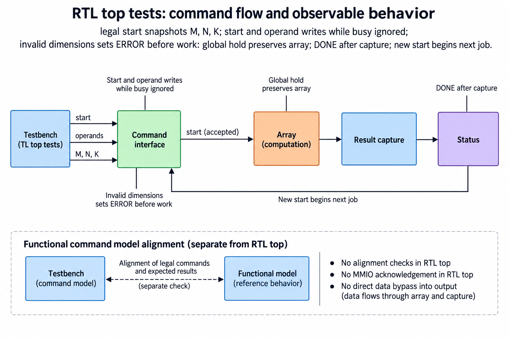

## Overview



This lesson extends one educational AI accelerator from its numerical specification toward verified RTL, FPGA integration and an ASIC implementation exercise. The overview shows this chapter's specific responsibility: Define a small register map, command sequencing, busy/done semantics and error behavior.

The shared project begins with signed INT8 operands and INT32 accumulation, grows into a 4×4 output-stationary array, and provides a verified host-loaded tile top. The larger tiled inference/transport examples are software models, while external bus, board and physical-design integration remain explicit exercises. Follow the evidence labels rather than treating every diagram as an executed hardware result.

Start after [Double Buffering: Overlap Transfers and Compute](/blog/fpga-ai-overlap-1-double-buffering/). Keep the previous fixture and source revision so this chapter's change can be checked independently.

## Deep dive

### Define the command register map



The register-map figure names source pointers, destination, dimensions, start, status and error/completion. The exact offsets and access widths belong to a versioned interface. Our software Command records the fields without claiming a physical MMIO bus.

A hardware register block must define read/write behavior, reserved fields and byte enables. START is an event or a command bit with explicit clearing semantics. DONE must remain observable long enough for the host policy.

Use one command contract across simulation and a future board transport. That makes numerical packing and lifecycle tests reusable while keeping physical bus integration separate.

### Validate and snapshot a command



The snapshot figure validates and copies fields when start is accepted. Active execution uses that snapshot, so later host writes cannot change addresses halfway through a job. Invalid ranges, zero dimensions and output alignment fail before work.

The functional model checks busy and rejects a second submission when already busy. Its synchronous execution makes busy duration short in software; an asynchronous hardware implementation needs explicit busy-write behavior and a realistic concurrency test.

Define which configuration writes are accepted during execution and whether they configure the next command. Do not rely on the host never issuing an inconvenient transaction.

### Schedule load, compute, and store



The scheduler figure orders CHECK, LOAD, COMPUTE, STORE and DONE, with an error path. Completion events, not arbitrary clock counts, cause stage transitions. A load can take longer because the bus stalls; compute can take longer because global step is blocked.

The numerical oracle is still direct matrix multiplication. Control logic can be wrong even if each PE is correct, by skipping a tile or storing early. Compare complete matrices and check addressed byte ranges.

For a first hardware implementation, use a sequential schedule before overlap. Its explicit stages provide a baseline trace. Double buffering adds concurrency only after the same command/result contract is verified.

### Completion ordering and visibility



The visibility figure delays DONE until successful output completion. A store request issued locally may still be outstanding. The host must use the platform's required cache/barrier behavior before consuming the result.

The functional model writes output bytes before setting done. It packs INT32 results little-endian. A real transport may need cache maintenance, coherent mappings or an explicit completion queue; shared physical memory does not remove ownership rules.

Time the usable completion boundary. Ending a benchmark when START is written or a store is issued measures dispatch, not complete accelerator execution.

### Test busy writes and failure recovery



The recovery figure rejects invalid commands and preserves memory. Tests include a misaligned output pointer and byte-for-byte comparison of memory after failure. That checks a useful safety/correctness property independently of numerical output.

Hardware faults after partial stores require a policy: output may be invalid, retry may not be idempotent, and a reset may have outstanding transactions. Record error status and define which buffers can be reused.

The release supplies functional command behavior and exercises. A complete hardware register/DMA controller remains an extension, with bus-specific verification and board integration. Teach that boundary explicitly rather than presenting Python objects as synthesized control RTL.

### Run this lesson

Download the [accelerator lab](/labs/fpga-ai-chip/accelerator-lab.zip), extract it and run from its directory:

```sh
python3 lessons.py control-1
python3 -m unittest discover -s tests -v
```

The first command writes `reports/control-1.json`. Inspect its scope and result together. The second runs the independent numerical, addressing and scheduling checks. To reproduce RTL evidence, install Icarus Verilog 13.0 and run `python3 scripts/verify_top.py`; that also runs the block/array tests. These commands are software/RTL checks, not board measurements.

### Source: rtl/accelerator_top.sv

This is the released executable source for this step. Preserve its stated protocol/width assumptions when adapting it.

```systemverilog
// Small complete tile accelerator. Host-load interface is not AXI/MMIO/DMA.
// A uses four padded rows of 8 bytes at addresses 0..31.
// B uses eight padded rows of 4 bytes at addresses 32..63.
module accelerator_top(input logic clk,rst,start,step_enable,wr_en,
 input logic [5:0] wr_addr,input logic signed [7:0] wr_data,
 input logic [2:0] m,n,input logic [3:0] k,input logic [3:0] rd_addr,
 output logic signed [31:0] rd_data,output logic busy,done,error);
 localparam IDLE=0,CLEAR=1,RUN=2,CAPTURE=3,FINISHED=4;
 logic [2:0] state;logic [2:0] mq,nq;logic [3:0] kq;
 logic [4:0] t;
 logic signed [7:0] amem[0:3][0:7],bmem[0:7][0:3];
 logic [31:0] a_rows,b_cols;logic [3:0] a_valid,b_valid;
 wire [511:0] results;logic signed [31:0] output_mem[0:15];
 wire clear=(state==CLEAR);wire step=(state==RUN && step_enable);
 integer i,j,q;
 assign busy=(state==CLEAR || state==RUN || state==CAPTURE);
 assign rd_data=output_mem[rd_addr];
 always_comb begin
  a_rows=0;b_cols=0;a_valid=0;b_valid=0;
  for(i=0;i<4;i=i+1)begin
   q=$signed({1'b0,t})-i;
   if(state==RUN && i<mq && q>=0 && q<kq)begin a_rows[i*8+:8]=amem[i][q];a_valid[i]=1;end
  end
  for(j=0;j<4;j=j+1)begin
   q=$signed({1'b0,t})-j;
   if(state==RUN && j<nq && q>=0 && q<kq)begin b_cols[j*8+:8]=bmem[q][j];b_valid[j]=1;end
  end
 end
 systolic_array array_core(.clk(clk),.rst(rst),.clear(clear),.step(step),
  .a_rows(a_rows),.b_cols(b_cols),.a_valid(a_valid),.b_valid(b_valid),.results(results));
 integer x;
 always_ff @(posedge clk)begin
  if(rst)begin state<=IDLE;t<=0;mq<=0;nq<=0;kq<=0;done<=0;error<=0;end
  else begin
   if(wr_en && !busy)begin
    if(wr_addr<32)amem[wr_addr>>3][wr_addr&7]<=wr_data;
    else bmem[(wr_addr-32)>>2][wr_addr&3]<=wr_data;
   end
   case(state)
    IDLE,FINISHED:if(start)begin
     done<=0;error<=0;
     if(m==0 || m>4 || n==0 || n>4 || k==0 || k>8)begin error<=1;state<=FINISHED;end
     else begin mq<=m;nq<=n;kq<=k;t<=0;state<=CLEAR;end
    end
    CLEAR:state<=RUN;
    RUN:if(step_enable)begin
     if(t==kq+5)state<=CAPTURE;
     else t<=t+1;
    end
    CAPTURE:begin
     for(x=0;x<16;x=x+1)output_mem[x]<=results[x*32+:32];
     done<=1;state<=FINISHED;
    end
    default:state<=IDLE;
   endcase
  end
 end
endmodule
```

### Verify ownership and completion, not only payload

A transfer request and a completed buffer are different states. Mark a tile READY only after the required bytes and response status are available. Keep a COMPUTE buffer owned until its last use, then permit refill. The two-buffer scheduler additionally prevents a load from overwriting the previous tile assigned to the same physical buffer.

Address calculations use bytes throughout the interface. INT8 inputs and INT32 outputs have different element widths, so a correct index with the wrong multiplier still targets the wrong memory. Validate dimensions, range, alignment and relevant overlap before issuing work. The software model checks these preconditions and preserves memory when a command is rejected.

The integrated RTL top implements fixed on-chip operand storage, validated dimensions and a globally stepped tile controller. Its host-load port is deliberately simple and is not AXI, MMIO or external DMA. The functional command/memory model teaches a broader transport contract. Connecting a real bus requires its own request/response and ordering verification.

Completion means the declared output is usable under the selected interface. An issued store, a queue entry and a successful response may represent different milestones. Keep that event explicit in status and timing. Tests should cover delayed progress, invalid commands and reset/recovery as well as the uninterrupted numerical path.

### A worked engineering decision

#### Follow the implemented tile controller exactly

The integrated top accepts host operand writes while idle into fixed padded A/B storage. A legal START snapshots M, N and K. It clears local array state, runs the required logical steps under step_enable, captures the complete packed result, and reports DONE. Its source uses a small internal sequence rather than an external DMA command queue. The simple host-load ports are not MMIO or AXI, and the diagrams distinguish a proposed broader register interface from this implemented core.

For M=N=4 and K=8, the array needs 14 logical updates. Holding step_enable during RUN retains the wavefront and the controller's logical count. Clear and capture use separate control edges. Capturing in the same scheduling region as the last accumulation, without accounting for nonblocking updates, could retain the previous sums. The explicit capture stage avoids that ambiguity. DONE describes those captured local outputs.

Dimension validation permits M,N from 1 through 4 and K from 1 through 8. An invalid start sets the declared error behavior before work. The simulation includes an invalid dimension case and checks that the top is not reported as busy or done for that rejected operation. Larger matrices use the software tiler or a future scheduler; they are not legal direct commands to this fixed-capacity interface.

#### Verify snapshot and busy policy with adversarial writes

After a legal job begins, change the live dimension inputs, assert another start and offer an operand write while the array is globally held. The accepted job must retain its original snapshot, and the offered busy write/start must be ignored under this top's policy. Continue the original logical steps and compare all 16 physical result fields with the independent expected matrix, including padded zeros. The released integrated regression executes this interference pattern across its random jobs.

Ignoring busy events is a simple local interface choice. A physical bus wrapper might instead stall a write, return an error or queue another command. It must not pretend the current top accepted the event merely because a bus transaction arrived. Define the wrapper's acceptance and response separately, and test the bridge so a caller cannot mistake discarded input for a completed update.

DONE and ERROR lifetime also need a documented policy. The top's next accepted operation re-establishes its status and numerical state according to the source. A proposed MMIO DONE acknowledgement is not implemented simply because a figure contains a register named DONE. If a wrapper adds read-to-clear or write-one-to-clear status, it introduces new sequential behavior and races to verify.

#### Design a proposed external-memory command interface

A broader command can include baseA, baseB, baseC, M, N, K and optional numerical metadata. Define each field's width, byte units and permitted layout. START should snapshot a complete validated command, protecting the active job from later register writes. Partial writes, byte enables, reserved fields and submission ordering depend on the chosen bus and belong in the interface specification before RTL is written.

Validation should happen before memory operations that rely on dimensions and addresses. Check supported shape, overflow-safe byte ranges, output alignment and prohibited overlap. The functional Python command model executes these conditions with bounded memory. A hardware register/DMA controller needs its own request, response, outstanding-operation and recovery checks; the Python objects are not synthesized control RTL.

A conceptual external sequence might CHECK, LOAD, COMPUTE, STORE and DONE. Those names explain stage dependencies but are not the actual state names of the released on-chip top. Transitions follow successful completion events, not fixed assumptions about bus latency. On load or store errors, recovery must prevent an incomplete region from becoming ready or a partial output from being reported as fully usable.

#### Make host-visible completion a real boundary

In an external-memory design, issuing an output request is not the same as receiving a successful completion. DONE must follow the declared successful output boundary. The host then performs required platform-specific acquisition/cache handling before consuming the output. Drawing cache handling after the read is too late to establish visibility. The exact operations depend on the platform and should come from its documented memory model.

A status poll needs a timeout and a distinguishable failure path. A timeout means the expected completion was not observed. It does not prove that hardware stopped or that memory is safe to reuse. A cancellation/reset operation must define what happens to outstanding requests and owned buffers. Production control complexity comes from those lifetimes as much as from the number of normal-operation states.

The current regression verifies 20 integrated signed matrix jobs, global holds, snapshot protection, busy interference and invalid dimensions in simulation. It does not execute a board driver, MMIO bus or external-memory DMA. Retain that report beside the source so future wrappers can add evidence without inflating the current scope.

The architectural result is a usable small compute controller and an explicit path to a programmable system. Keeping its implemented ports separate from the proposed transport makes the tutorial reproducible: readers can run the actual core today and know precisely which command, memory and board responsibilities remain to be built.

## Conclusion

The outcome of this chapter is a concrete project artifact and a check whose scope is stated explicitly. Preserve numerical results, transaction ordering and lifetime rules as the design grows; optimize only after the baseline is correct. Next, [Synthesize and Implement the Accelerator on an FPGA](/blog/fpga-ai-fpga-1-synthesize-and-implement-the-accelerator-on-an-fpga/) adds the next responsibility without changing the established contract.

### Sources

- [Original accelerator lab and verification evidence](https://chiaxinliang.github.io/labs/fpga-ai-chip/accelerator-lab.zip)
