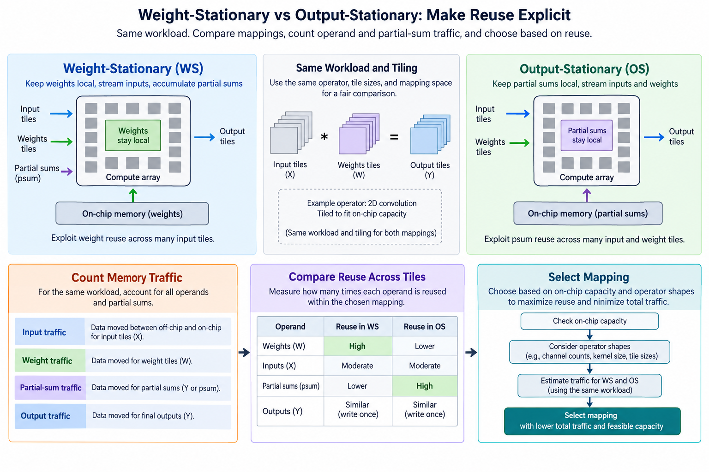
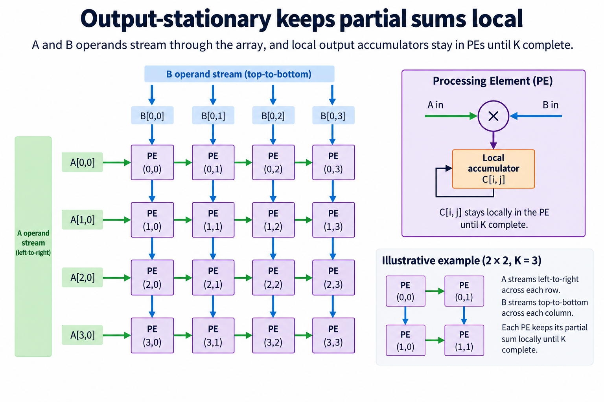
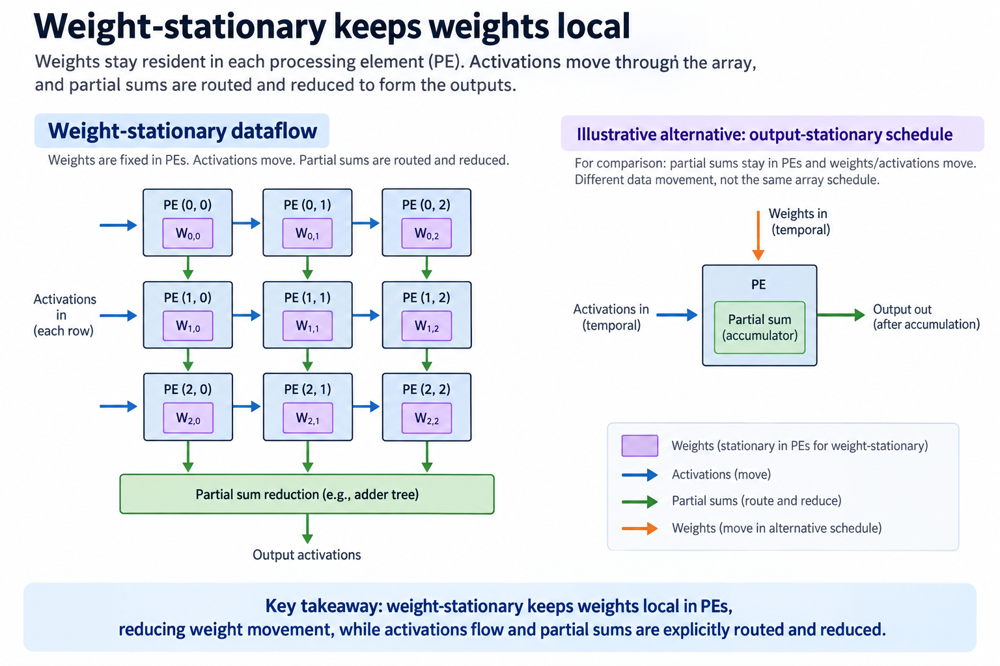
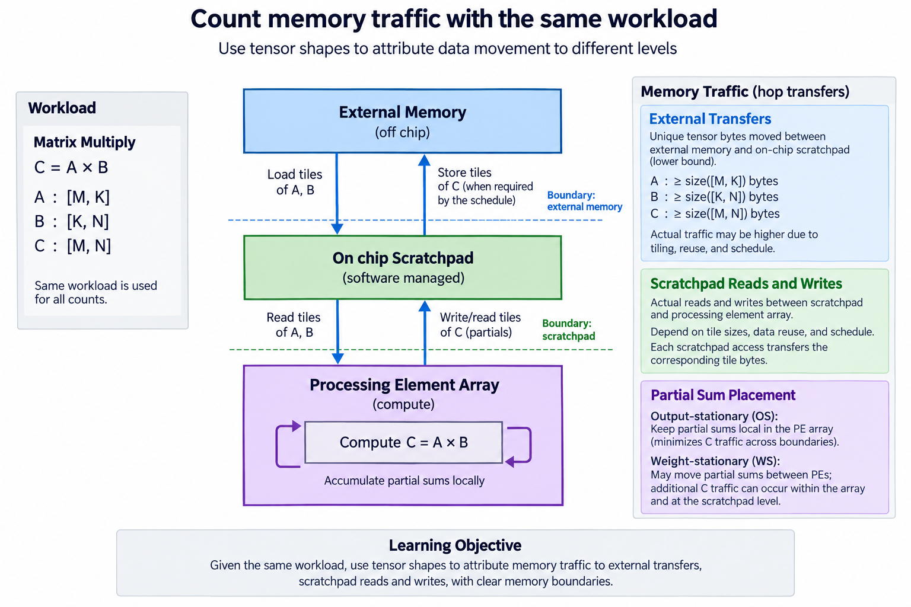
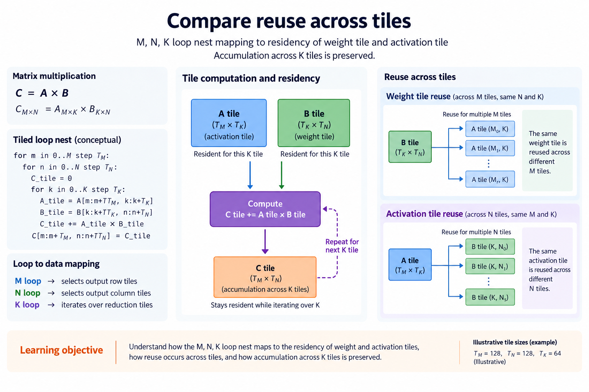
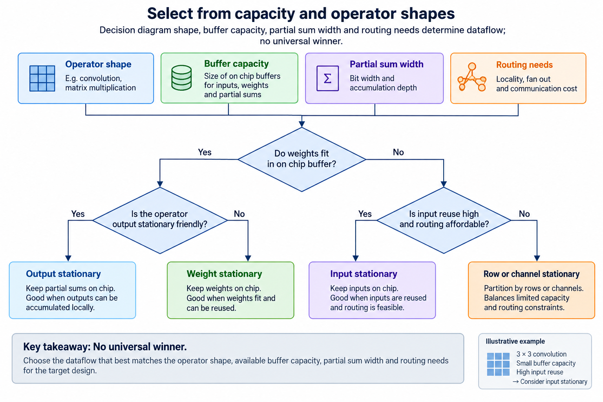

## Overview



This lesson extends one educational AI accelerator from its numerical specification toward verified RTL, FPGA integration and an ASIC implementation exercise. The overview shows this chapter's specific responsibility: Compare mappings using the same workload and account for operand and partial-sum traffic.

The shared project begins with signed INT8 operands and INT32 accumulation, grows into a 4×4 output-stationary array, and provides a verified host-loaded tile top. The larger tiled inference/transport examples are software models, while external bus, board and physical-design integration remain explicit exercises. Follow the evidence labels rather than treating every diagram as an executed hardware result.

Start after [Build a 4×4 Systolic Array and Trace Every Cycle](/blog/fpga-ai-array-1-build-a-4x4-systolic-array-and-trace-every-cycle/). Keep the previous fixture and source revision so this chapter's change can be checked independently.

## Deep dive

### Output-stationary keeps partial sums local



The output-stationary figure keeps each C element in a PE while A and B move. This is the released RTL array's dataflow. It avoids routing partial sums between cells during the local reduction, but requires operands to arrive in the correct skewed order.

Local accumulation does not mean the complete model fits locally. K chunks and multiple output tiles still need a schedule, and weights may be refilled between tiles. Name which boundary holds the output and for how long.

State the advantage as a traffic/ownership property, not a universal speedup. For some shapes, keeping outputs local reduces expensive partial-sum movement; for others, weight reuse across many input rows becomes more important.

### Weight-stationary keeps weights local



The weight-stationary figure describes an alternative where weights remain resident and activations/partial results move under another schedule. It is conceptual: the released OS array is not silently reconfigured into WS by changing one label.

A legal WS implementation must define how a partial sum reaches the right accumulator and how weights are loaded/replaced. Its ports, links and pipeline state can differ. Reusing a weight without accounting for partial-sum traffic produces an incomplete comparison.

Compare both against the same mathematical oracle and workload. Then count traffic at the same boundaries. A future WS exercise should implement its own schedule and verification rather than use an OS simulation result as WS evidence.

### Count memory traffic with the same workload



The ledger figure distinguishes external bytes, local buffer reads and forwarded operands. For a 4×4 tile with K=8, inputs loaded once occupy 64 bytes and final INT32 output occupies 64. Naively reading two INT8 operands for every MAC creates 256 input payload bytes, before output storage.

These are different access strategies for the same 128 useful products. A cache or local buffer may change which reads reach external memory, so source-code loads are not automatically HBM traffic. The ledger needs an explicit residency assumption.

Count scale metadata and temporary buffers where relevant. Keep bandwidth rates separate from byte counts until a schedule and measurement boundary are known.

### Compare reuse across tiles



The loop-mapping figure orders output row tiles, output column tiles and K chunks. Keeping one B tile across several A row tiles can reuse weights; keeping an output partial sum across K chunks avoids repeated output movement. Capacity and lifetime determine whether both are possible.

Changing loop order preserves matrix multiplication only when the partial-sum semantics remain correct. Applying ReLU after each K chunk breaks the operation for mixed positive/negative contributions. Conversion may also change rounding if done too early.

Use irregular shapes to test every loop boundary. A loop ordering that works for square multiples of 4 can still omit the final row or reduction chunk.

### Select from capacity and operator shapes



The choice figure combines shape, capacity, port demand and routing. No dataflow name is best for every operator. A tall matrix, a wide matrix and a short reduction expose different reuse opportunities.

Before selecting a mapping, estimate all simultaneously live storage and count accesses per bank per step. If the array requires four operands while one memory port supplies one, the mapping needs banking, staging or a slower step rate.

The practical result is an evidence-backed design choice. Keep the released OS baseline correct, implement an alternative separately, then compare useful work, traffic and timing under the same contract. Analytical ledgers guide the experiment but are not measured hardware results.

### Run this lesson

Download the [accelerator lab](/labs/fpga-ai-chip/accelerator-lab.zip), extract it and run from its directory:

```sh
python3 lessons.py dataflow-1
python3 -m unittest discover -s tests -v
```

The first command writes `reports/dataflow-1.json`. Inspect its scope and result together. The second runs the independent numerical, addressing and scheduling checks. To reproduce RTL evidence, install Icarus Verilog 13.0 and run `python3 scripts/verify_top.py`; that also runs the block/array tests. These commands are software/RTL checks, not board measurements.

### Preserve the complete matrix operation

Keep logical dimensions separate from the physical array. The 4×4 engine computes tiles, while the software tiler covers larger matrices and K chunks. A boundary tile's inactive locations are not useful output elements. Masks and store bounds must preserve the allocated logical tensor even if the internal engine computes padded positions.

Initialize a new output reduction once, combine every required contribution, and apply bias/activation/conversion only at the specified final stage. ReLU does not distribute over partial sums. A premature quantization can also change rounding and cancellation. Use mixed-sign fixtures so these mistakes cannot hide behind positive-only inputs.

Count traffic at named boundaries. External tensor bytes, local RAM reads, register access and forwarded operands are different quantities. Reuse that avoids a host or external-memory load can still create heavy local traffic. A dataflow comparison needs the same shapes, types, numerical output and storage assumptions.

The direct matrix oracle remains independent of the systolic timing trace. Use the trace to debug alignment and the oracle to verify the final result. Global stalls consume clocks without changing logical step; maintain that distinction in both the driver and the array. Once the complete tile contract is correct, measure its useful work and integration overhead separately.

### A worked engineering decision

#### Compare 2 schedules without changing the operation

Stationary names identify which values remain at a chosen local boundary while other work proceeds. In the released output-stationary array, C partial sums remain in PE registers while A and B move through forwarding paths. A weight-stationary alternative retains weights locally while activations and partial sums follow another schedule. The labels do not by themselves determine external traffic, because tiling and residency at larger memory boundaries still matter.

Use the same logical M, N and K and the same input/output types for a comparison. If 1 mapping computes a convolution and another computes a different matrix shape, you cannot credit the traffic difference to stationarity alone. Likewise, changing the accumulator width or applying activation earlier changes the numerical contract. Keep the complete operator and epilogue fixed before comparing storage and movement.

For a 4×4 output with K=8 and INT8 A/B plus INT32 C, unique external tensor bytes are 32+32+64=128 under a one-load/one-final-store assumption. That is a lower-bound ledger for this operation, not the automatic traffic of every schedule. Reloading A across N tiles, reloading B across M tiles or spilling partial sums adds bytes. A mapping can keep C local at a PE while repeatedly loading the same input from another boundary.

#### Account for useful reuse at named boundaries

A weight block B[k-range,j-range] can be reused across different output row blocks with the same reduction and output-column ranges. An activation block A[i-range,k-range] can be reused across output-column blocks with the same row and reduction ranges. Loop order decides which opportunity is convenient, while local capacity decides whether the block can actually stay resident. A mathematical reuse opportunity is not a storage guarantee.

Changing the loop order to retain B across more M tiles can increase the number of live C tiles or force partial sums to another storage boundary. Keeping those sums needs capacity and access ports. If they spill, count both reads and writes of the INT32 partial state. The saved INT8 weight bytes may not outweigh the added wide partial-sum traffic. This is why the traffic ledger includes inputs, weights, partial sums and final outputs separately.

PE-hop transfers are another quantity. Forwarding 1 A value across several columns creates several local hop events even if it was loaded externally only once. The count depends on physical tile dimensions, masks and schedule; it is not simply the number of elements in the logical A tensor. OS local sums do not create the same partial-sum forwarding as a WS reduction path. Keep physical movement counts separate from unique tensor storage.

#### Use lifetime to test whether the proposed reuse is feasible

Draw when a block is loaded, when each consumer reads it and when its final consumer releases it. A block marked resident cannot share its physical space with a newly loaded block before that release. Add the simultaneously live operands and accumulators to the capacity budget. Double buffering deliberately increases live storage to overlap work; it is not a free reuse mechanism.

Ports matter as well as bytes. A memory large enough for 2 blocks may still lack the reads needed to supply all PE lanes in a logical step. Banking can create parallel access, but a bank mapping can collide under a particular stride. Resource feasibility therefore includes storage size, port count, read latency and routing. An attractive reuse ratio without those obligations is an incomplete architecture comparison.

The lesson's software ledger makes the counting assumptions explicit, while the released RTL implements only OS. It does not include a verified WS array that can be benchmarked against OS in hardware. Readers can implement that alternative as an extension, but must preserve the operator, numerical oracle and complete traffic boundary. Label an analytical comparison as such rather than implying a measured energy result.

#### Select a dataflow with an auditable cost model

A useful cost model can weight external bytes, local reads/writes, register updates and PE-hop movement using assumptions from a selected target. Without target energy data, report raw event counts instead of invented joules. The best mapping can change with shape, batch size, available storage and the relative costs of those events. There is no universal winner selected by a single “weights fit” question.

Inspect complete latency too. A schedule that minimizes bytes may serialize computation, require an extra reduction phase or increase command setup. Conversely, a schedule with more local movement may reduce expensive external traffic and improve overall completion. Compare the same correctness and timing boundaries and retain the assumptions beside the result.

The architectural lesson is to make reuse concrete. Specify the value, its residence boundary, its consumers and the movement avoided. Then verify that the schedule has enough capacity and ports to deliver it. This turns a stationarity slogan into a design decision you can implement and test, while keeping the 4×4 OS engine as an unchanged numerical baseline.

## Conclusion

The outcome of this chapter is a concrete project artifact and a check whose scope is stated explicitly. Preserve numerical results, transaction ordering and lifetime rules as the design grows; optimize only after the baseline is correct. Next, [Matrix Tiling: Run Problems Larger Than the Array](/blog/fpga-ai-tile-1-matrix-tiling/) adds the next responsibility without changing the established contract.

### Sources

- [Original accelerator lab and verification evidence](https://chiaxinliang.github.io/labs/fpga-ai-chip/accelerator-lab.zip)
