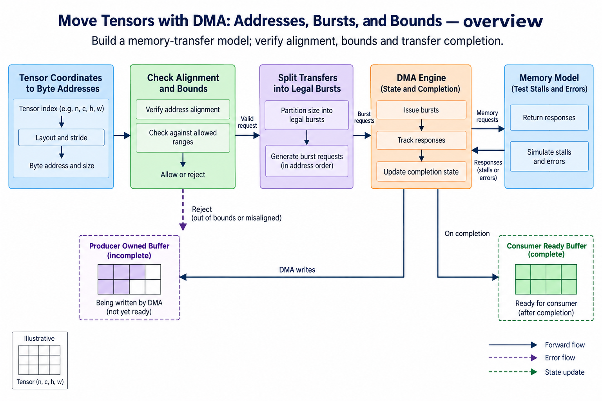
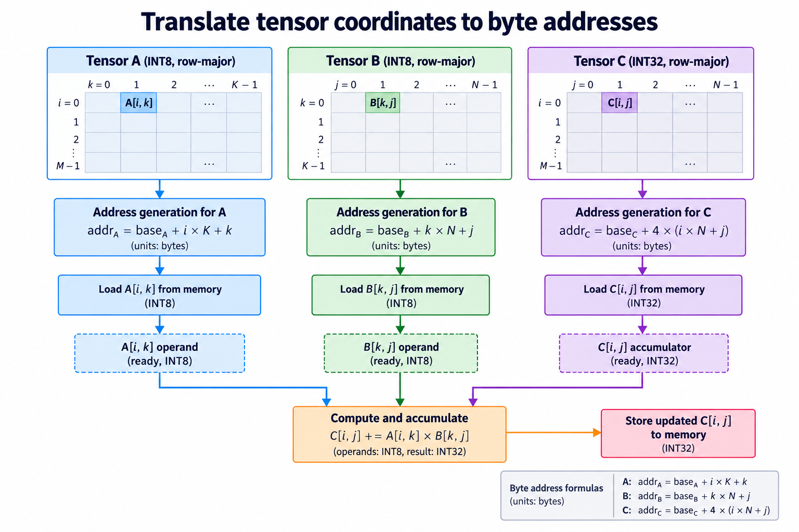
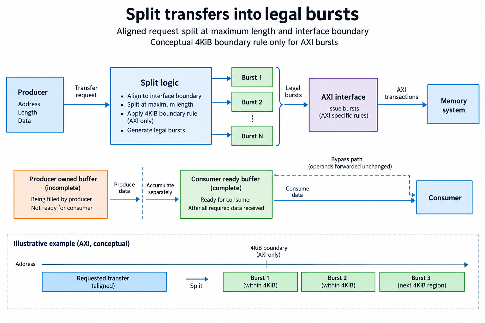
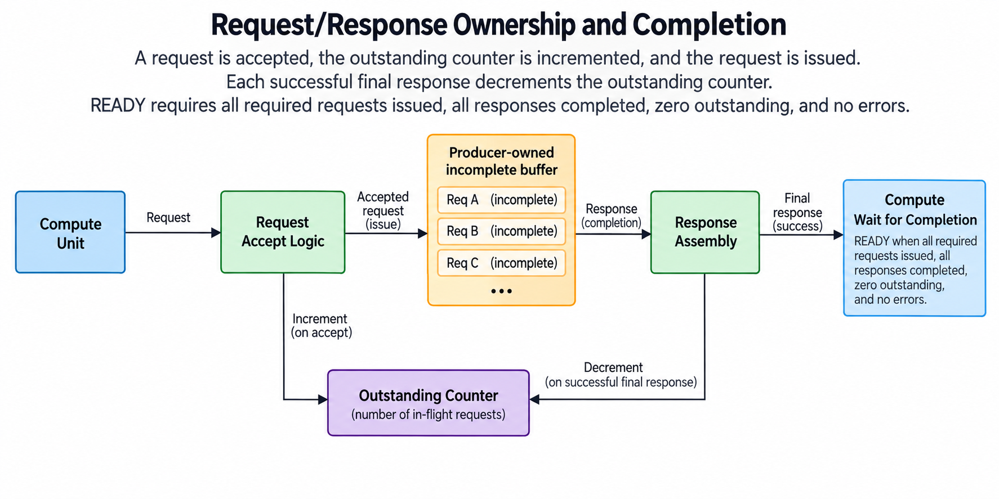
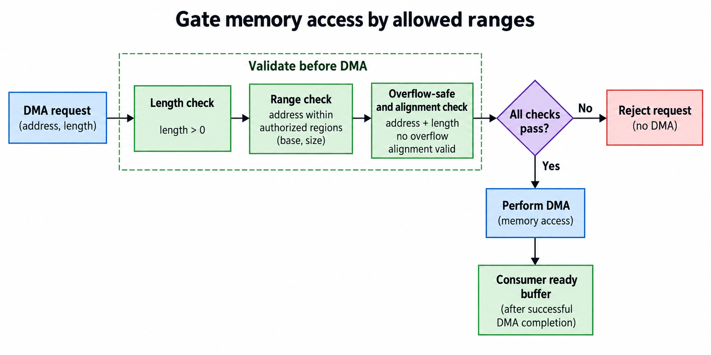
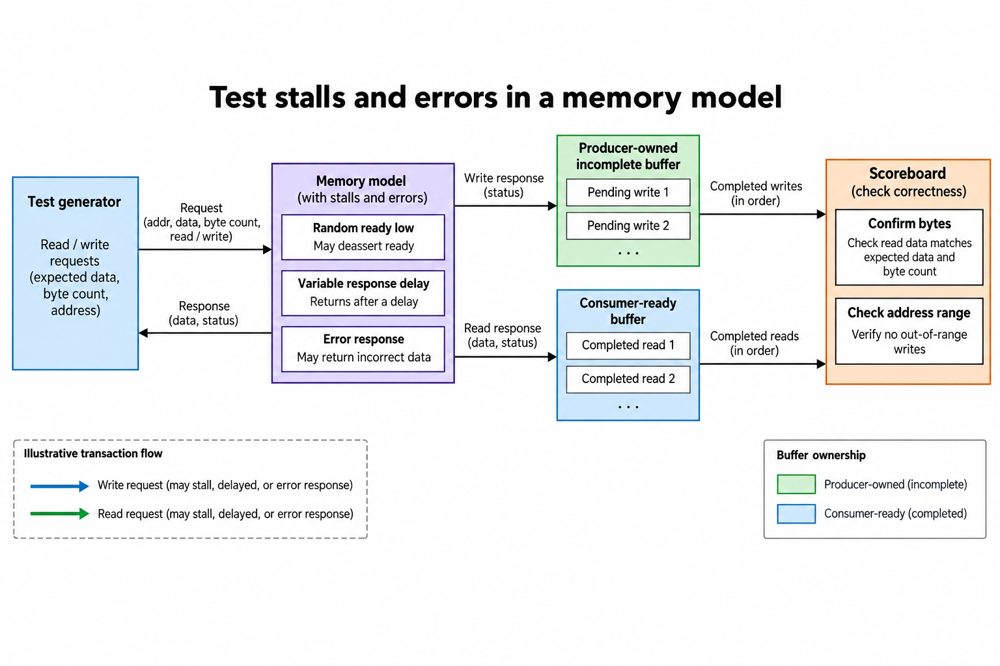

## Overview



This lesson extends one educational AI accelerator from its numerical specification toward verified RTL, FPGA integration and an ASIC implementation exercise. The overview shows this chapter's specific responsibility: Build a memory-transfer model; verify alignment, bounds and transfer completion.

The shared project begins with signed INT8 operands and INT32 accumulation, grows into a 4×4 output-stationary array, and provides a verified host-loaded tile top. The larger tiled inference/transport examples are software models, while external bus, board and physical-design integration remain explicit exercises. Follow the evidence labels rather than treating every diagram as an executed hardware result.

Start after [On-Chip Buffers: FPGA BRAM, Banking, and Port Conflicts](/blog/fpga-ai-buffer-1-on-chip-buffers/). Keep the previous fixture and source revision so this chapter's change can be checked independently.

## Deep dive

### Translate tensor coordinates to byte addresses



The address figure converts tensor coordinates to byte addresses. INT8 input offsets use i*K+k, while INT32 output offsets use 4*(i*N+j). The base pointer and every offset share byte units. A hardware bus needs enough width for the validated result.

The bounded Memory model rejects negative addresses, invalid alignment and ranges exceeding its allocated byte array. Its subtraction-based end check avoids treating wrapped address addition as valid. This is a functional access model, not an IOMMU or a complete security boundary.

A real DMA engine adds request/response state and a documented bus interface. Keep the numerical packing contract identical so the simulated host transport can test the integration without becoming a fake hardware driver.

### Split transfers into legal bursts



The burst figure divides one byte range into legal interface requests. The exercise starts at address 4080 with length 600 and maximum 256 bytes per burst. An AXI-style 4-KiB boundary forces the first request to stop after 16 bytes, followed by 256,256 and 72 bytes.

The 4-KiB rule is AXI-specific, not a universal property of all DMA protocols. A real interface also constrains beat size, alignment, length encoding and responses. This simple splitter models byte coverage only.

Verify that requests are contiguous, cover exactly the requested bytes and never cross the configured 4-KiB boundary. A correct total count can still hide a duplicated or skipped range if you do not check addresses.

### Responses and completion are state



The completion figure distinguishes a request accepted by a bus from data successfully delivered. A load becomes READY only after all required response beats and status checks. A store's completion must mean the chosen visibility contract is satisfied.

Outstanding requests need identifiers or ordering guarantees compatible with the bus. Variable response delay is normal behavior, not a reason to advance the tile counter early. Error responses must invalidate the affected tile and produce a defined recovery state.

Our functional Accelerator completes its synchronous memory operation before setting done. It does not implement concurrent RTL requests. A hardware extension must preserve that behavior through an explicit outstanding counter and documented response handling.

### Gate memory access by allowed ranges



The bounds figure checks address, length and alignment before movement. The command model also rejects output overlap with its live input regions, avoiding an in-place overwrite during calculation. Input and weight overlap is allowed only because both are read-only in this model.

Validate dimensions before multiplying them into transfer lengths. Finite-width hardware arithmetic can overflow even when individual dimensions look plausible. Restrict supported sizes or use sufficiently wide checked calculations.

An invalid command should fail before modifying memory. The test retains a byte-for-byte snapshot and verifies no output write after a rejected misaligned request. Real bus faults after partial progress need additional documented recovery semantics.

### Test stalls and errors in a memory model



The test figure adds stalls, delayed responses and errors to the hardware design plan. The released executable splitter and bounded functional transport test addressing and byte conservation; they do not claim RTL AXI simulation.

When implementing RTL DMA, build a response-capable bus model and scoreboard accepted bytes. Randomize ready and response timing separately. Check that reset cancels or drains outstanding work according to the actual interface.

The outcome is a precise transfer contract and executable addressing exercises. Integrate a supported board DMA IP or implement the bus protocol only after deciding its complete request/response behavior. A byte copy in Python is not evidence that the hardware transport works.

### Run this lesson

Download the [accelerator lab](/labs/fpga-ai-chip/accelerator-lab.zip), extract it and run from its directory:

```sh
python3 lessons.py dma-1
python3 -m unittest discover -s tests -v
```

The first command writes `reports/dma-1.json`. Inspect its scope and result together. The second runs the independent numerical, addressing and scheduling checks. To reproduce RTL evidence, install Icarus Verilog 13.0 and run `python3 scripts/verify_top.py`; that also runs the block/array tests. These commands are software/RTL checks, not board measurements.

### Verify ownership and completion, not only payload

A transfer request and a completed buffer are different states. Mark a tile READY only after the required bytes and response status are available. Keep a COMPUTE buffer owned until its last use, then permit refill. The 2-buffer scheduler additionally prevents a load from overwriting the previous tile assigned to the same physical buffer.

Address calculations use bytes throughout the interface. INT8 inputs and INT32 outputs have different element widths, so a correct index with the wrong multiplier still targets the wrong memory. Validate dimensions, range, alignment and relevant overlap before issuing work. The software model checks these preconditions and preserves memory when a command is rejected.

The integrated RTL top implements fixed on-chip operand storage, validated dimensions and a globally stepped tile controller. Its host-load port is deliberately simple and is not AXI, MMIO or external DMA. The functional command/memory model teaches a broader transport contract. Connecting a real bus requires its own request/response and ordering verification.

Completion means the declared output is usable under the selected interface, and an issued store, a queue entry and a successful response may represent different milestones, so keep that event explicit in status and timing and cover delayed progress, invalid commands and reset/recovery in tests as well as the uninterrupted numerical path.

### A worked engineering decision

#### Derive each transfer from byte-level tensor layout

For compact row-major matrices, INT8 A[i,k] uses baseA+i×K+k and INT8 B[k,j] uses baseB+k×N+j. INT32 C[i,j] uses baseC+4×(i×N+j). Keep all resulting addresses in bytes. A shape or element index is not itself a DMA address, and the input and output element sizes differ. A transfer descriptor must also declare byte length and the permitted memory region.

The functional Memory model provides bounded byte reads and writes, while the Accelerator command model validates the complete operation before performing it. These models do not implement an RTL AXI master or a physical board transport. The burst exercise teaches an AXI-style 4-KiB boundary rule as a separate scheduling constraint. Do not mistake it for proof that a hardware DMA engine has passed a bus protocol regression.

Use a transfer starting at byte address 4080 with length 600 and a maximum chunk of 256 bytes. The splitter produces lengths 16,256,256,72 at addresses 4080,4096,4352,4608. The lengths sum to 600, addresses are contiguous and no chunk crosses its selected 4-KiB region. The first short chunk arises from the boundary, not from a missing tensor element. Reconstruct the original byte interval from the chunks as an independent check.

#### Validate before issuing memory work

Check positive length where required, alignment, supported dimensions and complete address ranges before access. In finite-width hardware, computing address+length can overflow; the range check must use an overflow-safe formulation or sufficient widened arithmetic. The Python model's unbounded integers avoid that representation overflow, but a hardware port cannot rely on Python behavior. Declare the address width and validate the corresponding limits in an RTL extension.

Output overlap restrictions protect required input values. If C writes overlap unread A or B bytes, a naive execution can change later operands. The released command model rejects its prohibited output overlap before writes. A design intentionally supporting in-place operations needs a schedule or staging that proves the original operands remain available. Calling an overlap “supported” without that lifetime proof changes correctness, not merely performance.

Every access must pass the validator. A direct bypass from a raw request into memory defeats the range and alignment checks even if another arrow follows the validated path, so in a diagram, show a single gated access branch and a rejection branch that performs no memory operation. In a test, preserve sentinel bytes and compare the entire relevant memory region after an invalid command, not just its error flag.

#### Distinguish issued, accepted and completed transfers

A request can be offered while the interface is blocked, accepted into an outstanding queue, and completed later by responses. Those are separate events. Increment an outstanding counter on actual request acceptance and decrement on the appropriate final completed response. READY additionally requires that all required requests were issued and succeeded. An initially zero counter does not prove a tile has been loaded.

Keep response status beside returned data. A short or errored fill cannot become a complete buffer merely because its last observed beat arrived. Assembly must account for expected bytes and the interface's declared response semantics. A future external-memory implementation needs recovery rules for partial writes and canceled commands; the functional model supplies deterministic behavior but not those physical bus details.

A consumer waits for successful fill completion before reading operands, the producer owns LOAD storage until it marks READY, and a separate buffer can be computed while the next fill is outstanding, but the corresponding live buffer cannot be overwritten, which is why the upcoming double-buffer schedule shows the lifetime constraints without treating accepted requests as instantly usable data.

#### Build a transport regression with explicit fault categories

First compare a legal transfer's exact bytes, including signed INT8 bit patterns and wider output decoding. Then insert offered-request stalls and delayed responses while retaining the same accepted sequence. Confirm that the output is unchanged and completion is delayed appropriately. For an RTL bus extension, random stimulus must obey stable-payload and channel requirements so a failure can be traced to the component under test.

Add range, alignment, length and prohibited-overlap rejection fixtures. Add response errors and truncated completion to the proposed transport model with declared expected behavior. The current bounded-memory and splitter tests check their implemented contracts; they do not claim a cycle-accurate memory response simulator exists when only a functional path was executed. Keep planned faults and executed evidence distinguishable.

Retain addresses, chunk lengths, accepted/completed event logs and raw payloads. A final matrix mismatch could arise from signed interpretation, stride, burst omission, duplicated bytes or arithmetic. A byte-level transfer ledger identifies the first wrong boundary before the array is blamed. That makes the memory path independently testable.

The architectural benefit of DMA is moving data without requiring the host to execute every byte operation, and its cost includes descriptors, setup, queueing, bandwidth and completion handling, all of which should be measured only with a concrete transport and timing boundary, so this lesson supplies a bounded functional contract and a verified burst decomposition, preparing an RTL/board extension without reporting an unperformed hardware offload.

## Conclusion

The outcome of this chapter is a concrete project artifact and a check whose scope is stated explicitly. Preserve numerical results, transaction ordering and lifetime rules as the design grows; optimize only after the baseline is correct. Next, [Double Buffering: Overlap Transfers and Compute](/blog/fpga-ai-overlap-1-double-buffering/) adds the next responsibility without changing the established contract.

### Sources

- [Original accelerator lab and verification evidence](https://chiaxinliang.github.io/labs/fpga-ai-chip/accelerator-lab.zip)
