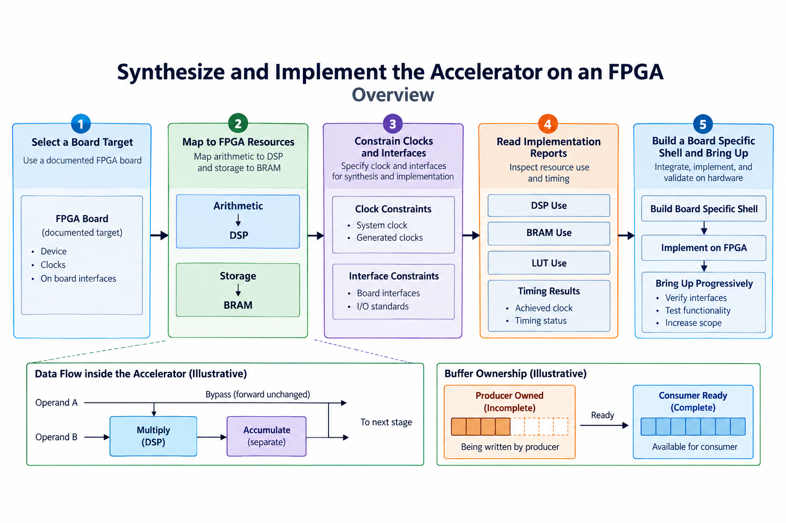
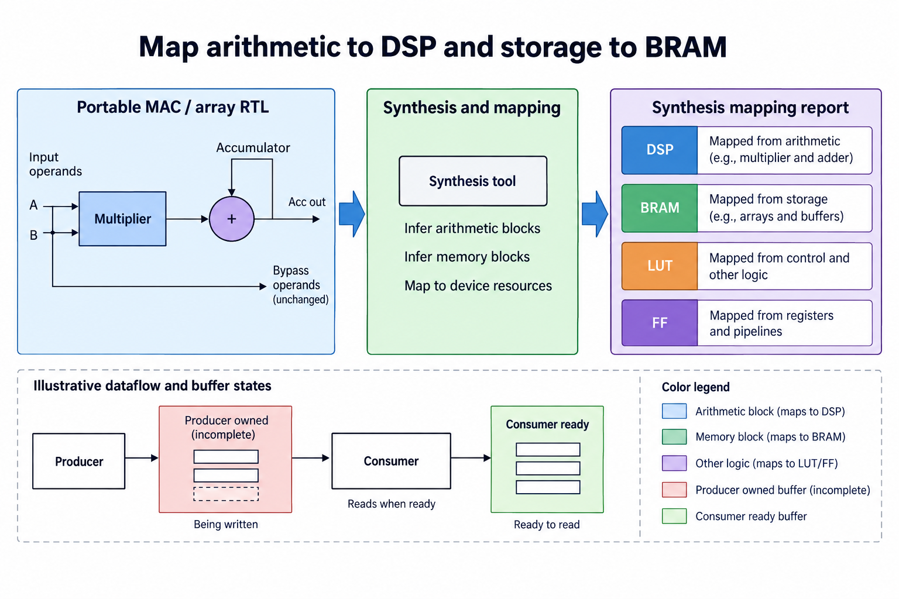
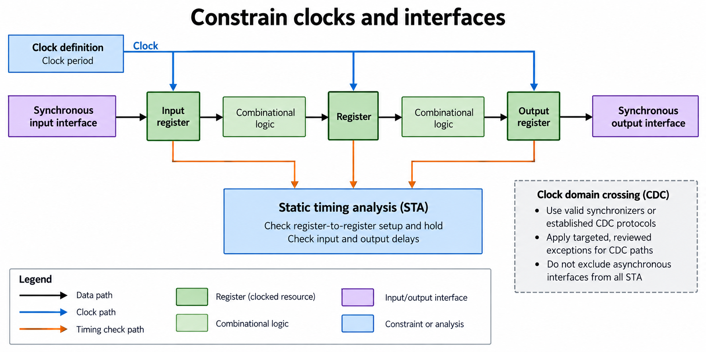
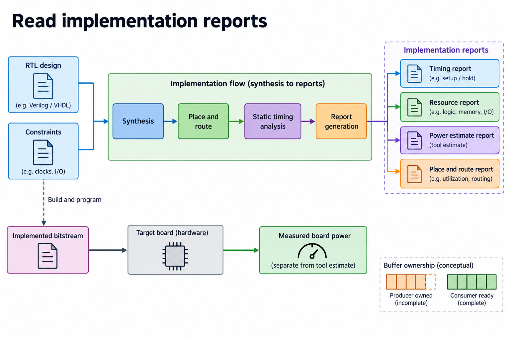
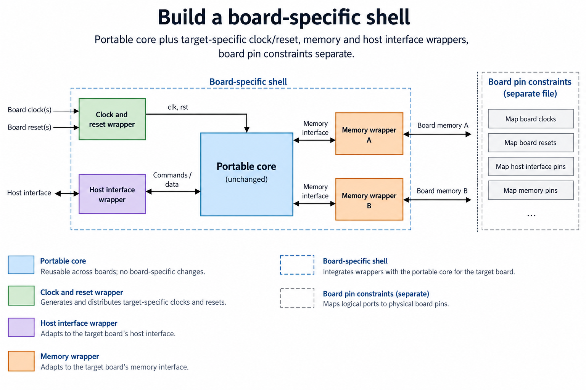
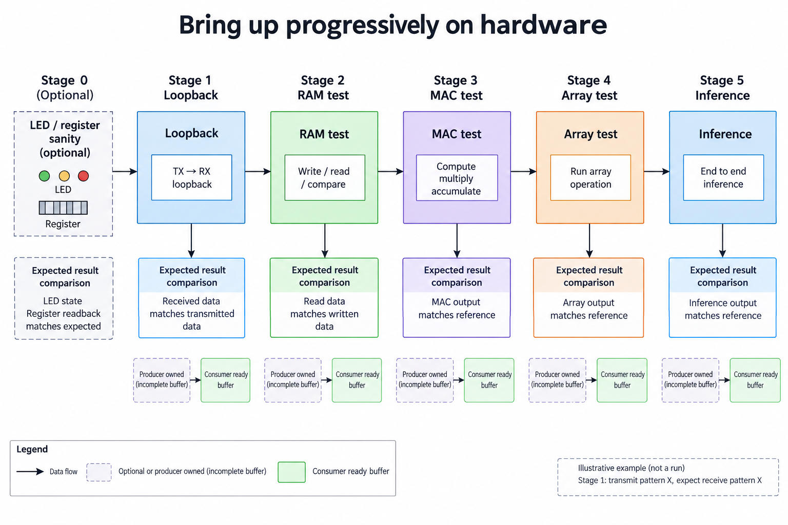

## Overview



This lesson extends one educational AI accelerator from its numerical specification toward verified RTL, FPGA integration and an ASIC implementation exercise. The overview shows this chapter's specific responsibility: Select a documented board target, constrain the clock and inspect DSP/BRAM/LUT use and timing.

The shared project begins with signed INT8 operands and INT32 accumulation, grows into a 4×4 output-stationary array, and provides a verified host-loaded tile top. The larger tiled inference/transport examples are software models, while external bus, board and physical-design integration remain explicit exercises. Follow the evidence labels rather than treating every diagram as an executed hardware result.

Start after [Command Registers and Scheduling: Make the Accelerator Programmable](/blog/fpga-ai-control-1-command-registers-and-scheduling/). Keep the previous fixture and source revision so this chapter's change can be checked independently.

## Deep dive

### Map arithmetic to DSP and storage to BRAM



The resource figure maps portable compute to a selected FPGA's synthesis resources. Multipliers may use DSPs, sums use arithmetic/state, and staged memories may map to BRAM or logic. The exact mapping is a report result, not a source-code promise.

The supplied Tcl targets xc7a35tcsg324-1 by default and allows FPGA_PART override. This is a generic part-level core exercise, not a recommended board purchase or an integrated pinout.

Run synthesis and inspect DSP/LUT/FF counts. If an arithmetic operator maps unexpectedly, check width, signedness, pipelining and constraints before forcing a primitive. Preserve the verified numerical contract when changing mapping.

### Constrain clocks and interfaces



The constraint figure defines a clock and interface delays for timing analysis. The exercise uses an illustrative 10-ns clock with 2-ns input/output delays. Those numbers are target constraints, not an achieved frequency measurement.

A board shell needs the actual oscillator, generated clocks, I/O timing and reset handling. Unconstrained paths invalidate a timing conclusion. False-path exceptions require a legitimate asynchronous or nonfunctional path, not a desire to hide failures.

The globally stepped core has one local clock. Connecting another domain requires a suitable CDC design. A single-bit synchronizer is not enough for an arbitrary changing multi-bit tensor bus.

### Read implementation reports



The implementation figure proceeds through synthesis, optimization, placement and routing. The script writes utilization, timing and power-estimate reports plus a routed checkpoint. Post-route timing includes wire effects absent from behavioral simulation.

Read slack and unconstrained-path warnings before calling a target met. Tool-estimated power depends on activity assumptions and models; it is different from measured board power. Keep those labels in benchmark output.

Vivado has not been executed in this release, and no FPGA board measurement is reported. The script is a documented core-only exercise. Readers running it must retain tool version, part, constraints and generated evidence.

### Build a board-specific shell



The shell figure connects the core to board clocks/reset, memory and host I/O. A working array alone cannot receive a host matrix or return a result through a physical connector. Pin constraints and interface IP belong to the selected board/system.

The released build is out-of-context and does not generate a board-ready bitstream. Adapt a documented shell and verify its clock/reset and transport separately. The functional host model is a reference for byte packing and commands, not a physical driver.

Bring-up benefits from a staged plan: register access, transfer loopback, memory test, MAC fixture, array fixture and small inference. Each step has a known expected result.

### Bring up progressively on hardware



The progressive-test figure reduces ambiguity during hardware bring-up. Confirm clock/reset first, then data transport, then numerical work. A failing full network can otherwise hide a clock, packing or arithmetic defect.

Use the same 2×2 matrix fixture and compare all 4 INT32 values. Add signed and irregular shapes only after the simple path works. Retain the exact bitstream/checkpoint and board/tool versions with results.

This lesson produces an implementation procedure and evidence checklist. A routed core checkpoint, board-loaded bitstream and measured inference are distinct milestones. Report a milestone only after it has been executed and checked.

### Run this lesson

Download the [accelerator lab](/labs/fpga-ai-chip/accelerator-lab.zip), extract it and run from its directory:

```sh
python3 lessons.py fpga-1
python3 -m unittest discover -s tests -v
```

The first command writes `reports/fpga-1.json`. Inspect its scope and result together. The second runs the independent numerical, addressing and scheduling checks. To reproduce RTL evidence, install Icarus Verilog 13.0 and run `python3 scripts/verify_top.py`; that also runs the block/array tests. These commands are software/RTL checks, not board measurements.

### Source: fpga/build.tcl

This is the released executable source for this step. Preserve its stated protocol/width assumptions when adapting it.

```tcl
# Core-only out-of-context implementation. No board pins or bitstream claim.
set lab [file normalize [file join [file dirname [info script]] ..]]
set part xc7a35tcsg324-1
if {[info exists ::env(FPGA_PART)]} {set part $::env(FPGA_PART)}
file mkdir [file join $lab reports fpga]
read_verilog -sv [list [file join $lab rtl pe.sv] [file join $lab rtl systolic_array.sv] [file join $lab rtl accelerator_top.sv]]
synth_design -top accelerator_top -mode out_of_context -part $part
create_clock -name core_clk -period 10.0 [get_ports clk]
set_input_delay 2.0 -clock core_clk [get_ports -filter {DIRECTION == IN && NAME != clk}]
set_output_delay 2.0 -clock core_clk [get_ports -filter {DIRECTION == OUT}]
opt_design
place_design
route_design
report_utilization -file [file join $lab reports fpga utilization.rpt]
report_timing_summary -file [file join $lab reports fpga timing.rpt]
report_power -file [file join $lab reports fpga power_estimate.rpt]
write_checkpoint -force [file join $lab reports fpga accelerator_routed.dcp]
```

### Retain a reproducible integration boundary

The released project verifies software and RTL simulation. Its FPGA Tcl is a core-only out-of-context implementation exercise, and the host transport is a functional model. A board-ready system additionally needs documented clock/reset, pins, memory and physical host I/O. Select those for a real target and retain their versions before claiming a working board application.

Bring up the simplest observable path first. Check register or transport access, then a transfer loopback, memory behavior and a small known matrix. Compare raw bytes and wider signed results before running the tiny MLP. If a complete inference fails, intermediate values should identify the first wrong layer rather than leaving arithmetic, packing and clocks mixed together.

Measure the boundary that matters to the application. Device compute time, load/compute/store and host end-to-end latency include different work. Count useful products separately from masked slots and elapsed clocks. Cold setup, warm repetitions and concurrent system load also need separate labels.

Tool-estimated power and physical board measurements are different evidence. The release intentionally contains no fabricated FPGA throughput or power values. Save raw implementation/measurement reports when those steps are actually performed, together with source revision, device, constraints and timing convention. That makes follow-up results comparable with the verified numerical baseline.

### A worked engineering decision

#### Choose the implementation target before interpreting reports

The supplied Tcl targets the integrated accelerator_top in out-of-context mode. Its default FPGA part is xc7a35tcsg324-1, which can be overridden with FPGA_PART. This selects a device for a core implementation exercise; it does not select a complete board, physical host interface or board-specific pin mapping. A real board shell must use its documented part, clock source, reset behavior, I/O standards and permitted electrical connections.

Pin a Vivado version and retain the exact Tcl, RTL and part string with the run. Execute the batch command from a clean extracted lab and save its console output and generated reports. The release has not executed Vivado, so no utilization, achieved timing or power estimate is reported as an obtained result. A reader running the flow should record those artifacts rather than filling a table with expected numbers from the diagram.

The initial clock period is an illustrative 10 ns, with illustrative 2-ns input/output delays for the core boundary. Those values create a constrained exercise, not a statement about a board's actual source and receiving devices. Replace them with justified interface requirements when integrating a board. Missing constraints can make a timing report appear successful while paths important to the system were never analyzed.

#### Read resource mapping as an implementation result

The source declares signed arithmetic and behavioral storage. Synthesis can infer DSP resources, LUT/flip-flop structures or memory resources according to the target and access pattern. An array large enough to hold operands does not automatically infer BRAM if its concurrent reads do not match a supported port configuration. Inspect actual mapped cells and reports rather than using the RTL variable name to classify the physical resource.

The integrated top's fixed operand banks make its simulation understandable, but a reader may choose registered memory wrappers to match a target's RAM resources. That introduces read latency and possibly a changed supply schedule. Preserve the numerical oracle and match masks/tags to returned operands. A resource optimization that silently changes which reduction index reaches a PE is a functional defect even if it saves LUTs.

Resource totals alone are not timing closure. A design can fit all device resources and still have an unacceptable routed path, congestion or control fan-out. Conversely, a mapper can use more registers to meet timing. Read the timing and utilization reports together, retaining the same clock and interface constraints for each comparison. Change 1 architectural choice at a time so the report explains a specific tradeoff.

#### Constrain clocked boundaries and review CDC separately

Clock nets drive registers and supported clocked resources. Combinational logic lies on data paths between those boundaries; a figure that clocks a generic combinational block hides where setup and hold checks apply. Identify launch and capture clocks, input/output timing, generated clocks where actually present, and any deliberately reviewed exceptions. An exception is not a mechanism that makes an unsafe path correct.

A board host or memory interface can introduce another clock domain. Use a synchronization method appropriate to the signal and protocol: a stable single-bit level differs from a multi-bit payload or pulse. A multi-bit transfer often needs a handshake or asynchronous FIFO rather than independent bit synchronizers. Review the CDC structure and reset release for each domain, and apply targeted timing exceptions justified by that structure. Do not blanket-exclude asynchronous interfaces from analysis.

The released core uses a simple clocked simulation environment and has no verified board CDC shell. A proposed shell consequently creates new verification and implementation obligations. Keep it outside the portable numerical core where possible, and retain its target-specific sources and constraints in the board release. Passing the existing array regression does not establish that shell's correctness.

#### Bring up the integrated board in increasing scope

Begin with an observable clock/reset and register or transport sanity check supported by the selected board. Then verify a transfer loopback, memory read/write behavior and a known signed MAC/matrix fixture. Raw byte comparisons should precede a complete neural-network test. A large inference mismatch can otherwise combine packing, arithmetic, transport and timing into 1 symptom with no clear first boundary.

Use the fixed tile top's contract when loading operands: padded A stride 8, padded B stride 4 and supported dimensions. Compare captured INT32 results after DONE. If a shell translates MMIO or a serial packet into host-load writes, test accepted writes and command ordering independently. A packet parser receiving bytes is not proof that every required operand reached its intended address.

A generated bitstream is an implementation artifact, while programming a board and executing the fixture provides hardware evidence. Retain both milestones separately. A tool-estimated power report is another artifact and should not be labeled measured board power. Instrumented measurement needs a named boundary and test conditions.

The chapter's outcome in this release is a concrete, inspectable core implementation script and a board-integration procedure. It supplies the source boundary and verification baseline needed to perform those steps, while reporting only the software/RTL checks already executed. The path to hardware is explicit and reproducible rather than implied by an FPGA-shaped illustration.

## Conclusion

The outcome of this chapter is a concrete project artifact and a check whose scope is stated explicitly. Preserve numerical results, transaction ordering and lifetime rules as the design grows; optimize only after the baseline is correct. Next, [Host-to-FPGA Integration: Submit Work and Retrieve Results](/blog/fpga-ai-host-1-host-to-fpga-integration/) adds the next responsibility without changing the established contract.

### Sources

- [Original accelerator lab and verification evidence](https://chiaxinliang.github.io/labs/fpga-ai-chip/accelerator-lab.zip)
- [AMD Vivado design flows](https://docs.amd.com/r/en-US/ug892-vivado-design-flows-overview/Design-Flows)
