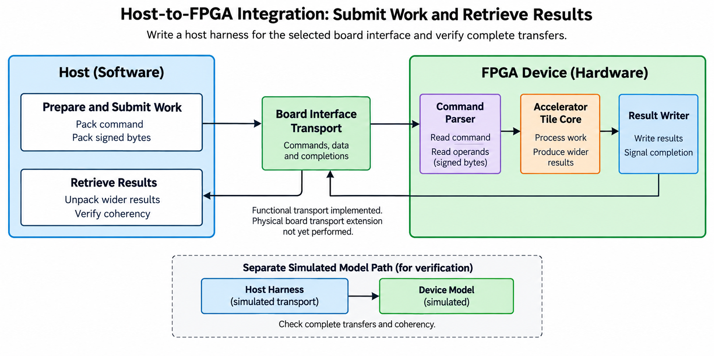
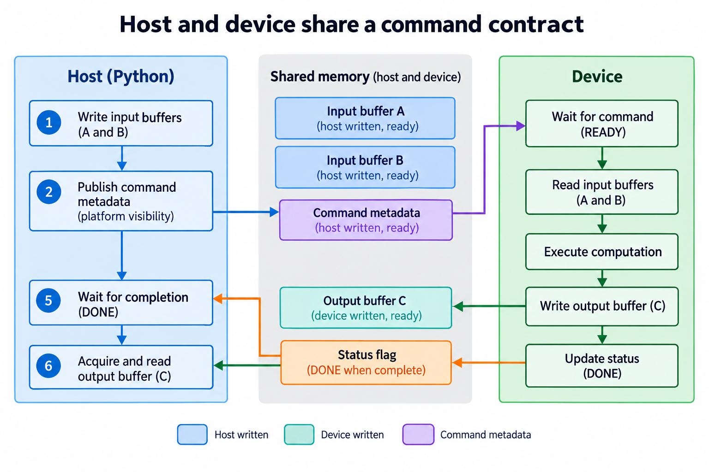
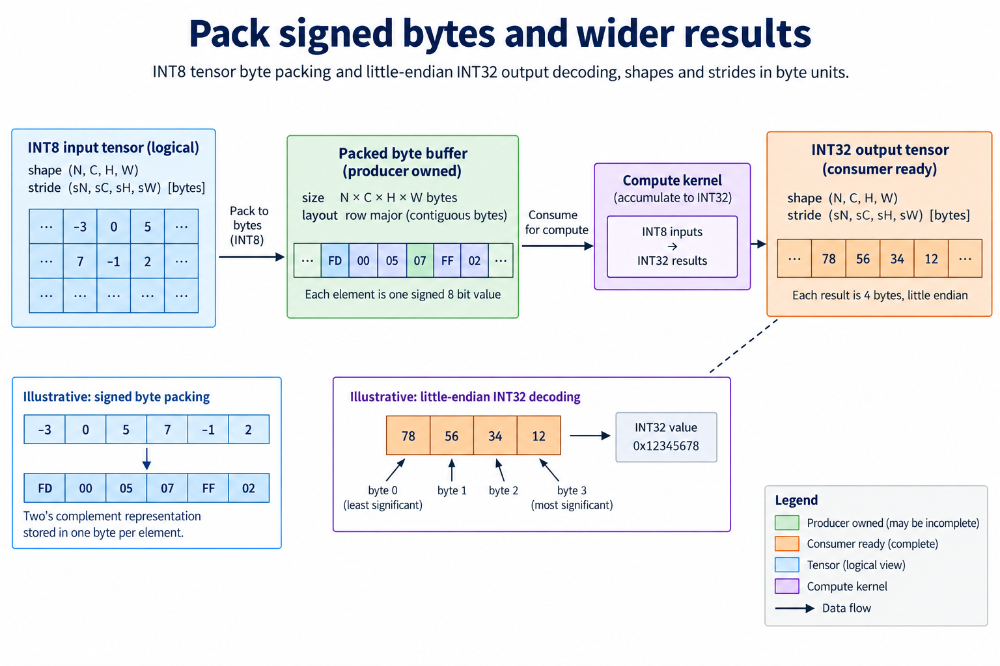
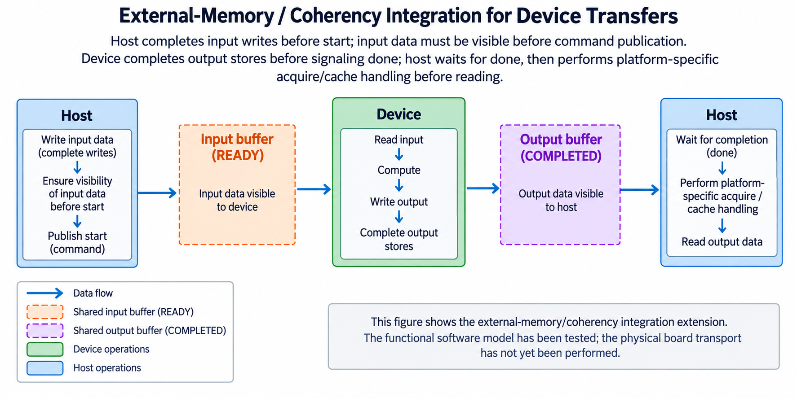
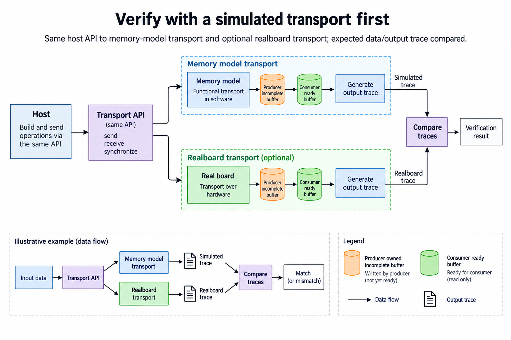

## Overview



This lesson extends one educational AI accelerator from its numerical specification toward verified RTL, FPGA integration and an ASIC implementation exercise. The overview shows this chapter's specific responsibility: Write a host harness for the selected board interface and verify complete transfers.

The shared project begins with signed INT8 operands and INT32 accumulation, grows into a 4×4 output-stationary array, and provides a verified host-loaded tile top. The larger tiled inference/transport examples are software models, while external bus, board and physical-design integration remain explicit exercises. Follow the evidence labels rather than treating every diagram as an executed hardware result.

Start after [Synthesize and Implement the Accelerator on an FPGA](/blog/fpga-ai-fpga-1-synthesize-and-implement-the-accelerator-on-an-fpga/). Keep the previous fixture and source revision so this chapter's change can be checked independently.

## Deep dive

### Host and device share a command contract



The host figure writes input/weights, submits a command, waits for completion and reads output. The software transport model follows this sequence synchronously. A real driver must connect it to the chosen board's bus/API.

Keep the numerical contract independent of transport. The same 2×2 input matrix should produce the same result through the model and hardware. Transport-specific cache handling and request completion remain explicit.

Begin with a fixed fixture before optimizing transfers. If numerical results fail, compare packed bytes and register fields before changing the PE array. A wrong dimension or byte order can mimic arithmetic corruption.

### Pack signed bytes and wider results



The packing figure uses signed bytes for INT8 and little-endian signed words for INT32 outputs. The known input matrices occupy 4 bytes each, while their 2×2 output occupies 16 bytes.

Python struct packing with b preserves the intended signed byte values; decoding with little-endian i restores signed 32-bit results. Endianness and widths belong to the interface contract, not the host's default native settings.

Shapes and strides must match the canonical row-major layout. If hardware uses banked tiles, the packing layer performs that transformation deliberately. Test round-trip packing with negative INT8 values and distinct elements.

### Transfers need completion and coherency



The completion figure orders host writes before start and output completion before host reads. An asynchronous API requires explicit wait/notification behavior. Cache-coherent access can simplify visibility, but it does not remove command dependencies.

The model returns only after output write and sets done. It therefore verifies a functional ordering contract, not driver latency. A real transport should expose separate submission and completion if that matches its hardware.

Handle timeouts and errors with a documented buffer-lifetime policy. Retrying after an unknown completion state can duplicate work or consume a partially written result.

### Verify with a simulated transport first



The simulated-transport figure lets the host harness run before a board is chosen. The exercise checks the matrix result [[19,22],[43,50]], its 16 encoded bytes and done status. Invalid bounds/alignment tests check rejection before writes.

A board adapter implements the same logical operations, but you must still test its transfers, coherency and reset. Passing the model is a prerequisite, not proof the adapter works.

Retain a simple loopback test and compare raw bytes before running inference. This isolates transport from compute and makes the later hardware result reviewable.

### Run this lesson

Download the [accelerator lab](/labs/fpga-ai-chip/accelerator-lab.zip), extract it and run from its directory:

```sh
python3 lessons.py host-1
python3 -m unittest discover -s tests -v
```

The first command writes `reports/host-1.json`. Inspect its scope and result together. The second runs the independent numerical, addressing and scheduling checks. To reproduce RTL evidence, install Icarus Verilog 13.0 and run `python3 scripts/verify_top.py`; that also runs the block/array tests. These commands are software/RTL checks, not board measurements.

### Reference implementation: Memory

This Python reference is executable behavior, not synthesized hardware. Its range, rounding and layout contract provides an oracle for the corresponding RTL/integration.

```python
class Memory:
 def __init__(self,size=4096):self.data=bytearray(size)
 def validate(self,addr,length,alignment=1):
  if not isinstance(addr,int) or addr<0 or length<0 or addr%alignment or length>len(self.data) or addr>len(self.data)-length:raise ValueError('invalid memory range/alignment')
 def write(self,addr,payload):self.validate(addr,len(payload));self.data[addr:addr+len(payload)]=payload
 def read(self,addr,length):self.validate(addr,length);return bytes(self.data[addr:addr+length])
```

### Reference implementation: Command

This Python reference is executable behavior, not synthesized hardware. Its range, rounding and layout contract provides an oracle for the corresponding RTL/integration.

```python
@dataclass(frozen=True)
class Command:
 a:int;b:int;c:int;m:int;n:int;k:int
```

### Reference implementation: Accelerator

This Python reference is executable behavior, not synthesized hardware. Its range, rounding and layout contract provides an oracle for the corresponding RTL/integration.

```python
class Accelerator:
 """Functional transport model, not RTL DMA or an AXI implementation."""
 def __init__(self,memory):self.memory=memory;self.busy=False;self.done=False;self.error=None
 def submit(self,cmd):
  if self.busy:raise RuntimeError('busy')
  self.done=False;self.error=None
  if min(cmd.m,cmd.n,cmd.k)<=0:raise ValueError('positive dimensions required')
  for addr,length,align in [(cmd.a,cmd.m*cmd.k,1),(cmd.b,cmd.k*cmd.n,1),(cmd.c,cmd.m*cmd.n*4,4)]:self.memory.validate(addr,length,align)
  regions=[(cmd.a,cmd.a+cmd.m*cmd.k),(cmd.b,cmd.b+cmd.k*cmd.n),(cmd.c,cmd.c+cmd.m*cmd.n*4)]
  if any(max(regions[i][0],regions[j][0])<min(regions[i][1],regions[j][1]) for i,j in [(0,2),(1,2)]):raise ValueError('output overlaps input')
  self.busy=True
  try:
   a=list(struct.unpack(f'{cmd.m*cmd.k}b',self.memory.read(cmd.a,cmd.m*cmd.k)));b=list(struct.unpack(f'{cmd.k*cmd.n}b',self.memory.read(cmd.b,cmd.k*cmd.n)))
   result=tiled_matmul([a[i*cmd.k:(i+1)*cmd.k] for i in range(cmd.m)],[b[i*cmd.n:(i+1)*cmd.n] for i in range(cmd.k)])
   flat=[x for row in result for x in row];self.memory.write(cmd.c,struct.pack('<'+'i'*len(flat),*flat));self.done=True;return result
  except Exception as e:self.error=str(e);raise
  finally:self.busy=False
```

### Retain a reproducible integration boundary

The released project verifies software and RTL simulation. Its FPGA Tcl is a core-only out-of-context implementation exercise, and the host transport is a functional model, so a board-ready system additionally needs documented clock/reset, pins, memory and physical host I/O, which you select for a real target and whose versions you retain before claiming a working board application.

Bring up the simplest observable path first. Check register or transport access, then a transfer loopback, memory behavior and a small known matrix. Compare raw bytes and wider signed results before running the tiny MLP. If a complete inference fails, intermediate values should identify the first wrong layer rather than leaving arithmetic, packing and clocks mixed together.

Measure the boundary that matters to the application. Device compute time, load/compute/store and host end-to-end latency include different work. Count useful products separately from masked slots and elapsed clocks. Cold setup, warm repetitions and concurrent system load also need separate labels.

Tool-estimated power and physical board measurements are different evidence. The release intentionally contains no fabricated FPGA throughput or power values. Save raw implementation/measurement reports when those steps are actually performed, together with source revision, device, constraints and timing convention. That makes follow-up results comparable with the verified numerical baseline.

### A worked engineering decision

#### Establish a byte contract before building a driver

The host and device must agree on shapes, layouts, signed input interpretation, result width and completion. For compact matrices, INT8 inputs use 1 byte per element and INT32 outputs use 4. The functional lab transport stores wider outputs in little-endian order. A driver cannot infer that convention from a Python integer or a memory pointer; the protocol must declare it.

Use the signed sequence [-3,0,5,7,-1,2]. Its packed INT8 bytes are fd 00 05 07 ff 02. Unpacking those bytes as unsigned creates different numerical operands at fd and ff. For a wider decoding fixture, bytes 78 56 34 12 represent 0x12345678 in little-endian order. Also include a negative INT32 result so the driver checks both byte order and signed interpretation instead of only a positive value.

The integrated RTL top has another layout boundary: A uses padded row stride 8 and B uses padded row stride 4 in its host-load address space. The functional command model uses compact logical layouts in bounded memory. A board wrapper can support either exposed contract, but the host must know which one it targets. Repacking a smaller matrix into fixed physical storage is an explicit operation with its own expected byte map.

#### Order input publication and command submission

The host writes all required A/B bytes, completes the transport's required visibility steps, publishes a complete command and starts the operation. The device then snapshots the accepted configuration and consumes ready operands. Writing command metadata into the weight region or asserting start before all operands arrive can create a legal-looking matrix call with the wrong data. Draw metadata and tensor storage as separate objects.

A proposed MMIO or packet interface needs field widths, byte units, alignment, supported dimensions and submission behavior, while a functional Python Command object is not a physical packet parser, and the simple RTL top has dimension/start ports rather than address registers. A driver for a new transport must serialize exactly the fields its wrapper implements. Keep a version or schema identifier if the protocol will evolve.

Busy handling is also part of submission. The current top ignores additional starts and operand writes while busy. A wrapper may return backpressure or a defined busy response, but it must not report acceptance for work the top discards. The host should wait for the declared accepted/completed state and avoid reusing live buffers. A driver that writes faster than the core can accept is not automatically a higher-throughput system.

#### Consume results only after the declared completion

For the simple top, DONE follows capture of local INT32 outputs. For an external-memory extension, successful output writes and platform visibility may add another completion condition, so host polling must wait for that event, perform required platform-specific acquisition/cache handling, then decode the output. Cache handling after an already completed read cannot retroactively establish correct visibility.

A timeout is a distinct outcome. It says the driver did not observe completion within its interval. It does not prove the device stopped or its memory is safe to overwrite. Define cancellation/reset and outstanding-transfer recovery for the selected wrapper. Keep error status distinguishable from numerical mismatch so a transport failure does not look like a wrong model prediction.

The bounded functional transport completes deterministically and validates commands before its writes. It does not exercise a real board's queues, cache hierarchy, interrupts or electrical interface. A future driver can reuse the numerical fixtures, but must add those transport-specific checks. Label its evidence with the actual board and interface rather than treating a software API as hardware execution.

#### Verify each boundary with distinguishable data

First run the same host packing and command logic against the functional memory model. Compare raw operand bytes and raw INT32 output bytes with independently constructed fixtures. Then compare signed matrices. This separates serialization defects from arithmetic. Sentinel bytes around output allocations expose overrun even when the logical result matrix itself matches.

Next implement the optional board transport behind the same high-level operation API. A shared API is useful, but the underlying acceptance and synchronization may differ. Compare completed output traces and status for a known small matrix before attempting the MLP. Retain the raw trace when a mismatch occurs; an end-to-end checksum alone cannot identify which field or byte was wrong.

Test a second job with different shapes and values. Stale command fields or incompletely overwritten padded storage often remain hidden when every job repeats the same matrix. Include an invalid dimension, misalignment where the exposed interface requires it, and prohibited overlap in the command model. Confirm rejected operations preserve memory and do not produce an ordinary success event.

The architectural lesson is that a host interface is a numerical and lifetime contract, not just a way to move bits, so packing, accepted submission, snapshot, successful output completion and decoding all need evidence, and the release provides a verified functional path and a simulated host-loaded core, creating a precise starting point for a board driver while keeping physical transport unperformed.

#### Extend the next boundary

For the first physical driver fixture, retain a complete packet/register trace with the logical matrix and expected byte locations. Check each accepted write against that map, then inspect status and every returned result field. This trace can separate an incorrectly serialized command from a correctly serialized command rejected by the wrapper. Keep the driver timeout and error path observable too. A reusable high-level API should expose those outcomes rather than converting every failure into an empty matrix or a nominal success.

## Conclusion

The outcome of this chapter is a concrete project artifact and a check whose scope is stated explicitly. Preserve numerical results, transaction ordering and lifetime rules as the design grows; optimize only after the baseline is correct. Next, [Run a Small Neural Network End to End](/blog/fpga-ai-inference-1-run-a-small-neural-network-end-to-end/) adds the next responsibility without changing the established contract.

### Sources

- [Original accelerator lab and verification evidence](https://chiaxinliang.github.io/labs/fpga-ai-chip/accelerator-lab.zip)
- [AMD Vivado design flows](https://docs.amd.com/r/en-US/ug892-vivado-design-flows-overview/Design-Flows)
