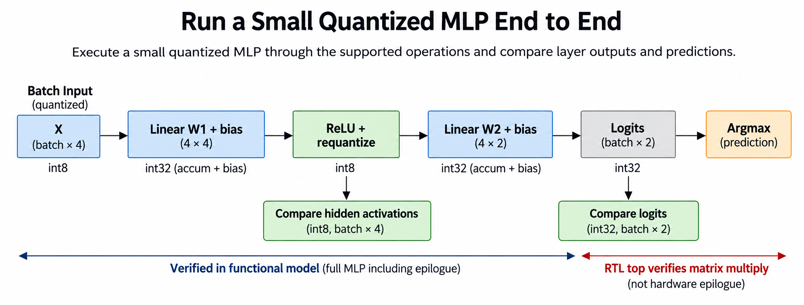
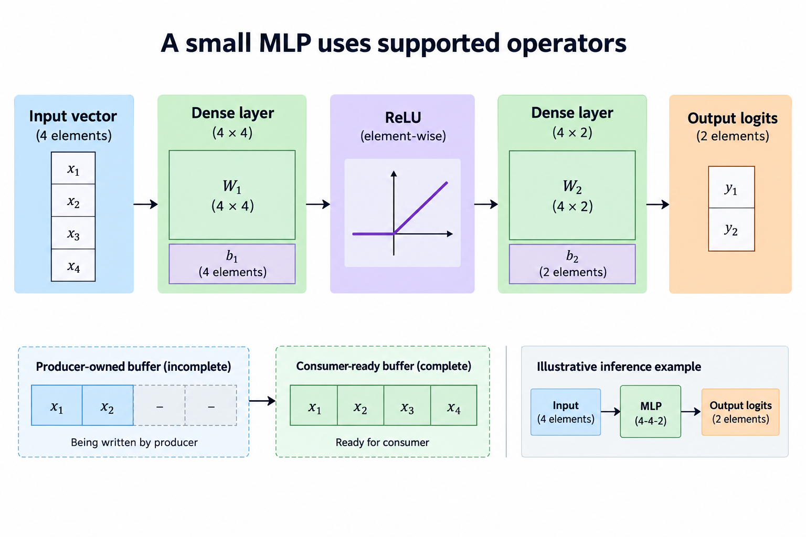
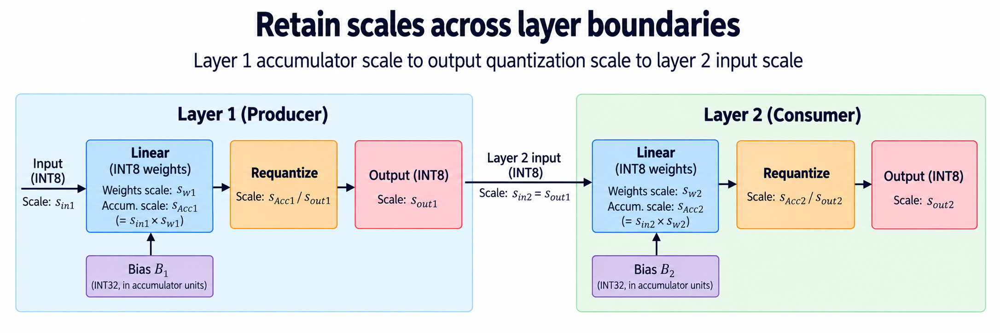
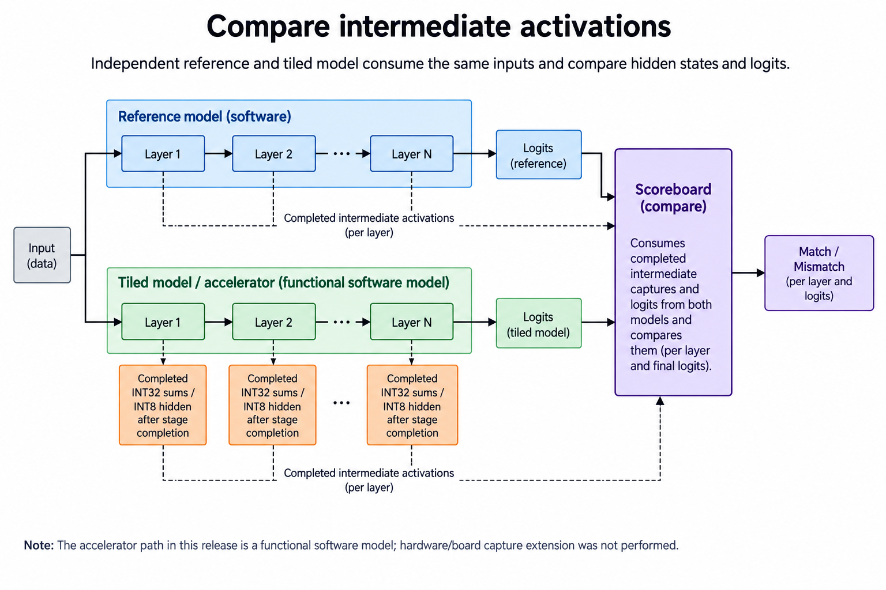
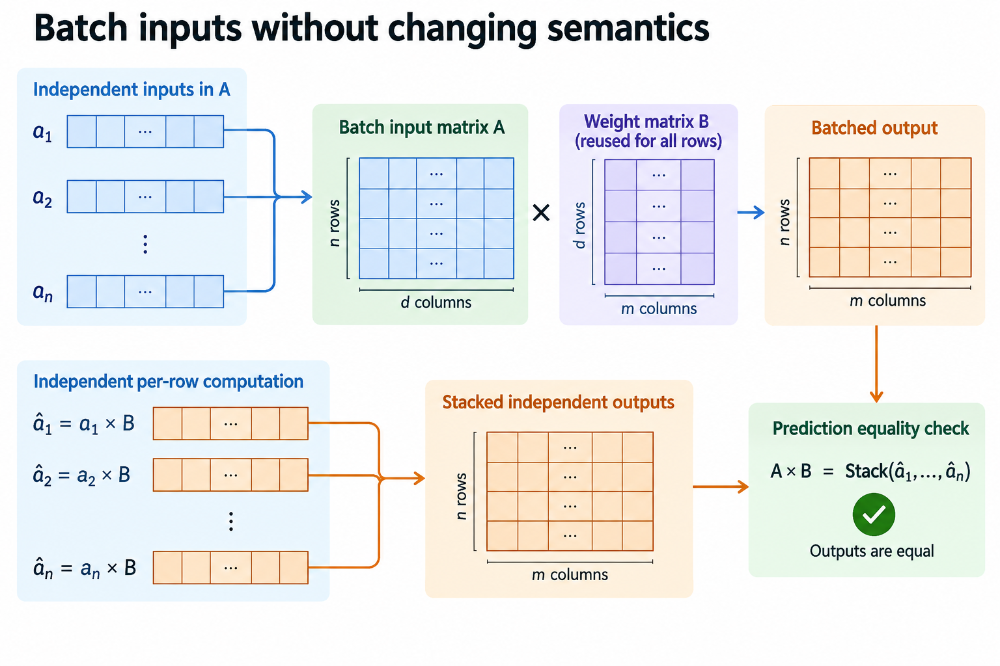

## Overview



This lesson extends one educational AI accelerator from its numerical specification toward verified RTL, FPGA integration and an ASIC implementation exercise. The overview shows this chapter's specific responsibility: Execute a small quantized MLP through the supported operations and compare layer outputs and predictions.

The shared project begins with signed INT8 operands and INT32 accumulation, grows into a 4×4 output-stationary array, and provides a verified host-loaded tile top. The larger tiled inference/transport examples are software models, while external bus, board and physical-design integration remain explicit exercises. Follow the evidence labels rather than treating every diagram as an executed hardware result.

Start after [Host-to-FPGA Integration: Submit Work and Retrieve Results](/blog/fpga-ai-host-1-host-to-fpga-integration/). Keep the previous fixture and source revision so this chapter's change can be checked independently.

## Deep dive

### A small MLP uses supported operators



The network figure defines a tiny supported graph: 4 inputs, a 4×4 dense layer, ReLU/requantization, then a 4×2 dense layer producing two logits. This is a numerical demonstration, not a trained model with a claimed classification accuracy.

Use the released input [[1,2,-1,3]] and fixed weights in test_small_mlp. The first layer's integer sums are [6,1,6,6]. ReLU and division by 2 with ties-away rounding produce hidden values [3,1,3,3]. The second layer produces [5,4], with argmax index 0.

These 4 small distinct values let you check every product. A larger random network is useful later but makes the first debugging step harder. Only implemented operators belong in the supported graph.

### Retain scales across layer boundaries



The scale figure connects one layer's stored output to the next layer's input contract. The released example uses an illustrative shift-based conversion; it does not automatically calibrate a trained floating model.

Record each layer's input, weight, accumulator and output scale. Bias must use compatible accumulator units. If output quantization changes, the next layer's interpretation must change consistently. Merely copying INT8 bytes does not preserve their real meaning across arbitrary scales.

Compare a bit-accurate integer reference, such as the hidden [3,1,3,3] above, before evaluating model quality. Circuit equivalence and predictive accuracy are separate checks. A quantized network can be implemented perfectly yet be a poor approximation of its original trained model.

### Compare intermediate activations



The intermediate-comparison figure checks hidden activations as well as final logits. The first mismatching layer localizes the problem. A final argmax may stay unchanged even when several numerical outputs are wrong.

The software test checks hidden [[3,1,3,3]] and output [[5,4]] exactly. Array RTL separately verifies signed tiles; the integrated top verifies host-loaded tile execution. An end-to-end physical board run has not been performed.

For hardware integration, preserve the same fixtures and collect each layer's output. Check raw packing, partial sums and epilogue before using a full dataset. If one layer exceeds the tile size, apply the verified tiler and combine K chunks before conversion.

### Batch inputs without changing semantics



The batching figure maps independent input examples to rows of A while reusing B weights. Each output row remains an independent example. Batch size changes scheduling and reuse, not the neural-network function.

A larger batch, beyond the 4-row local tile, can amortize loading but increases resident activations and complete job time. Request latency includes time waiting for the batch. Report batch throughput separately from one example's completion latency.

The project's useful outcome is a fully checkable small inference graph and a path to tile-level RTL execution. Do not label software-model runtime as FPGA performance. A board benchmark needs its own transport, bitstream and measured timing boundary.

### Run this lesson

Download the [accelerator lab](/labs/fpga-ai-chip/accelerator-lab.zip), extract it and run from its directory:

```sh
python3 lessons.py inference-1
python3 -m unittest discover -s tests -v
```

The first command writes `reports/inference-1.json`. Inspect its scope and result together. The second runs the independent numerical, addressing and scheduling checks. To reproduce RTL evidence, install Icarus Verilog 13.0 and run `python3 scripts/verify_top.py`; that also runs the block/array tests. These commands are software/RTL checks, not board measurements.

### Reference implementation: mlp

This Python reference is executable behavior, not synthesized hardware. Its range, rounding and layout contract provides an oracle for the corresponding RTL/integration.

```python
def mlp(x,w1,w2):
 h=[[epilogue(v,shift=1) for v in row] for row in tiled_matmul(x,w1)]
 return h,tiled_matmul(h,w2)
```

### Retain a reproducible integration boundary

The released project verifies software and RTL simulation. Its FPGA Tcl is a core-only out-of-context implementation exercise, and the host transport is a functional model, so a board-ready system additionally needs documented clock/reset, pins, memory and physical host I/O, which you select for a real target and whose versions you retain before claiming a working board application.

Bring up the simplest observable path first. Check register or transport access, then a transfer loopback, memory behavior and a small known matrix. Compare raw bytes and wider signed results before running the tiny MLP. If a complete inference fails, intermediate values should identify the first wrong layer rather than leaving arithmetic, packing and clocks mixed together.

Measure the boundary that matters to the application. Device compute time, load/compute/store and host end-to-end latency include different work. Count useful products separately from masked slots and elapsed clocks. Cold setup, warm repetitions and concurrent system load also need separate labels.

Tool-estimated power and physical board measurements are different evidence. The release intentionally contains no fabricated FPGA throughput or power values. Save raw implementation/measurement reports when those steps are actually performed, together with source revision, device, constraints and timing convention. That makes follow-up results comparable with the verified numerical baseline.

### A worked engineering decision

#### Treat the small network as a composition of exact operators

The educational MLP uses 4 input features, a 4-channel hidden layer and 2 output logits. The first matrix operation combines INT8 inputs with a 4×4 weight matrix and compatible bias. ReLU and requantization create the INT8 hidden representation. The second matrix operation uses a 4×2 weight matrix and bias to produce wide logits. There is no third linear layer or final ReLU in this released model.

Write down each intermediate shape and numerical domain. A batch of n inputs is n×4; the hidden representation is n×4; logits are n×2. The first accumulator, compatible bias and conversion parameters belong to that layer's domain. The second bias belongs to the second layer, not the first layer's interstage buffer. Keeping these objects separate prevents a diagram or implementation from carrying the wrong metadata across the boundary.

The MLP is an executable functional model built from supported educational operations. It is not a trained production network or an executed FPGA inference application. Its purpose is checking that matrix computation, epilogue, storage and batching compose numerically. A board implementation needs the selected host/transport shell and any epilogue RTL that the current INT32 tile top does not include.

#### Compare intermediate values before predictions

Compute a direct reference for the first wide matrix result, compatible biased values, activated/scaled hidden values and second logits. Compare each stage with the tiled/model path. If the hidden representation first diverges, inspect the first layer and its epilogue before blaming the second weight matrix. If hidden matches but logits differ, focus on the second matrix, bias and output decoding.

Argmax agreement alone is weak evidence. Different logits can still select the same output class, especially when the leading logit has a large margin. Conversely, a small numerical difference near a tie can change the prediction. Retain complete logits and the declared tie convention rather than reporting only a class label. The model's numerical oracle and any future task-quality evaluation answer different questions.

Use mixed-sign inputs and distinguishable weight columns. Positive-only fixtures can hide signedness defects and premature ReLU. Identical columns can hide output permutation. Saturated hidden values can conceal wide arithmetic differences, so include values that remain within the conversion range as well as deliberate clipping cases. The first differing intermediate is more actionable than a final “inference failed.”

#### Preserve scale metadata at the layer boundary

The first layer's output quantization targets a chosen hidden scale, which becomes the second layer's input interpretation if no additional rescale is inserted. The first accumulator scale and hidden-output scale are not automatically identical. A generic affine model may also carry zero points and per-channel parameters, while the simple released function uses a narrower defined contract. Record any model conversion rather than assuming universal quantized-format support.

Prepare compatible integer bias in each layer's accumulator units. Copying the first layer's bias into the second layer's input buffer changes the operation. Likewise, changing a multiplier or shift to avoid saturation changes the numerical model and should be evaluated against its intended outputs. Hardware correctness preserves a chosen contract; it does not select calibration parameters on behalf of the model author.

Finish the complete reduction before activation and conversion. If larger K is chunked, combine every INT32 partial result before ReLU. The same -10 and 8 cancellation fixture used in the epilogue lesson exposes premature nonlinear processing. A tiler that activates each chunk can produce a plausible hidden vector while computing a different network.

#### Batch independent inputs without mixing rows

For this feed-forward model, independent input rows share weights and are processed without row-to-row dependence. Stacking rows into a matrix can therefore expose weight reuse and more array work. Compare a batched result with the stack of separately computed row results. This equality checks shape/layout and independence; it should be exact under the same integer operator, not a vague tolerance selected after failure.

Batching changes the schedule and resource demand. It does not automatically improve single-request latency, especially when requests wait to form a batch, and a larger batch can exceed the 4-row local tile and require software tiling or additional commands, so retain logical batch dimensions while mapping to physical tiles and store only valid row/column outputs at boundaries.

The functional model comparison verifies those numerical rows, not a measured serving throughput. A future performance experiment should separate batching wait, host transfer, compute and result retrieval. It also needs a task-quality dataset if the goal is evaluating model usefulness. The small deterministic MLP fixture supplies neither a commercial benchmark nor trained accuracy evidence.

The chapter connects local operator correctness into a complete numerical application, and its strength is inspectable shapes, intermediate values and explicit scale/ordering rules, so readers can reproduce the software inference now, use the verified tile core as a building block, and know which physical transport and epilogue implementation steps remain before reporting an FPGA application.

#### Extend the next boundary

For a second numerical fixture, change 1 input feature and retain both hidden and logit differences. This makes it easier to detect a stale input row or ignored command field than repeating the same network invocation. Also compare a batch containing that changed row with separate single-row results under the same integer parameters. Retain raw INT32 logits before prediction so output conversion cannot hide a mismatch. These are deterministic operator checks; they do not imply the small hand-specified MLP has been trained or evaluated on a task dataset.

## Conclusion

The outcome of this chapter is a concrete project artifact and a check whose scope is stated explicitly. Preserve numerical results, transaction ordering and lifetime rules as the design grows; optimize only after the baseline is correct. Next, [Measure the Accelerator: Useful MACs, Bandwidth, Latency, and Power](/blog/fpga-ai-measure-1-measure-the-accelerator/) adds the next responsibility without changing the established contract.

### Sources

- [Original accelerator lab and verification evidence](https://chiaxinliang.github.io/labs/fpga-ai-chip/accelerator-lab.zip)
- [AMD Vivado design flows](https://docs.amd.com/r/en-US/ug892-vivado-design-flows-overview/Design-Flows)
