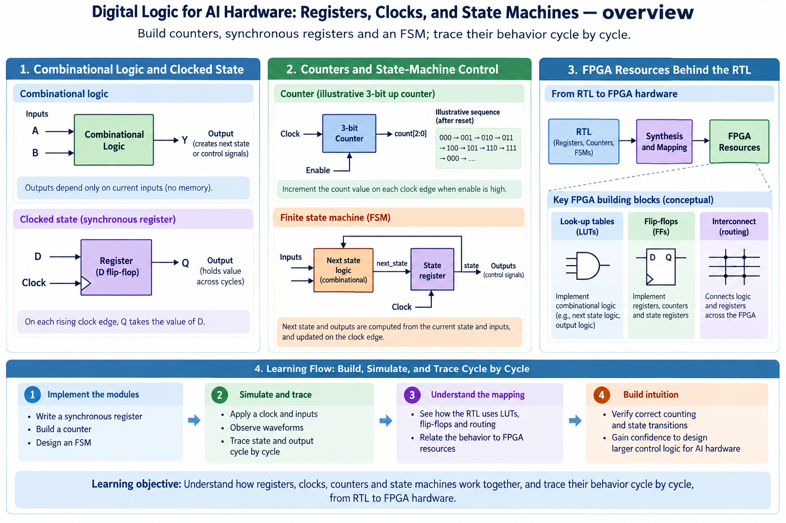
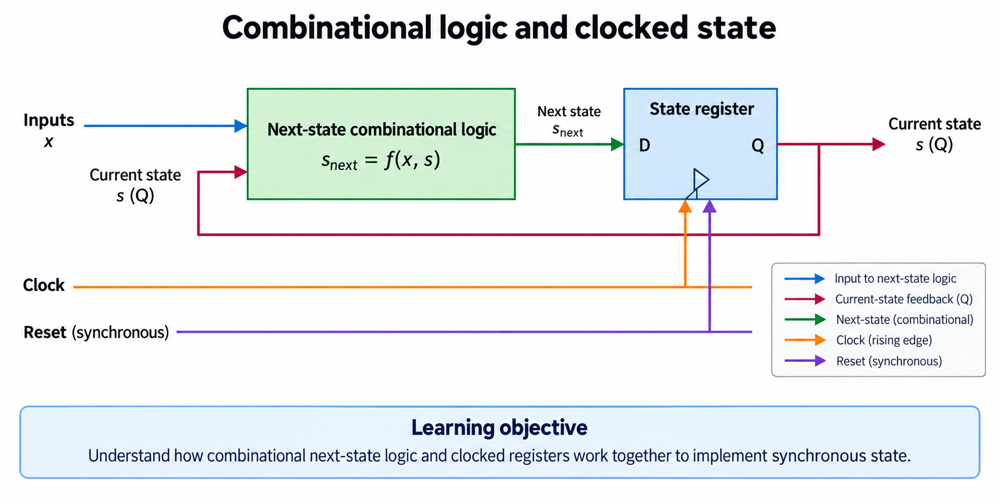
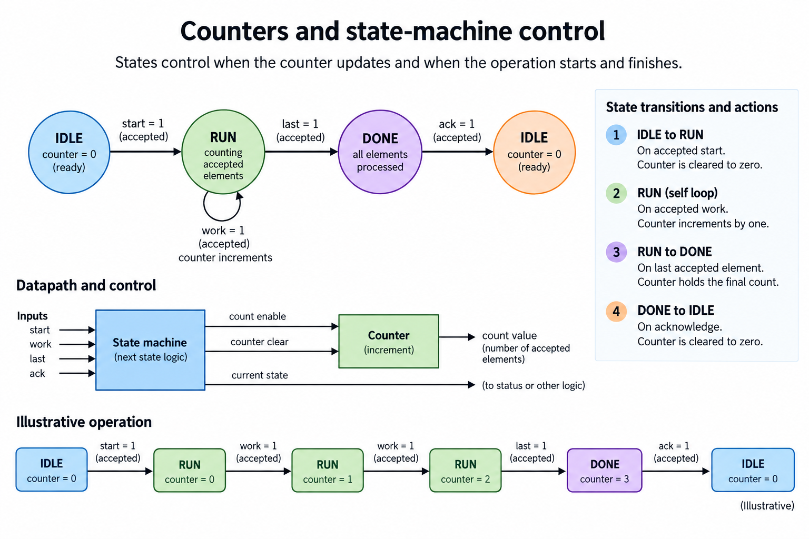
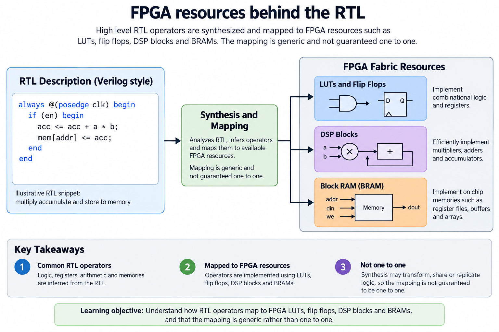

## Overview



This lesson extends one educational AI accelerator from its numerical specification toward verified RTL, FPGA integration and an ASIC implementation exercise. The overview shows this chapter's specific responsibility: Build counters, synchronous registers and an FSM; trace their behavior cycle by cycle.

The shared project begins with signed INT8 operands and INT32 accumulation, grows into a 4×4 output-stationary array, and provides a verified host-loaded tile top. The larger tiled inference/transport examples are software models, while external bus, board and physical-design integration remain explicit exercises. Follow the evidence labels rather than treating every diagram as an executed hardware result.

Start after [Define the AI Accelerator: Workload, Interfaces, and Success Criteria](/blog/fpga-ai-spec-1-define-the-ai-accelerator/). Keep the previous fixture and source revision so this chapter's change can be checked independently.

## Deep dive

### Combinational logic and clocked state



The register figure divides combinational calculation from stored state. Combinational logic reacts to its inputs; a clocked register changes at its specified edge. A counter's next value is calculated from its current value, but the stored count updates only when the clocked process samples the relevant enable.

In SystemVerilog, always_ff with nonblocking assignments expresses sequential state. All right-hand sides use the sampled pre-update state. Replacing a nonblocking assignment with a blocking assignment inside a multi-register pipeline can change simulation behavior and obscure the intended circuit.

Our core uses one clock and synchronous active-high reset. That is a deliberate local contract, not a claim that every FPGA input is synchronous. Board buttons, external clocks and bus signals need their own integration treatment. Draw every register boundary before guessing the number of cycles.

### Counters and state-machine control



The state-machine figure shows IDLE, RUN and DONE. A start accepted in IDLE begins a job. RUN increments the work counter only when the required work event is accepted. A stall must hold the count. DONE remains visible until the chosen acknowledgement policy releases it.

The logic-1 exercise includes a stalled step and demonstrates that elapsed cycles differ from accepted work. Counting every clock instead would finish the operation early when input is unavailable. The completion condition must match the last valid operation, not just a timer started at launch.

Define priority when events coincide. Reset dominates ordinary progress; new commands during busy execution have a documented response. A state machine whose transitions depend on undocumented host behavior is difficult to reuse. Verify reset and acknowledgement alongside the normal path.

### FPGA resources behind the RTL



The FPGA resource figure maps circuit roles to LUTs, flip-flops, DSP blocks and block RAM. LUTs implement supported combinational functions, flip-flops retain state, DSP resources can implement arithmetic, and BRAM provides structured memory. Synthesis decides a legal mapping under device capabilities and constraints.

An RTL multiply is not a guarantee of one DSP block. Operand width, signedness, pipeline placement and synthesis settings can change mapping. A small memory may become distributed logic, while another inference pattern maps to BRAM. Read the synthesis report rather than estimating resource use from source lines.

The same portable RTL can map to standard cells in an ASIC flow, but memory and clocking assumptions still differ. Our PE/array source avoids vendor-specific primitives; the RAM wrapper states read latency and collision behavior. That separation makes the later FPGA-to-ASIC transition testable.

### Run this lesson

Download the [accelerator lab](/labs/fpga-ai-chip/accelerator-lab.zip), extract it and run from its directory:

```sh
python3 lessons.py logic-1
python3 -m unittest discover -s tests -v
```

The first command writes `reports/logic-1.json`. Inspect its scope and result together. The second runs the independent numerical, addressing and scheduling checks. To reproduce RTL evidence, install Icarus Verilog 13.0 and run `python3 scripts/verify_top.py`; that also runs the block/array tests. These commands are software/RTL checks, not board measurements.

### From specification to an executable check

Create a new working copy of the lab and keep the numerical contract beside its sources. The opening work uses Python to make the values and accepted events explicit before circuit optimization. A direct matrix loop is the independent reference; a cycle-stepped array model explains timing without being the only numerical oracle.

Start with known signed values, not only random data. Distinct elements expose row/column swaps and misaligned reductions. Zero and the signed endpoints expose conversion and width mistakes. A stalled event exposes the difference between offered work, accepted work and elapsed clocks. Retain each fixture so later changes can be compared against the same contract.

When moving the operation into RTL, draw the register boundaries and define reset/clear priority. A value observed before an active edge belongs to the previous state; a value observed after nonblocking updates belongs to the new state. Record that convention in the harness. Otherwise a testbench race can resemble a circuit defect.

The acceptance result is a defined behavior and an executed software/RTL check, not a physical clock achievement. Synthesis, board integration and measured performance belong to later milestones. This separation makes the early lesson useful without inventing a hardware result.

### A worked engineering decision

#### Follow 1 job through the state register

Start from IDLE with a work counter of 0. At an active clock edge, an accepted start chooses RUN as the next state. The counter then advances only when the work event chosen for RUN is accepted. In the lesson exercise, 3 accepted work events are enough to reach DONE. Insert a clock without accepted work between the first and second events: the state remains RUN and the counter remains 1. The absence of progress is an intentional hold, not a combinational recalculation of a new result.

When the third work event is accepted, the counter becomes 3 and the machine enters DONE. DONE remains observable until acknowledgement. The exercise returns to IDLE and clears the count on that acknowledgement, so the next job begins from the same baseline. A design with a pulse-only DONE would need a consumer guaranteed to observe that pulse; a design with persistent DONE needs a clear or acknowledgement policy. The exercise uses the latter so visibility is easy to inspect.

Distinguish the value before an edge from the value after it. Combinational logic sees the current registered state and offered inputs, and computes a candidate next state. The register captures that candidate at the active edge. If a testbench changes an input at exactly the same simulation scheduling point, it can race the DUT. Drive inputs before the edge and observe after sequential updates, or use a harness with an explicit clocking convention. That convention is part of verification, even though it is not part of the mathematical operation.

#### Draw the feedback that makes the logic sequential

The next-state function depends on current state. A diagram must consequently feed the register's Q output back into the combinational function, as well as expose any state-derived outputs. Without that feedback, a block labeled f(input,state) has an undeclared state input. The missing connection can be more misleading than a missing decorative label because it changes how a reader understands a hold or conditional transition.

A counter is another feedback path. The incrementer computes count+1 from the current count, while the register decides whether to capture that value, retain the old count or clear it. An enable is not a new asynchronous clock. In ordinary synchronous RTL, it chooses the data captured at a clock edge. A target synthesis tool may implement this behavior using a supported enable feature or a data multiplexer; the source behavior must remain the same.

Reset policy needs equal precision. The released compute blocks use synchronous reset: the reset condition takes effect at an active edge. That does not establish a board's reset synchronizer or recovery timing. A physical reset pin and an internal synchronous reset signal may require an integration circuit between them. The opening lesson defines local behavior; a later board shell must define how an external event safely becomes that local signal.

#### Separate computation, storage and control resources

A combinational multiplier maps differently from a state register, and a small memory with many simultaneous reads can map differently from a single-port RAM. FPGA LUTs, flip-flops, DSP blocks and BRAM are implementation resources with target-specific capabilities. Writing multiplication in RTL does not prove the mapper selected a DSP, just as declaring an array does not prove the implementation uses BRAM. Inspect the actual synthesis report when that flow is executed.

Control logic commonly includes comparisons, state selection and address generation. The counter width should follow its representable range, and the final-work comparison should use the intended pre-edge or post-edge convention. A counter that reaches 3 requires values 0 through 3; a controller that detects count==3 before incrementing may finish a clock later than one that detects the third accepted event. Draw the condition and test the event sequence rather than guessing from a familiar state name.

Nonblocking sequential assignments use old right-hand-side state within the same edge. If a clocked block assigns acc<=acc+product and memory[addr]<=acc, the stored memory value is the previous accumulator unless a separately computed next sum is used. That behavior is sometimes intentional, but it should not be mistaken for a new accumulated output. The later capture stage in the integrated top makes the distinction explicit by waiting until the array's sequential updates are available.

#### Use a short event ledger to expose failures

Write each edge as a row containing current state, start, accepted work, acknowledgement, reset, current count and expected next state/count. The uninterrupted case is only the first ledger. Add start while RUN, acknowledgement before DONE, a work stall, reset during RUN and a second complete job. These cases reveal whether control events have a defined priority and whether stale state can leak into a later operation.

Do not use a final counter alone as the checker. An erroneous increment during a stall followed by a missed increment can cancel numerically. Compare every transition in the ledger and retain the accepted-work sequence. Likewise, a final IDLE state does not prove DONE was observable for the required interval. Check the lifetime of status events, not just the final state.

For the supplied exercise, a passing report documents a small deterministic state-machine model. It is not a formally proven RTL controller. The integrated accelerator controller arrives in a later chapter and is tested with actual matrix jobs in simulation. The foundation here is the reasoning pattern: state, edge, accepted event, priority and observable output.

Once that pattern is stable, every later register boundary becomes easier to explain. A product-valid bit is state; a ready/valid buffer's occupancy is state; an array's forwarded operand mask is state; a tile controller's completion counter is state. Each updates on a declared event and must hold when that event is absent. The circuit grows, but the basic question remains concrete: which stored values change at this edge, and why?

## Conclusion

The outcome of this chapter is a concrete project artifact and a check whose scope is stated explicitly. Preserve numerical results, transaction ordering and lifetime rules as the design grows; optimize only after the baseline is correct. Next, [INT8 Arithmetic: Quantization, Signed Products, and Accumulator Width](/blog/fpga-ai-number-1-int8-arithmetic/) adds the next responsibility without changing the established contract.

### Sources

- [Original accelerator lab and verification evidence](https://chiaxinliang.github.io/labs/fpga-ai-chip/accelerator-lab.zip)
