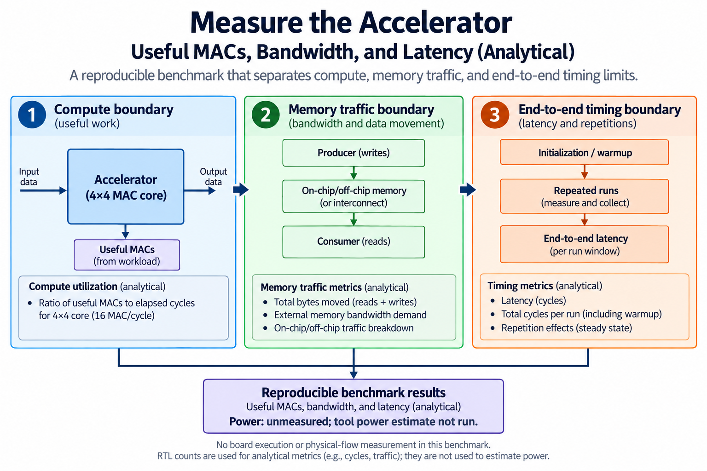
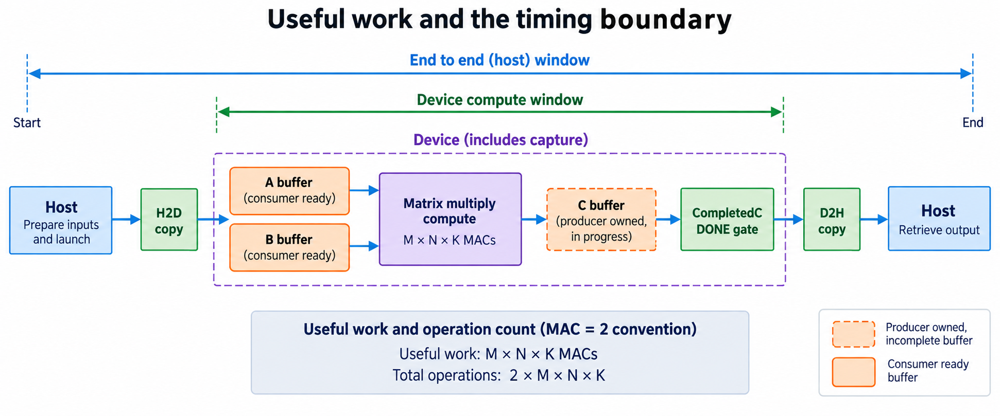
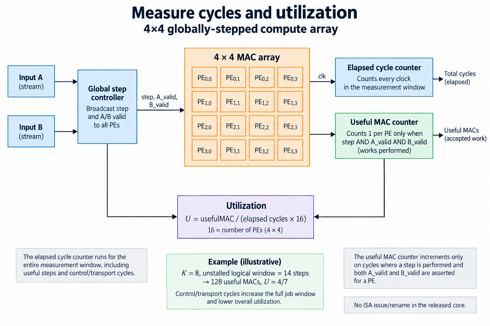
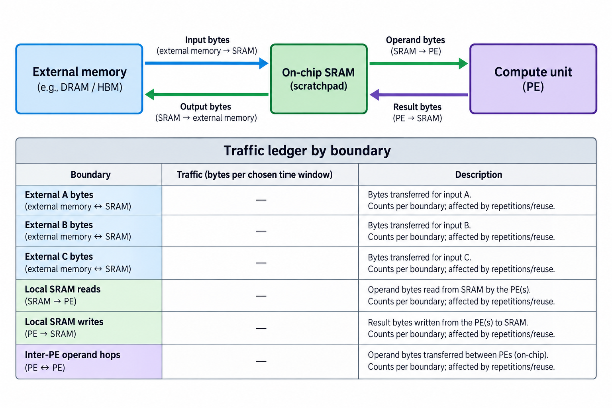
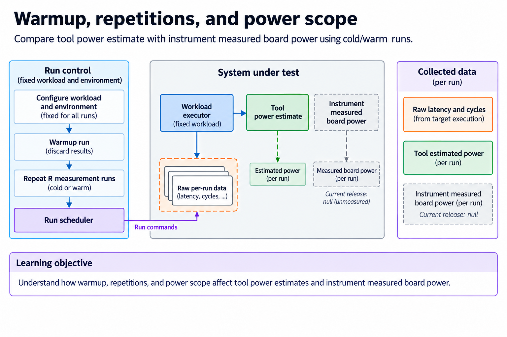
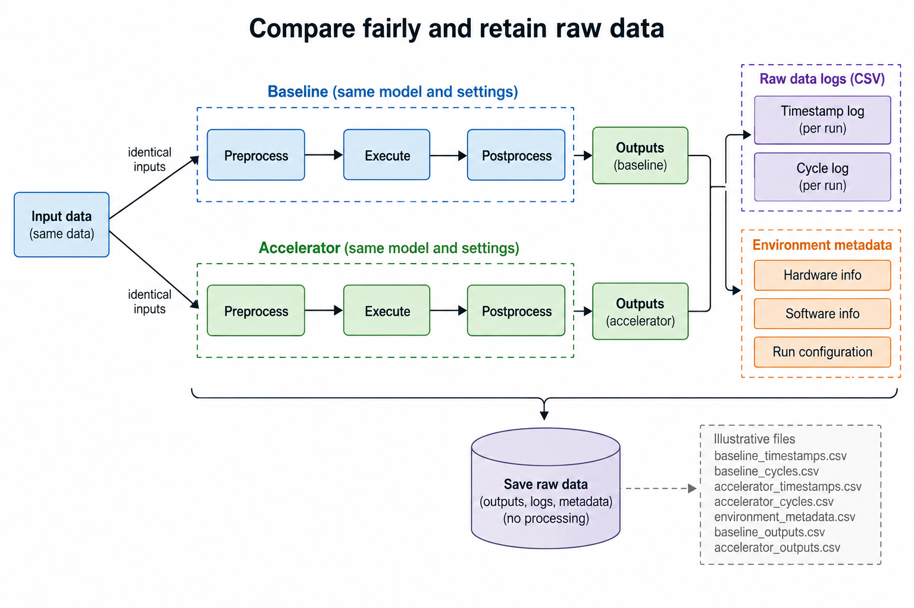

## Overview



This lesson extends one educational AI accelerator from its numerical specification toward verified RTL, FPGA integration and an ASIC implementation exercise. The overview shows this chapter's specific responsibility: Publish a reproducible benchmark separating transfer time, compute time, utilization and measurement limits.

The shared project begins with signed INT8 operands and INT32 accumulation, grows into a 4×4 output-stationary array, and provides a verified host-loaded tile top. The larger tiled inference/transport examples are software models, while external bus, board and physical-design integration remain explicit exercises. Follow the evidence labels rather than treating every diagram as an executed hardware result.

Start after [Run a Small Neural Network End to End](/blog/fpga-ai-inference-1-run-a-small-neural-network-end-to-end/). Keep the previous fixture and source revision so this chapter's change can be checked independently.

## Deep dive

### Define useful work and the timing boundary



The work figure defines useful MACs as M*N*K for dense matrix multiplication. Under MAC=2, useful operations are 2*M*N*K. Padded or masked products are not extra useful model work.

Name the timing window. Device arithmetic, load/compute/store, and host end-to-end latency include different costs. A benchmark ending at command submission cannot establish inference completion time.

The release's measure exercise reports analytic array steps, not measured board performance. Keep that scope alongside the numbers. A software-model wall-clock timing can measure the Python implementation, but does not predict RTL clock throughput.

### Measure cycles and utilization



The counter figure measures elapsed active clock cycles and accepted useful contributions. For the ideal 4×4,K=8 wavefront, useful MACs are 128 across 14 steps with 224 potential cell-step slots. The analytic utilization is 4/7.

Actual global stalls consume clocks without advancing logical steps. Load/store and controller cycles add to complete tile time. A useful counter must distinguish valid cell products from elapsed capacity.

A physical clock rate comes from implemented timing and the actual board clock configuration. Multiplying an ideal model by an unachieved target clock produces an estimate, not a measurement.

### Build a bandwidth traffic ledger



The byte ledger names external input, weight, output and temporary transfers. The standard tile has 32 input bytes,32 weight bytes and64 output bytes before repeated transfers or metadata.

On-chip reads and forwarding use a different boundary from host/network/DMA traffic. A weight reused across several tiles may require one external load but many local accesses. Keep those quantities separate.

Sustained bandwidth is measured bytes divided by the matching transfer interval. A full-duplex aggregate or estimated interface peak cannot replace that payload measurement. A slow host transport can dominate despite a fast local array.

### Warmup, repetitions, and power scope



The repetition figure separates cold setup from warm execution. Save individual runs, report distributions and record shape, type, clock, tool version and software transport. A best sample hides variability and startup costs.

Power needs a stated instrument/scope. Tool estimates, FPGA rails and wall-plug power are different. The release stores unknown board power as null, never as zero or an invented value.

Energy is integrated power over time under a defined boundary. A shorter job at higher power may or may not use less energy. Compare the same numerical workload and include the intended idle/transfer costs.

### Compare fairly and retain raw data



The comparison figure retains exact outputs and raw evidence. A baseline must calculate the same shapes and types under the same overflow/conversion policy. Counting different work or excluding different transfers invalidates a ratio.

Use the independent oracle to gate correctness, then compare complete timing. Retain the bitstream/checkpoint or RTL revision and the actual environment. If an optimization changes tile size, adjust useful-work counts for its masks and fill/drain.

The practical artifact is a reproducible measurement protocol. It makes estimates and unperformed board checks explicit, so future measured results can be added without rewriting their meaning.

### Run this lesson

Download the [accelerator lab](/labs/fpga-ai-chip/accelerator-lab.zip), extract it and run from its directory:

```sh
python3 lessons.py measure-1
python3 -m unittest discover -s tests -v
```

The first command writes `reports/measure-1.json`. Inspect its scope and result together. The second runs the independent numerical, addressing and scheduling checks. To reproduce RTL evidence, install Icarus Verilog 13.0 and run `python3 scripts/verify_top.py`; that also runs the block/array tests. These commands are software/RTL checks, not board measurements.

### Retain a reproducible integration boundary

The released project verifies software and RTL simulation. Its FPGA Tcl is a core-only out-of-context implementation exercise, and the host transport is a functional model. A board-ready system additionally needs documented clock/reset, pins, memory and physical host I/O. Select those for a real target and retain their versions before claiming a working board application.

Bring up the simplest observable path first. Check register or transport access, then a transfer loopback, memory behavior and a small known matrix. Compare raw bytes and wider signed results before running the tiny MLP. If a complete inference fails, intermediate values should identify the first wrong layer rather than leaving arithmetic, packing and clocks mixed together.

Measure the boundary that matters to the application. Device compute time, load/compute/store and host end-to-end latency include different work. Count useful products separately from masked slots and elapsed clocks. Cold setup, warm repetitions and concurrent system load also need separate labels.

Tool-estimated power and physical board measurements are different evidence. The release intentionally contains no fabricated FPGA throughput or power values. Save raw implementation/measurement reports when those steps are actually performed, together with source revision, device, constraints and timing convention. That makes follow-up results comparable with the verified numerical baseline.

### A worked engineering decision

#### Count useful work at a declared timing boundary

For a full 4×4 output with K=8, useful work is 128 MAC contributions. The ideal array window uses 14 logical steps, providing 16 cell slots per step. Useful occupancy is therefore 128/(14×16)=4/7. This is an analytical count under an unstalled logical-window assumption. It is not a measured utilization percentage from a board counter, and it excludes the integrated top's clear/capture and host-load intervals.

A global hold adds elapsed clocks without adding useful MACs. A complete command window also includes setup and result capture, while a host window can include packing, transfers, polling and retrieval. Choose the boundary before computing throughput or utilization. Comparing 1 system's isolated array window with another's end-to-end time is not a fair application comparison.

If counting each MAC as 2 operations, report that convention beside the useful operation rate. Do not include padded or invalid positions as useful model work. Physical cell activity can be higher than useful work if padding or redundant execution occurs. A useful-work counter should count valid matched A/B contributions under the array's actual step event, not simply clocks in RUN.

#### Keep cycle counts, frequency and wall time distinct

Simulator clocks and logical steps can explain the schedule. Converting clocks to seconds requires a real selected clock frequency, and claiming achieved frequency requires an executed constrained implementation or hardware measurement. The release does not substitute its illustrative 10-ns Tcl constraint for an obtained physical result. A frequency target and a timing-closed implementation are different artifacts.

For a real board, retain both device counters and host timestamps where available. Host time can include asynchronous submission and queueing; a timestamp around an API that only enqueues work may not measure completion. Wait on the declared usable-output event. If output memory is still producer-owned, result-copy time cannot end the benchmark meaningfully.

Counter instrumentation also changes the design. Define counter widths, reset points and overflow policy. Use accepted-work and elapsed counters with the same window. A counter labeled duration is still in cycles unless converted using a stated frequency. Pin the RTL revision and instrumentation when comparing runs so a new counter or debug path is not silently mixed into an old baseline.

#### Build separate ledgers for data movement

Unique tensor bytes are a capacity/lower-bound quantity under declared reuse assumptions. Actual external loads and stores include repeats and any partial-sum traffic. Local RAM accesses, register updates and PE-hop forwarding are different boundaries. Sustained bandwidth is bytes divided by time at 1 named boundary. Combining local and external totals into a single “memory bandwidth” can conceal the bottleneck.

For the full tile, A and B each contain 32 unique INT8 bytes and C contains 64 INT32 bytes. A larger tiler may reload inputs across different output blocks; double buffering changes live storage and overlap but not the numerical tensor sizes. Count actual scheduled transfers for the selected model. Do not claim every mapping transfers only the unique tensor total.

An overlapped timeline also requires ownership evidence. A loader cannot overwrite a live ping region to maintain an ideal rate. Include intentional loader or consumer idle intervals caused by finite buffering. The analytical overlap scheduler provides such intervals; it does not generate measured DDR or host-link bandwidth. Retain its assumptions beside the predicted stage period.

#### Report power and repetitions honestly

Tool-estimated power and instrumented board power have different inputs and boundaries. An implementation estimate depends on target models and switching assumptions; a board instrument may include memory, regulators and other components. Compare them only with declared scope and conditions. The current release records board power as unmeasured rather than inventing a value or an illustrative distribution that looks obtained.

For executed timing, define warmup, repetition count, input distribution and environment. Keep raw samples, not only the best run. Report a summary appropriate to the application, including distributions when tail latency matters. State whether initialization, cold loads or batch formation are included. A warm kernel interval and a cold complete request can both be useful, but they answer different questions.

Validate outputs during the experiment. A fast run that skips required work or reads unfinished output is not an optimization. Compare the same shapes, numerical format, model behavior and output boundary across baseline and accelerator. Retain source/tool versions with raw timing and counter records.

The lesson supplies analytical counts, deterministic scheduling reports and executed RTL verification evidence. It does not report board throughput, bandwidth or power. That distinction makes later measurements meaningful: they can be compared with an auditable model and investigated at the first boundary where actual behavior differs from assumptions.

#### Extend the next boundary

Before a future benchmark, save a run manifest containing the logical shape, input distribution, numerical parameters, source hashes and exact start/end events. Compare measured counters with the analytical MAC and traffic ledger before summarizing throughput. A disagreement may indicate instrumentation scope rather than an arithmetic defect. Retain both raw values and the explanation of their boundaries. If a run fails its output or completion check, exclude it from ordinary performance summaries and report the failure separately instead of allowing an incomplete fast interval to improve the average.

## Conclusion

The outcome of this chapter is a concrete project artifact and a check whose scope is stated explicitly. Preserve numerical results, transaction ordering and lifetime rules as the design grows; optimize only after the baseline is correct. Next, [From FPGA to ASIC: Replace Device Primitives and Preserve Behavior](/blog/fpga-ai-portable-1-from-fpga-to-asic/) adds the next responsibility without changing the established contract.

### Sources

- [Original accelerator lab and verification evidence](https://chiaxinliang.github.io/labs/fpga-ai-chip/accelerator-lab.zip)
- [AMD Vivado design flows](https://docs.amd.com/r/en-US/ug892-vivado-design-flows-overview/Design-Flows)
