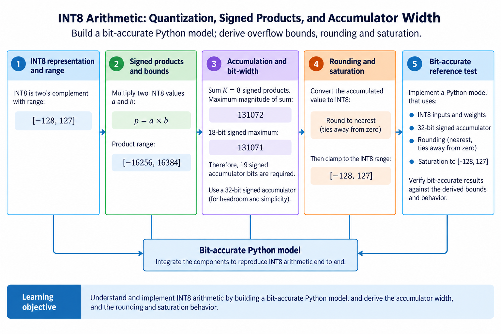
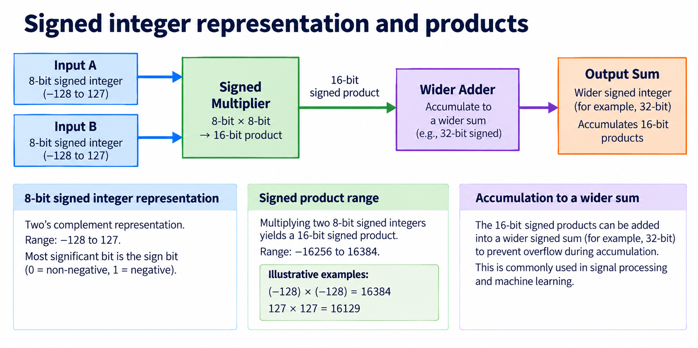
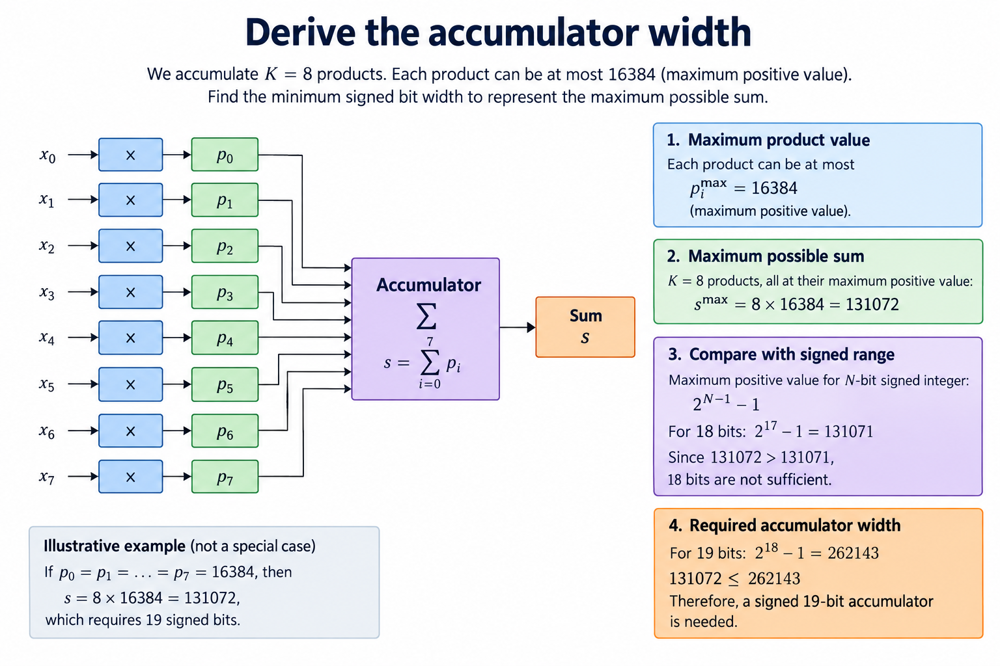
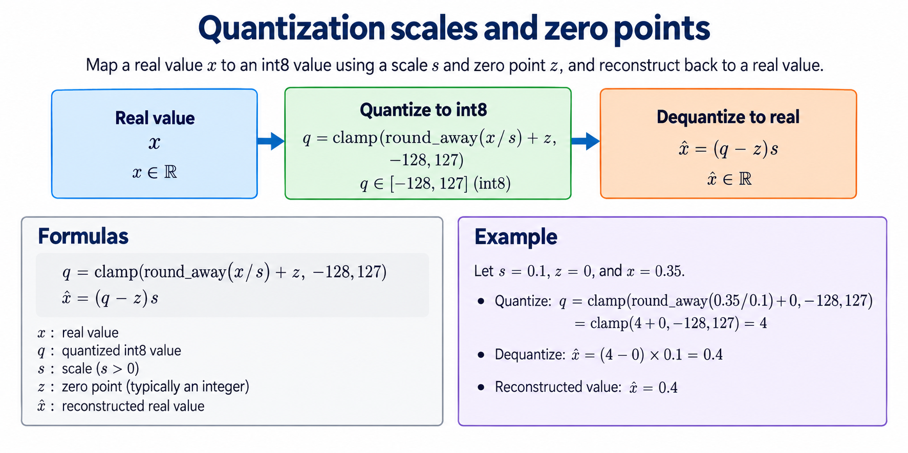
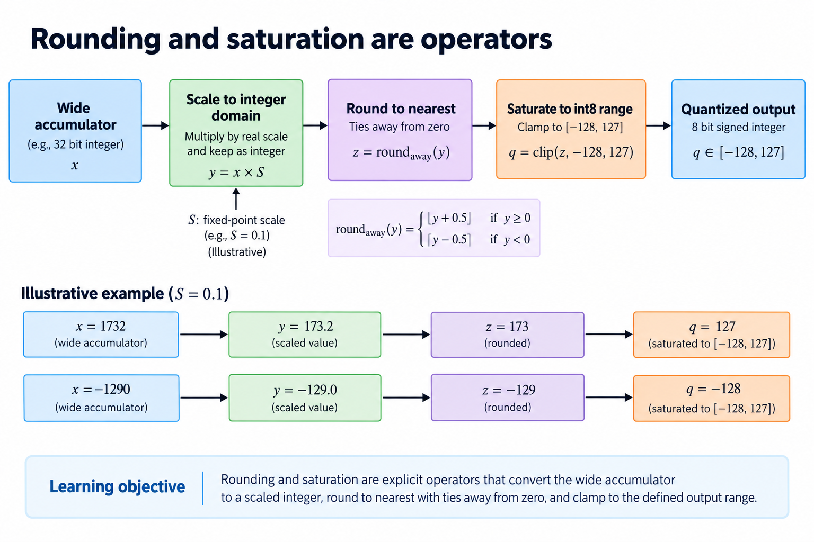
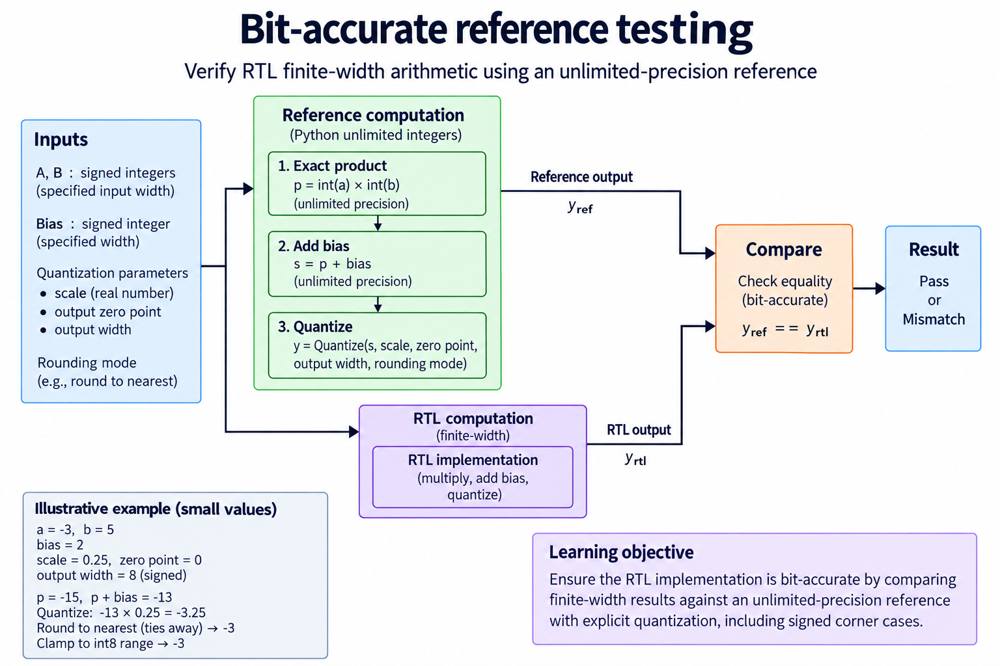

## Overview



This introductory lesson belongs to [FPGA & Digital Hardware Fundamentals](/series/fpga-fundamentals/). Read [dot products and matrix shapes](/blog/ai-arithmetic-dot-products-matrix-shapes-reuse/) first, then continue with the [accelerator project](/series/fpga-ai-chip/).

This lesson extends one educational AI accelerator from its numerical specification toward verified RTL, FPGA integration and an ASIC implementation exercise. The overview shows this chapter's specific responsibility: Build a bit-accurate Python model; derive overflow bounds, rounding and saturation.

The shared project starts with signed INT8 operands and INT32 accumulation, grows into a 4×4 output-stationary array, and provides a verified host-loaded tile top. The larger tiled inference/transport examples are software models. External bus, board and physical-design integration remain explicit exercises. Follow the evidence labels rather than treating every diagram as an executed hardware result.

Start after [Digital Logic for AI Hardware: Registers, Clocks, and State Machines](/blog/fpga-ai-logic-1-digital-logic-for-ai-hardware/). Keep the previous fixture and source revision so this chapter's change can be checked independently.

## Deep dive

### Signed integer representation and products



The signed-number figure includes the most easily missed corner: signed 8-bit values range from -128 to 127. The maximum positive product is -128 times -128=16,384, not 127 squared=16,129. A product of two signed 8-bit operands fits in a signed 16-bit result.

Two's-complement bit patterns require signed interpretation. The byte 0xff represents -1 under INT8, while an unsigned interpretation gives 255. So mixed signed/unsigned expressions can produce a different product even though the input wires carry identical bits.

The Python model checks input range explicitly, and RTL declares signed operands and product. Hardware has finite-width arithmetic; Python integers do not overflow automatically. The reference must apply the intended width/range contract rather than quietly using unlimited arithmetic to bless an overflowing implementation.

### Derive the accumulator width



The width figure accumulates a bound over K products. For K=8 and maximum positive contribution 16,384, the sum can reach 131,072. A signed 18-bit register stops at 131,071, so 19 signed bits are needed for that positive corner. A commonly repeated width shortcut can miss this exact power-of-two boundary.

The general requirement is that the maximum positive sum be strictly less than 2^(W-1), where W is the signed accumulator width. Also check the negative bound and any bias. Our implementation uses INT32 and the reference checks its supported range.

A width budget must include the complete operation. Adding an INT32 bias to a near-limit sum can overflow even if the dot product itself fits. If saturation or wraparound is intended, define where it occurs. This project rejects out-of-contract reference results instead of presenting them as valid INT32 outputs.

### Quantization scales and zero points



The quantization figure maps a real value to an integer using positive scale s and zero point z: q=round(x/s)+z, followed by clipping to the supported range. Reconstruction is approximately (q-z)s. The scale is metadata, not another integer value that may be omitted from the operator.

With symmetric quantization, zero point is 0 and the dot product's real scale is the product of input and weight scales. Nonzero zero points require centering or algebraically equivalent correction terms. Ignoring those corrections changes the mathematical function.

Calibration, trained accuracy and per-channel scale selection belong to a larger model pipeline. Here we fix small illustrative scales and verify arithmetic. That separates circuit correctness from the question of whether a chosen quantized model preserves useful predictive quality.

### Rounding and saturation are operators



The rounding figure treats conversion as an operator. Our helper uses round-to-nearest with ties away from zero, then clips to [-128,127]. It is deliberately explicit because Python's default round uses a different tie rule. A negative arithmetic shift alone also does not implement this rule.

For division by 2, 3 becomes 2 and -3 becomes -2. Values 2 and -2 become 1 and -1. Add the half-step magnitude before shifting the absolute value, then restore the sign. The helper handles shift=0 separately and rejects negative shifts.

After optional bias and ReLU, multiplication by a scaling numerator can require more width than the original accumulator. A hardware epilogue must preserve that intermediate until rounding/clipping. Clipping early can destroy information needed for the final scaled result.

### Bit-accurate reference testing



The testing figure compares finite-width hardware with a specified software oracle. Directed tests include -128,127,0, sign changes and half-step rounding cases. Random tests use a stored seed. Each check names whether it tests the product, running accumulation or converted output.

The signed-extreme model test sums eight -128×-128 products and expects 131,072. The epilogue test converts [-8,3,300] through ReLU and division by 2 to [0,2,127]. These are exact numerical fixtures, not trained-network accuracy tests.

When a mismatch occurs, inspect the earliest intermediate that differs. A correct multiplication followed by a wrong sign extension is a width bug; a correct sum followed by a wrong negative tie is a conversion bug. Testing only final argmax can hide both.

### Run this lesson

Download the [accelerator lab](/labs/fpga-ai-chip/accelerator-lab.zip), extract it and run from its directory:

```sh
python3 lessons.py number-1
python3 -m unittest discover -s tests -v
```

The first command writes `reports/number-1.json`. Inspect its scope and result together. The second runs the independent numerical, addressing and scheduling checks. To reproduce RTL evidence, install Icarus Verilog 13.0 and run `python3 scripts/verify_top.py`; that also runs the block/array tests. These commands are software/RTL checks, not board measurements.

### Reference implementation: round_shift_away

This Python reference is executable behavior, not synthesized hardware. Its range, rounding and layout contract provides an oracle for the corresponding RTL/integration.

```python
def round_shift_away(x,shift):
 if shift<0:raise ValueError('shift must be nonnegative')
 if shift==0:return x
 return (1 if x>=0 else -1)*((abs(x)+(1<<(shift-1)))>>shift)
```

### From specification to an executable check

Create a new working copy of the lab and keep the numerical contract beside its sources. The opening work uses Python to make the values and accepted events explicit before circuit optimization. A direct matrix loop is the independent reference; a cycle-stepped array model explains timing without being the only numerical oracle.

Start with known signed values, not only random data. Distinct elements expose row/column swaps and misaligned reductions. Zero and the signed endpoints expose conversion and width mistakes. A stalled event exposes the difference between offered work, accepted work and elapsed clocks. Keep each fixture so you can compare later changes against the same contract.

When moving the operation into RTL, draw the register boundaries and define reset/clear priority. A value observed before an active edge belongs to the previous state; a value observed after nonblocking updates belongs to the new state. Record that convention in the harness. Otherwise a testbench race can look like a circuit defect.

The acceptance result is a defined behavior and an executed software/RTL check, not a physical clock achievement. Synthesis, board integration and measured performance belong to later milestones. This separation makes the early lesson useful without inventing a hardware result.

### A worked engineering decision

#### Prove the width using the signed endpoints

INT8 has values from -128 through 127. Its most negative input has a larger magnitude than its most positive input. So the largest positive product is (-128)×(-128)=16384, while the most negative product is (-128)×127=-16256. The product range is not symmetric and does not fit a signed 15-bit number, whose maximum is 16383. Use a signed 16-bit product so both endpoints are representable.

For K=8, the largest positive sum of products is 8×16384=131072. A signed 18-bit number reaches only 131071, so it misses the required maximum by 1. At least 19 signed bits are needed for this un-biased reduction. The released accumulator uses INT32, leaving room for the supported tile contract; a broader reduction or bias still requires its own bound. Choosing a familiar width is not a substitute for proving that the complete operation fits.

The distinction matters at exact powers of 2. A formula based on the logarithm of the largest magnitude can be off by 1 if it ignores the signed positive limit, so compare the required minimum and maximum with [-2^(w-1),2^(w-1)-1] for a candidate width w, and add every contribution included in the contract, including bias, before accepting that width. If input ranges are restricted by calibration, record that assumption explicitly and test the unrestricted interface separately if it remains permitted.

#### Follow a negative product through representation

The INT8 bit pattern for -3 is 0xfd. Multiplying -3 by 5 gives -15, represented as 0xfff1 in signed 16-bit two's complement. Extending that product to INT32 replicates the sign bit, producing 0xfffffff1. Zero extension would instead produce the positive integer 65521. A correct multiplier followed by the wrong extension therefore creates a wrong matrix result even though the low product bits look plausible.

Signedness belongs to declarations and expressions. A mixed signed/unsigned expression can change how a tool interprets a bit vector. Make the source operands signed, declare the product width explicitly and widen into the accumulator domain before addition. Keep a directed negative-product fixture in the simulator harness so refactoring a declaration cannot silently change the interpretation. An all-positive random test distribution would not expose this class of mistake reliably.

The Python reference uses arbitrary-precision integers, but it is not permission for hardware to do so. The reference explicitly checks supported input and accumulator ranges. That creates 2 useful failure categories: incorrect finite-width hardware behavior and an operation outside the supported numerical contract. Treating every reference output as automatically representable would hide the latter.

#### Make rounding an operator rather than an adjective

The lab defines division by powers of 2 with nearest rounding and ties away from zero. For a right shift of 1, positive 3 becomes 2 because 3/2=1.5, and negative -3 becomes -2 because -3/2=-1.5. Python's ordinary round uses a different tie convention, so it is not the oracle for this lesson. The supplied round_shift_away function defines the chosen integer behavior directly.

An arithmetic right shift alone rounds negative values differently from nearest ties away: -5 divided by 2 is -2.5 and the chosen result is -3, whereas another rounding rule might select -2, while for an exact -4 divided by 2 the result is -2 under either correct exact-division path, so test exact multiples, values just below and above thresholds, and positive and negative ties. A fixture only at 0 cannot distinguish these implementations.

After scaling and rounding, clamp to the output range. A rounded 150 becomes 127 for signed INT8, while -150 becomes -128. Clamping is not wraparound. Casting an out-of-range wide integer directly to 8 bits may keep low bits and produce an unrelated signed value. Keep the clamp as an explicit operation and compare its boundary behavior. If ReLU is enabled earlier, some negative cases disappear, so test the rounding operator independently as well.

#### Connect the integer contract to model quantization

A generic affine quantizer uses a positive scale and integer zero point. The real value represented by q is approximately scale×(q-zero_point). If inputs have nonzero zero points, matrix accumulation must subtract the appropriate offsets or use an algebraically equivalent implementation. The simple released signed matrix core does not automatically implement every framework's affine quantization convention. A compiler or preprocessing stage must map the model into a compatible operation.

Bias needs compatible accumulator units. Adding a floating-point model bias directly to an INT32 sum is not a meaningful integer operator without a scale conversion. Likewise, output scaling can be per tensor or per channel, and the multiplier/shift approximation must keep that metadata. The tutorial's epilogue is a defined educational function rather than a claim to reproduce all quantized model formats.

Record the numerical path as an ordered sequence: signed interpretation, product, widened reduction, compatible bias, optional activation, scaling, rounding and saturation. Compare intermediate values on a small fixture. A final mismatch then has a specific first divergence instead of a vague explanation that “quantization is inaccurate.” This numerical discipline is what lets a hardware optimization preserve the intended model behavior.

## Conclusion

The outcome of this chapter is a concrete project artifact and a check whose scope is stated explicitly. Preserve numerical results, transaction ordering and lifetime rules as the design grows; optimize only after the baseline is correct. Next, [Your First SystemVerilog Compute Block: A Verified Multiply–Accumulate Unit](/blog/fpga-ai-rtl-1-your-first-systemverilog-compute-block/) adds the next responsibility without changing the established contract.

### Sources

- [Original accelerator lab and verification evidence](https://chiaxinliang.github.io/labs/fpga-ai-chip/accelerator-lab.zip)
