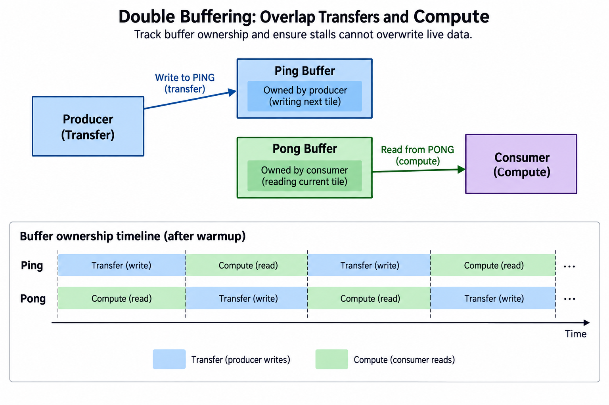
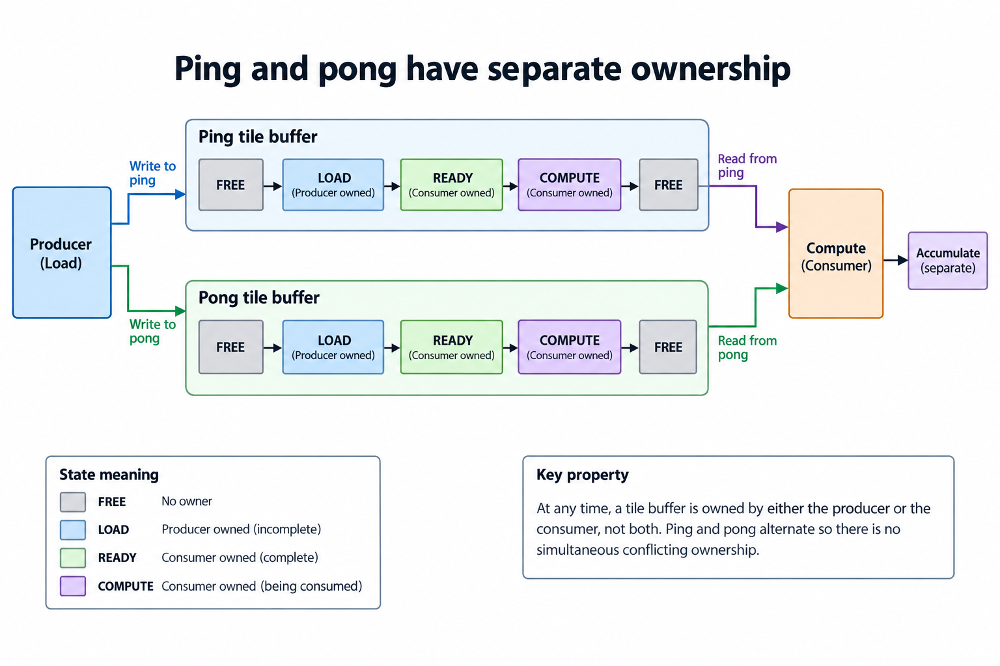
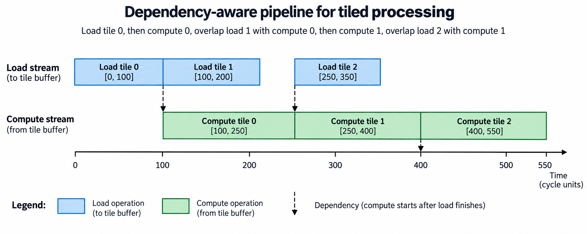
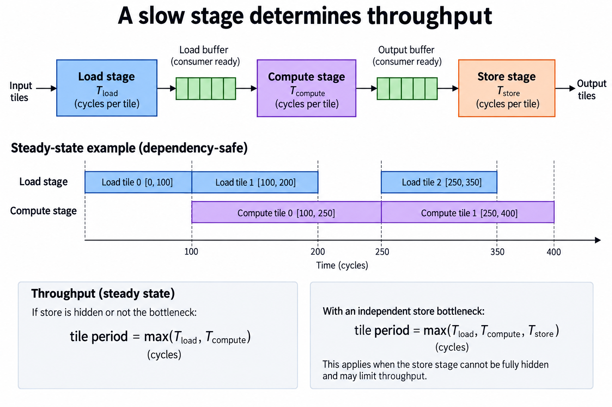
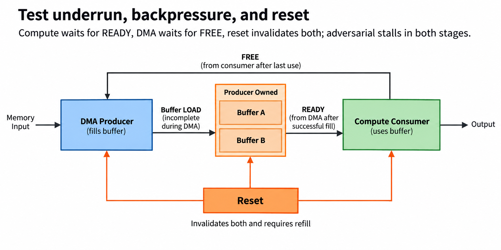

## Overview



This lesson extends one educational AI accelerator from its numerical specification toward verified RTL, FPGA integration and an ASIC implementation exercise. The overview shows this chapter's specific responsibility: Track buffer ownership and verify that stalls cannot overwrite live data.

The shared project begins with signed INT8 operands and INT32 accumulation, grows into a 4×4 output-stationary array, and provides a verified host-loaded tile top. The larger tiled inference/transport examples are software models, while external bus, board and physical-design integration remain explicit exercises. Follow the evidence labels rather than treating every diagram as an executed hardware result.

Start after [Move Tensors with DMA: Addresses, Bursts, and Bounds](/blog/fpga-ai-dma-1-move-tensors-with-dma/). Keep the previous fixture and source revision so this chapter's change can be checked independently.

## Deep dive

### Ping and pong have separate ownership



The ownership figure gives each buffer a lifecycle. FREE can be loaded, READY can be consumed, and COMPUTE remains owned until the tile's last use. A producer must not overwrite a buffer just because another buffer is currently active.

With ping/pong indexing i modulo 2, loading tile i cannot begin before compute(i-2) releases that physical buffer. The schedule model enforces that dependency, plus single-loader and single-compute serialization.

A valid flag alone is too vague unless its transitions define ownership. Reset invalidates both buffers. An error during load must not leave a partially filled buffer marked READY.

### Draw the dependency timeline



The timeline loads tile 0 first, then overlaps compute 0 with load 1. Computation waits for its own input fill; later loads wait for both loader availability and buffer release. The trace records start/end intervals for each stage.

The exercise uses four loads of 100 cycles and computes of 150 cycles. Its modeled final completion is 700 cycles: 100 startup plus four 150-cycle compute periods. Sequential load/compute would total 1000 cycles under the same ideal assumptions.

Those are analytical schedule results, not measured FPGA speedups. Additional stalls, store traffic and shared-memory contention can change the outcome. The model makes dependencies explicit so those costs can be added rather than hidden.

### A slow stage determines throughput



The bottleneck figure approximates steady tile period by max(Tload,Tcompute) under ideal two-stage overlap. If load is slower, compute waits; if compute is slower, the loader eventually waits for a free buffer.

Increasing buffers can absorb variation and expose more independent work, but cannot fix a permanent stage-rate mismatch. More buffering also increases live memory and control state. A capacity budget must include all copies.

Measure stage intervals and complete job time separately. A fast average load can still cause an occasional underrun that gates a latency-sensitive job. Preserve raw schedules and distributions instead of reporting only the ideal formula.

### Test underrun, backpressure, and reset



The adversarial-test figure uses varying load/compute durations. The test ensures each compute follows its load and each reused buffer follows its previous compute. It also preserves stage serialization.

To implement RTL, encode ownership transitions and use completion events from DMA/compute rather than predicted timers. Delays should be allowed to vary without corrupting state. Global array stalls must also hold operand progression.

The executable schedule is a design oracle, not RTL double-buffer integration. Compare a hardware trace against these dependency constraints and its numerical outputs. Overlap is successful only when it improves the chosen timing metric without losing or reusing the wrong tile.

### Run this lesson

Download the [accelerator lab](/labs/fpga-ai-chip/accelerator-lab.zip), extract it and run from its directory:

```sh
python3 lessons.py overlap-1
python3 -m unittest discover -s tests -v
```

The first command writes `reports/overlap-1.json`. Inspect its scope and result together. The second runs the independent numerical, addressing and scheduling checks. To reproduce RTL evidence, install Icarus Verilog 13.0 and run `python3 scripts/verify_top.py`; that also runs the block/array tests. These commands are software/RTL checks, not board measurements.

### Verify ownership and completion, not only payload

A transfer request and a completed buffer are different states, so mark a tile READY only after the required bytes and response status are available, keep a COMPUTE buffer owned until its last use and only then permit refill, and note that the two-buffer scheduler also prevents a load from overwriting the previous tile assigned to the same physical buffer.

Address calculations use bytes throughout the interface. INT8 inputs and INT32 outputs have different element widths, so a correct index with the wrong multiplier still targets the wrong memory. Validate dimensions, range, alignment and relevant overlap before issuing work. The software model checks these preconditions and preserves memory when a command is rejected.

The integrated RTL top implements fixed on-chip operand storage, validated dimensions and a globally stepped tile controller. Its host-load port is deliberately simple and is not AXI, MMIO or external DMA. The functional command/memory model teaches a broader transport contract. Connecting a real bus requires its own request/response and ordering verification.

Completion means the declared output is usable under the selected interface. An issued store, a queue entry and a successful response may represent different milestones. Keep that event explicit in status and timing. Tests should cover delayed progress, invalid commands and reset/recovery as well as the uninterrupted numerical path.

### A worked engineering decision

#### Derive the 2-buffer schedule from dependencies

Assume an illustrative load takes 100 cycles and compute takes 150 cycles. Load tile 0 into ping over [0,100], then compute it over [100,250]. During that computation, load tile 1 into pong over [100,200]. Tile 1 cannot compute until both its own load is complete and the compute resource is free, so it computes over [250,400]. These are analytical intervals, not measured FPGA timing.

Tile 2 uses ping again. Its load cannot begin before compute tile 0 releases ping at 250, even though the loader finished tile 1 at 200. So load tile 2 occupies [250,350], followed by compute tile 2 over [400,550]. Tile 3 uses pong only after compute tile 1 releases it at 400. The ownership dependency is what makes the timeline valid; drawing overlapping colored bars without it can overwrite a live input.

The supplied scheduler computes each load start from loader availability and the prior consumer of the same physical buffer, it computes each compute start from its own completed load and prior compute completion, and the tests vary both stage durations to check those inequalities, so a particular load/compute ratio is not required for correctness, although it changes whether stalls appear.

#### Explain steady-state throughput with its assumptions

When independent load and compute resources overlap under the stated storage schedule, the long-run tile period approaches the slower stage's time, subject to setup and resource constraints. For the 100/150 example, compute is the limiting stage. The loader has intentional idle intervals because only 2 regions are available and ping or pong remains owned by computation. Those idle intervals do not imply the dependency rules should be bypassed.

If store is another bottleneck, include its resource and storage lifetimes, since a formula max(Tload,Tcompute) assumes store is hidden or not limiting in the selected model: an independent pipelined store stage would lead to a period constrained by all relevant stages, while a shared load/store interface can introduce combined bandwidth contention, so state those conditions instead of using the 2-stage formula as a universal accelerator prediction.

Finite jobs also include warmup and drain, because the first tile must be loaded before computation and the final tile must complete its declared output boundary, so a steady-state diagram starting with pong already in compute should say explicitly that it is after warmup, and end-to-end latency for a short job can differ a lot from the number of tiles times the steady-state period.

#### Use ownership states as invariants

FREE permits a new producer to acquire the region. LOAD is producer-owned and incomplete. Successful fill makes READY, allowing the consumer to acquire it for COMPUTE. The consumer then releases FREE after its last use. READY comes from producer completion; FREE comes from consumer release. Reversing those signals can make a controller compute unfinished data or overwrite values still in use.

At a given instant, the producer writes only its owned region and the consumer reads only its completed region. A figure showing both a write arrow and compute ownership on pong is invalid unless a permitted nonconflicting partition is explicitly defined. The simple exercise has whole-tile ownership, so it does not support that exception. Ping and pong are physical regions, not just labels for 2 operations accessing the same bytes.

Reset invalidates the modeled states and cancels the selected pending work. The next job must refill any region whose contents are no longer declared valid. A production bus implementation must also handle outstanding responses and partially completed writes under its own recovery contract. The analytical scheduler does not execute that bus behavior and should not claim to do so.

#### Test underrun, backpressure and resource reuse

For underrun, make load slower than compute. The consumer should wait for the next region to become READY, and no useful operation should read an incomplete buffer. For backpressure, make compute slower than load. The producer may finish filling the alternate region, then must wait rather than overwrite the region still owned by computation. These are expected schedule outcomes, not failures to overlap.

Check same-buffer reuse across tiles 0 and 2, then 1 and 3. That is where a schedule checking only adjacent load and compute stages can miss an overwrite. Verify the start of load i is at or after compute i-2 finishes, and compute i starts after load i finishes. Keep the loader and compute resource intervals nonoverlapping with themselves. The tests implement these concrete inequalities.

A useful numerical integration fixture fills each tile with distinguishable values or tags. An overwritten tile may still produce a plausible sum if adjacent tiles are identical. Sequence tags make ownership bugs visible before evaluating a complete inference. Compare final outputs with an independent reference while also retaining the schedule ledger.

This release verifies the analytical 2-buffer scheduler in software; it does not integrate RTL DMA and double-buffer control into the fixed host-loaded top. The extension has a clear contract to implement: completed fills, whole-region ownership, global array step and successful output completion. The value of overlap is reducing idle time within those rules, not allowing the consumer to skip them.

#### Extend the next boundary

An extension with more than 2 buffers should assign a physical region to each live tile explicitly. More capacity can let the loader proceed earlier, but resource intervals and consumer completion still bound reuse. Re-run the same-buffer ownership inequalities using the actual region assignment, rather than assuming tile i-2 remains the relevant predecessor. Retain distinguishable tile payloads and compare output order as well as values. Queue depth is a performance parameter only after these lifetime rules are established. A larger queue that overwrites or reorders required work cannot be evaluated as a throughput improvement.

## Conclusion

The outcome of this chapter is a concrete project artifact and a check whose scope is stated explicitly. Preserve numerical results, transaction ordering and lifetime rules as the design grows; optimize only after the baseline is correct. Next, [Command Registers and Scheduling: Make the Accelerator Programmable](/blog/fpga-ai-control-1-command-registers-and-scheduling/) adds the next responsibility without changing the established contract.

### Sources

- [Original accelerator lab and verification evidence](https://chiaxinliang.github.io/labs/fpga-ai-chip/accelerator-lab.zip)
