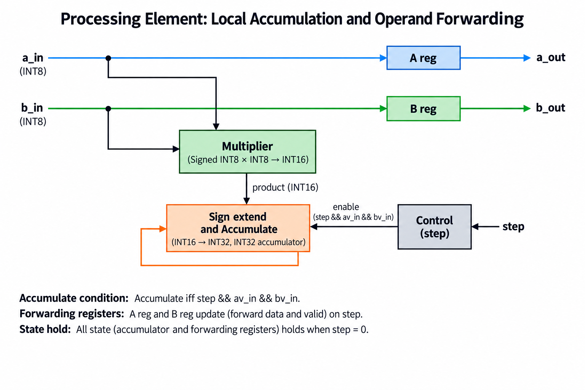
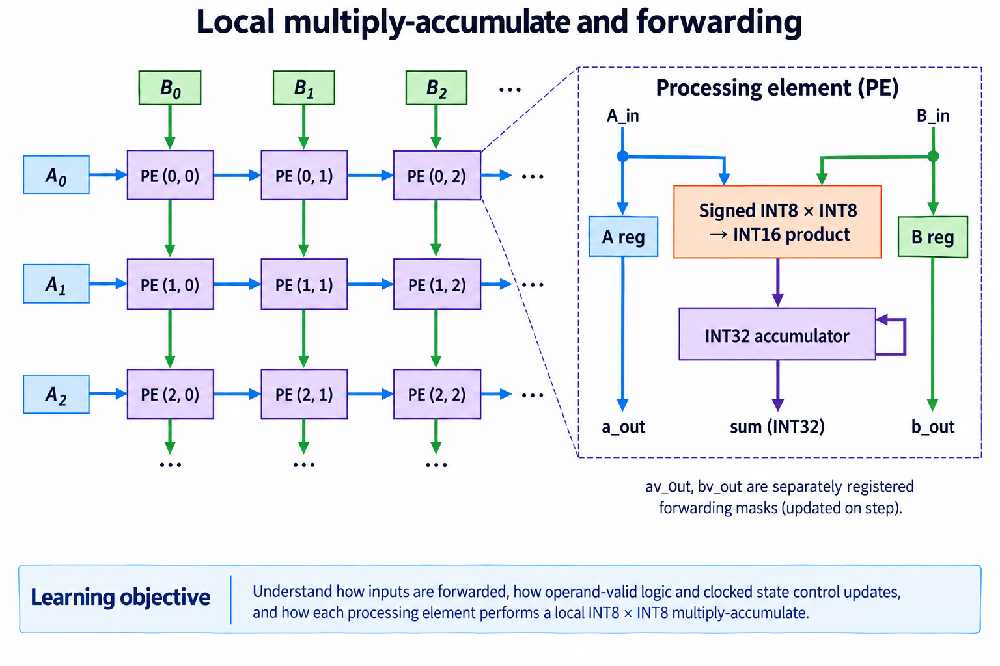
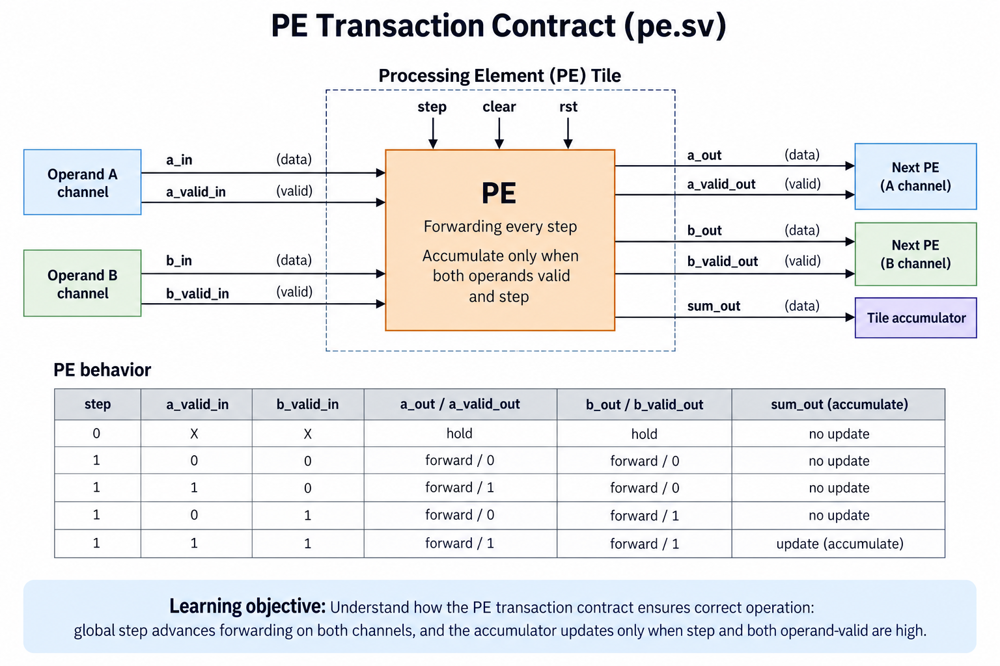
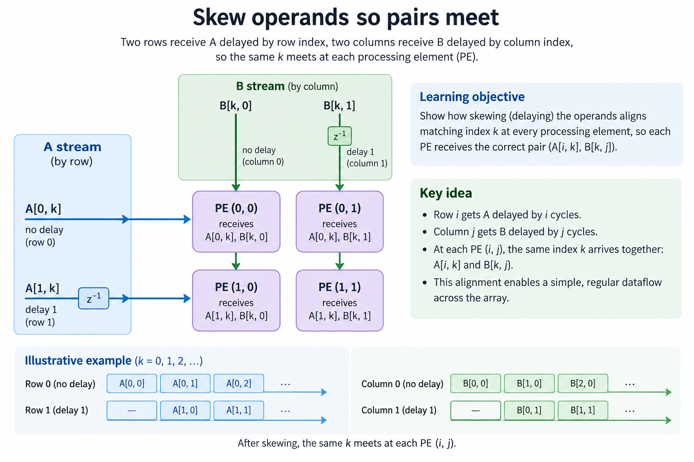
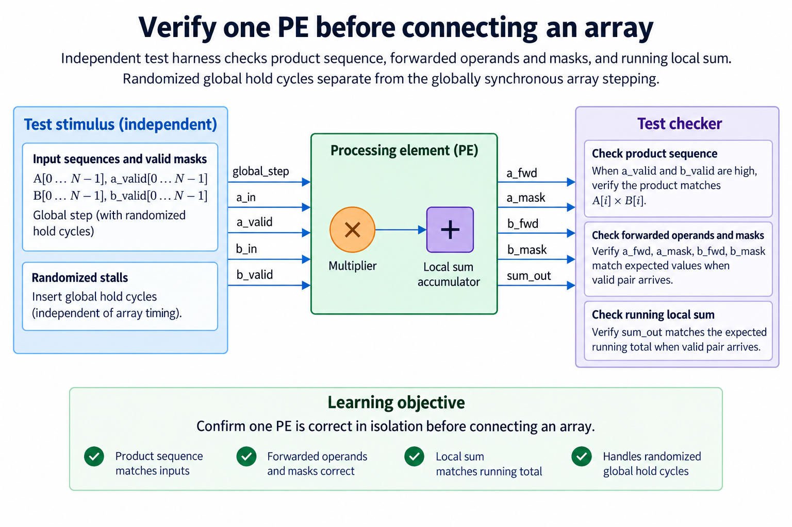

## Overview



This lesson extends one educational AI accelerator from its numerical specification toward verified RTL, FPGA integration and an ASIC implementation exercise. The overview shows this chapter's specific responsibility: Specify a PE protocol and verify its state, accumulation and forwarding independently.

The shared project begins with signed INT8 operands and INT32 accumulation, grows into a 4×4 output-stationary array, and provides a verified host-loaded tile top. The larger tiled inference/transport examples are software models, while external bus, board and physical-design integration remain explicit exercises. Follow the evidence labels rather than treating every diagram as an executed hardware result.

Start after [Ready/Valid Interfaces: Backpressure Without Lost Results](/blog/fpga-ai-stream-1-ready-valid-interfaces/). Keep the previous fixture and source revision so this chapter's change can be checked independently.

## Deep dive

### Local multiply-accumulate and forwarding



The PE figure adds forwarding to local accumulation. A travels horizontally, B vertically, and a local INT32 sum retains the output contribution. Clocked forwarding means a neighbor receives a value one accepted global step later.

Each operand also carries validity, so the PE accumulates only when both required operands are valid at that location, and padding with zero values alone is not a complete protocol: a mask also distinguishes a real INT8 zero from an absent operand.

The source uses a common step signal for every PE, so when step is low the forwarding registers, masks and sums all hold, which makes a synchronous wavefront stall safely across all 16 PEs, though it does not provide independent ready/valid queues on every link.

### Choose the PE transaction contract



The contract figure defines clear, step and result lifetime: clear removes the previous sum and forwarding validity, a step samples the current operands and propagates them, a valid pair contributes one product, and the final INT32 sum becomes meaningful only after all required contributions arrive.

There is no autonomous K counter inside pe.sv. The array/system scheduler knows the tile's reduction length and fill/drain requirements. Confusing a PE's local value with a globally complete tile can cause early stores.

For pairs (2,3),(-4,5),(7,-2), the local products are 6,-20,-14 and the sum is -28. An intervening invalid pair forwards its mask but contributes nothing. A stalled global step contributes nothing and does not advance the wavefront.

### Skew operands so pairs meet



The skew figure makes matching reduction indices arrive together, and in a regular output-stationary array row i's input enters after i initial steps while column j's weight enters after j, so their kth operands meet at location (i,j) on step k+i+j.

Without skew, a PE away from the top-left can multiply operands from different reduction positions. The resulting output can look plausible for constant inputs while failing varied matrices. That is why test vectors must contain distinct values and signs.

The driver generates skew at the array boundary; individual PEs implement one-hop forwarding. Keep those responsibilities separate so the local block remains reusable. Global stalls hold the driver's logical step as well as the array state.

### Verify one PE before connecting an array



The local-verification figure checks sum, forwarding and masks independently. The full-array test also compares final outputs against direct matrix multiplication, providing a system check with different structure.

Before connecting a grid, exercise reset, clear, valid/invalid pairs and a stalled step. After connection, use irregular valid dimensions and verify that inactive output locations remain zero. A mask bug can otherwise store stale values beyond the matrix boundary.

The outcome is a verified educational PE with a precise globally stepped contract. To make links independently stallable, redesign buffering and acceptance, then prove that matched operand pairs remain aligned. That extension is substantial; adding one ready signal to the current PE is not enough.

### Run this lesson

Download the [accelerator lab](/labs/fpga-ai-chip/accelerator-lab.zip), extract it and run from its directory:

```sh
python3 lessons.py pe-1
python3 -m unittest discover -s tests -v
```

The first command writes `reports/pe-1.json`. Inspect its scope and result together. The second runs the independent numerical, addressing and scheduling checks. To reproduce RTL evidence, install Icarus Verilog 13.0 and run `python3 scripts/verify_top.py`; that also runs the block/array tests. These commands are software/RTL checks, not board measurements.

### Source: rtl/pe.sv

This is the released executable source for this step. Preserve its stated protocol/width assumptions when adapting it.

```systemverilog
module pe(input logic clk,rst,clear,step,
 input logic signed [7:0] a_in,b_in,input logic av_in,bv_in,
 output logic signed [7:0] a_out,b_out,output logic av_out,bv_out,
 output logic signed [31:0] sum);
 wire signed [15:0] product=$signed(a_in)*$signed(b_in);
 always_ff @(posedge clk)begin
  if(rst || clear)begin a_out<=0;b_out<=0;av_out<=0;bv_out<=0;sum<=0;end
  else if(step)begin
   a_out<=a_in;b_out<=b_in;av_out<=av_in;bv_out<=bv_in;
   if(av_in && bv_in)sum<=sum+{{16{product[15]}},product};
  end
 end
endmodule
```

### Connect the block without changing its contract

Write the accepted-work event for every boundary: for a ready/valid stream it is valid AND ready at the sampled edge, while for the released systolic core it is a common global step, and because those are different protocols, connecting them requires buffering or a scheduler that preserves matched operand pairs and advances every affected state consistently.

Track data and validity together. A register can contain old bits while its valid flag is false; those bits must not become an output transaction. Clear/reset invalidates pending work according to the chosen contract. If a pipeline is stalled, its payload, validity and ownership must remain aligned. A consumer may not reuse a buffer before its producer/previous consumer completes the relevant stage.

Use a FIFO scoreboard to check sequence as well as values. A test that counts transactions alone can miss swapped payloads, while a test of a final sum alone can hide duplicated and missing items that cancel numerically. Directed reset/stall fixtures supplement reproducible random traffic.

After a local block passes, connect one additional boundary at a time and retain the same oracle. A passing simulation supports the exercised contract, not physical timing or every possible sequence. Keep the released test report with the exact source revision so a later wrapper or pipeline change creates an explicit new verification step.

### A worked engineering decision

#### Keep forwarded operands separate from arithmetic results

An output-stationary processing element receives an A operand from its left and a B operand from above, forwards those operands toward neighboring PEs and updates its own local accumulated C value, and because the forwarded A is still A and the forwarded B is still B, neither the product nor the local sum substitutes for them, which is why a diagram that routes a multiplier output into A-out would describe a different computation and break the intended matrix mapping.

The released PE registers its forwarded operands and their separate validity masks on a global step. The multiplier uses the matched current input pair, and its signed product contributes to local INT32 state only when both masks are valid. A step with one invalid operand still advances the forwarding state and masks, while skipping the local multiply. That is important during array filling and draining, where not every PE has useful work on every logical step.

A global hold leaves forwarding data, masks and the accumulator unchanged together. Holding only the sum while forwarding operands would change the wavefront alignment, while holding operands but updating the sum could duplicate a product. So the common step is a protocol for the entire PE state, not just an arithmetic enable. The test harness and array driver use that same event definition.

#### Derive the local reduction from the intended pair

For output C[i,j], the PE must combine A[i,k] with B[k,j] for each required reduction index k. The shared index is k, not the row or column index. Row and column skew at the array boundary ensures corresponding k values meet after forwarding delays. Before connecting the array, a local fixture can directly supply matched pairs and compare the expected running sum.

Use A sequence [2,-4,7] and B sequence [3,5,-2], yielding products [6,-20,-14] and total -28. Insert an invalid A mask on one offered clock and confirm that the sum does not update for that clock. Then use an invalid B mask, a global hold and clear. Compare forwarded values/masks separately from the arithmetic sum. A correct total does not establish correct forwarding, because other PEs depend on those forwarded operands.

Clear begins a new local reduction under the declared control priority. It is not a command queue or a host-visible DONE mechanism. The PE does not accept K as a configured counter limit and does not decide that the complete tile has finished. The tile controller knows how many logical array steps are required and when all local results can be captured. Keeping those responsibilities separate makes the small PE reusable and its figure accurate.

#### Verify the register-level contract independently

An isolated test should know which operand is expected at the forwarded output after each stepped edge. It should also know which validity mask accompanies it. During a global hold, all 4 forwarded fields retain their previous state. When a new step contains an invalid operand, its forwarded bits can still be present, but the mask prevents the downstream PE from counting them as useful work.

The oracle for the local sum uses the original input pair and control conditions. The forwarding checker uses the original A/B sequence, not a product or sum obtained from the DUT. Logging input tags can make a mismatch obvious: expected reduction index 2 arriving as index 1 suggests a delay or hold defect, while a correctly tagged pair with a wrong signed product suggests arithmetic interpretation. This split lets the checker identify the first violated responsibility.

Randomized global stalls are useful because they separate elapsed clocks from logical array steps. The numerical reduction must be unchanged when arbitrary hold clocks are inserted. Keep the same accepted logical sequence and compare both the unstalled and stalled run with the independent reference. The released verification exercises this behavior at the array level as well as checking constituent arithmetic blocks.

#### Understand the cost of scaling the PE

Connecting 16 PEs creates more than 16 independent MACs. Boundary operand supply, skew storage, clear/step fan-out, result collection and physical routing become system resources. The local reuse is valuable because one incoming A can reach several columns and one B can reach several rows, but forwarding consumes registers and switching activity. It is not zero-cost broadcast or unlimited bandwidth.

The output-stationary sum remains at its PE through the complete reduction. Result collection therefore needs access to every local C[i,j], not only outputs at the bottom row. The educational array exposes a packed result bus. A physical implementation may choose a serialized collection network or banked output storage, which introduces another schedule and completion boundary. That change should preserve local output ownership and be independently tested.

A globally stepped architecture is intentionally simple, and it avoids independent per-PE elastic state, though a missing required boundary operand can stall all 16 PEs at once, while more elaborate designs can overlap tiles or use local queues and still must preserve matched reductions and bounded storage, so their benefit should be evaluated against the same useful operation rather than inferred from additional blocks in a drawing.

The practical result of this lesson is a PE with a narrow, verified responsibility: forward unchanged operands and masks, update a local signed sum for valid matched pairs, and hold all relevant state consistently. That is enough to construct the next array chapter. It is not a complete accelerator instruction set, a DMA engine or a host protocol, and its local simulation does not establish a physical clock target.

## Conclusion

The outcome of this chapter is a concrete project artifact and a check whose scope is stated explicitly. Preserve numerical results, transaction ordering and lifetime rules as the design grows; optimize only after the baseline is correct. Next, [Build a 4×4 Systolic Array and Trace Every Cycle](/blog/fpga-ai-array-1-build-a-4x4-systolic-array-and-trace-every-cycle/) adds the next responsibility without changing the established contract.

### Sources

- [Original accelerator lab and verification evidence](https://chiaxinliang.github.io/labs/fpga-ai-chip/accelerator-lab.zip)
