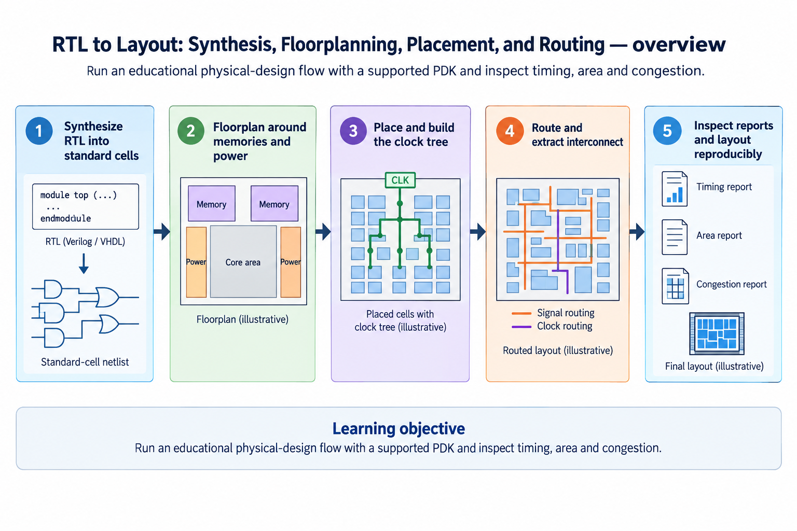
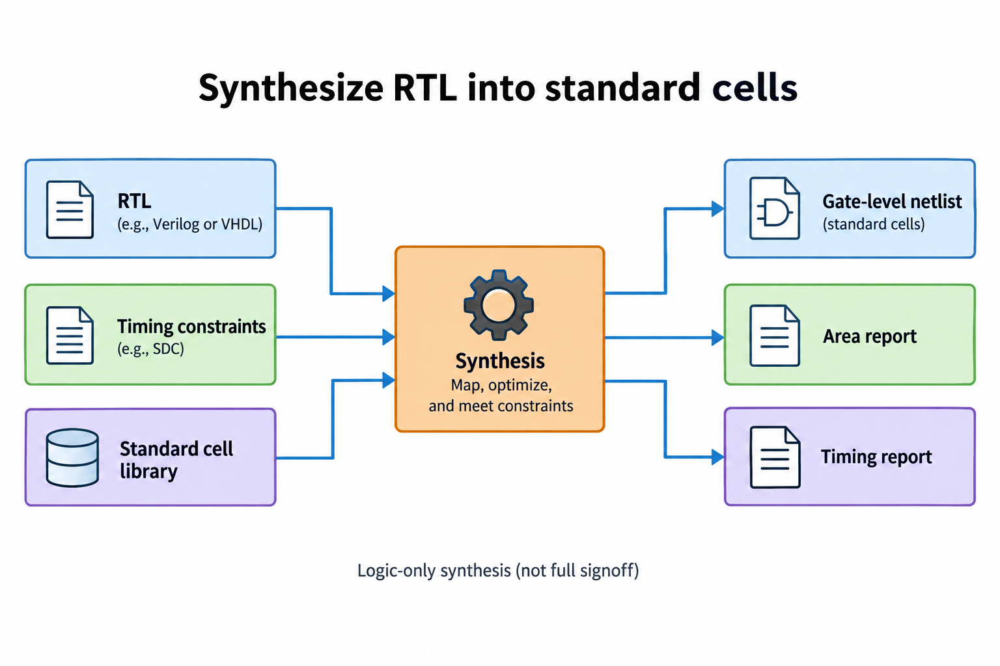
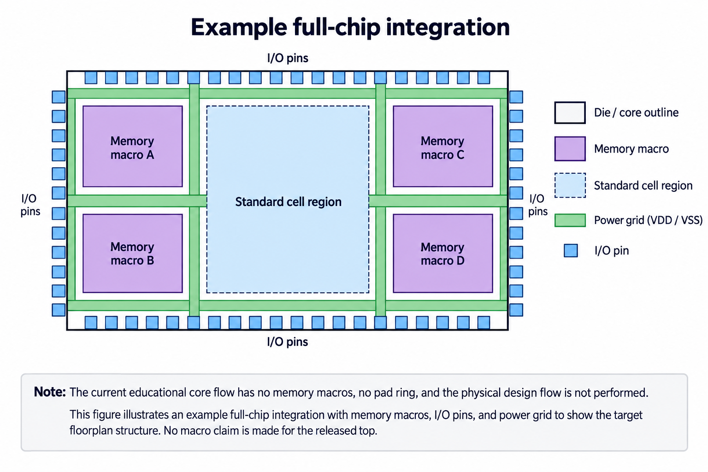
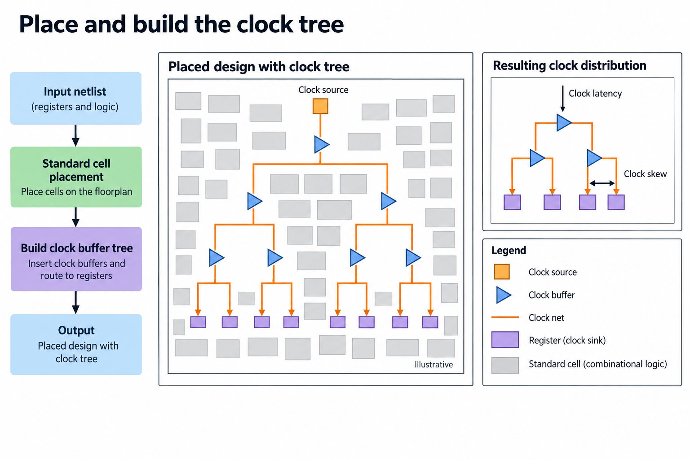
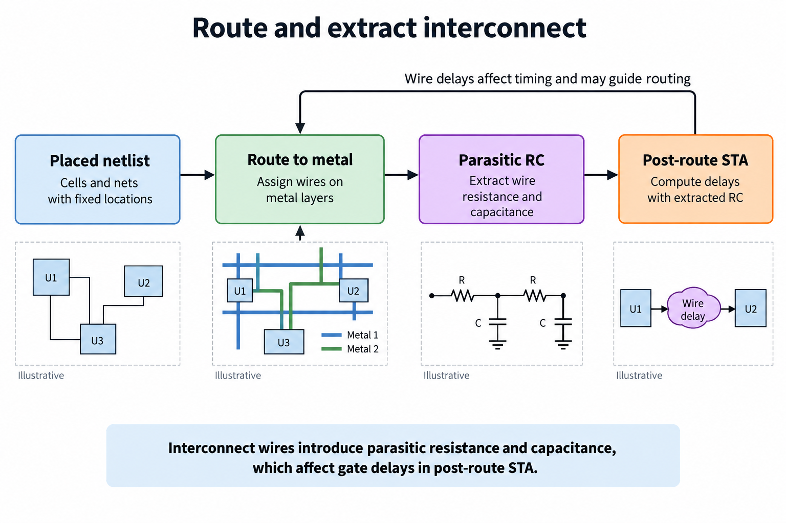
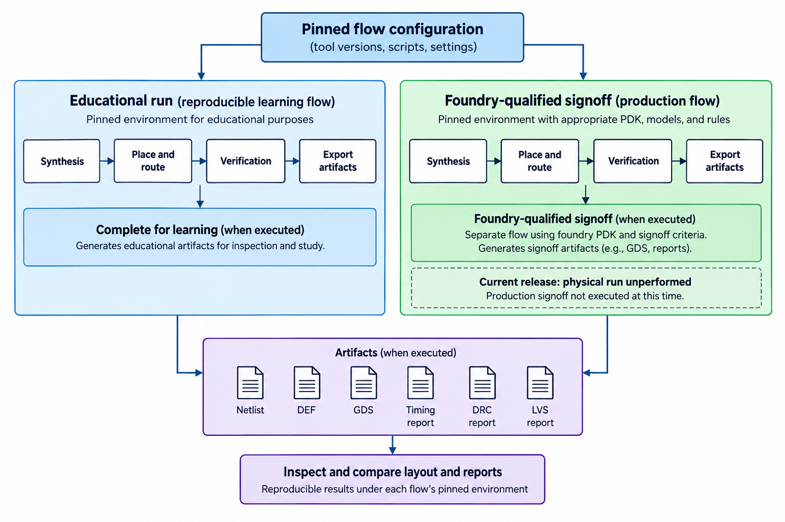

## Overview



This lesson extends one educational AI accelerator from its numerical specification toward verified RTL, FPGA integration and an ASIC implementation exercise. The overview shows this chapter's specific responsibility: Run an educational physical-design flow with a supported PDK and inspect timing, area and congestion.

The shared project begins with signed INT8 operands and INT32 accumulation, grows into a 4×4 output-stationary array, and provides a verified host-loaded tile top. The larger tiled inference/transport examples are software models, while external bus, board and physical-design integration remain explicit exercises. Follow the evidence labels rather than treating every diagram as an executed hardware result.

Start after [From FPGA to ASIC: Replace Device Primitives and Preserve Behavior](/blog/fpga-ai-portable-1-from-fpga-to-asic/). Keep the previous fixture and source revision so this chapter's change can be checked independently.

## Deep dive

### Synthesize RTL into standard cells



The synthesis figure combines RTL, cell libraries and timing constraints into a gate-level netlist. Logic optimization maps arithmetic and registers to available cells. The resulting area/timing reports depend on the target library and constraints.

The supplied OpenROAD-flow-scripts configuration targets educational Nangate45. It is not a production foundry PDK or a fabrication-ready release. Pin the actual flow revision before running and retain its environment.

RTL simulation is a prerequisite but does not establish cell timing. A synthesized netlist can also require equivalence or gate-level checks. Read warnings about unsupported constructs, missing libraries and unconnected signals before proceeding.

### Floorplan around memories and power



The floorplan figure allocates core area, I/O and space for macros/power. Utilization leaves room for routing and physical repair; a maximum-density rectangle can be impossible to route or time.

The released small top has behavioral banked storage rather than a placed SRAM macro. A larger accelerator needs real macro dimensions, placement, power pins and timing models. Reserve those only from documented target data.

Power delivery belongs to physical integration, not the mathematical matrix diagram. Full-chip pads, package planning and production signoff are beyond this educational core configuration and must not be implied by a generated GDS file.

### Place and build the clock tree



The placement figure locates standard cells and builds a clock distribution network. Data paths and clock arrival both affect setup/hold. A logically equivalent netlist can have very different wire delay under another placement.

Clock-tree synthesis balances the implemented network under its constraints, not an ideal zero-skew assumption. Read clock latency/skew reports and resulting data-path slack. Excessive fanout or congestion can create new bottlenecks.

Do not fix timing by adding unsupported exceptions. If a path is functionally real, it needs a design, placement or target change. Maintain the verified latency/protocol contract when adding registers.

### Route and extract interconnect



The routing figure connects placed cells with legal wires, then extraction models parasitic resistance/capacitance. Post-route timing uses those wire effects. A pre-route estimate and extracted final report are different evidence.

DRC checks geometry under provided rules; LVS compares extracted layout connectivity against the expected netlist. Passing one does not establish the other. Missing macro views can prevent meaningful checks.

The release has not run this physical flow and contains no generated layout or signoff results. The script/configuration is an exercise entry point whose outputs must be executed, inspected and retained.

### Inspect reports and layout reproducibly



The artifact figure packages netlists, constraints, layout and reports with tool/library revisions. The OpenROAD documentation describes the physical stages and flow ecosystem; the supplied configuration applies them to the educational top.

From a supported checkout, run make -C flow DESIGN_CONFIG=/absolute/path/to/accelerator-lab/asic/config.mk. Inspect the actual output paths produced by that revision rather than assuming one universal report location.

A successful educational run teaches implementation tradeoffs. Foundry fabrication additionally requires permitted PDK/models, full-chip integration, test strategy and appropriate signoff. The distinction is a learning milestone, not a reason to invent a completed chip.

### Run this lesson

Download the [accelerator lab](/labs/fpga-ai-chip/accelerator-lab.zip), extract it and run from its directory:

```sh
python3 lessons.py physical-1
python3 -m unittest discover -s tests -v
```

The first command writes `reports/physical-1.json`. Inspect its scope and result together. The second runs the independent numerical, addressing and scheduling checks. To reproduce RTL evidence, install Icarus Verilog 13.0 and run `python3 scripts/verify_top.py`; that also runs the block/array tests. These commands are software/RTL checks, not board measurements.

### Source: asic/config.mk

This is the released executable source for this step. Preserve its stated protocol/width assumptions when adapting it.

```makefile
# Educational Nangate45 target; not a foundry fabrication/signoff package.
LAB_ROOT := $(abspath $(dir $(lastword $(MAKEFILE_LIST)))/..)
export DESIGN_NAME = accelerator_top
export PLATFORM = nangate45
export VERILOG_FILES = $(LAB_ROOT)/rtl/pe.sv $(LAB_ROOT)/rtl/systolic_array.sv $(LAB_ROOT)/rtl/accelerator_top.sv
export SDC_FILE = $(LAB_ROOT)/asic/constraints.sdc
export CORE_UTILIZATION = 30
export PLACE_DENSITY = 0.40
export TNS_END_PERCENT = 100
```

### Source: asic/constraints.sdc

This is the released executable source for this step. Preserve its stated protocol/width assumptions when adapting it.

```tcl
create_clock -name core_clk -period 10.0 [get_ports clk]
set_input_delay 2.0 -clock core_clk [get_ports {rst start step_enable wr_en wr_addr* wr_data* m* n* k* rd_addr*}]
set_output_delay 2.0 -clock core_clk [get_ports {rd_data* busy done error}]
```

### Keep behavioral and physical evidence separate

Portable RTL is an entry point to implementation, not a fabrication-ready package. The educational flow must combine it with a supported cell library, constraints and appropriate models. Larger memory structures need permitted macros with simulation, timing and physical views that agree on their behavior. FPGA initialization and primitive assumptions cannot be carried over silently.

Inspect each stage's evidence: synthesis mapping, floorplan/placement, clock distribution, routed interconnect and extracted timing. A layout file is not a substitute for DRC, LVS or STA. Unconstrained paths and missing views can make an apparently successful report incomplete. Record the exact target and flow revision.

The supplied configuration uses educational Nangate45 and has not been executed in this release. It is not a foundry signoff package. The small core also lacks a production pad ring, scan insertion and fabrication/board integration. Those are later target-specific milestones with distinct evidence, rather than properties inferred from a passing RTL test.

Retain a manifest of sources, tests, constraints and tool/model versions. Numerical and protocol tests remain reproducible while new wrappers or physical stages are added. Before fabrication, close the actual full-chip electrical, physical and test requirements and prepare a bring-up plan. The learning result is a traceable transition from verified behavior to implementation, with unperformed checks left explicitly unclosed.

### A worked engineering decision

#### Pin the complete educational flow input set

The included ASIC configuration selects accelerator_top, the portable PE/array sources, a simple SDC and the educational Nangate45 platform. It is a concrete starting configuration for a supported OpenROAD-flow-scripts checkout. Pin the checkout, tool versions and platform libraries before execution, and retain the exact command and console output. The current release has not executed this flow or produced DEF, GDS, parasitic extraction, DRC/LVS or signoff timing reports.

Nangate45 supports an educational standard-cell exercise; it is not authorization or evidence for fabrication in a commercial process. The configuration contains no selected SRAM macro, pad ring, scan insertion or foundry-approved full-chip signoff package. A figure showing generic memory blocks and power routing explains additional physical design responsibilities, rather than claiming those objects are instantiated in the released core.

The SDC declares an illustrative 10-ns clock and 2-ns interface delays for the core boundary. Every timing result depends on such assumptions. A successful report with unconstrained ports is not a complete timing result. Before interpreting slack, review clock definitions, input/output delays, generated clocks if present and exceptions. Target-specific requirements must replace illustrative values in a real system.

#### Follow the artifacts through the implementation stages

Synthesis maps behavior into cells under the selected logical library and constraints. Its netlist, cell totals and estimated timing provide an early implementation view. They do not include all final routing parasitics. Placement assigns cells to physical locations; floorplanning establishes core geometry, regions, pins and any macros. Resource legality and routability depend on the selected physical views and power structure.

Clock-tree synthesis inserts and routes a clock distribution to sequential sinks. Clock latency and skew affect setup and hold, while clock routing also consumes physical resources. A data-path diagram and a clock-tree diagram describe different nets. Connect clocks to register/resource clock pins, not to generic combinational blocks or data outputs. Retain the post-clock-tree checks before proceeding to detailed routing.

Routing assigns interconnect and legal layers/vias. Extraction then models the selected parasitic resistance and capacitance used by post-route timing analysis. Wire delay can change which path is limiting and can expose hold as well as setup issues. Re-running optimization may alter cells or routes, so retain the final consistent artifact set rather than mixing an old netlist with a new extracted model.

#### Read results as evidence at a specific milestone

An educational run can produce complete artifacts for its learning scope without becoming production signoff. Conversely, using a foundry-qualified tool does not automatically make an incomplete input set ready. The chosen process rules, model corners, integration, verification and permissions determine the production milestone. Label each result with what was actually executed and approved.

Inspect timing, area and congestion together. A smaller mapped area can create a denser layout with difficult routing; extra buffering can improve timing while increasing cells and power. A large wide result bus can be a physical cost even when its simulation interface is convenient. Keep the numerical operation and constraints fixed when comparing architectural variants so changes in reports have an interpretable cause.

Open the generated layout with its actual technology views and inspect pins, power structure, placement and routing. A generic clean floorplan drawing in an article is not a screenshot of a completed run. If publishing real screenshots later, retain artifact revision and identify the shown stage. A visually tidy layout cannot replace rule checks or timing reports.

#### Extend the core toward a full chip deliberately

A full-chip design may need SRAM macros, I/O cells, package-related interfaces, clock/reset integration, power planning, test access and a host/data transport. Each adds logical and physical obligations. A macro requires compatible functional/timing/physical views and permitted use; an I/O ring requires the selected process and electrical design. Those cannot be inferred from the small core's arithmetic source.

The current fixed operand storage can map into standard-cell structures in an educational flow. Replacing it with macros affects ports and latency and must preserve or explicitly adapt the buffer contract. Retain the same numerical and event-level regressions after the change. A macro that reduces area but returns the wrong reduction index is not a successful implementation optimization.

A production signoff plan also covers more than post-route STA: process-specific DRC/LVS, power integrity, electromigration where required, testability, verification and approved model/constraint sets. The next lesson separates those checks. Do not rename an OpenROAD route output as a complete manufacturing release.

This chapter supplies an implementation exercise that readers can execute and inspect, with its source and constraints packaged beside the verified RTL. Its present evidence remains software and circuit simulation. Physical results should be added only after running the pinned flow, keeping educational artifacts, board implementation and foundry release as distinct milestones in the path from an AI accelerator concept to silicon.

## Conclusion

The outcome of this chapter is a concrete project artifact and a check whose scope is stated explicitly. Preserve numerical results, transaction ordering and lifetime rules as the design grows; optimize only after the baseline is correct. Next, [Check the Design: Timing Corners, Reset, CDC, and Testability](/blog/fpga-ai-signoff-1-check-the-design/) adds the next responsibility without changing the established contract.

### Sources

- [Original accelerator lab and verification evidence](https://chiaxinliang.github.io/labs/fpga-ai-chip/accelerator-lab.zip)
- [OpenROAD physical-design documentation](https://openroad.readthedocs.io/en/latest/main/README.html)
