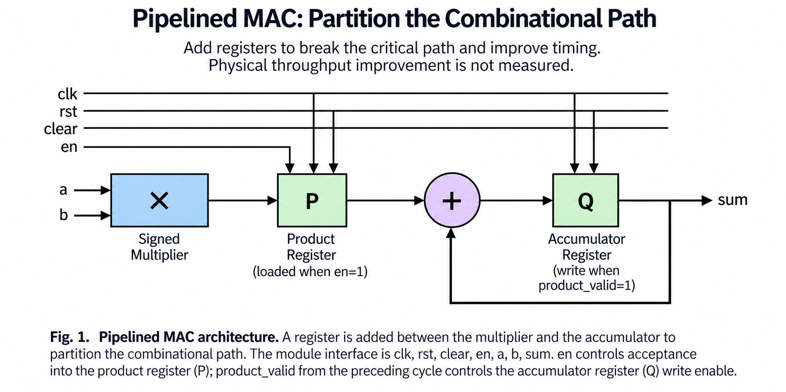
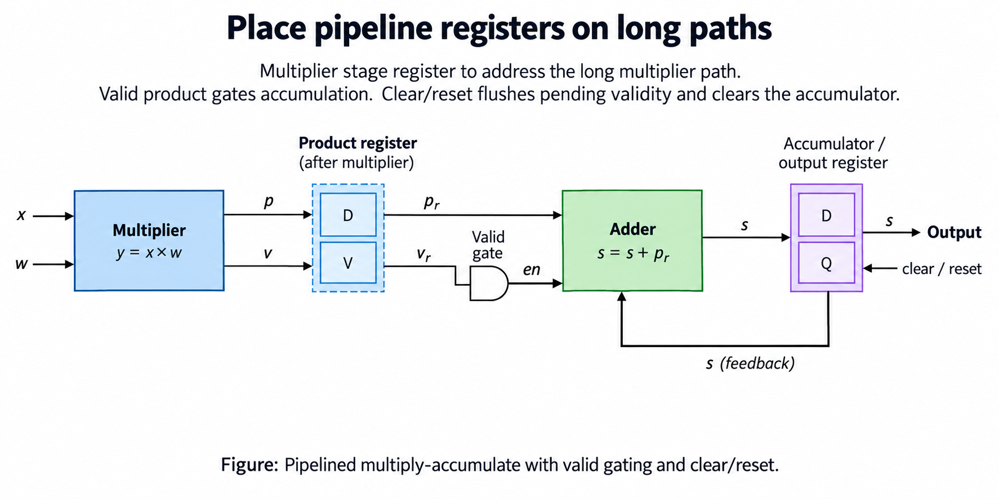
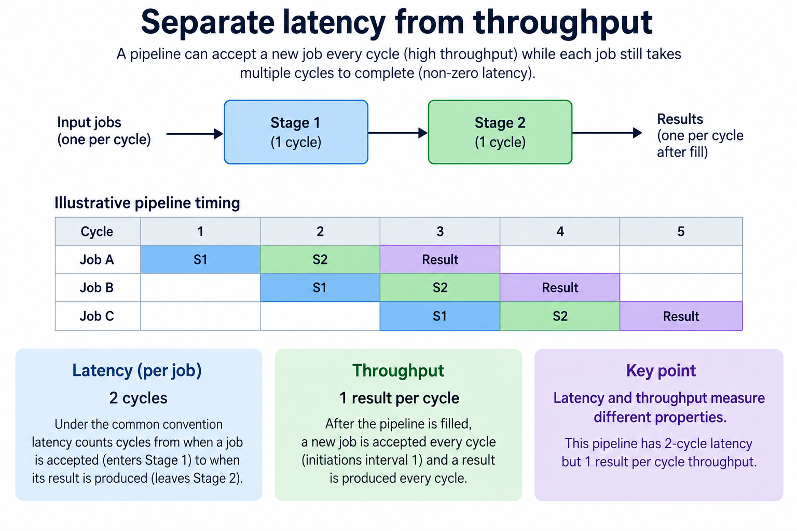
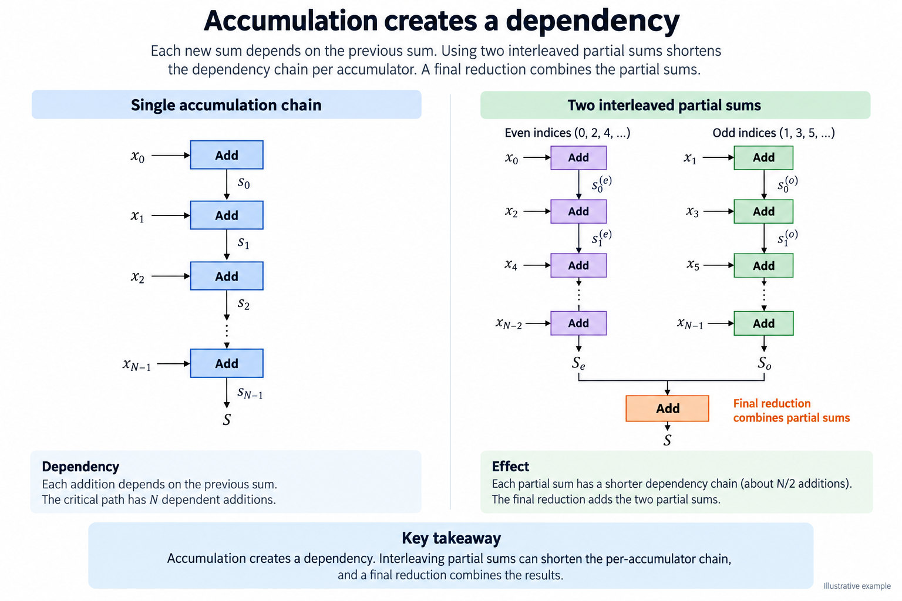
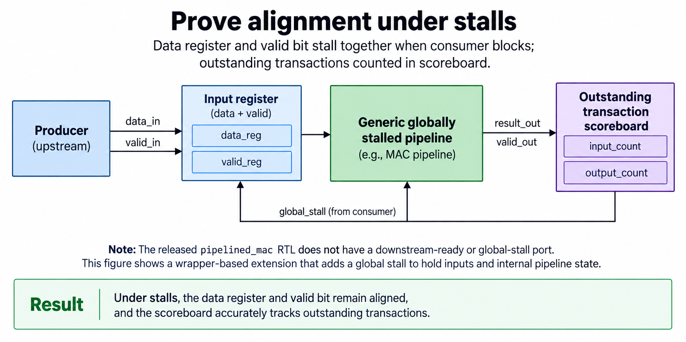

## Overview



This lesson extends one educational AI accelerator from its numerical specification toward verified RTL, FPGA integration and an ASIC implementation exercise. The overview shows this chapter's specific responsibility: Add registers, retain numerical equivalence and measure cycles per result.

The shared project begins with signed INT8 operands and INT32 accumulation, grows into a 4×4 output-stationary array, and provides a verified host-loaded tile top. The larger tiled inference/transport examples are software models, while external bus, board and physical-design integration remain explicit exercises. Follow the evidence labels rather than treating every diagram as an executed hardware result.

Start after [Hardware Verification: Python Testbenches, Scoreboards, and Waveforms](/blog/fpga-ai-verify-1-hardware-verification/). Keep the previous fixture and source revision so this chapter's change can be checked independently.

## Deep dive

### Place pipeline registers on long paths



The pipeline figure places a register after multiplication so the adder consumes a product from an earlier edge. A matching valid bit records whether that product belongs to accepted work. Data without validity is just stale register content.

In pipelined_mac.sv, an enabled edge captures a product and sets product_valid. The same edge accumulates the previous valid product. This uses nonblocking assignments intentionally. Clear/reset flush both the accumulator and pending product so work from the previous tile cannot leak into the next.

The extra register can change timing and latency, but physical clock improvement requires synthesis/place-route evidence. A shorter source-level expression or more stages does not establish a higher implemented clock. The release verifies numerical/stage behavior in simulation and leaves physical timing to the implementation exercise.

### Separate latency from throughput



The latency figure separates first-result delay from initiation interval. A pipeline can accept work on consecutive cycles while producing each result after a fixed delay. The throughput interval can be one cycle even when individual work spans several stages.

For this MAC, a newly captured product contributes on the next active edge if not cleared. Its running sum is therefore shifted relative to mac.sv. After the last input, provide a drain edge so the pending contribution reaches the accumulator.

Do not compare two modules at identical wall-clock edges without aligning their contracts. Check the sequence of accepted inputs and their expected contribution times. For a complete dot product, measure the final usable sum including startup and drain rather than report only steady-state issue rate.

### Accumulation creates a dependency



The dependency figure shows why pipelining does not magically remove feedback. A running accumulation uses the previous sum. If the adder's result itself spans several cycles, a new contribution to that same chain may have to wait or use a deliberately changed accumulation scheme.

Interleaving independent partial sums can expose parallelism, then a final reduction combines them. That change needs numerical and scheduling analysis. Floating-point addition may change with reassociation; even integer arithmetic must fit the selected widths at every intermediate.

Our simple pipeline registers the product and retains a one-edge sum update. It does not implement an arbitrarily deep adder pipeline. Start with the specific dependency graph and target timing report before selecting an interleaving or reduction design.

### Prove alignment under stalls



The stall figure requires data and validity to remain aligned. The current pipelined MAC accepts an enabled input and drains its pending product independently; it does not expose an output-ready handshake. A stallable stream pipeline needs explicit backpressure across every occupied stage.

The harness checks 250 vectors with signed inputs, enabled gaps and periodic clear. The oracle separately tracks a pending product and the running sum. That catches an off-by-one valid delay or a failure to flush pending state.

To extend it, define whether each stage can advance, which register holds during a stall and how reset invalidates occupancy. Then test arbitrary consumer stalls using a queue scoreboard. Adding ready signals without an ownership model can overwrite a product or count it twice.

### Run this lesson

Download the [accelerator lab](/labs/fpga-ai-chip/accelerator-lab.zip), extract it and run from its directory:

```sh
python3 lessons.py pipe-1
python3 -m unittest discover -s tests -v
```

The first command writes `reports/pipe-1.json`. Inspect its scope and result together. The second runs the independent numerical, addressing and scheduling checks. To reproduce RTL evidence, install Icarus Verilog 13.0 and run `python3 scripts/verify_top.py`; that also runs the block/array tests. These commands are software/RTL checks, not board measurements.

### Source: rtl/pipelined_mac.sv

This is the released executable source for this step. Preserve its stated protocol/width assumptions when adapting it.

```systemverilog
module pipelined_mac(input logic clk,rst,clear,en,
 input logic signed [7:0] a,b,output logic signed [31:0] sum);
 logic signed [15:0] product_q;logic product_valid;
 always_ff @(posedge clk)begin
  if(rst || clear)begin sum<=0;product_q<=0;product_valid<=0;end
  else begin
   product_valid<=en;
   if(en)product_q<=$signed(a)*$signed(b);
   if(product_valid)sum<=sum+{{16{product_q[15]}},product_q};
  end
 end
endmodule
```

### Connect the block without changing its contract

Write the accepted-work event for every boundary. For a ready/valid stream, it is valid AND ready at the sampled edge. For the released systolic core, it is a common global step. These are different protocols. Connecting them requires buffering or a scheduler that preserves matched operand pairs and advances every affected state consistently.

Track data and validity together. A register can contain old bits while its valid flag is false; those bits must not become an output transaction. Clear/reset invalidates pending work according to the chosen contract. If a pipeline is stalled, its payload, validity and ownership must remain aligned. A consumer may not reuse a buffer before its producer/previous consumer completes the relevant stage.

Use a FIFO scoreboard to check sequence as well as values. A test that counts transactions alone can miss swapped payloads, while a test of a final sum alone can hide duplicated and missing items that cancel numerically. Directed reset/stall fixtures supplement reproducible random traffic.

After a local block passes, connect one additional boundary at a time and retain the same oracle. A passing simulation supports the exercised contract, not physical timing or every possible sequence. Keep the released test report with the exact source revision so a later wrapper or pipeline change creates an explicit new verification step.

### A worked engineering decision

#### Compare the same input sequence across 2 circuits

The baseline MAC multiplies and adds before one accumulator register. The pipelined version first stores a product and its valid state, then accumulates the stored product on a later edge. This divides the combinational work, but changes when an accepted input affects the accumulator. Use the same signed input sequence for both circuits and compare the aligned running results after allowing the pipeline to drain.

For 3 accepted pairs yielding products [6,-20,-14], the final numerical sum remains -28. Immediately after accepting the first pair, however, the pipelined accumulator may still show its previous value because the product has only entered its register. A test expecting the baseline's output at the same edge will fail even when the pipeline is correct. Write an edge ledger containing accepted pair, stored product-valid state and accumulated result.

A bubble is a clock with no newly accepted valid product. It must not make stale product bits count again. The product register may retain old bits while validity becomes false; the accumulator must use the validity condition. Conversely, the last accepted product must be consumed even when no newer input follows. Drain the pipeline with the required clocks and compare the final sum. A test ending at the last input edge can overlook missing tail work.

#### Identify the feedback path before adding registers

The accumulator is a recurrence: its next value depends on its current value and the selected product. The released design has one accumulator register whose Q output feeds the adder directly. Adding another register in that feedback path changes which previous sum the adder sees. It is not an innocent extension of a feed-forward pipeline. Draw the exact recurrence and test consecutive accepted products before claiming equivalence.

A deep arithmetic pipeline may need several interleaved accumulators or another schedule to handle feedback latency. For example, independent even- and odd-index partial sums can break one long dependency chain, but the complete result then requires a final reduction. The arrangement changes storage and scheduling, and finite-width arithmetic or floating-point reassociation can affect numerical behavior. The chapter's interleaving figure is an architectural alternative, not the implementation inside the released pipelined MAC.

Separate feed-forward input stages from feedback state. A product register can delay an operand pair without introducing a second accumulator recurrence. An input register can also delay when the product is formed. If the source has only a product and accumulator register, its figure should not silently add input registers and then advertise the resulting latency as the source's behavior.

#### Distinguish latency from sustained throughput

Latency counts the interval from an accepted input to its associated visible result under a defined sampling convention. Initiation interval describes how often new work can enter. A pipeline can have several clocks of latency while accepting independent work every clock after filling. That observation does not guarantee a recurrence with a long feedback delay sustains the same initiation interval. Dependencies and acceptance policy decide that question.

For a finite sequence, filling and draining contribute to total time. A kernel with only a few products may gain little from an architecture whose steady state is efficient but whose setup is larger. Count useful accepted products and elapsed clocks separately. Converting either count to seconds additionally requires an actually achieved implementation frequency; this release supplies simulator evidence rather than a routed-frequency measurement.

A timing optimization should hold the numerical operation fixed. Compare the same output widths, signedness, reset/clear behavior and input acceptance semantics. Otherwise a faster circuit may simply be computing a narrower or different result. Retain the unpipelined block as a reference implementation while verifying the new sequential contract with an independently aligned scoreboard.

#### Define flush and stall behavior explicitly

Clear/reset invalidates pending products and clears accumulated state in the released block. Consider clear asserted immediately after accepting a negative product. If pending validity survives, that old product can be added into the next job after clear, contaminating its baseline. A directed fixture should accept work, clear before drain, then begin a second job and compare its result independently.

The released pipelined MAC does not expose downstream ready. Its acceptance and product-valid behavior therefore cannot be treated as a complete elastic stream. A globally stalled pipeline would need every affected register and validity state to hold together; an elastic adaptation may instead move data into a free buffer while downstream blocks. Both can be valid architectures, but their events differ. The next stream lesson introduces that boundary separately.

Do not gate only data while allowing validity to advance, or vice versa. If a product stays in place while its validity shifts to another logical position, the consumer can associate a correct value with the wrong transaction. A stall checker should inspect payload and validity alignment, not just count how many nonzero products appear. All-zero payloads are especially poor for diagnosing this mistake because repeated stale bits look numerically harmless.

After functional alignment passes, execute the selected synthesis/place/route flow and inspect its constrained timing paths before reporting a physical improvement. Adding registers can reduce one path while creating routing, control fan-out or another bottleneck. The chapter teaches how to make a pipeline change reviewable: exact state boundaries, an edge-level contract and a preserved numerical oracle. Physical performance is a later result with its own evidence.

## Conclusion

The outcome of this chapter is a concrete project artifact and a check whose scope is stated explicitly. Preserve numerical results, transaction ordering and lifetime rules as the design grows; optimize only after the baseline is correct. Next, [Ready/Valid Interfaces: Backpressure Without Lost Results](/blog/fpga-ai-stream-1-ready-valid-interfaces/) adds the next responsibility without changing the established contract.

### Sources

- [Original accelerator lab and verification evidence](https://chiaxinliang.github.io/labs/fpga-ai-chip/accelerator-lab.zip)
