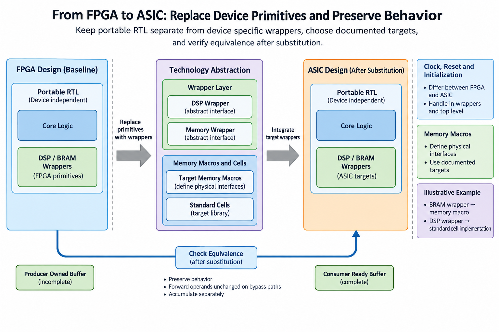
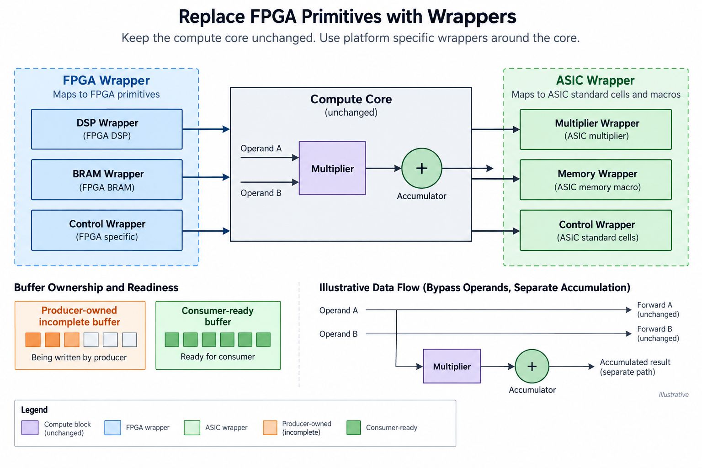
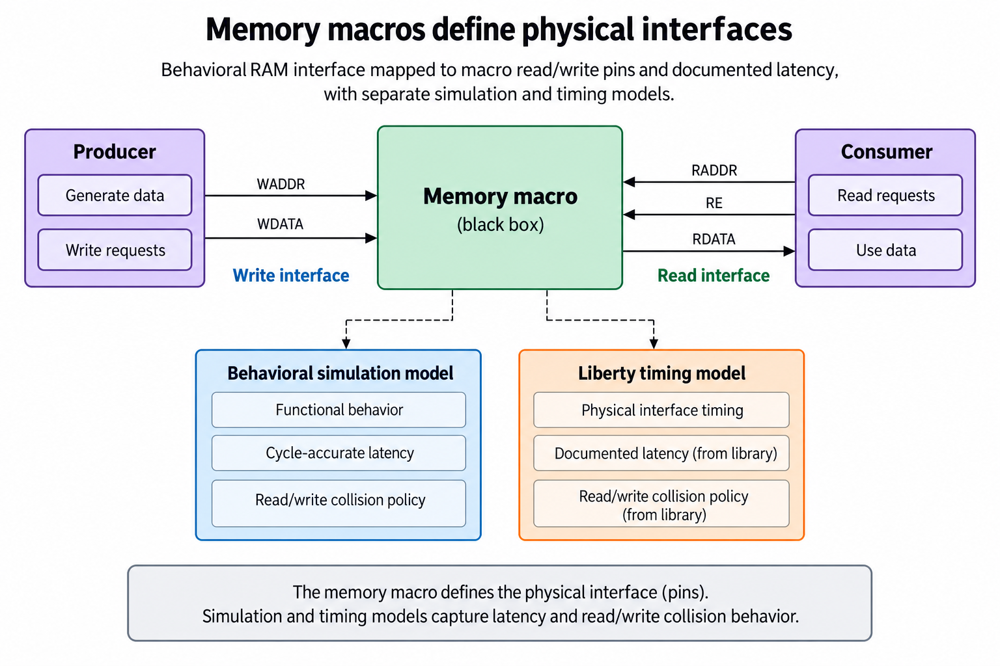
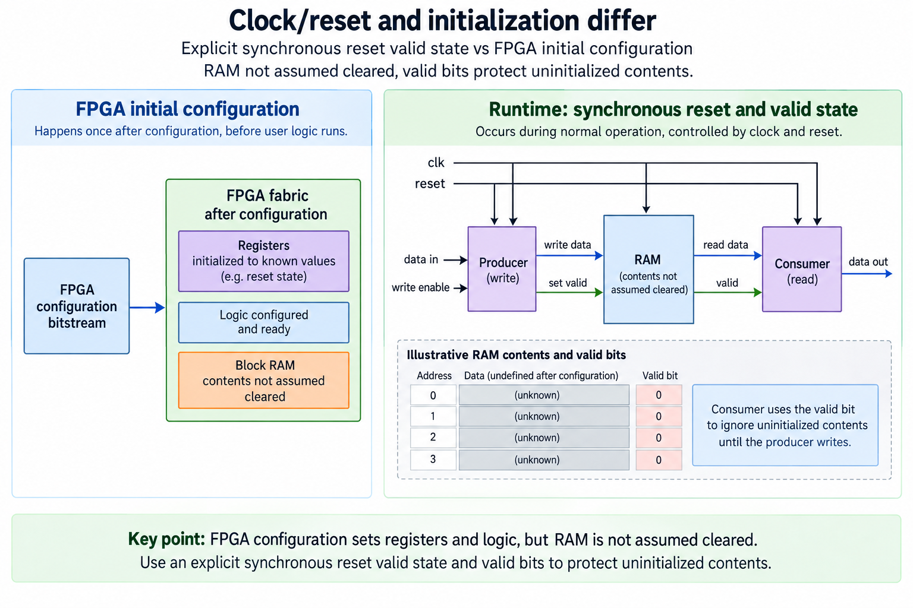
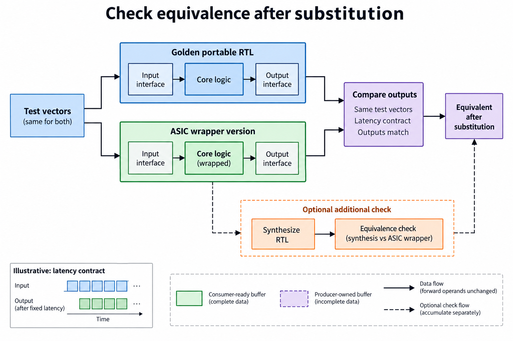

## Overview



This lesson extends one educational AI accelerator from its numerical specification toward verified RTL, FPGA integration and an ASIC implementation exercise. The overview shows this chapter's specific responsibility: Separate portable RTL from DSP/BRAM wrappers; choose documented memory/standard-cell targets.

The shared project begins with signed INT8 operands and INT32 accumulation, grows into a 4×4 output-stationary array, and provides a verified host-loaded tile top. The larger tiled inference/transport examples are software models, while external bus, board and physical-design integration remain explicit exercises. Follow the evidence labels rather than treating every diagram as an executed hardware result.

Start after [Measure the Accelerator: Useful MACs, Bandwidth, Latency, and Power](/blog/fpga-ai-measure-1-measure-the-accelerator/). Keep the previous fixture and source revision so this chapter's change can be checked independently.

## Deep dive

### Replace FPGA primitives with wrappers



The wrapper figure separates portable compute from device-specific resources: the PE and the 4×4 array use explicit arithmetic and state without FPGA primitive instances, and a memory or clock wrapper exposes the contract that another technology must implement.

Replacing a DSP primitive with an RTL multiply of signed INT8 operands can preserve the arithmetic while changing timing and area, and replacing BRAM with an ASIC SRAM macro needs matching ports, read latency and collision behavior, because a similar interface name is not equivalence.

The new integrated tile top uses banked behavioral storage for the host-loaded INT8 operands, and it is a small verified core rather than a claim that those arrays become production SRAM automatically, so inspect the chosen synthesis mapping.

### Memory macros define physical interfaces



The macro figure shows a physical memory's logical, simulation and Liberty timing views, width and depth alone do not define its behavior, and enables, byte masks, read latency and same-address policies all matter too.

The released operand_ram contract is registered read-first, so choose a permitted macro or target primitive that matches it, or add a deliberate adapter and reverify, because a black box with missing Liberty timing data cannot support a timing-closure claim.

The educational Nangate45 array and core exercise does not instantiate a production SRAM macro, a larger chip needs an appropriate memory plan and licensed models, and that integration stays separate from the verified arithmetic source.

### Clock/reset and initialization differ



The initialization figure distinguishes reset control from valid data: FPGA configuration can initialize some resources while an ASIC offers no such guarantee, so the portable design must define which state resets and which memory needs loading.

Our INT32 sums and valid masks reset synchronously while operand memories are loaded before use, control prevents invalid operands from contributing, and the integrated top's outputs are meaningful only after done.

A full-chip reset network also needs physical analysis, and if an external reset is asynchronous its deassertion must follow the clock-domain strategy, so do not change reset style just to satisfy a synthesis warning without understanding the behavior.

### Check equivalence after substitution



The comparison figure runs the same numerical and protocol fixtures after substitution. Simulation verifies expected behavior under the modeled timing; equivalence checking can add another form of evidence where the flow supports it.

Retain signed corners, pipeline flush, backpressure and irregular tiles. A wrapper can alter latency without altering stored data, so the scoreboard must align the documented timing contract.

The practical outcome is a clean portability boundary, it does not turn FPGA place and route reports into ASIC reports, and each technology still needs its own libraries, constraints, physical checks and integration evidence.

### Run this lesson

Download the [accelerator lab](/labs/fpga-ai-chip/accelerator-lab.zip), extract it and run from its directory:

```sh
python3 lessons.py portable-1
python3 -m unittest discover -s tests -v
```

The first command writes `reports/portable-1.json`. Inspect its scope and result together. The second runs the independent numerical, addressing and scheduling checks. To reproduce RTL evidence, install Icarus Verilog 13.0 and run `python3 scripts/verify_top.py`; that also runs the block/array tests. These commands are software/RTL checks, not board measurements.

### Keep behavioral and physical evidence separate

Portable RTL is an entry point to implementation, not a fabrication-ready package. The educational flow must combine it with a supported cell library, constraints and appropriate models. Larger memory structures need permitted macros with simulation, timing and physical views that agree on their behavior. FPGA initialization and primitive assumptions cannot be carried over silently.

Inspect each stage's evidence: synthesis mapping, floorplan/placement, clock distribution, routed interconnect and extracted timing. A layout file is not a substitute for DRC, LVS or STA. Unconstrained paths and missing views can make an apparently successful report incomplete. Record the exact target and flow revision.

The supplied configuration uses educational Nangate45 and has not been executed in this release. It is not a foundry signoff package. The small core also lacks a production pad ring, scan insertion and fabrication/board integration. Those are later target-specific milestones with distinct evidence, rather than properties inferred from a passing RTL test.

Retain a manifest of sources, tests, constraints and tool/model versions. Numerical and protocol tests remain reproducible while new wrappers or physical stages are added. Before fabrication, close the actual full-chip electrical, physical and test requirements and prepare a bring-up plan. The learning result is a traceable transition from verified behavior to implementation, with unperformed checks left explicitly unclosed.

### A worked engineering decision

#### Separate logical behavior from technology resources

The portable numerical core describes signed products of INT8 operands, local INT32 sums, masks and accepted state updates, while FPGA DSP and BRAM resources are target-specific ways to implement parts of that behavior and an ASIC uses a selected standard-cell library with any permitted memory macros, so moving between them is not a literal replacement of a component named DSP with an identically named ASIC DSP block. Preserve the operation and expose resource-specific interfaces through documented wrappers.

The released RTL uses behavioral arithmetic and storage rather than an instantiated proprietary primitive library. That provides an educational portability baseline, but does not prove every synthesis tool and technology maps it efficiently. The fixed operand top's access pattern may require storage restructuring for a physical macro. Such a change can affect read latency, banking and schedule, so it belongs in both the source review and verification evidence.

Write a wrapper contract before selecting a macro: data/address widths, depth, write/read enables, read latency, collision behavior, reset and initialization assumptions. Those properties determine whether the consumer can use a returned operand correctly. A wrapper name is not a contract. If two targets use different latencies, a bridge must adapt the schedule or the public interface must explicitly change.

#### Follow a read request through the macro boundary

The consumer supplies read address and read enable to the memory interface. Returned read data travels from the macro to the consumer after the declared latency. Reversing the request arrow in a figure changes ownership of the interface. The producer supplies write address, write data and write enable on the write side. Keep request and returned-data directions separate even when the wrapper is drawn as a single box.

A behavioral model defines functional values and collision behavior. A timing model defines delays and checks for the physical pins under selected conditions. Physical abstract views describe placement/routing obligations. These are complementary inputs, not interchangeable files. A simulation model that returns the right data does not establish that the instantiated macro's Liberty pins, clock polarity or physical power connections match.

The supplied operand_ram regression checks registered read and read-first behavior. It does not integrate an actual ASIC SRAM macro. A future substitution should compare identical accepted events against the behavioral reference at the declared latency, then verify the macro's implementation models and constraints. If same-address collision semantics differ, explicitly preserve or revise the operation rather than accepting whichever value the simulator happens to return.

#### Make initialization and reset assumptions visible

FPGA configuration can initialize certain resources under a documented target flow. That is not a universal ASIC power-up guarantee. The portable core should establish required control and validity state through its declared reset protocol. Memory contents remain unusable until the producer writes and marks them valid. Clearing a validity bit can prevent an uninitialized word from being consumed without physically clearing every memory location.

The released blocks use synchronous reset locally. A physical external reset must be integrated with the selected clocks and target requirements. Reset assertion and deassertion policy, domain synchronization and any macro-specific behavior need a separate review. Simulation with a clean ideal reset pulse does not demonstrate that board or silicon reset release is electrically safe.

A reset during a job also affects ownership and pending work. Define whether the command is canceled, whether outputs become invalid and which buffers require refill. An external bus can retain outstanding responses after local core reset, creating additional recovery behavior. The portable core alone does not solve that system lifetime problem; the wrapper/controller must implement and verify it.

#### Compare the behavior after a substitution

Drive the same legal input events into the golden portable design and the wrapped version. Compare output sequence, numerical values, validity and declared latency. Include stalls, reset/clear, signed endpoints and collision cases relevant to the replaced resource. A final matrix equality alone can miss a changed handshake or delayed status that breaks the surrounding system.

A finite simulation is bounded evidence, formal equivalence can establish a stronger relation under stated assumptions where the flow supports it and someone actually runs it, though the release does not claim a formal run occurred, and a synthesis netlist comparison likewise has a declared boundary and model set, so retain the actual reports with source, tool and target versions instead of using “equivalent” as a generic label for matching one fixture.

Physical constraints remain technology-specific even when behavior matches. An ASIC implementation needs clocks, input/output delays, corners, physical libraries, power integration and routing rules. A core netlist that preserves arithmetic can still fail timing or lack required full-chip integration. Educational Nangate45 configuration is useful for learning that flow but is not a production foundry release.

The architecture lesson is to retain a stable numerical and protocol boundary while changing its implementation resources, so each target wrapper should explain what it preserves, what it adapts and what evidence was executed, and the current project provides portable behavioral RTL plus tests that run under Icarus Verilog, while FPGA mapping and ASIC macro integration remain clearly scoped follow-up steps that keep the path from a learning circuit to a physical design precise instead of assuming portability from source syntax alone.

#### A release check for this boundary

For a concrete wrapper acceptance experiment, keep a read address stable while the declared read enable is absent. Then issue a single enabled read and inspect the returned validity/data at the specified edge. Repeat after reset with no preceding write and confirm that uninitialized storage is not declared useful. Then write a distinguishable value and read it through both implementations. These fixtures expose an enable polarity, latency or initialization mismatch that an uninterrupted matrix run might miss. Add the same-address collision case separately, retaining the permitted reference semantics. If the selected macro forbids that collision, prevent it in control and verify the prevention instead of accepting an arbitrary response.

## Conclusion

The outcome of this chapter is a concrete project artifact and a check whose scope is stated explicitly. Preserve numerical results, transaction ordering and lifetime rules as the design grows; optimize only after the baseline is correct. Next, [RTL to Layout: Synthesis, Floorplanning, Placement, and Routing](/blog/fpga-ai-physical-1-rtl-to-layout/) adds the next responsibility without changing the established contract.

### Sources

- [Original accelerator lab and verification evidence](https://chiaxinliang.github.io/labs/fpga-ai-chip/accelerator-lab.zip)
- [OpenROAD physical-design documentation](https://openroad.readthedocs.io/en/latest/main/README.html)
