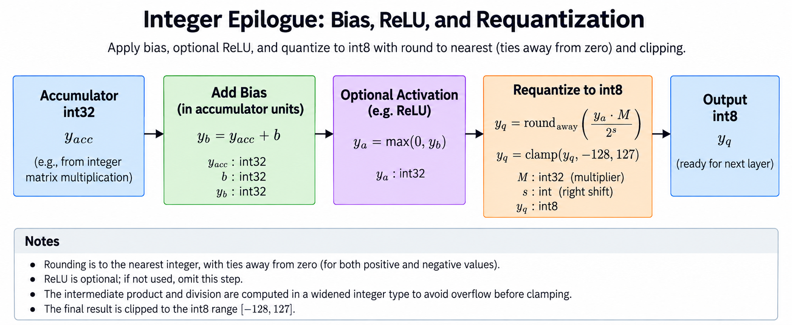
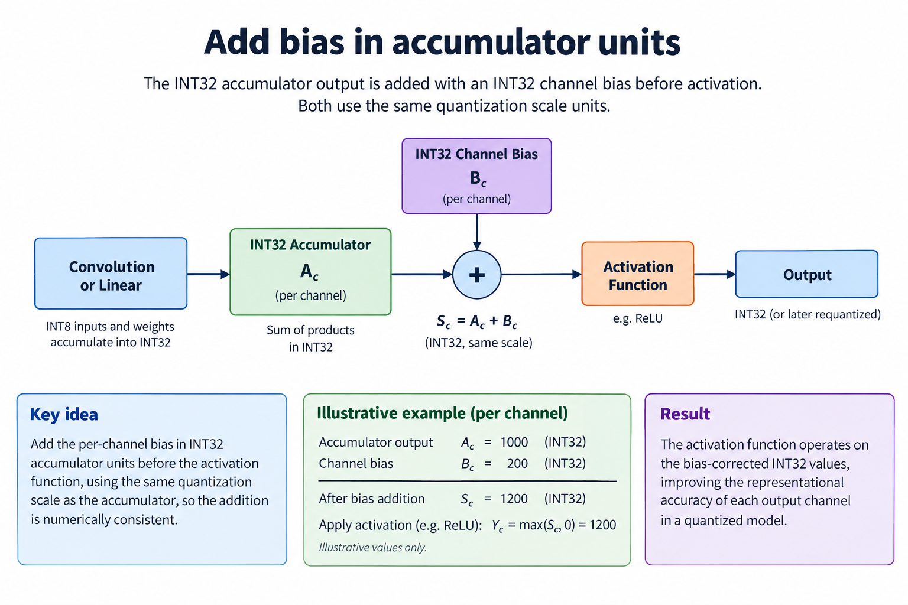
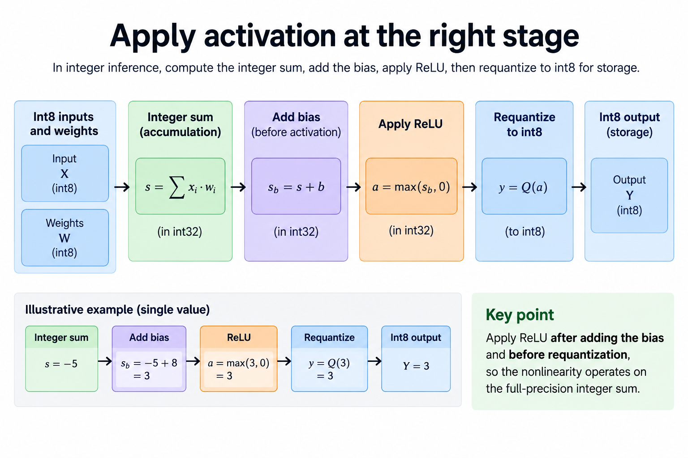
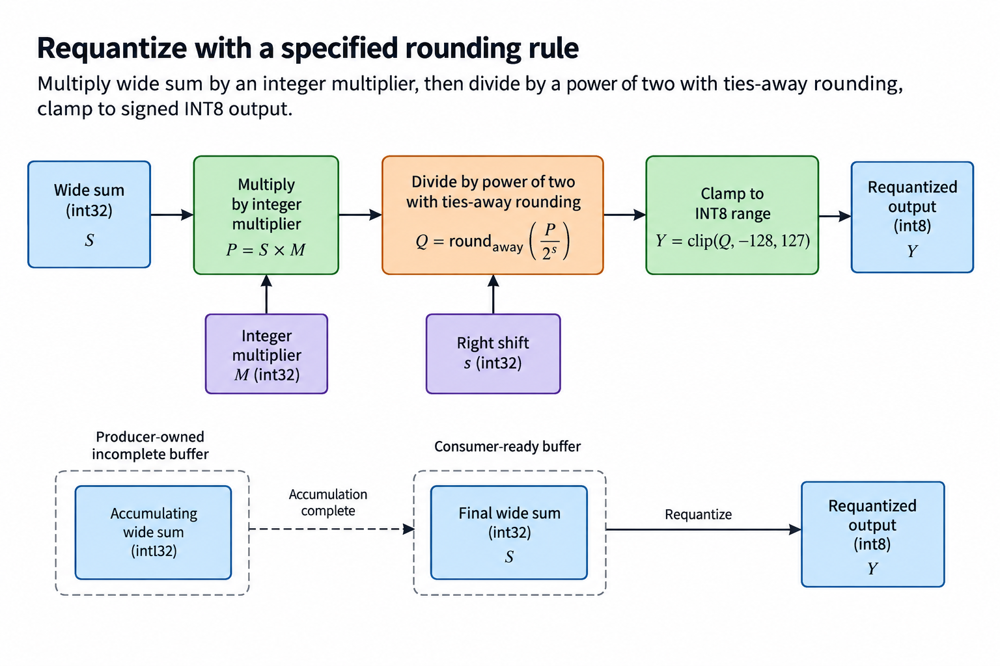
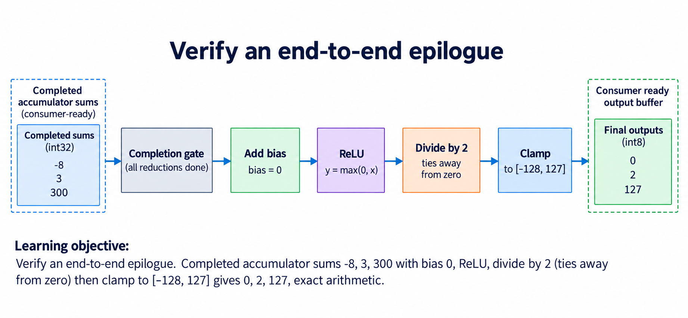

## Overview



This lesson extends one educational AI accelerator from its numerical specification toward verified RTL, FPGA integration and an ASIC implementation exercise. The overview shows this chapter's specific responsibility: Implement the chosen integer epilogue and verify clipping, scaling and signed rounding.

The shared project begins with signed INT8 operands and INT32 accumulation, grows into a 4×4 output-stationary array, and provides a verified host-loaded tile top. The larger tiled inference/transport examples are software models, while external bus, board and physical-design integration remain explicit exercises. Follow the evidence labels rather than treating every diagram as an executed hardware result.

Start after [Matrix Tiling: Run Problems Larger Than the Array](/blog/fpga-ai-tile-1-matrix-tiling/). Keep the previous fixture and source revision so this chapter's change can be checked independently.

## Deep dive

### Add bias in accumulator units



The bias figure adds a column/channel bias in accumulator units. If the integer dot product represents scale sx*sw, its integer bias must use a compatible scale before addition. A real bias cannot be treated as an arbitrary INT8 payload.

The reference epilogue takes an integer bias and adds it before activation/conversion. Check the complete addition's width, not only the dot-product width. A valid sum can overflow after bias.

For a sum -3 and bias 5, the biased value is 2. This small cancellation fixture helps distinguish the operator order from a superficially similar activation-first implementation.

### Apply activation at the right stage



The activation figure applies ReLU as max(sum,0) after bias. A signed comparison is required. Treating a two's-complement negative value as unsigned can make it appear very large and pass it through.

ReLU is not distributed over partial sums: ReLU(5)+ReLU(-8)=5, but ReLU(5-8)=0. K tiling therefore cannot activate each chunk independently and add the results.

The released MLP uses a fixed illustrative epilogue. Other activations, softmax and normalization are unsupported operators until implemented with their own numerical contracts. Naming them in a model does not create a hardware execution path.

### Requantize with a specified rounding rule



The conversion figure multiplies by an integer numerator, divides by a power of two with the defined tie rule and clips to INT8. Our round_shift_away helper rounds negative half-steps symmetrically by working with magnitude and restoring sign.

The scaling multiplication can need wider intermediate storage. Shift=0 is a valid special case; a negative shift is rejected. The output clamp occurs after rounding, preserving information until the final supported range is applied.

Do not use the language's default rounding function without checking its semantics. Python round, an arithmetic right shift and the selected hardware rounding instruction can disagree at ties.

### Verify an end-to-end epilogue



The checked epilogue converts [-8,3,300] using bias 0, ReLU and division by 2. Results are [0,2,127]: the negative value becomes zero, 1.5 rounds to 2 and 150 clips to 127.

The test also checks -3/2=-2 under ties-away rounding when ReLU is disabled. Testing only nonnegative outputs would miss that conversion behavior.

Record intermediate sums and converted outputs separately. An argmax can remain correct despite wrong logits, so the inference test compares values before predictions. A correct epilogue completes one supported operator, not an arbitrary network runtime.

### Run this lesson

Download the [accelerator lab](/labs/fpga-ai-chip/accelerator-lab.zip), extract it and run from its directory:

```sh
python3 lessons.py post-1
python3 -m unittest discover -s tests -v
```

The first command writes `reports/post-1.json`. Inspect its scope and result together. The second runs the independent numerical, addressing and scheduling checks. To reproduce RTL evidence, install Icarus Verilog 13.0 and run `python3 scripts/verify_top.py`; that also runs the block/array tests. These commands are software/RTL checks, not board measurements.

### Reference implementation: epilogue

This Python reference is executable behavior, not synthesized hardware. Its range, rounding and layout contract provides an oracle for the corresponding RTL/integration.

```python
def epilogue(value,bias=0,multiplier=1,shift=0,relu=True):
 value=value+bias
 if relu:value=max(0,value)
 return max(-128,min(127,round_shift_away(value*multiplier,shift)))
```

### Preserve the complete matrix operation

Keep logical dimensions separate from the physical array. The 4×4 engine computes tiles, while the software tiler covers larger matrices and K chunks. A boundary tile's inactive locations are not useful output elements. Masks and store bounds must preserve the allocated logical tensor even if the internal engine computes padded positions.

Initialize a new output reduction once, combine every required contribution, and apply bias/activation/conversion only at the specified final stage. ReLU does not distribute over partial sums. A premature quantization can also change rounding and cancellation. Use mixed-sign fixtures so these mistakes cannot hide behind positive-only inputs.

Count traffic at named boundaries. External tensor bytes, local RAM reads, register access and forwarded operands are different quantities. Reuse that avoids a host or external-memory load can still create a lot of local traffic. A dataflow comparison needs the same shapes, types, numerical output and storage assumptions.

The direct matrix oracle remains independent of the systolic timing trace. Use the trace to debug alignment and the oracle to verify the final result. Global stalls consume clocks without changing logical step; maintain that distinction in both the driver and the array. Once the complete tile contract is correct, measure its useful work and integration overhead separately.

### A worked engineering decision

#### Check the complete ordered epilogue

The matrix engine produces a completed wide reduction. The epilogue adds compatible bias, optionally applies ReLU, multiplies by the chosen integer scale factor, divides by a power of 2 with nearest ties-away rounding, then saturates to signed INT8. Every stage is ordered. Replacing the sequence with a generic cast or a framework's default round function can change numerical behavior even if the output shape is unchanged.

Use completed sums [-8,3,300], bias 0, ReLU enabled, multiplier 1 and shift 1. ReLU gives [0,3,300]. Division by 2 with ties away gives [0,2,150]. Signed INT8 saturation gives [0,2,127]. The example checks negative activation, a positive tie and overflow clipping in 3 values. It does not test negative rounding after ReLU, because ReLU intentionally removes those negatives; test the rounding function separately with ReLU disabled.

For sum -3, multiplier 1 and shift 1 without ReLU, the expected rounded result is -2. A positive-offset floor formula can produce another result for negative inputs. The lab uses explicit signed integer logic to make the rule reproducible. For an exact -4 divided by 2, the result remains -2. Fixtures at exact multiples and both sides of ties distinguish several superficially similar implementations.

#### Put bias in the same numerical domain

An INT32 accumulator represents a sum of integer products. If model input and weight scales are sA and sB under a compatible quantization mapping, the real-domain product scale relates to sA×sB. An integer bias added at this stage must represent the model bias in that accumulator domain. The educational function accepts an already compatible integer bias; it does not automatically calibrate a floating-point model's bias.

Per-channel bias can vary across output columns. Test distinguishable bias values so broadcasting the first bias into every channel cannot pass. Likewise, per-channel output scale metadata needs the correct channel indexing if supported by a future implementation. A single multiplier/shift demonstration is not proof that every quantized network convention maps to it. Record the model conversion and parameter assumptions beside the deployed operator.

Bias can enlarge the required wide range. Proving the un-biased K-term dot product fits INT32 does not automatically prove the biased value fits. The Python function checks its numerical contract with wider intermediate arithmetic, while a hardware epilogue must choose sufficient intermediate widths explicitly. A multiplier applied to an INT32 sum can require more than 32 product bits before shifting. Truncating that product early changes rounding and saturation behavior.

#### Explain why partial sums cannot be converted early

Take two reduction chunks with sums -10 and 8. The complete sum is -2 and ReLU then gives 0. ReLU on each chunk instead produces 8 after addition. Nonlinear activation therefore belongs after complete reduction. Even when a conversion is linear in real arithmetic, finite-width rounding and saturation can make chunk-wise conversion differ from converting the total.

A producer-owned accumulating buffer is not epilogue input until completion. A diagram can show the ownership transition as a gate, but should not draw unfinished partials directly into activation and label the final result valid. In an overlapped system, another completed buffer may be converted while the next reduction accumulates elsewhere. That is a buffer schedule with separate lifetimes, not permission to process an incomplete value.

The integrated tile top in this release captures INT32 C. The epilogue remains verified functional Python behavior, used by the small MLP model. Implementing it in RTL is a well-defined extension: preserve stage order, widths, rounding, saturation, channel metadata and valid/ready timing. The present articles do not claim that an epilogue circuit or board inference was synthesized or measured.

#### Build checks around thresholds and intermediate values

Compare intermediate biased, activated, scaled, rounded and clamped values on a short fixture. The first divergent stage identifies whether the defect is a bias index, activation order, multiply width, rounding rule or saturation boundary. A final INT8 equality is useful but can hide wide differences when both incorrect and correct values saturate to the same endpoint.

Include values that remain inside range and values just outside both endpoints. Test a scale/shift that creates exact ties and a case with no shift. A shift of 0 must not accidentally add a half-unit rounding offset. Negative ties need their own fixtures. Keep multiplier, shift and activation flags explicit in the report rather than reporting only the final vector.

Task-level model quality is another evaluation. Bit-accurate reproduction of this integer operator does not establish that an arbitrary trained network retains acceptable accuracy after quantization. Calibration, scale selection and the task dataset require separate evidence. The architecture lesson is preserving a chosen numerical operator; it is not an automatic guarantee of representational improvement.

The resulting epilogue contract is small enough to implement and inspect. It connects the wide matrix result to a compact next-layer representation without relying on undocumented defaults. Keeping that contract independent of array timing also makes a future hardware pipeline easier to verify against the same functional reference.

#### Extend the next boundary

A useful extension experiment implements only the integer requantizer first, with the same explicit multiplier/shift and ties-away rule. Keep bias and ReLU in the independent reference until the new block passes its own threshold fixtures, then connect stages incrementally. This isolates multiply-width, signed division and clamp behavior from array timing. A ready/valid epilogue also needs an expected FIFO, blocked-output stability and reset cancellation checks. Record both the numerical intermediate and its valid transaction; a correctly rounded value presented on the wrong transaction is still incorrect. Use the source function as an oracle, not a screenshot of the generated diagram's formula.

## Conclusion

The outcome of this chapter is a concrete project artifact and a check whose scope is stated explicitly. Preserve numerical results, transaction ordering and lifetime rules as the design grows; optimize only after the baseline is correct. Next, [On-Chip Buffers: FPGA BRAM, Banking, and Port Conflicts](/blog/fpga-ai-buffer-1-on-chip-buffers/) adds the next responsibility without changing the established contract.

### Sources

- [Original accelerator lab and verification evidence](https://chiaxinliang.github.io/labs/fpga-ai-chip/accelerator-lab.zip)
