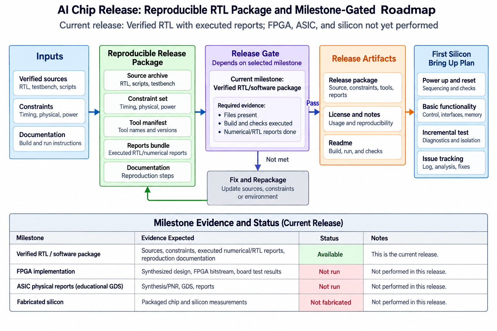
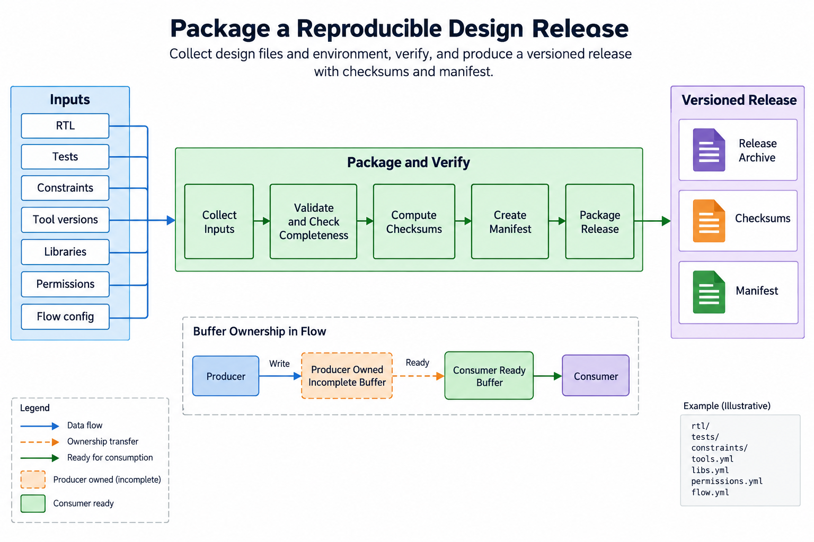
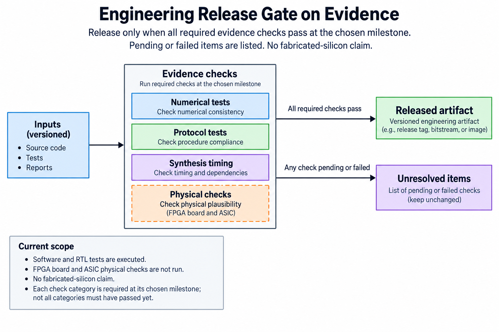
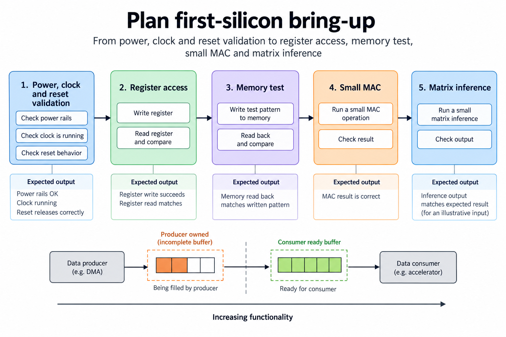
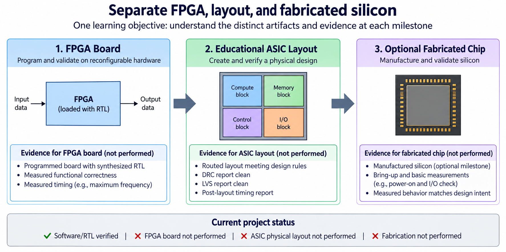

## Overview



This lesson extends one educational AI accelerator from its numerical specification toward verified RTL, FPGA integration and an ASIC implementation exercise. The overview shows this chapter's specific responsibility: Package verified sources, constraints, tool versions and layout reports; define an optional fabrication and bring-up checklist.

The shared project begins with signed INT8 operands and INT32 accumulation, grows into a 4×4 output-stationary array, and provides a verified host-loaded tile top. The larger tiled inference/transport examples are software models, while external bus, board and physical-design integration remain explicit exercises. Follow the evidence labels rather than treating every diagram as an executed hardware result.

Start after [Check the Design: Timing Corners, Reset, CDC, and Testability](/blog/fpga-ai-signoff-1-check-the-design/). Keep the previous fixture and source revision so this chapter's change can be checked independently.

## Deep dive

### Package a reproducible design release



The release figure gathers RTL, reference/tests, constraints, tool versions and source permissions into a reproducible package. Checksums identify the exact files used. A later fix needs a new revision and refreshed evidence.

The lab includes original MIT-licensed source, Python exercises and recorded Icarus Verilog checks. It excludes simulator binaries and vendor libraries. Users obtain target tools under their own documented installation/licensing path.

A manifest is useful only if it corresponds to the checked source. Recompute it after changes and avoid including transient caches or stale reports as if they were current artifacts.

### Gate the release on evidence



The gate figure separates numerical, protocol, implementation and physical evidence. The release's numerical/RTL gates are executed; Vivado, board deployment and ASIC physical checks are not. Those remain explicit milestones.

Preserve raw reports and seed/version information rather than one “all tests passed” sentence. A small fixture verifies a limited contract; record its scope. A new memory wrapper or board transport creates new checks.

The release can be useful educational material before fabrication. Label what is implemented and what remains to be integrated so another reader can reproduce the same software/RTL results.

### Plan first-silicon bring-up



The bring-up figure starts with power, clock and reset, then register/transport access, memory tests and a small MAC/matrix fixture. Large inference comes only after those simpler checks succeed.

Define expected outputs before silicon or board access. The 2×2 fixture and small MLP provide known numerical values. Instrument status and timeouts so a missing completion is distinguishable from wrong arithmetic.

First-silicon validation also needs a documented package/board, test access and electrical setup. This release supplies a plan, not fabricated hardware or measurements.

### Separate FPGA, layout, and fabricated silicon



The milestone figure distinguishes verified RTL, implemented FPGA core, working FPGA system, educational ASIC layout and optional fabricated silicon. Each requires different evidence. One cannot be renamed into the next by changing a status field.

The current deliverable is a tested educational RTL/project package plus implementation exercises. The integrated tile top provides host-loaded computation in simulation; a physical host interface, board shell and foundry implementation remain target-specific.

Publish follow-up measured results with the exact revision and environment once executed. That makes the learning path cumulative and reproducible, while keeping architecture explanations separate from unperformed physical claims.

### Run this lesson

Download the [accelerator lab](/labs/fpga-ai-chip/accelerator-lab.zip), extract it and run from its directory:

```sh
python3 lessons.py release-1
python3 -m unittest discover -s tests -v
```

The first command writes `reports/release-1.json`. Inspect its scope and result together. The second runs the independent numerical, addressing and scheduling checks. To reproduce RTL evidence, install Icarus Verilog 13.0 and run `python3 scripts/verify_top.py`; that also runs the block/array tests. These commands are software/RTL checks, not board measurements.

### Keep behavioral and physical evidence separate

Portable RTL is an entry point to implementation, not a fabrication-ready package. The educational flow must combine it with a supported cell library, constraints and appropriate models. Larger memory structures need permitted macros with simulation, timing and physical views that agree on their behavior. FPGA initialization and primitive assumptions cannot be carried over silently.

Inspect each stage's evidence: synthesis mapping, floorplan/placement, clock distribution, routed interconnect and extracted timing. A layout file is not a substitute for DRC, LVS or STA. Unconstrained paths and missing views can make an apparently successful report incomplete. Record the exact target and flow revision.

The supplied configuration uses educational Nangate45 and has not been executed in this release. It is not a foundry signoff package. The small core also lacks a production pad ring, scan insertion and fabrication/board integration. Those are later target-specific milestones with distinct evidence, rather than properties inferred from a passing RTL test.

Retain a manifest of sources, tests, constraints and tool/model versions. Numerical and protocol tests remain reproducible while new wrappers or physical stages are added. Before fabrication, close the actual full-chip electrical, physical and test requirements and prepare a bring-up plan. The learning result is a traceable transition from verified behavior to implementation, with unperformed checks left explicitly unclosed.

### A worked engineering decision

#### Package the milestone that actually exists

The current release is a verified educational software/RTL project: original source, independent numerical tests, deterministic exercises and simulator evidence. It includes a host-loaded tile controller and physical implementation scripts that readers can inspect and execute in appropriate environments. It does not contain an executed FPGA bitstream, measured board inference, educational GDS or fabricated silicon. The archive should say this plainly so another reader can reproduce the same result.

A milestone table is more useful than checking every possible box. Verified RTL requires its functional evidence; an implemented FPGA core requires a constrained target run; a working board system requires physical interface and application results; educational ASIC layout requires executed flow artifacts; production silicon requires the selected full-chip and manufacturing obligations. A later milestone adds evidence rather than being created by editing a status label.

The code is original educational MIT-licensed material. Include LICENSE and retain attribution. Do not package proprietary vendor libraries, restricted PDK files or third-party macro models just because a local implementation flow references them. Readers should obtain required target inputs through their permitted channels. The archive can record expected versions and setup locations without redistributing those files.

#### Build a manifest that binds source to evidence

List every included source, test, script, constraint and report with a checksum. The release exercise computes SHA-256 entries for reproducible project files. A checksum identifies bytes, not correctness; its value is connecting the tested revision to what another reader downloads. Retain the simulator version, seed and executed scope beside the source hashes.

Reports should identify actual executed checks. The RTL evidence records MAC and pipeline vectors, stream clocks with backpressure, array cases with global stalls, registered RAM collision behavior and integrated tile jobs. The integrated tests also exercise dimension snapshot and ignored busy writes/starts. Python tests cover numerical, command/memory and scheduling behavior. Do not add physical reports with fabricated empty success fields to make the manifest look complete.

Exclude caches, simulator binaries and generated temporary testbench executables from the distributable archive. They are not needed to reproduce the source-based checks and may be platform-specific. Include a README with exact entry points and environment requirements. A clean extraction should not depend on hidden working-directory state from the author's machine.

#### Reproduce from a new extracted directory

Run the Python unit suite and deterministic lesson exercises from a fresh extracted lab. Install Icarus or set IVERILOG/VVP to documented executables, then run verify_top.py, which includes the block/array checks. Confirm the generated reports describe the same bounded contracts. A passing result on the author's old working tree is weaker release evidence if the archive omits a required source or contains an older version.

Keep commands separated by purpose. Unit tests verify functional models and scheduling; RTL scripts compile and execute circuit fixtures; Vivado Tcl targets an out-of-context implementation exercise; OpenROAD configuration targets an educational physical flow. A reader can reproduce the first two without buying a board or attempting fabrication. The latter steps require their own installed tools and target models and remain unperformed in the shipped evidence.

Record tool differences if reproducing with another simulator or Python version. A new environment can reveal unsupported syntax or differing setup requirements without changing the mathematical contract. Preserve the new log and resolve discrepancies against the source and fixtures. Reproducibility does not mean assuming every environment must produce identical physical reports from an unspecified target.

#### Prepare progressive bring-up without inventing results

A board or first-silicon plan begins with safe documented power, clock and reset checks appropriate to the selected platform. Then establish test/transport access, memory behavior and a small signed MAC/matrix fixture. Complete inference follows only after those simpler boundaries work. The plan should contain expected values and timeout/error observations before hardware execution so failures can be classified.

Use the same 2×2 matrix fixture and distinguishable signed byte patterns from the series. Compare intermediate data and complete INT32 outputs rather than just an LED or class prediction. If a small matrix fails, inspect packing, accepted load events, snapshot, array step and result capture. A large network test is not a substitute for those localized checks.

The current project has no board-specific pin/clock shell or fabricated package. Those target artifacts belong in a future release with their own source, constraints, electrical setup and evidence. Do not label a generic FPGA drawing or a conceptual GDS icon as the obtained device artifact. Keep planned bring-up procedures separate from performed measurements.

#### Make subsequent improvements cumulative

When adding an RTL epilogue, external DMA, a physical host driver or a macro wrapper, retain the established numerical reference and event fixtures. Add checks for the new boundary and update the manifest/report set. A faster tile or smaller memory implementation should still compute the same declared operation. If the numerical or protocol contract intentionally changes, version and explain that change.

A performance follow-up should report useful work, precision, shape, timing boundary, repetitions, target and environment. A power follow-up should distinguish estimates from instrumented measurements. A physical-design follow-up should retain consistent netlist/layout/extraction/model artifacts and the actual checks run. These reports let readers compare new evidence with the earlier analytical model without conflating milestones.

The final educational deliverable is therefore more than 24 isolated articles: one source-backed progression from specification through verified compute and system contracts to implementation and release exercises. Readers can reproduce the current software/RTL result and see the precise work required for the next hardware milestone. A clear archive, stable fixtures and honest evidence make that progression useful without claiming that a tutorial has already manufactured a commercial AI chip.

#### A release check for this boundary

Add a concise changelog entry for every later release: changed numerical or protocol behavior, implemented target boundary, executed checks and remaining scope. Keep stable fixture identifiers so readers can compare revisions. A source checksum change should have a corresponding explanation when it alters behavior or evidence. Rebuild the archive from the reviewed sources, extract it independently and confirm the manifest against those bytes. This protects the connection between the published tutorial, downloadable code and actual reports; a passing local checkout does not verify an older archive uploaded by mistake.

## Conclusion

The outcome of this chapter is a concrete project artifact and a check whose scope is stated explicitly. Preserve numerical results, transaction ordering and lifetime rules as the design grows; optimize only after the baseline is correct.

### Sources

- [Original accelerator lab and verification evidence](https://chiaxinliang.github.io/labs/fpga-ai-chip/accelerator-lab.zip)
- [OpenROAD physical-design documentation](https://openroad.readthedocs.io/en/latest/main/README.html)
