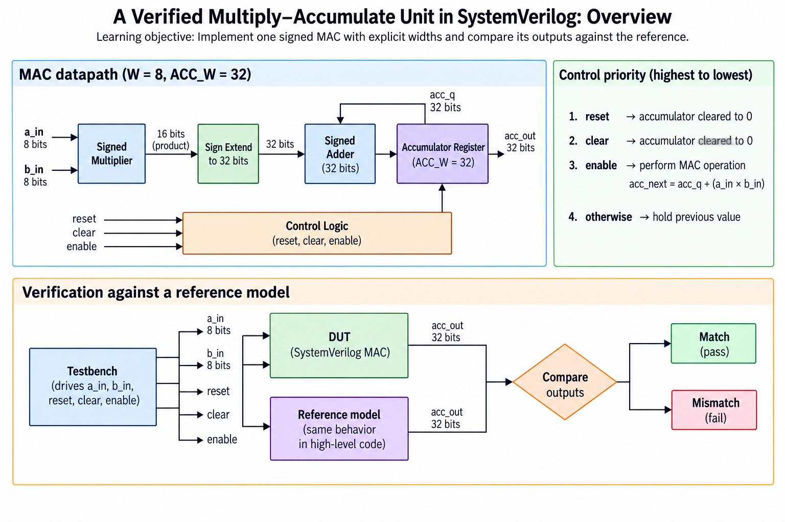
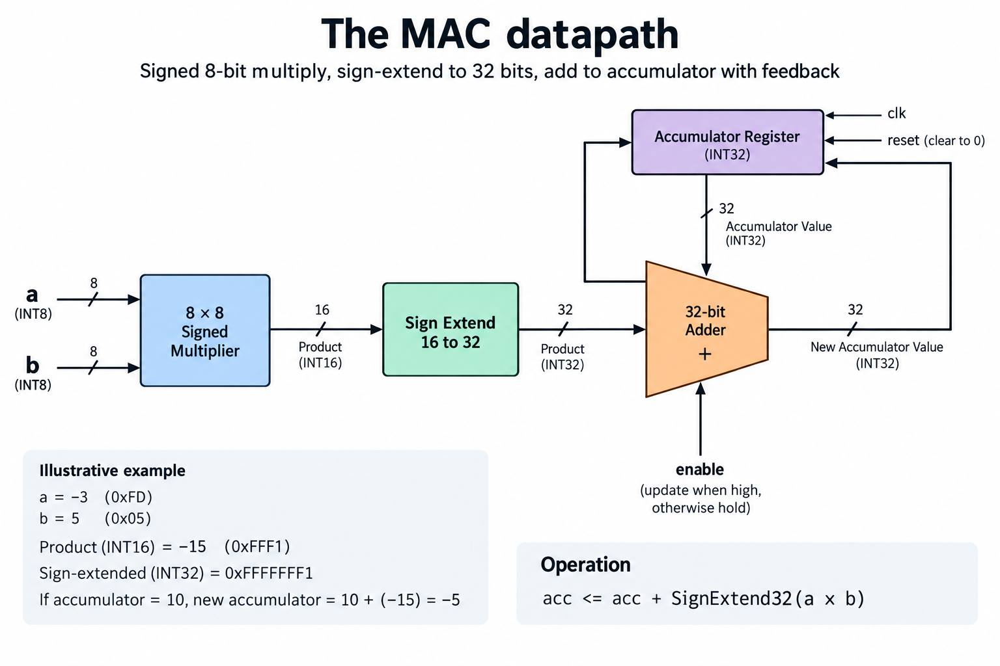
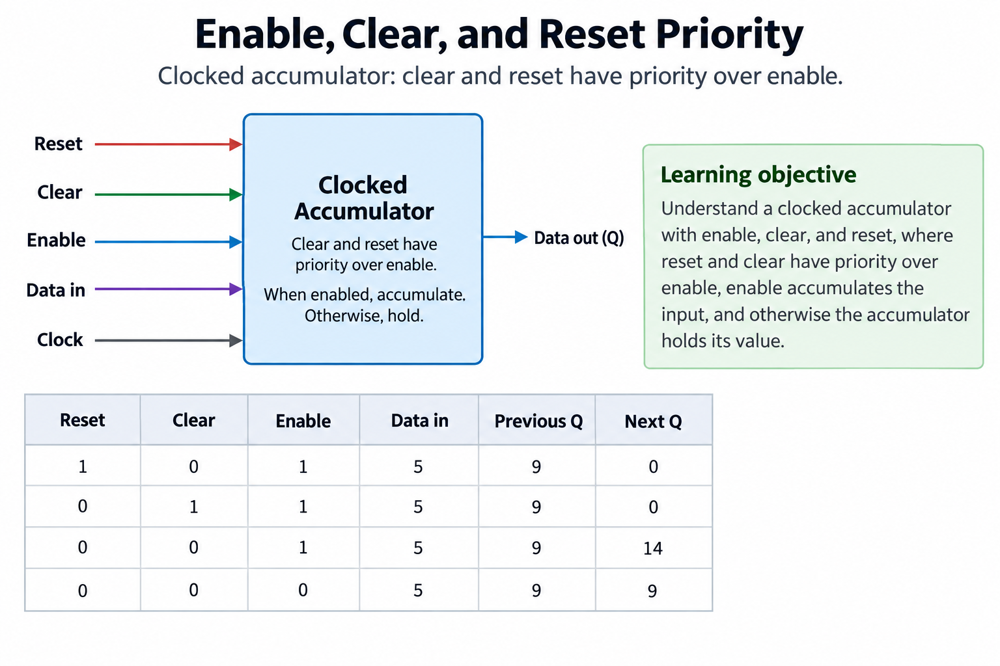
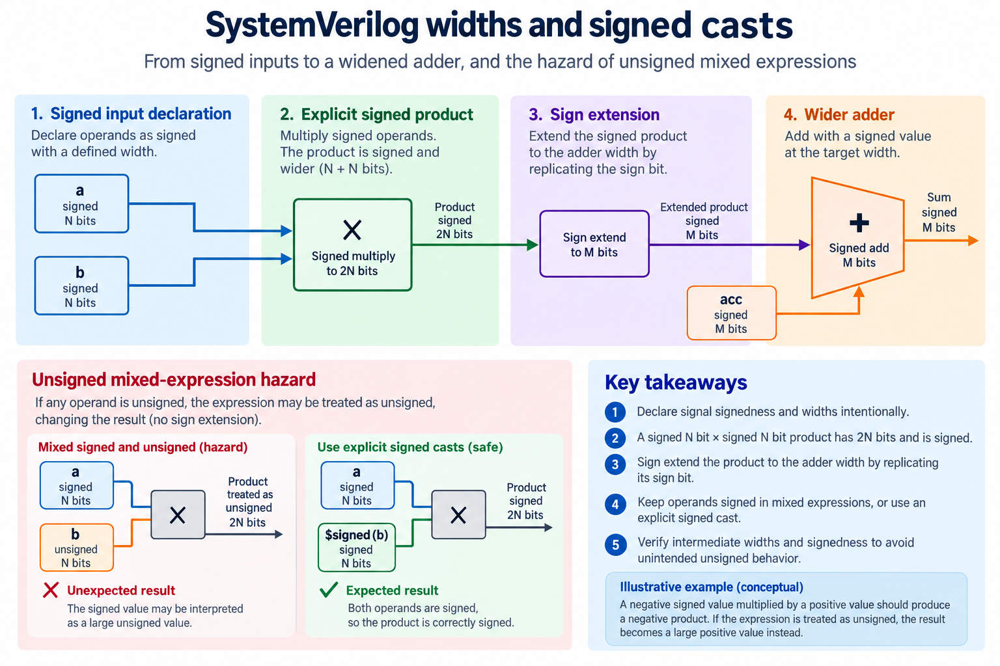
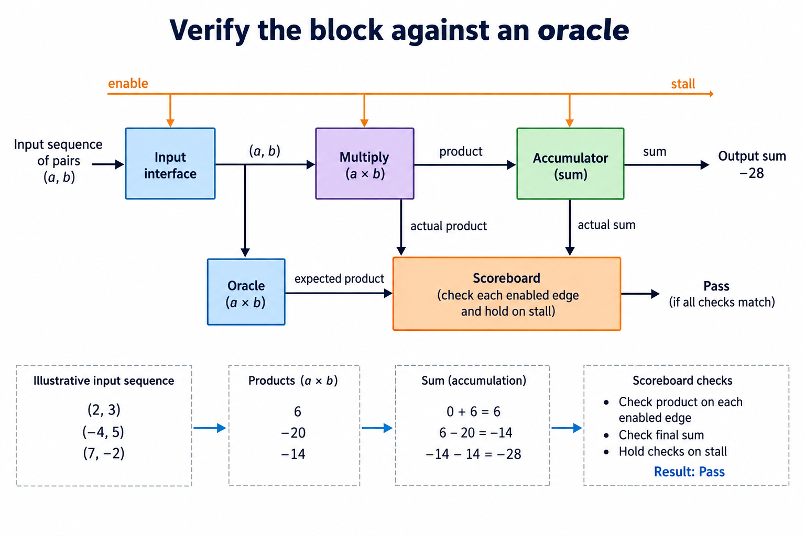

## Overview



This lesson extends one educational AI accelerator from its numerical specification toward verified RTL, FPGA integration and an ASIC implementation exercise. The overview shows this chapter's specific responsibility: Implement one signed MAC with explicit widths and compare its outputs against the reference.

The shared project begins with signed INT8 operands and INT32 accumulation, grows into a 4×4 output-stationary array, and provides a verified host-loaded tile top. The larger tiled inference/transport examples are software models, while external bus, board and physical-design integration remain explicit exercises. Follow the evidence labels rather than treating every diagram as an executed hardware result.

Start after [INT8 Arithmetic: Quantization, Signed Products, and Accumulator Width](/blog/fpga-ai-number-1-int8-arithmetic/). Keep the previous fixture and source revision so this chapter's change can be checked independently.

## Deep dive

### The MAC datapath



The MAC figure multiplies two signed INT8 inputs and adds their sign-extended product to an INT32 register. The register provides feedback so each enabled cycle contributes another product. This is the smallest useful compute building block in the series.

The multiplier result has its own explicit signed 16-bit wire. Sign extension repeats that result's sign bit before the wider addition. Zero extension would turn a negative product into a large positive contribution. Keeping the intermediate visible makes review and waveforms easier.

The module parameterization requires accumulator width at least twice operand width. Our supported instance uses W=8 and ACC=32. It does not silently promise arbitrary legal parameters or unlimited K. The workload contract and width derivation remain necessary even when a generic module compiles.

### Enable, clear, and reset priority



The priority figure defines behavior at every edge. Reset or clear sets the sum to zero. Otherwise enable adds the current product. Otherwise the sum holds. Because clear has priority over enable, an edge asserting both does not accumulate a product.

That contract removes ambiguity at tile boundaries. Clear the accumulator before beginning a new output tile, then issue the required enabled contributions. If clear occurs halfway through a dot product, its previous partial result is intentionally discarded. A testbench must model that same event rather than call it a numerical failure.

Reset here is synchronous and active high. A board/system wrapper must provide a reset compatible with the clock domain. Adding asynchronous reset later is a changed timing contract that needs review; source-level similarity is not proof of identical physical behavior.

### SystemVerilog widths and signed casts



The signed-expression figure highlights the boundary between bit width and arithmetic meaning. Declaring the inputs signed is necessary, and explicitly retaining a signed product prevents an accidental unsigned intermediate. The wider adder receives the intended negative value through sign extension.

In mac.sv, product and extended are separate wires. The sequential assignment uses the registered sum plus extended. With nonblocking assignment, the sum observed after the edge includes exactly one accepted contribution. There is no output-ready interface in this first block; enable is its local accepted-work event.

A later stream interface should not feed enable from valid alone. If a producer is blocked, valid may remain high for several cycles without a new transaction. Using valid alone would accumulate the same product repeatedly. Local arithmetic and system handshake contracts must be connected deliberately.

### Verify the block against an oracle



The verification figure follows products 6,-20,-14 from input pairs (2,3),(-4,5),(7,-2). With three enabled edges and no intervening clear, the final sum is -28. Disabled edges must leave that running sum unchanged.

The shared RTL harness compiles the actual source and checks 250 deterministic vectors including enable stalls, signed operands and clear events. Expected values are calculated independently in Python and inserted into a generated testbench. The recorded report identifies simulator version and seed.

Inspect a failing intermediate before replacing the circuit. Wrong negative contributions suggest signedness or extension. Extra contributions suggest enable/handshake logic. Missing contributions suggest clear/reset or sampling alignment. A MAC that passes these local tests is ready to become a PE component, but it is not yet a complete accelerator.

### Run this lesson

Download the [accelerator lab](/labs/fpga-ai-chip/accelerator-lab.zip), extract it and run from its directory:

```sh
python3 lessons.py rtl-1
python3 -m unittest discover -s tests -v
```

The first command writes `reports/rtl-1.json`. Inspect its scope and result together. The second runs the independent numerical, addressing and scheduling checks. To reproduce RTL evidence, install Icarus Verilog 13.0 and run `python3 scripts/verify_top.py`; that also runs the block/array tests. These commands are software/RTL checks, not board measurements.

### Source: rtl/mac.sv

This is the released executable source for this step. Preserve its stated protocol/width assumptions when adapting it.

```systemverilog
module mac #(parameter W=8, ACC=32)(input logic clk,rst,clear,en,
 input logic signed [W-1:0] a,b, output logic signed [ACC-1:0] sum);
 wire signed [2*W-1:0] product=$signed(a)*$signed(b);
 wire signed [ACC-1:0] extended={{(ACC-2*W){product[2*W-1]}},product};
 always_ff @(posedge clk) begin
  if(rst || clear) sum<='0;
  else if(en) sum<=sum+extended;
 end
endmodule
```

### From specification to an executable check

Create a new working copy of the lab and keep the numerical contract beside its sources. The opening work uses Python to make the values and accepted events explicit before circuit optimization. A direct matrix loop is the independent reference; a cycle-stepped array model explains timing without being the only numerical oracle.

Start with known signed values, not only random data. Distinct elements expose row/column swaps and misaligned reductions, zero and the signed endpoints expose conversion and width mistakes, and a stalled event exposes the difference between offered work, accepted work and elapsed clocks. Retain each fixture so later changes can be compared against the same contract.

When moving the operation into RTL, draw the register boundaries and define reset/clear priority. A value observed before an active edge belongs to the previous state; a value observed after nonblocking updates belongs to the new state. Record that convention in the harness. Otherwise a testbench race can resemble a circuit defect.

The acceptance result is a defined behavior and an executed software/RTL check, not a physical clock achievement. Synthesis, board integration and measured performance belong to later milestones. This separation makes the early lesson useful without inventing a hardware result.

### A worked engineering decision

#### Reconstruct the MAC from its state equation

The multiply-accumulate block has one persistent numerical state: its accumulator. On an enabled edge, it adds the signed product of the current input pair to the previous accumulator, reset has the highest priority with clear next and enable last, and with no reset, clear or enable the accumulator retains its previous value. The multiplier itself is combinational in this baseline, so the complete product-plus-add path lies between input/state sources and the accumulator register.

Begin with accumulator 0 and input pair (2,3). An enabled edge produces 6. The next enabled pair (-4,5) produces a product of -20 and a new accumulator of -14. A clock with enable 0 must retain -14 regardless of offered input bits. A final enabled pair (7,-2) produces -28. This short sequence checks signed products, feedback, accumulation and hold behavior in a way that one isolated multiplication cannot.

Clear with enable simultaneously high must produce 0, not the offered product. Reset with clear and enable also high must produce 0. Those cases prove the priority encoded by the clocked if/else chain. Clear here does not mean “clear and begin a new multiplication on the same edge.” If an integration wants that behavior, it needs a different contract and independent fixtures. Avoid altering priority during a performance refactor without recognizing that it is a functional change.

#### Keep product and accumulator widths distinct

For W=8, the product is signed 16-bit, while the accumulator is signed 32-bit. The source explicitly sign-extends the product into the accumulator domain. Calling the accumulator “2W” would describe a different circuit and would fail longer reductions. The parameter relationship therefore matters as much as the arithmetic expression: operands, product and accumulated result do not share one universal width.

Parameterization is useful only within a supported range. If a reader changes W or ACC_W, they must ensure the extension remains valid and the required reduction fits, and a generated part-select with a negative replication count is not a legal way to truncate a larger product, so the educational default stays intentionally simple: production-quality parameter guards and additional numerical configurations are follow-up work rather than assumed verified behavior.

The right-hand side of a nonblocking assignment uses the old accumulator at the active edge. The simulator then updates the register. A checker observing before that update sees the previous result; a checker observing afterward sees the new result. The verification script follows an explicit drive/edge/sample sequence. A waveform should use the same convention so a timing misunderstanding does not appear to be an arithmetic defect.

#### Build an independent scoreboard for the state

The oracle should receive the accepted input pair and control conditions, not a value computed by the DUT. It maintains its own expected accumulator using Python integers and the declared reset/clear/enable priorities. After each edge, compare the observed hardware accumulator with that independent state. If the expected value is derived from DUT output, a shared wrong result can pass by construction.

Compare every edge rather than only the final sum. Missing and duplicated products can cancel, and a clear applied at the wrong moment can still leave a plausible final 0. The directed sequence above is supplemented by signed endpoints, random accepted pairs, hold cycles and simultaneous control conditions. Store the seed and source revision with the result so a future change can reproduce the same traffic.

For a failure, log the previous expected accumulator, input pair, control bits, expected next accumulator and observed next accumulator. A wrong negative product suggests signedness or extension. A correct product with a wrong running sum suggests feedback, sampling or control priority. An output change during enable 0 suggests a hold defect. This classification reduces debugging from the entire project to a specific register transition.

#### Understand what synthesis can and cannot establish

An FPGA mapper may place multiplication and accumulation in a DSP block, distribute some logic into LUTs, or select another legal implementation. The RTL statement defines behavior; it does not guarantee a particular resource mapping. Inspect the target's resource report and inferred arithmetic structures when synthesis is actually executed. A simulator cannot provide those implementation facts.

Likewise, the combinational path has no measured delay in this release. A later implementation run must constrain the clock, interface timing and target part before reporting timing closure. Pipelining can divide the path, but it introduces state and validity that must be verified. The next lesson makes that change while preserving the numerical sequence; it does not rename a simulator cycle count as an achieved FPGA frequency.

A useful baseline is small enough that every state change can be explained from the source and fixture. Preserve that baseline as a reference even after adding pipeline stages or an array. When a larger accelerator fails, one tested MAC provides a trustworthy local component, while the integration still needs its own operand pairing, forwarding and completion checks. Verified building blocks make the project easier to reason about without implying that their composition is automatically correct.

## Conclusion

The outcome of this chapter is a concrete project artifact and a check whose scope is stated explicitly. Preserve numerical results, transaction ordering and lifetime rules as the design grows; optimize only after the baseline is correct. Next, [Hardware Verification: Python Testbenches, Scoreboards, and Waveforms](/blog/fpga-ai-verify-1-hardware-verification/) adds the next responsibility without changing the established contract.

### Sources

- [Original accelerator lab and verification evidence](https://chiaxinliang.github.io/labs/fpga-ai-chip/accelerator-lab.zip)
