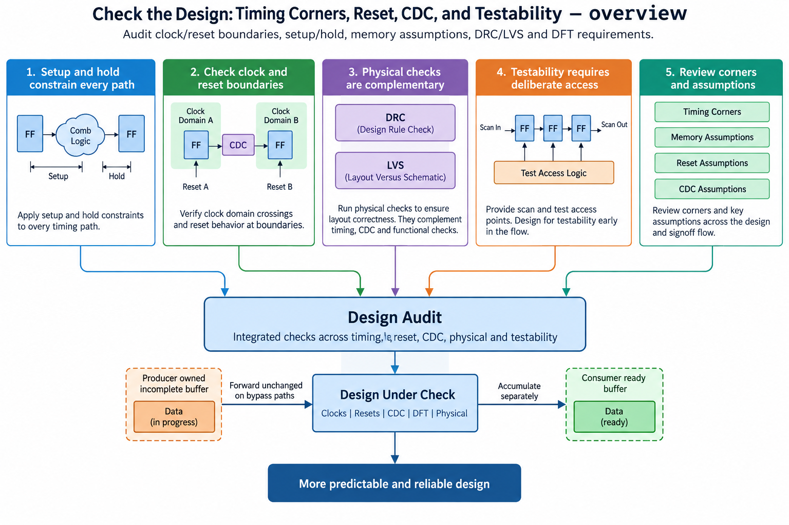
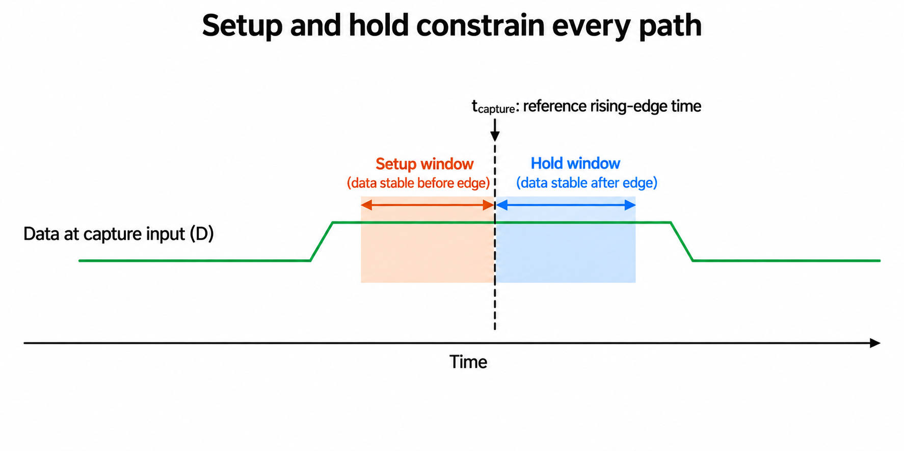
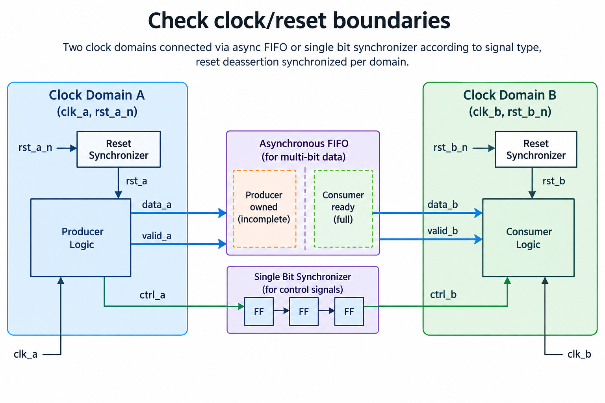
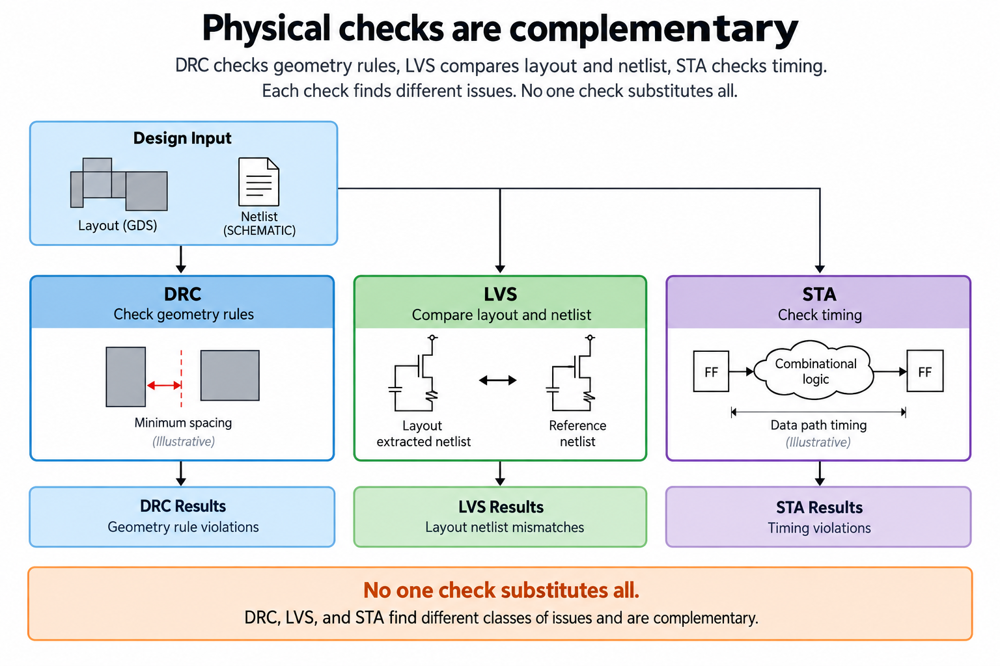
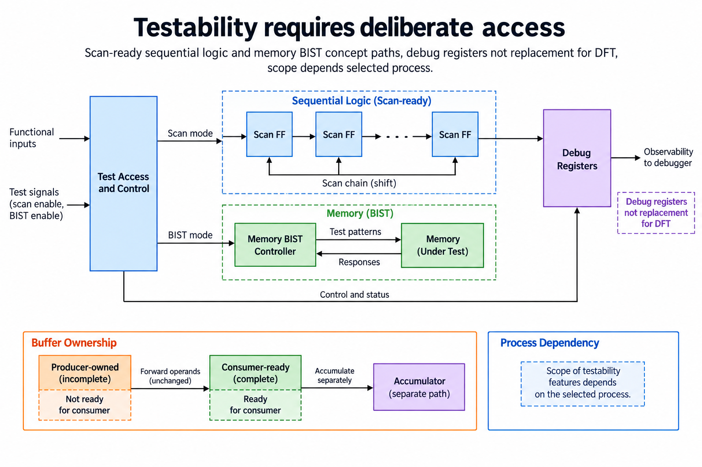
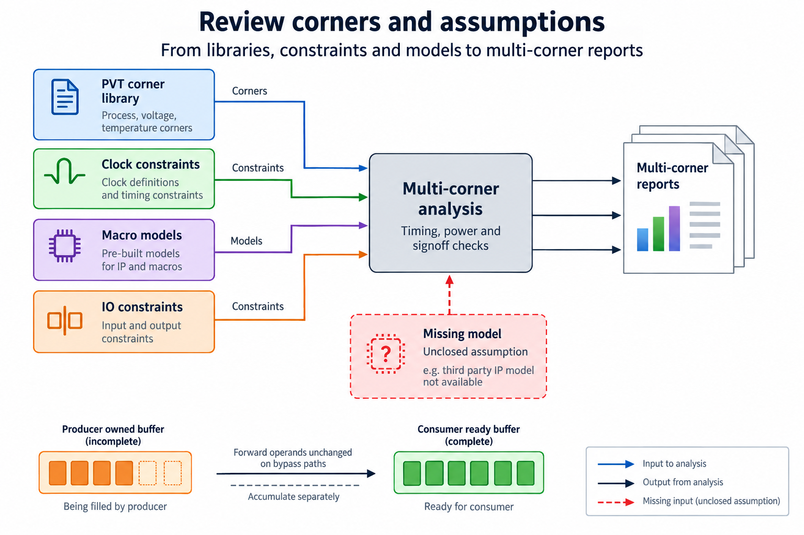

## Overview



This lesson extends one educational AI accelerator from its numerical specification toward verified RTL, FPGA integration and an ASIC implementation exercise. The overview shows this chapter's specific responsibility: Audit clock/reset boundaries, setup/hold, memory assumptions, DRC/LVS and DFT requirements.

The shared project begins with signed INT8 operands and INT32 accumulation, grows into a 4×4 output-stationary array, and provides a verified host-loaded tile top. The larger tiled inference/transport examples are software models, while external bus, board and physical-design integration remain explicit exercises. Follow the evidence labels rather than treating every diagram as an executed hardware result.

Start after [RTL to Layout: Synthesis, Floorplanning, Placement, and Routing](/blog/fpga-ai-physical-1-rtl-to-layout/). Keep the previous fixture and source revision so this chapter's change can be checked independently.

## Deep dive

### Setup and hold constrain every path



The timing figure shows setup before a capture edge and hold after it. Both depend on data delay, clock arrival, cell timing and the selected corner. Meeting a target period at one condition is not a complete timing conclusion.

Our RTL tests use ideal simulation clocks. They do not measure setup/hold or physical skew. The physical flow must use the correct libraries and constraints, including I/O timing and memory models.

Review unconstrained paths and exceptions alongside slack. A report with missing constraints can look successful while checking little of the actual design.

### Check clock/reset boundaries



The boundary figure treats CDC according to signal type. A stable single-bit control can use a suitable synchronizer; a changing multi-bit stream generally needs a protocol such as an asynchronous FIFO or coherent handshake.

The released core uses one local clock. A board shell can introduce additional domains, so the absence of CDC inside the array does not prove system-level CDC closure. Reset deassertion also needs domain-specific treatment.

Test reset while work is outstanding and define whether it cancels or drains transactions. A correct sum after a clean launch says nothing about recovery from an asynchronous external event.

### Physical checks are complementary



The checks figure separates DRC,LVS and STA. Geometry rules, layout connectivity and timing are complementary. A generated layout picture is not evidence that any of these passed.

The release checklist marks physical checks as unperformed. RTL numerical/protocol checks remain recorded separately. Unknown evidence is unclosed, not a successful result or a zero-error assumption.

For a real target, retain tool versions, rules, corners and logs. Investigate waived violations with their exact scope. A generic educational ruleset is not interchangeable with foundry-approved signoff.

### Testability requires deliberate access



The testability figure distinguishes debug access from manufacturing test. Scan and memory test strategies expose internal faults under a technology/integration plan. Host-readable registers are useful for bring-up but do not automatically replace DFT.

The small release has no inserted scan chain or SRAM BIST. Its RTL tests verify modeled functionality, not manufactured defect coverage. A future fabrication plan must define test interfaces and permitted flows.

DFT can change area, timing and reset/control behavior. Integrate it deliberately, then repeat functional/equivalence and physical checks. Do not append a “scan-ready” label without supporting evidence.

### Review corners and assumptions



The corner figure records process,voltage,temperature and modeling assumptions. Different corners can dominate setup and hold. Include memory, I/O and clock models where they participate in paths.

A report should state which checks remain missing. For this release, the checklist explicitly leaves STA,DRC,LVS and scan insertion unperformed. It can serve as a gate for a later educational or fabrication milestone.

The useful outcome is an honest signoff evidence map. It connects every claim to an executed check and prevents a passing RTL simulation from being mistaken for a manufactured chip's readiness.

### Run this lesson

Download the [accelerator lab](/labs/fpga-ai-chip/accelerator-lab.zip), extract it and run from its directory:

```sh
python3 lessons.py signoff-1
python3 -m unittest discover -s tests -v
```

The first command writes `reports/signoff-1.json`. Inspect its scope and result together. The second runs the independent numerical, addressing and scheduling checks. To reproduce RTL evidence, install Icarus Verilog 13.0 and run `python3 scripts/verify_top.py`; that also runs the block/array tests. These commands are software/RTL checks, not board measurements.

### Keep behavioral and physical evidence separate

Portable RTL is an entry point to implementation, not a fabrication-ready package. The educational flow must combine it with a supported cell library, constraints and appropriate models. Larger memory structures need permitted macros with simulation, timing and physical views that agree on their behavior. FPGA initialization and primitive assumptions cannot be carried over silently.

Inspect each stage's evidence: synthesis mapping, floorplan/placement, clock distribution, routed interconnect and extracted timing. A layout file is not a substitute for DRC, LVS or STA. Unconstrained paths and missing views can make an apparently successful report incomplete. Record the exact target and flow revision.

The supplied configuration uses educational Nangate45 and has not been executed in this release. It is not a foundry signoff package. The small core also lacks a production pad ring, scan insertion and fabrication/board integration. Those are later target-specific milestones with distinct evidence, rather than properties inferred from a passing RTL test.

Retain a manifest of sources, tests, constraints and tool/model versions. Numerical and protocol tests remain reproducible while new wrappers or physical stages are added. Before fabrication, close the actual full-chip electrical, physical and test requirements and prepare a bring-up plan. The learning result is a traceable transition from verified behavior to implementation, with unperformed checks left explicitly unclosed.

### A worked engineering decision

#### Audit timing assumptions before reading a pass result

A timing report evaluates paths under a model and constraint set. Identify launch/capture clocks, input/output requirements, generated clocks, process/voltage/temperature corners and parasitic models. Setup constrains data arrival before capture; hold constrains stability after the relevant edge. A diagram's stability windows are illustrative intervals, while actual values come from the selected library, clocks and implementation.

Review unconstrained paths and exceptions explicitly. An exception can remove a check from ordinary analysis without making the physical design safe. Its justification should come from an implemented protocol or timing relationship, not from the desire to eliminate a violation. Multi-cycle or false-path declarations also need companion hold and structural reasoning appropriate to the design. Keep reviewed constraints beside the report.

The provided core SDC is an illustrative educational boundary, not a multi-corner production signoff set. The release did not execute physical STA or produce timing slack. A simulator's 14 logical array steps say nothing about a cell library's setup/hold closure. Preserve that distinction when documenting the current milestone.

#### Review clock and reset crossings by signal purpose

A single-bit stable control level may use a suitable synchronizer, while a pulse needs a method that ensures it is observed. A multi-bit payload normally needs a protocol such as a handshake or asynchronous FIFO rather than independently synchronizing bits and assuming they remain coherent. The crossing method should reflect data lifetime and acceptance, not just bus width.

Reset release must be appropriate to each destination clock domain and target requirements. An ideal simulation reset does not establish physical recovery/removal behavior or metastability risk. Review clock availability, reset sequencing and macro-specific assumptions. A board shell or full-chip wrapper can introduce crossings absent from the single-clock portable core, so its checks are new work rather than inherited proof.

A CDC structure also needs functional protocol verification. A queue can have safe clock-domain pointer handling yet still lose transactions through a wrong full/empty or reset policy. Track accepted and consumed events with the declared cancellation rules. Timing exceptions, structural CDC checks and numerical/transaction simulation complement each other; 1 category does not replace the others.

#### Keep physical checks distinct from functional checks

DRC evaluates layout geometry against the selected process rules. LVS compares extracted connectivity with the intended reference netlist/schematic under the required models. STA evaluates timing. A functionally correct simulation can still have illegal geometry or incorrect physical connectivity, while a DRC-clean layout can implement a wrong numerical circuit. The checks answer different questions and need consistent artifacts.

Retain the exact netlist, layout, extraction and rule/model versions used for each report. Mixing a newer layout with an older reference can produce misleading results or obscure which revision passed. Missing third-party or macro models are unresolved assumptions, not successful signoff. Document the missing input and keep the relevant milestone unclaimed until evidence exists.

Power and reliability checks depend on target and required process scope. Do not invent universal thresholds or claim a generic cell-level exercise covers full-chip power integrity. A production plan comes from the selected integration and process requirements. The educational checklist identifies categories, while a real project must bind them to tools, rules, conditions and owners.

#### Design test access before the manufacturing boundary

Debug registers can expose useful state for bring-up, but they are not a universal replacement for scan, memory test or other DFT requirements. Scan changes sequential test access; memory BIST applies defined patterns and checks to memories; test control and pins must be integrated. The chosen process and manufacturing plan determine the required scope and evidence.

The current lab contains no scan insertion or implemented memory BIST controller. Its figures teach those mechanisms as extensions. A proposed DFT insertion must preserve functional behavior outside test mode and have test-mode verification. It can also change timing, area, clocks and routing, requiring updated physical reports. Adding a test-enable label to a drawing does not create test coverage.

Bring-up observability has another role: identify clock/reset, transport, memory and arithmetic failures on a real board or first silicon. Small known fixtures remain useful, but successful bring-up is not exhaustive manufacturing test. Keep debug evidence and formal/physical/manufacturing checks distinct in the release records.

#### Close assumptions with a requirement-to-evidence ledger

For every required condition, record the source artifact, tool/model environment, executed check, result and remaining limitation. A checklist item marked planned is not a pass. The release's actual ledger includes numerical Python tests and RTL simulation reports, while physical timing, CDC shell integration, DRC/LVS, scan and fabrication remain unperformed. That is an honest educational milestone, not a failed claim to be a production chip.

After any wrapper, memory, clock or physical change, identify which evidence must be rerun. Reuse unchanged numerical fixtures, but do not assume old physical results apply to new routes or libraries. This ledger turns “signoff” into reviewable obligations instead of a single reassuring word. It also tells the next reader exactly what remains between the tested accelerator core and a manufacturable integrated system.

## Conclusion

The outcome of this chapter is a concrete project artifact and a check whose scope is stated explicitly. Preserve numerical results, transaction ordering and lifetime rules as the design grows; optimize only after the baseline is correct. Next, [Prepare the AI Chip Release: Reproducible RTL, Reports, and Bring-Up Plan](/blog/fpga-ai-release-1-prepare-the-ai-chip-release/) adds the next responsibility without changing the established contract.

### Sources

- [Original accelerator lab and verification evidence](https://chiaxinliang.github.io/labs/fpga-ai-chip/accelerator-lab.zip)
- [OpenROAD physical-design documentation](https://openroad.readthedocs.io/en/latest/main/README.html)
