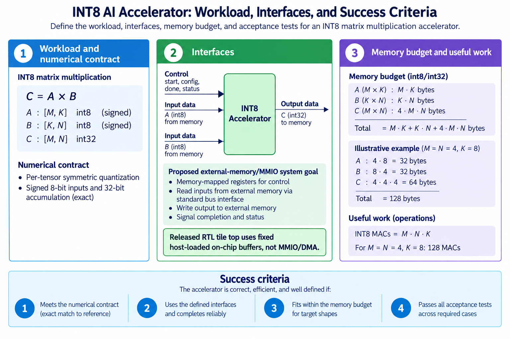
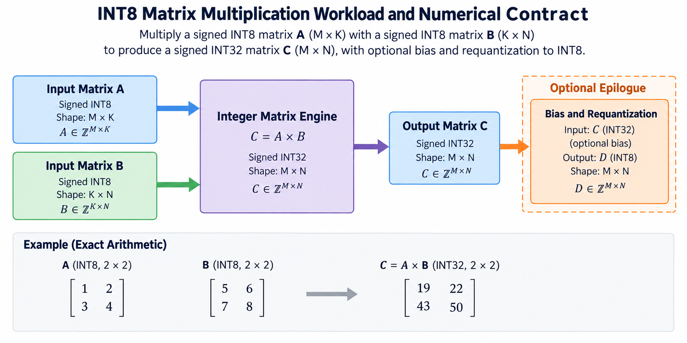
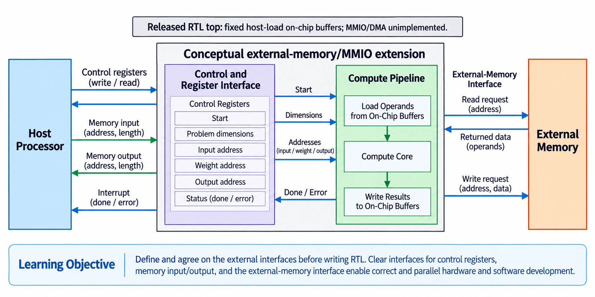
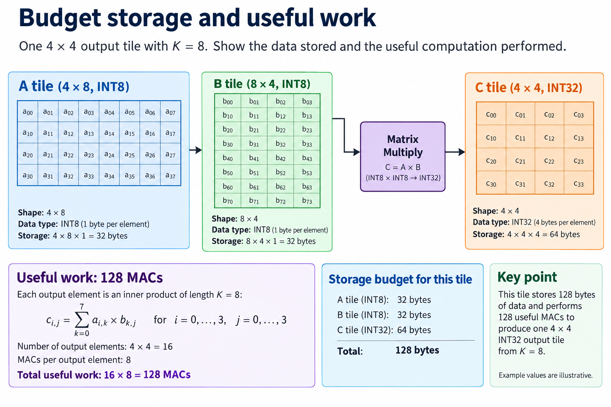
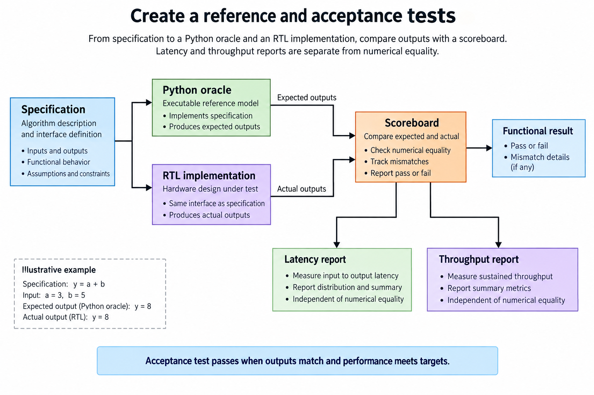

## Overview



This lesson extends one educational AI accelerator from its numerical specification toward verified RTL, FPGA integration and an ASIC implementation exercise. The overview shows this chapter's specific responsibility: Write a small INT8 inference specification, shapes, numerical contract, memory budget and test criteria.

The shared project begins with signed INT8 operands and INT32 accumulation, grows into a 4×4 output-stationary array, and provides a verified host-loaded tile top. The larger tiled inference/transport examples are software models, while external bus, board and physical-design integration remain explicit exercises. Follow the evidence labels rather than treating every diagram as an executed hardware result.

## Deep dive

### Choose one workload and its numerical contract



The first figure fixes what the accelerator will calculate: signed INT8 matrix inputs, INT32 sums and a defined output epilogue. Begin with matrix multiplication, not a promise to support every neural-network operator. If A has M rows and K columns and B has K rows and N columns, the output has M rows and N columns. Every output element is a reduction over the same K dimension.

A workload specification names valid shapes, memory layout and supported types. Our model accepts positive dimensions and row-major inputs. It rejects incompatible shapes. The initial array is 4×4, but tiling lets a larger logical matrix use repeated physical tiles. The contract distinguishes logical dimensions from hardware dimensions.

Define correctness before optimization. Integer results must match a bit-accurate oracle exactly, while overflow and requantization follow explicit policies. “Approximately correct” is not enough for an integer datapath whose intended arithmetic is exact. Floating-point training accuracy is outside this small project's acceptance test.

### Define interfaces before writing RTL



The interface figure separates commands from payload. A command describes source/destination addresses and dimensions; tensors contain the bytes consumed and produced. Completion tells the host when output is usable. A start event must snapshot a complete command rather than reading fields while the host changes them.

The functional model uses Command(a,b,c,m,n,k) and bounded byte-addressed Memory. Those objects define behavior without claiming to implement RTL MMIO or AXI DMA. Hardware integration later needs actual registers, bus transactions and a board-specific shell. Keeping the same behavioral contract helps test that extension.

Require valid ranges, output alignment and non-overlap with live inputs. For INT32 outputs, each element occupies 4 bytes. An output pointer aligned for INT8 input is not necessarily aligned for wider output. Validate before doing work so an invalid command cannot corrupt another buffer.

### Budget storage and useful work



The budget figure makes one tile concrete. A 4×4 output with K=8 needs 4×8=32 input bytes and 8×4=32 weight bytes at INT8. Its 16 INT32 output elements occupy 64 bytes. Useful work is 4×4×8=128 MACs. Under MAC=2 operations, that is 256 operations, not 256 instructions or cycles.

A 4×4 array has at most 16 active cells per global step, but fill/drain and invalid lanes reduce useful utilization. The ideal no-stall wavefront takes K+4+4-2=14 steps, giving 128 useful MACs out of 224 potential cell-step slots. This is an analytical model, not FPGA timing.

Add buffers, scale metadata and temporary state to the storage ledger before choosing a device target. Double buffering adds another live input pair. The arithmetic count is independent of whether those buffers are in BRAM, ASIC SRAM or the software model.

### Create a reference and acceptance tests



The acceptance figure sends identical accepted work to an oracle and the implementation. Compare output values first, then report latency and throughput separately. A test that merely compares two copies of the same hardware algorithm can repeat its mistake; the independent direct matrix loop provides a different reference.

Start with the hand-checkable 2×2 case producing [[19,22],[43,50]]. Add signed extremes, irregular shapes and invalid commands. The test corpus checks tiled execution against direct matmul, while RTL tests check forwarding, masks and global stalls. No board measurement is implied by those results.

Write the numerical and interface specification into a versioned artifact. Future optimization must preserve it or deliberately version a changed contract. The outcome of this lesson is a small enough target to implement and verify, with clear boundaries for unsupported operators and physical integration.

### Run this lesson

Download the [accelerator lab](/labs/fpga-ai-chip/accelerator-lab.zip), extract it and run from its directory:

```sh
python3 lessons.py spec-1
python3 -m unittest discover -s tests -v
```

The first command writes `reports/spec-1.json`. Inspect its scope and result together. The second runs the independent numerical, addressing and scheduling checks. To reproduce RTL evidence, install Icarus Verilog 13.0 and run `python3 scripts/verify_top.py`; that also runs the block/array tests. These commands are software/RTL checks, not board measurements.

### From specification to an executable check

Create a new working copy of the lab and keep the numerical contract beside its sources. The opening work uses Python to make the values and accepted events explicit before circuit optimization. A direct matrix loop is the independent reference; a cycle-stepped array model explains timing without being the only numerical oracle.

Start with known signed values, not only random data. Distinct elements expose row/column swaps and misaligned reductions. Zero and the signed endpoints expose conversion and width mistakes. A stalled event exposes the difference between offered work, accepted work and elapsed clocks. Retain each fixture so later changes can be compared against the same contract.

When moving the operation into RTL, draw the register boundaries and define reset/clear priority. A value observed before an active edge belongs to the previous state; a value observed after nonblocking updates belongs to the new state. Record that convention in the harness. Otherwise a testbench race can resemble a circuit defect.

The acceptance result is a defined behavior and an executed software/RTL check, not a physical clock achievement. Synthesis, board integration and measured performance belong to later milestones. This separation makes the early lesson useful without inventing a hardware result.

### A worked engineering decision

#### Derive a fixture before choosing the circuit

Use a 2×2 matrix as the first executable specification. Let A contain rows [1,2] and [3,4], and let B contain rows [5,6] and [7,8]. The expected C rows are [19,22] and [43,50]. Work out each dot product on paper, then check the same result with the direct Python reference. Distinct entries matter: a matrix filled with 1 can hide a transpose, repeated row or swapped column. This fixture gives the later controller, serializer and array the same small, inspectable target.

Next include a negative value. Replacing A[0,0] with -1 changes the first output row to [9,10] while preserving the second row. INT8 serialization stores -1 as the byte 0xff, but its numerical interpretation remains signed. A host that later reads that byte as 255 has changed the operation before the multiplier is involved. Put signed interpretation into the contract rather than trusting a programming-language default. Keep the raw byte fixture beside the expected signed result.

The operation produces a wider result. It does not promise that every C element fits INT8. Even a 1-term product of -128 with -128 is 16384. A specification that calls the result “8-bit AI output” without declaring a conversion cannot be implemented consistently. State whether the primary result is INT32, whether bias is included, and whether an optional output epilogue subsequently converts to INT8. The released tile top stops at INT32 matrix output; the epilogue is independently executable Python behavior.

#### Turn the logical shape into storage obligations

For the full educational tile M=N=4 and K=8, A holds 32 INT8 elements and B holds another 32. C holds 16 INT32 elements, which require 64 bytes. The unique tensor storage budget is consequently 128 bytes before any double buffers, metadata or implementation overhead. This is a capacity calculation, not a statement that a synthesized system will use exactly 128 bytes of physical memory. Mapping, ports, padding and registers affect the latter.

The useful work is M×N×K, or 128 multiply-accumulate contributions. Counting 1 MAC as 2 arithmetic operations gives 256 operations under that stated convention. Neither count is a measured rate. To produce a rate, a later experiment needs a time interval and a defined completion boundary. A device may spend clocks clearing state, injecting operands, draining the array, capturing results and waiting on transport. The specification should make those stages visible rather than letting an attractive arithmetic count imply application performance.

Separate logical dimensions from physical storage. The integrated tile top reserves fixed padded layouts: 4 A rows with stride 8 and 8 B rows with stride 4. A smaller legal operation still uses those storage conventions, although only its logical elements contribute. The broader software transport uses compact logical matrix layouts. A bridge between those interfaces must repack explicitly; sharing the same INT8 type does not make their address maps identical.

#### Specify accepted commands and observable completion

A command should snapshot the operation it accepts. Otherwise a host changing M, N or K during computation could silently alter a running reduction. The integrated top accepts a legal start while idle, validates M and N from 1 through 4 and K from 1 through 8, and retains that job's dimensions. A broader matrix tiler can cover larger shapes by invoking smaller operations, but it is not permission to send an unsupported large dimension to this fixed top.

Define what happens to writes and additional starts during busy. This project ignores those events in the simple integrated interface. That policy is easy to simulate, but a production transport might return a backpressure or error response instead. Whichever policy is selected, callers must be able to distinguish accepted work from offered work. A software driver should not reuse an operand buffer merely because it issued a write; it must follow the transport's actual acceptance and completion contract.

DONE describes captured usable results in this interface. In a future external-memory system, DONE may additionally need successful write responses and platform visibility rules. The event cannot be carried unchanged across a new bus by assumption. Document reset and recovery too: does reset cancel the job, invalidate outputs and require operands to be reloaded? A timeout can tell the host that completion did not arrive, but it does not by itself make partially written memory safe.

#### Review the specification as an independent artifact

Before optimizing, ask another reader to predict the 2×2 fixture from the written contract alone. They should know shapes, signedness, row-major interpretation, result width and any epilogue order without consulting RTL. Then give them an invalid dimension and ask whether output memory changes. Ambiguous answers indicate missing behavior, not a need for more pipeline registers. The numerical reference and the interface checks should exercise those decisions independently.

Keep a table of requirements and evidence. A Python result supports the mathematical and functional-memory behavior it executes. A simulator result supports the exercised RTL sequence. A timing report supports a constrained implementation in a specified target flow. A board measurement supports an actual integrated system and its test conditions. The progression from reference to circuit becomes reproducible when those records stay distinct.

The first design decision is therefore modest but consequential: a small signed matrix operation with a precise output and command boundary. That leaves enough structure to build the MAC, PE, array, controller and host lessons without pretending to have designed a complete commercial AI processor. Later architectural choices can be evaluated against a stable operation instead of repeatedly changing what success means.

## Conclusion

The outcome of this chapter is a concrete project artifact and a check whose scope is stated explicitly. Preserve numerical results, transaction ordering and lifetime rules as the design grows; optimize only after the baseline is correct. Next, [Digital Logic for AI Hardware: Registers, Clocks, and State Machines](/blog/fpga-ai-logic-1-digital-logic-for-ai-hardware/) adds the next responsibility without changing the established contract.

### Sources

- [Original accelerator lab and verification evidence](https://chiaxinliang.github.io/labs/fpga-ai-chip/accelerator-lab.zip)
