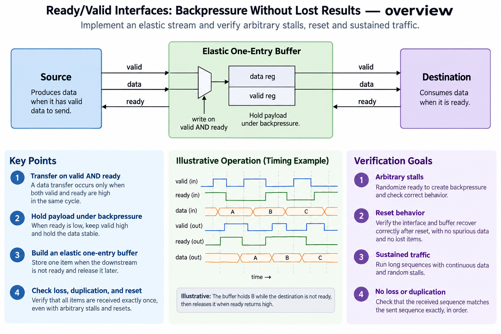
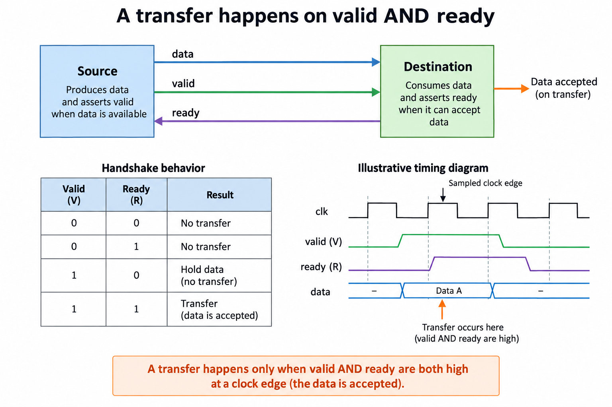
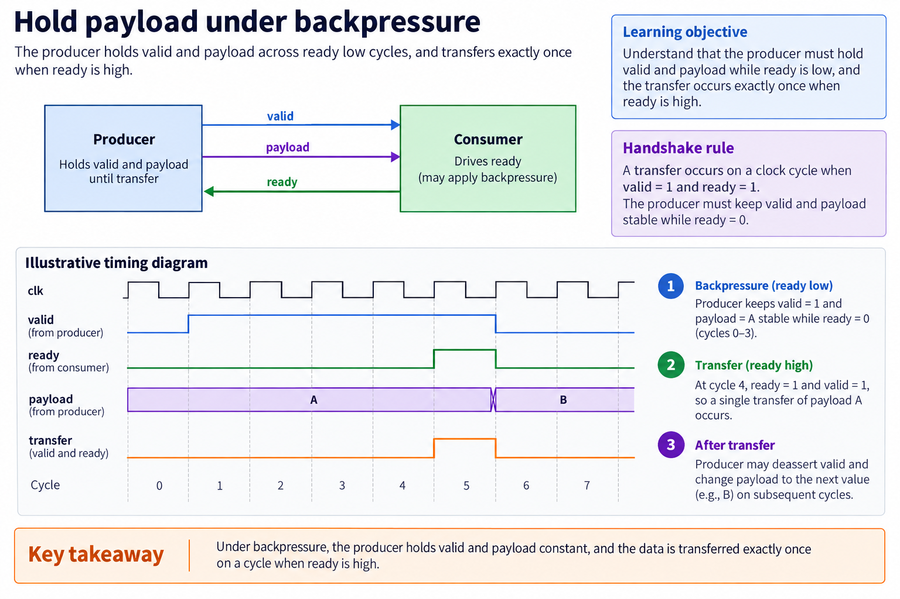
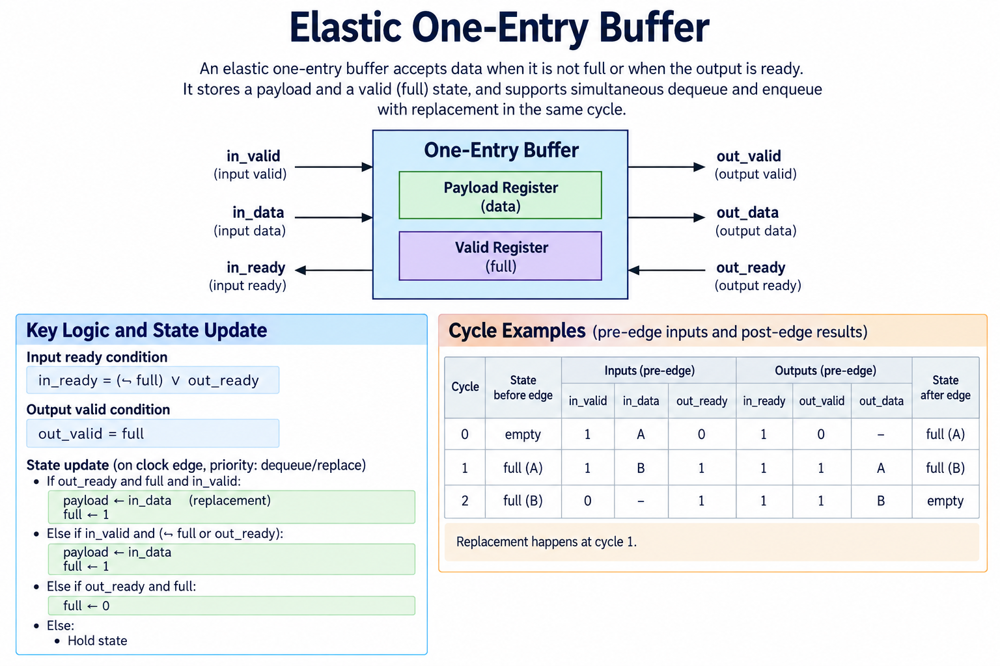
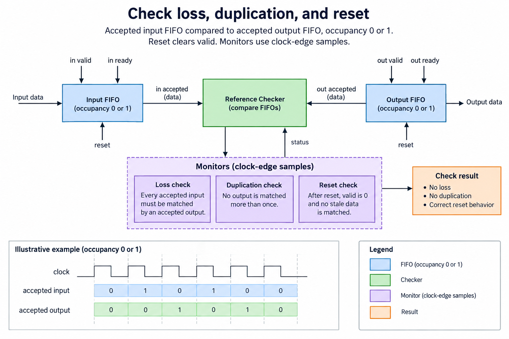

## Overview



This lesson extends one educational AI accelerator from its numerical specification toward verified RTL, FPGA integration and an ASIC implementation exercise. The overview shows this chapter's specific responsibility: Implement an elastic stream and verify arbitrary stalls, reset and sustained traffic.

The shared project begins with signed INT8 operands and INT32 accumulation, grows into a 4×4 output-stationary array, and provides a verified host-loaded tile top. The larger tiled inference/transport examples are software models, while external bus, board and physical-design integration remain explicit exercises. Follow the evidence labels rather than treating every diagram as an executed hardware result.

Start after [Pipeline the MAC: Latency, Throughput, and Timing](/blog/fpga-ai-pipe-1-pipeline-the-mac/). Keep the previous fixture and source revision so this chapter's change can be checked independently.

## Deep dive

### A transfer happens on valid AND ready



The handshake figure defines one transfer at a sampled edge when valid and ready are both true. Valid says the producer offers a payload; ready says the consumer can accept it. Either alone is not enough to count a transaction.

A producer may assert valid before the consumer is ready. While blocked, it must keep the offered payload stable under this stream contract. The consumer can change ready according to capacity, subject to the interface's timing rules.

This turns arithmetic enable into a meaningful event: enable equals accepted work, not simply offered work. A counter and accumulator should advance only when their required transaction actually occurs. The distinction matters for memory stalls and later tile scheduling.

### Hold payload under backpressure



The backpressure figure holds the same item across several ready-low cycles. When ready rises, the item transfers once. The producer may then offer the next item. A design that changes data each blocked cycle silently discards values.

A simulation monitor should sample valid, ready and data at the accepted edge. An assertion can require stable valid/payload across blocked cycles until acceptance or reset. Define the reset semantics, because invalidating a transaction changes what the receiver may expect.

Backpressure does not solve sustained rate mismatch. If a producer permanently offers more work than a consumer can process, finite queues eventually fill. Ready propagates that constraint upstream. Buffers absorb bursts and break timing paths; they do not create unlimited throughput.

### Build an elastic one-entry buffer



The elastic-buffer figure stores one payload plus an occupancy bit. Input ready is true when the buffer is empty or the current output can depart. That allows simultaneous dequeue and enqueue: the departing item is replaced without a wasted bubble.

In elastic.sv, output validity is the full/empty state. When input is ready, the next validity equals input valid, and accepted input data replaces the stored payload. When blocked, both state and payload hold. Reset clears validity.

Combinational ready paths can grow through many connected buffers. A larger design may need skid buffers or registered flow control with enough extra storage. Changing ready timing changes the buffering requirements; simply registering ready can acknowledge work that has nowhere to go.

### Check loss, duplication, and reset



The sequence figure compares accepted inputs with accepted outputs. The shared test supplies a retained offered item and randomized output readiness, then checks the FIFO order. It checks data values as well as count, so loss and duplication cannot cancel each other unnoticed.

The recorded run includes 500 cycles and 133 blocked-input cycles. The run exercises simultaneous replacement and final drain. Payloads are simple sequence numbers because they make an incorrect order visible; arithmetic modules use signed/random values separately.

An elastic stream can surround a MAC or memory consumer, but the internal unit must obey the same advance conditions. A globally stalled systolic array is one distinct contract; independently stallable PEs require a more complex protocol and are not implied by this one-entry buffer.

### Run this lesson

Download the [accelerator lab](/labs/fpga-ai-chip/accelerator-lab.zip), extract it and run from its directory:

```sh
python3 lessons.py stream-1
python3 -m unittest discover -s tests -v
```

The first command writes `reports/stream-1.json`. Inspect its scope and result together. The second runs the independent numerical, addressing and scheduling checks. To reproduce RTL evidence, install Icarus Verilog 13.0 and run `python3 scripts/verify_top.py`; that also runs the block/array tests. These commands are software/RTL checks, not board measurements.

### Source: rtl/elastic.sv

This is the released executable source for this step. Preserve its stated protocol/width assumptions when adapting it.

```systemverilog
module elastic #(parameter W=32)(input logic clk,rst,
 input logic in_valid, output logic in_ready, input logic [W-1:0] in_data,
 output logic out_valid, input logic out_ready, output logic [W-1:0] out_data);
 assign in_ready=!out_valid || out_ready;
 always_ff @(posedge clk) begin
  if(rst) begin out_valid<=0;out_data<='0;end
  else if(in_ready) begin
   out_valid<=in_valid;
   if(in_valid)out_data<=in_data;
  end
 end
endmodule
```

### Connect the block without changing its contract

Write the accepted-work event for every boundary. For a ready/valid stream, it is valid AND ready at the sampled edge. For the released systolic core, it is a common global step. These are different protocols. Connecting them requires buffering or a scheduler that preserves matched operand pairs and advances every affected state consistently.

Track data and validity together. A register can contain old bits while its valid flag is false; those bits must not become an output transaction. Clear/reset invalidates pending work according to the chosen contract. If a pipeline is stalled, its payload, validity and ownership must remain aligned. A consumer may not reuse a buffer before its producer/previous consumer completes the relevant stage.

Use a FIFO scoreboard to check sequence as well as values. A test that counts transactions alone can miss swapped payloads, while a test of a final sum alone can hide duplicated and missing items that cancel numerically. Directed reset/stall fixtures supplement reproducible random traffic.

After a local block passes, connect one additional boundary at a time and keep the same oracle. A passing simulation supports the exercised contract, not physical timing or every possible sequence. Keep the released test report with the exact source revision so a later wrapper or pipeline change creates an explicit new verification step.

### A worked engineering decision

#### Work through the 3 essential buffer cases

The elastic buffer contains 1 payload register and 1 occupancy/valid bit. When empty, it can accept a new item even if the destination is currently blocked, because the register provides storage. When full and the destination is blocked, it must retain that item and refuse another input. When full and the destination consumes the item, it can simultaneously accept a replacement. These cases explain the ready equation rather than treating it as a memorized protocol formula.

Start empty and offer payload A with input-valid 1 and output-ready 0. Before the edge, input-ready is 1 and output-valid is 0. At the edge A is accepted; afterward the buffer is full and output-valid is 1. If output-ready remains 0, A stays stable. The source cannot overwrite it with B because input-ready is now 0. Offering B is legal only if the source retains B until its own acceptance event.

Now let output-ready become 1 while the source offers valid B. Before that edge, the consumer sees valid A, and input-ready is also 1. The edge consumes A and accepts B simultaneously. Afterward the buffer remains full but contains B. A correct implementation creates no empty bubble in this replacement case. A later edge with no new valid input and output-ready 1 consumes B and makes the buffer empty.

#### Monitor transfers rather than signal transitions

A transaction occurs on the sampled edge when valid and ready are both high. Valid going high between edges is not independently an accepted item. Ready can be high when valid is low without transferring anything. A producer holding valid across several blocked clocks is offering the same item, not sending a new item each clock. These distinctions determine how a scoreboard counts input and output sequences.

Keep an expected FIFO of accepted input payloads. On each accepted output, remove and compare the oldest expected item. The difference between cumulative input and output accept counts is the occupancy within a reset-free interval. It must be 0 or 1 for this buffer. Equal total counts alone are not enough, because swapped payloads can preserve the count. Numerical equality alone is also not enough if repeated identical inputs hide duplication.

Reset clears output validity. The payload bits need not be meaningful while invalid, so the checker should not demand a particular idle payload unless the interface promises one. It must demand that stale data is not accepted as a valid output after reset. Clear the canceled expectation queue under the stated reset policy, then send a new distinguishable payload to expose stale-state leakage.

#### Preserve the source's obligations under backpressure

A legal source holds both valid and payload while its offered item is blocked. Random traffic must honor that rule. If a test randomly changes payload every blocked clock, a later accepted item might be whichever bits happened to be present, and the checker would be testing an undefined producer contract. The released simulation harness keeps offered payloads until acceptance and randomizes consumer readiness to create backpressure.

This rule is about the source interface, not the internal buffer's ability to accept when empty. An empty buffer may absorb 1 item despite downstream blocking, then assert backpressure when full. That is the useful decoupling provided by storage. A direct wire cannot provide the same behavior because it has no place to retain the item. A deeper FIFO adds more decoupling, but also more occupancy and pointer state.

Also inspect the combinational ready path. The equation includes downstream ready when the buffer is full, so a long chain of such buffers can create a timing path through readiness logic. Breaking that path requires a different buffering/control arrangement with its own acceptance proof. Do not call the single-entry circuit a universal timing-isolation solution just because it stores payload data.

#### Connect elastic events to the systolic core carefully

The systolic array uses a common global step rather than independent ready/valid movement at every PE. A front-end stream buffer can retain incoming operands, but it does not automatically establish matched A/B arrivals. A scheduler must advance the array only when the required boundary operands and masks are available, preserving the row/column skew. This is a protocol bridge, not a renaming of ready to step.

If only A is available, independently accepting and forwarding it into a globally stepped array can misalign it with B. Pair or schedule the operands according to the array contract, and retain their validity together with data. The simple PE has no independent input queues or done counter; those features belong in a wrapper or controller if needed. The stream lesson therefore supplies a building block, not a complete matrix front end.

Use distinct payload tags when verifying a proposed bridge. A tag identifying logical row, column and reduction index can reveal incorrect pairing even when numerical inputs happen to produce the same product. Tags may be verification-only metadata rather than hardware fields. The independent matrix oracle still checks the resulting complete operation.

The executed buffer regression checks 500 clocks, including recorded blocked intervals and sequence comparisons. That bounded evidence supports the released ready/valid behavior. It does not prove every possible traffic sequence or the physical timing of a long ready chain. The engineering outcome is a small, understandable storage boundary whose acceptance, replacement, hold and reset behavior you can reproduce before connecting it to larger compute.

## Conclusion

The outcome of this chapter is a concrete project artifact and a check whose scope is stated explicitly. Preserve numerical results, transaction ordering and lifetime rules as the design grows; optimize only after the baseline is correct. Next, [Build a Processing Element: Local Accumulation and Operand Forwarding](/blog/fpga-ai-pe-1-build-a-processing-element/) adds the next responsibility without changing the established contract.

### Sources

- [Original accelerator lab and verification evidence](https://chiaxinliang.github.io/labs/fpga-ai-chip/accelerator-lab.zip)
