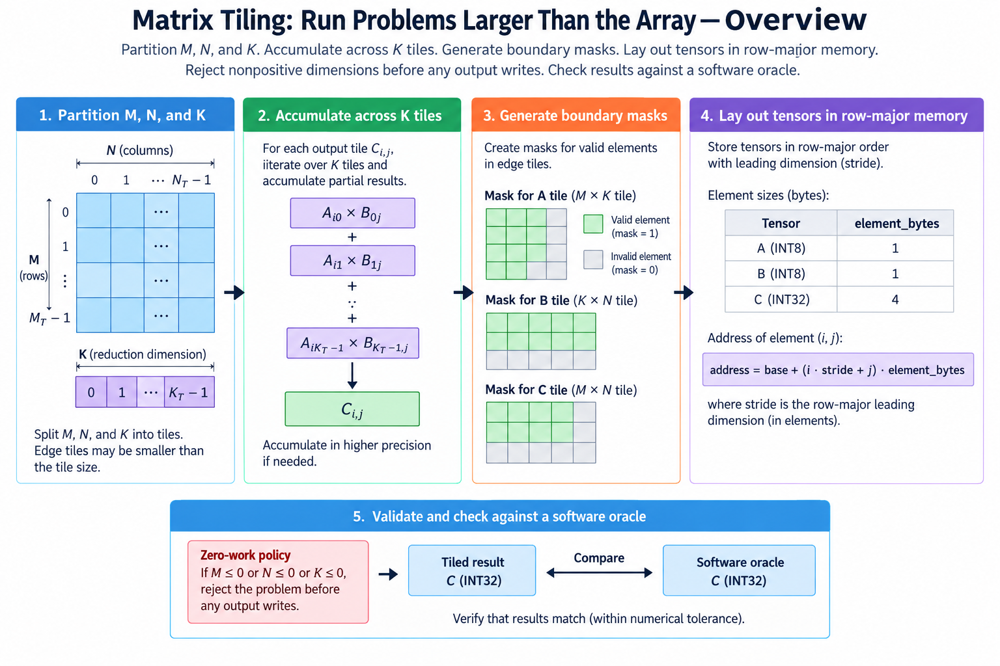
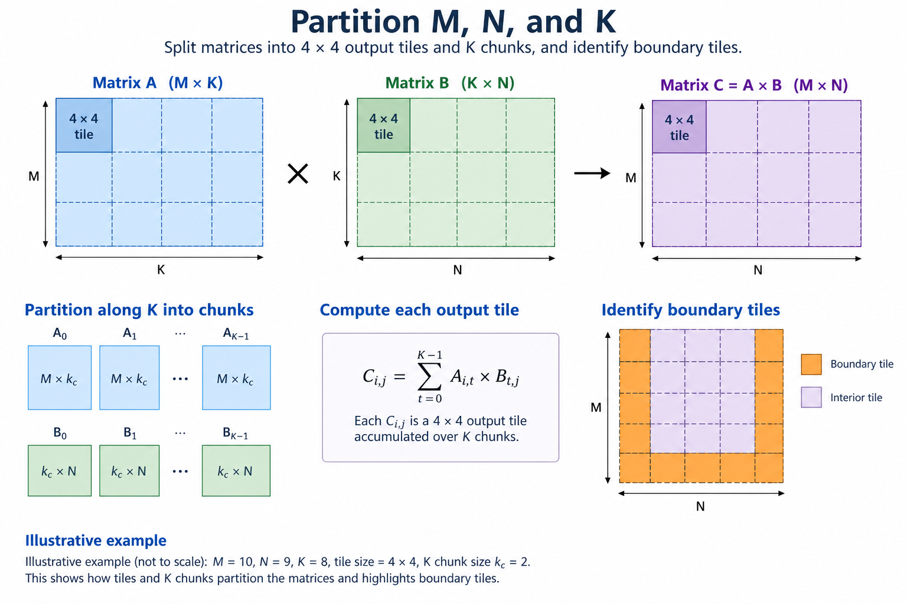
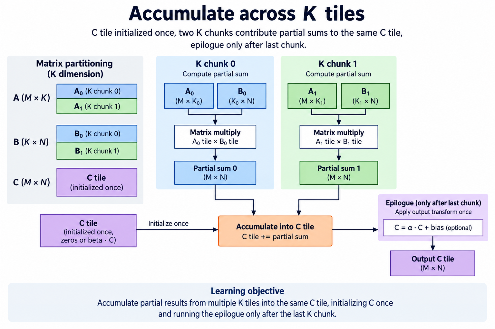
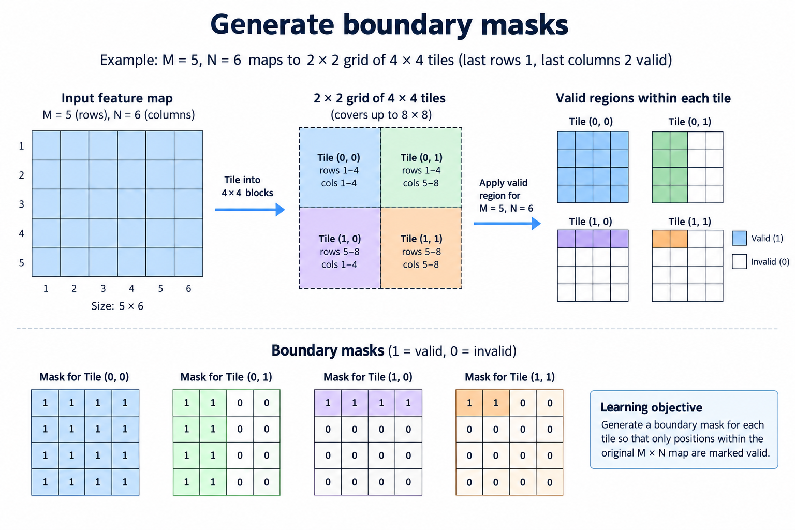
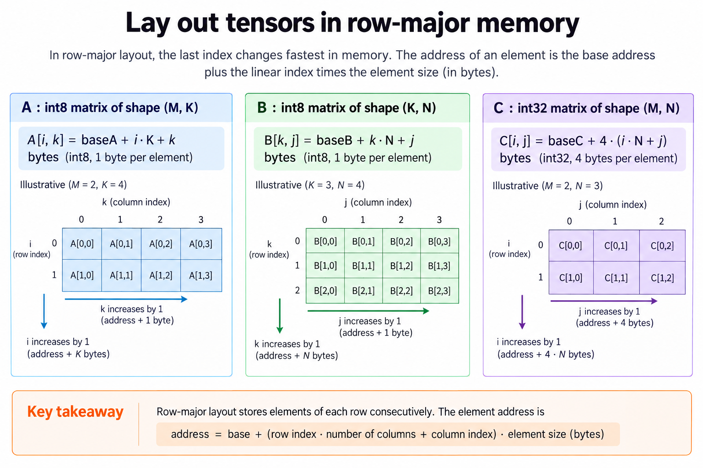
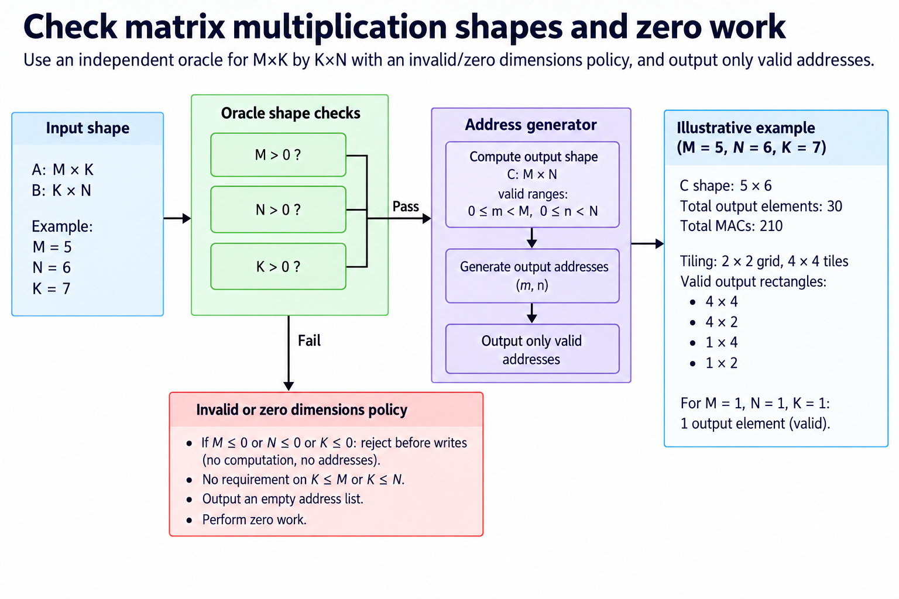

## Overview



This lesson extends one educational AI accelerator from its numerical specification toward verified RTL, FPGA integration and an ASIC implementation exercise. The overview shows this chapter's specific responsibility: Handle multiple tiles, K accumulation and boundary masks against a software oracle.

The shared project begins with signed INT8 operands and INT32 accumulation, grows into a 4×4 output-stationary array, and provides a verified host-loaded tile top. The larger tiled inference/transport examples are software models, while external bus, board and physical-design integration remain explicit exercises. Follow the evidence labels rather than treating every diagram as an executed hardware result.

Start after [Weight-Stationary vs Output-Stationary: Make Reuse Explicit](/blog/fpga-ai-dataflow-1-weight-stationary-vs-output-stationary/). Keep the previous fixture and source revision so this chapter's change can be checked independently.

## Deep dive

### Partition M, N, and K



The partition figure distinguishes the logical matrix from the 4×4 engine. Output row/column tiles cover M and N; reduction chunks cover K. Boundary tiles can be smaller, but every required contribution must be included exactly once.

For M=5,N=6,K=7, output tiling produces four physical tile launches, including partial final rows and columns. Splitting K into chunks of 4 creates chunks of lengths 4 and 3. The software tiler handles those slice lengths directly.

A hardware scheduler needs explicit dimensions/masks for the same slices. Do not assume that padded memory contains safe zeros unless it was deliberately initialized and its stores are gated.

### Accumulate across K tiles



The reduction figure initializes C once and combines all K-chunk partials. The mathematical identity is C=sum_q A_q B_q. A chunk is not a finished neural-network output until the entire reduction is complete.

Our software model computes an array result per chunk and adds it into the logical output. A hardware design could keep the accumulator or store wider partials in local memory, as long as it implements the same result. Those strategies have different traffic and control costs.

Bias, activation and requantization belong after the specified complete sum. Test chunks with cancellation, such as a positive partial followed by a negative partial, to catch an early activation.

### Generate boundary masks



The mask figure shows a 5×6 output covered by 4×4 tiles. The final row tile has 1 valid row; the final column tile has 2 valid columns. Their intersection has only 2 useful output elements, not 16.

The engine can use invalid masks or padding internally, but output address generation must skip invalid locations. A store to a padded location outside the allocated tensor is still a bug even if the stored value is zero.

Test shapes just above and below tile boundaries. Include a reduction length not divisible by the K chunk, because output masking does not protect an out-of-range weight load.

### Lay out tensors in row-major memory



The address figure uses row-major byte offsets. For INT8 A, offset(i,k)=i*K+k. For INT8 B, offset(k,j)=k*N+j. For INT32 C, offset(i,j)=4*(i*N+j). Base pointers are byte addresses.

Mixing element and byte units can produce a valid-looking but wrong address. Wider output storage is particularly easy to mishandle. Validate multiplication/addition ranges before passing an address to a finite-width bus.

Layout conversion is an explicit operation. If the physical engine wants banked or transposed tiles, pack them from the canonical logical layout and verify the inverse mapping. The host and reference do not infer that packing automatically.

### Check irregular shapes and zero work



The testing figure compares tiled_matmul with direct matmul on deterministic irregular shapes. The tile-1 exercise uses 5×6 output and K=7 with signed small values. The broader corpus includes 1×1, tall, wide and multiple-chunk cases.

The released command model requires positive dimensions. It rejects empty operations rather than silently producing an ambiguous DONE event. A system choosing zero-work success must specify it and test it separately.

The practical artifact is a tiler whose results match the independent reference. RTL memory/control integration must then preserve its slice, mask and partial-sum behavior. Passing the Python tiler is not proof that a hardware DMA schedule implements it.

### Run this lesson

Download the [accelerator lab](/labs/fpga-ai-chip/accelerator-lab.zip), extract it and run from its directory:

```sh
python3 lessons.py tile-1
python3 -m unittest discover -s tests -v
```

The first command writes `reports/tile-1.json`. Inspect its scope and result together. The second runs the independent numerical, addressing and scheduling checks. To reproduce RTL evidence, install Icarus Verilog 13.0 and run `python3 scripts/verify_top.py`; that also runs the block/array tests. These commands are software/RTL checks, not board measurements.

### Reference implementation: tiled_matmul

This Python reference is executable behavior, not synthesized hardware. Its range, rounding and layout contract provides an oracle for the corresponding RTL/integration.

```python
def tiled_matmul(a,b,tile=4,k_chunk=4):
 m=len(a);k=len(b);n=len(b[0]);out=[[0]*n for _ in range(m)]
 for i in range(0,m,tile):
  for j in range(0,n,tile):
   for q in range(0,k,k_chunk):
    aa=[row[q:q+k_chunk] for row in a[i:i+tile]];bb=[row[j:j+tile] for row in b[q:q+k_chunk]]
    partial,_=array_model(aa,bb,tile,tile)
    for ii,row in enumerate(partial):
     for jj,x in enumerate(row):out[i+ii][j+jj]+=x
 return out
```

### Preserve the complete matrix operation

Keep logical dimensions separate from the physical array. The 4×4 engine computes tiles, while the software tiler covers larger matrices and K chunks. A boundary tile's inactive locations are not useful output elements. Masks and store bounds must preserve the allocated logical tensor even if the internal engine computes padded positions.

Initialize a new output reduction once, combine every required contribution, and apply bias/activation/conversion only at the specified final stage. ReLU does not distribute over partial sums. A premature quantization can also change rounding and cancellation. Use mixed-sign fixtures so these mistakes cannot hide behind positive-only inputs.

Count traffic at named boundaries. External tensor bytes, local RAM reads, register access and forwarded operands are different quantities. Reuse that avoids a host or external-memory load can still create a lot of local traffic. A dataflow comparison needs the same shapes, types, numerical output and storage assumptions.

The direct matrix oracle remains independent of the systolic timing trace. Use the trace to debug alignment and the oracle to verify the final result. Global stalls consume clocks without changing logical step; keep that distinction in both the driver and the array. Once the complete tile contract is correct, measure its useful work and integration overhead separately.

### A worked engineering decision

#### Walk an irregular matrix across the physical engine

Let M=5, N=6 and K=7, using a 4×4 output engine. The output needs a 2×2 grid of physical tiles. Their valid output rectangles are 4×4, 4×2, 1×4 and 1×2. Together they cover 16+8+4+2=30 logical elements exactly once. A writer must not treat every physical tile as 16 valid destinations, because that would write outside the 5×6 allocation or overwrite another row.

The useful reduction work is 5×6×7=210 MAC contributions. Splitting K into chunks changes how those contributions are scheduled, not the number required. If chunks have lengths 4 and 3, each output element combines both partial sums. The final chunk may be padded internally to a physical interface convention, but its invalid reduction positions cannot add arbitrary values. Masks or zero padding must follow the actual engine contract.

A splits along its column/reduction dimension, while B splits along its row/reduction dimension. Drawing both splits horizontally would partition B along N instead of K. For output block C[i-range,j-range], the required sum is A[i-range,k0-range]B[k0-range,j-range] plus the next reduction block, continuing until all K is covered. Keep those indices in the schedule so a shape-compatible but wrong block cannot pass unnoticed.

#### Keep the accumulator alive across reduction chunks

Initialize each output reduction once, then add every required chunk. Clearing C before each chunk discards earlier contributions. Storing only the last chunk likewise computes a different result. Use a mixed-sign fixture so the expected total cannot be guessed from the final contribution. Check the intermediate complete partial sums in the software tiler when debugging, while preserving the direct matmul as the independent final oracle.

The released software tiler shows this full operation with arbitrary supported logical shapes. The integrated RTL top computes 1 fixed-capacity tile operation and begins from cleared local sums for that command. Accumulating multiple K commands therefore requires the software or a future controller to combine their INT32 outputs, or a separately designed accumulator-lifetime extension. Do not assume the simple top retains partial state across commands when its source clears it.

Bias, ReLU and requantization follow the complete reduction. For partial sums -10 and 8, the correct sum is -2, and ReLU then yields 0. Applying ReLU separately yields 0+8=8, a different result. Early quantization can similarly alter cancellation and rounding. The tiler's lifetime rule is numerical as well as administrative: a partial result is not a completed layer output.

#### Translate tile coordinates into byte addresses

Compact row-major A uses baseA+i×K+k because each INT8 element occupies 1 byte. B uses baseB+k×N+j. INT32 C uses baseC+4×(i×N+j). So A row's stride and C's row stride differ even for related shapes. A correct logical index with the wrong element-size multiplier still targets the wrong byte. Keep indices, strides and byte addresses distinguishable in the interface.

The integrated top uses padded A stride 8 and B stride 4 inside its fixed 64-byte operand loading space. A host bridging compact matrices to that top must copy each valid logical element into its padded location. Smaller dimensions do not change those physical strides. This packing step should have its own fixture so a correct matmul model does not hide an incorrect board/top load layout.

For output stores, generate addresses only where the logical row is below M and column below N. A disabled store leaves memory unchanged; it is not a store of zero into an invalid address. Surround the output allocation with sentinel values in a software/integration fixture and verify they remain unchanged. Such a check exposes out-of-bounds writes that a final 5×6 matrix comparison alone would miss.

#### Test shape boundaries rather than only full tiles

Use 1×1×1, a full tile, the 5×6×7 fixture and dimensions immediately above a tile boundary. Distinct sizes reveal assumptions about divisibility and final chunk length. The released command model rejects nonpositive dimensions before any memory writes. This is matrix multiplication: K can be larger than M or N, and no convolution-kernel-fitting rule applies.

A shape validation failure should preserve memory and produce the declared error behavior. Address validation should include element width, alignment and allocated range. The software model is functional, while an external bus would additionally need response and partial-write recovery rules. A valid numerical shape does not guarantee a valid memory command.

The main benefit of tiling is running a logical problem larger than the local array while exploiting a bounded working set. Its cost includes repeated loads, intermediate accumulation, masks and command overhead. Count those costs separately from useful MACs. The chapter supplies an executable software decomposition and a verified local engine, giving readers a precise boundary for implementing a larger hardware scheduler later.

## Conclusion

The outcome of this chapter is a concrete project artifact and a check whose scope is stated explicitly. Preserve numerical results, transaction ordering and lifetime rules as the design grows; optimize only after the baseline is correct. Next, [Finish the Operator: Bias, ReLU, and Requantization](/blog/fpga-ai-post-1-finish-the-operator/) adds the next responsibility without changing the established contract.

### Sources

- [Original accelerator lab and verification evidence](https://chiaxinliang.github.io/labs/fpga-ai-chip/accelerator-lab.zip)
