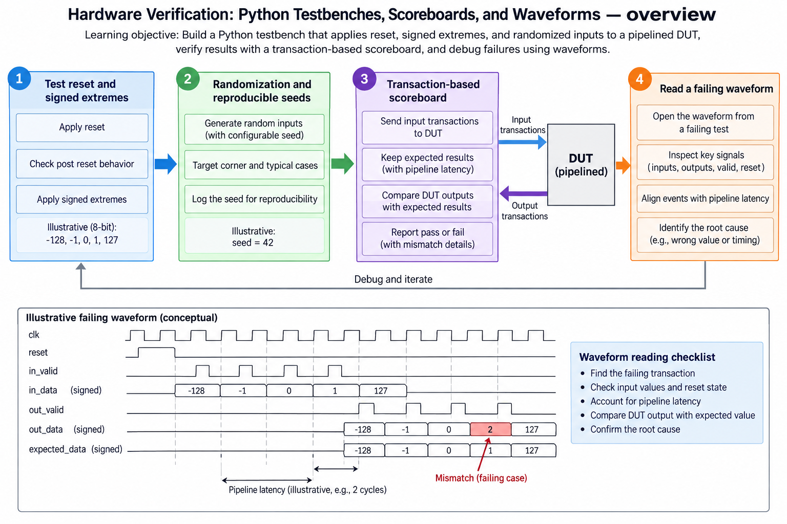
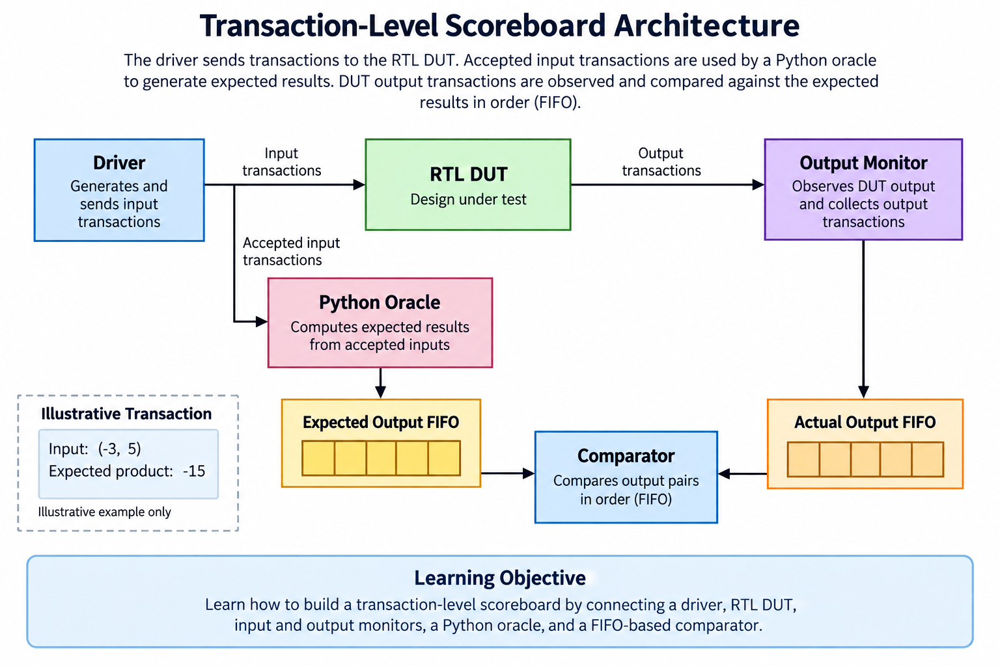
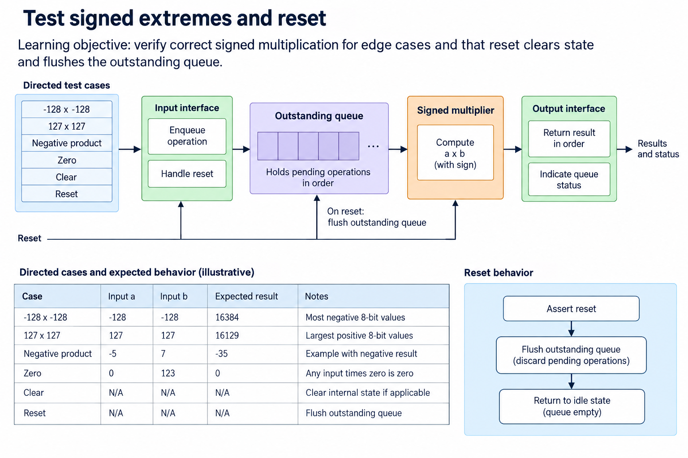
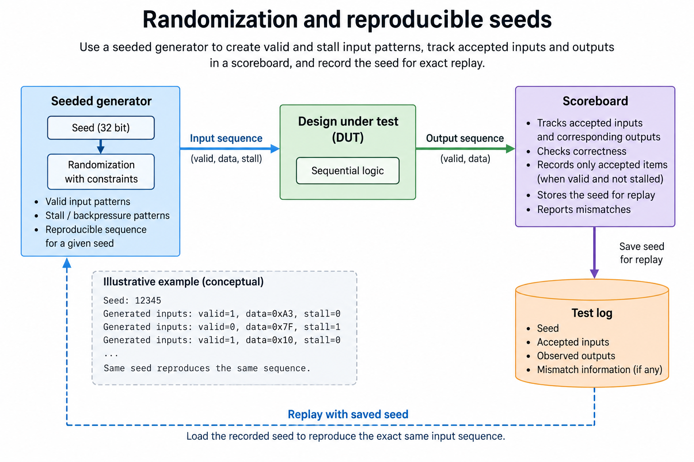
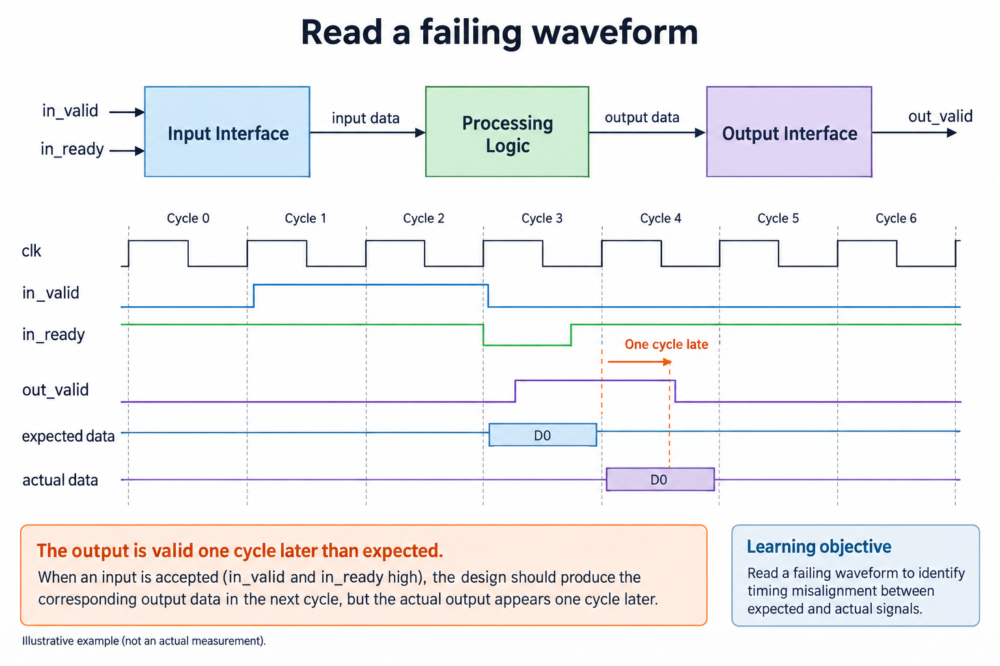

## Overview



This lesson extends one educational AI accelerator from its numerical specification toward verified RTL, FPGA integration and an ASIC implementation exercise. The overview shows this chapter's specific responsibility: Test reset, signed extremes, randomized inputs and pipeline latency with a scoreboard.

The shared project begins with signed INT8 operands and INT32 accumulation, grows into a 4×4 output-stationary array, and provides a verified host-loaded tile top. The larger tiled inference/transport examples are software models, while external bus, board and physical-design integration remain explicit exercises. Follow the evidence labels rather than treating every diagram as an executed hardware result.

Start after [Your First SystemVerilog Compute Block: A Verified Multiply–Accumulate Unit](/blog/fpga-ai-rtl-1-your-first-systemverilog-compute-block/). Keep the previous fixture and source revision so this chapter's change can be checked independently.

## Deep dive

### Build a scoreboard around transactions



The scoreboard figure tracks accepted transactions rather than clock count. A driver offers work to the DUT, a monitor observes accepted input/output events, and a queue matches those outputs with an independent reference. The scoreboard handles variable latency by preserving transaction order under the interface's contract.

For a stream, acceptance is valid AND ready at the sampled edge. Record the payload at that edge. An asserted valid during backpressure is still the same offered item. Counting it every cycle would make the scoreboard expect duplicate work and hide a real protocol defect.

The shared harness uses Python to generate and evaluate deterministic RTL tests. A cocotb testbench is another supported approach to Python-driven HDL verification, described in its official documentation. Whichever harness you choose, state the edge/sample convention and avoid races between drive, register update and observation.

### Test signed extremes and reset



The directed-case figure lists values and lifecycle events that random traffic can miss. Test the signed extrema, zero, negative products, reset, clear and pipeline drain. A reset must invalidate outstanding output expectations according to the module contract.

Our MAC tests give clear priority over enable, while pipeline clear also flushes its registered product-valid state. The elastic buffer resets output validity so stale payload bits cannot be treated as a transaction. Do not assume memory contents clear just because control validity resets.

Separate data correctness from protocol correctness. A numerical oracle can pass while the DUT duplicates a result, and a transaction-count check can pass while its payload is wrong. Both the sequence and each value need verification.

### Randomization and reproducible seeds



The randomization figure keeps a seed and varies stalls separately from data. This creates reproducible histories: if a failure occurs, you can regenerate the exact sequence. Randomized tests supplement directed fixtures rather than replacing them.

The release report uses seed 20260913. It records 500 elastic-stream cycles and 133 backpressure cycles, plus 40 array cases and 161 injected global stall cycles. Those numbers describe the executed test corpus, not a claim that all possible behaviors were proven.

Use a reference with different structure from the implementation. Direct matrix multiplication checks a forwarded systolic array without repeating its skew schedule. In contrast, two copies of the same PE update loop could share the same index mistake. Assertions about queue occupancy and stable payload add another independent view.

### Read a failing waveform



The waveform figure shows a one-cycle alignment error. Drive inputs before the active edge, then observe after sequential updates settle. A product pipeline delays the contribution relative to the unpipelined MAC. The testbench must compare the correct stage's result.

When an output mismatch appears, locate the first wrong accepted item. Inspect input acceptance, valid propagation, operand register values and sum update. If every output is shifted by one cycle, investigate the harness's timing before changing arithmetic.

Keep the failing seed, generated testbench and waveform when debugging. The normal harness uses temporary files, so a debugging extension should save them for failed cases. Passing a simulation is evidence for the exercised RTL contract; synthesis, physical timing and board behavior require their own checks.

### Run this lesson

Download the [accelerator lab](/labs/fpga-ai-chip/accelerator-lab.zip), extract it and run from its directory:

```sh
python3 lessons.py verify-1
python3 -m unittest discover -s tests -v
```

The first command writes `reports/verify-1.json`. Inspect its scope and result together. The second runs the independent numerical, addressing and scheduling checks. To reproduce RTL evidence, install Icarus Verilog 13.0 and run `python3 scripts/verify_top.py`; that also runs the block/array tests. These commands are software/RTL checks, not board measurements.

### Connect the block without changing its contract

Write the accepted-work event for every boundary. For a ready/valid stream, it is valid AND ready at the sampled edge. For the released systolic core, it is a common global step. These are different protocols. Connecting them requires buffering or a scheduler that preserves matched operand pairs and advances every affected state consistently.

Track data and validity together. A register can contain old bits while its valid flag is false; those bits must not become an output transaction. Clear/reset invalidates pending work according to the chosen contract. If a pipeline is stalled, its payload, validity and ownership must remain aligned. A consumer may not reuse a buffer before its producer/previous consumer completes the relevant stage.

Use a FIFO scoreboard to check sequence as well as values. A test that counts transactions alone can miss swapped payloads, while a test of a final sum alone can hide duplicated and missing items that cancel numerically. Directed reset/stall fixtures supplement reproducible random traffic.

After a local block passes, connect one additional boundary at a time and keep the same oracle. A passing simulation supports the exercised contract, not physical timing or every possible sequence. Keep the released test report with the exact source revision so a later wrapper or pipeline change creates an explicit new verification step.

### A worked engineering decision

#### Make the checker fail for the right reason

A testbench is another program and can contain defects. Begin by deliberately corrupting 1 expected value in a temporary fixture, then confirm that the comparison fails at the corresponding transaction. Remove the corruption afterward. This experiment checks that the scoreboard actually consumes the oracle output, that mismatches reach the test result and that a passing report is not produced unconditionally. It does not prove the entire checker, but it exposes a common disconnected-check failure.

The numerical oracle receives original accepted inputs independently of the DUT. For a MAC, it tracks its own accumulator and control priority. For a matrix array, it computes direct dot products without relying only on the same wavefront algorithm that drives hardware. Shared timing logic is useful for explaining arrivals, but it should not be the only mathematical reference. Otherwise an identical row/column mapping defect in driver and oracle can agree on a wrong answer.

Observe transactions at their declared interface. A ready/valid input is accepted when valid and ready are both high at the sampled edge. A globally stepped PE advances on step; its useful multiply additionally requires both operand-valid masks. These are different events. A test that increments its expected queue on every clock will misclassify intentional stalls, while one that increments only on a convenient output pulse can hide dropped input work.

#### Track order, lifetime and numerical state

An expected FIFO holds the results of accepted work in sequence. An output monitor removes the matching expectation when an output transaction is consumed. If the block is allowed to reorder, the checker needs declared identifiers and a different matching policy; the small educational stream is ordered. Never choose a convenient matching rule after observing a failing output, because that changes the protocol being checked.

For an accumulator, compare the running state as well as the final output. The sequence products [6,-20,-14] gives running sums [6,-14,-28]. Dropping the second product changes the intermediate and final state. A more complicated sequence could contain canceling terms, so checking only the total risks missing 2 defects. A forwarding check similarly compares each operand and mask, not just the local sum derived from them.

Reset cancels pending work according to the block contract. The scoreboard must clear or explicitly mark those canceled expectations; it must not report missing outputs for transactions the interface declares invalidated. At the same time, it should detect stale output validity after reset. A queue emptied by the testbench while the DUT continues returning old results is not a clean reset. Check post-reset validity before introducing a new accepted transaction.

#### Preserve a reproducible random experiment

Seeded random traffic supplements directed fixtures. It explores different signed values, control combinations and stall patterns, but cannot guarantee every corner case occurred. Log the seed, iteration count and traffic constraints. The released RTL script records deterministic seed 20260913 and the actual exercised block and array counts. A different simulator version or source revision should appear beside a newly generated report.

Use constraints that produce legal behavior at the boundary under test. A ready/valid producer must keep a blocked valid payload until acceptance; randomizing it freely while ready is low tests an illegal source rather than the buffer's promised behavior. Conversely, a negative test can deliberately violate a precondition if its purpose and expected response are stated. Keep legal traffic and rejection tests distinguishable in the report.

When a random failure occurs, keep the exact short event sequence around its first divergence. Replaying the full seed is valuable, but a reduced directed fixture is easier to understand and remains stable if the random generator changes. Reduce the sequence without removing the condition that causes failure. That creates a permanent regression for the actual defect rather than just increasing the number of random iterations.

#### Read waveforms from the first divergence

Find the first accepted input that lacks a matching correct output or the first incorrect state update. Inspect current input, acceptance, registered validity, control priority and observed output around that edge. A correct payload with validity 1 clock late is a protocol/timing error; a correct valid interval with an incorrect signed value is a numerical error. Debugging from the final matrix alone mixes these categories.

Sample timing matters. A waveform shows signals changing within simulator scheduling regions, while a checker uses a defined observation point. Record whether a value is pre-edge state or post-update state before counting latency. Do not infer 2-cycle latency from a picture whose transaction acceptance is itself ambiguous. Annotating accepted-edge numbers often makes a small trace more useful than adding more signal rows.

The current harness compiles generated SystemVerilog testbenches with Icarus and compares executed outputs. The series also introduces cocotb as an alternative Python-based verification environment, but does not claim a cocotb regression was executed when the released script uses another harness. Tool names belong in evidence, not as interchangeable labels for any simulation.

The release passes a bounded set of functional tests. It does not establish formal equivalence, exhaustive state coverage, clock-domain safety or physical timing closure. Those obligations grow with new interfaces and targets. The practical result of this chapter is a checker that has an independent oracle, explicit accepted events, reproducible stimuli and useful mismatch evidence—an infrastructure that can test the next circuit change without redefining correctness.

## Conclusion

The outcome of this chapter is a concrete project artifact and a check whose scope is stated explicitly. Preserve numerical results, transaction ordering and lifetime rules as the design grows; optimize only after the baseline is correct. Next, [Pipeline the MAC: Latency, Throughput, and Timing](/blog/fpga-ai-pipe-1-pipeline-the-mac/) adds the next responsibility without changing the established contract.

### Sources

- [Original accelerator lab and verification evidence](https://chiaxinliang.github.io/labs/fpga-ai-chip/accelerator-lab.zip)
- [cocotb documentation](https://docs.cocotb.org/en/stable/)
