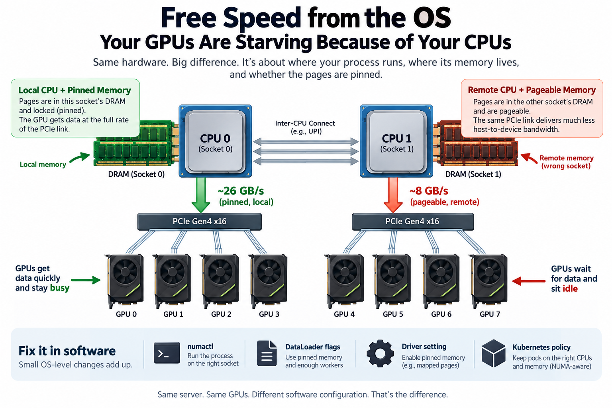
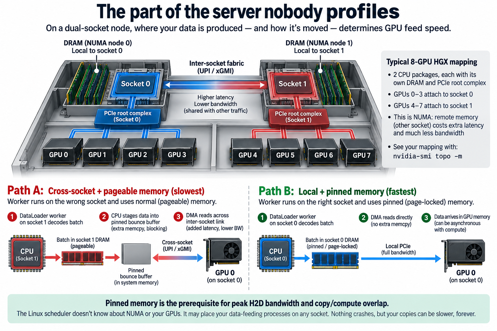
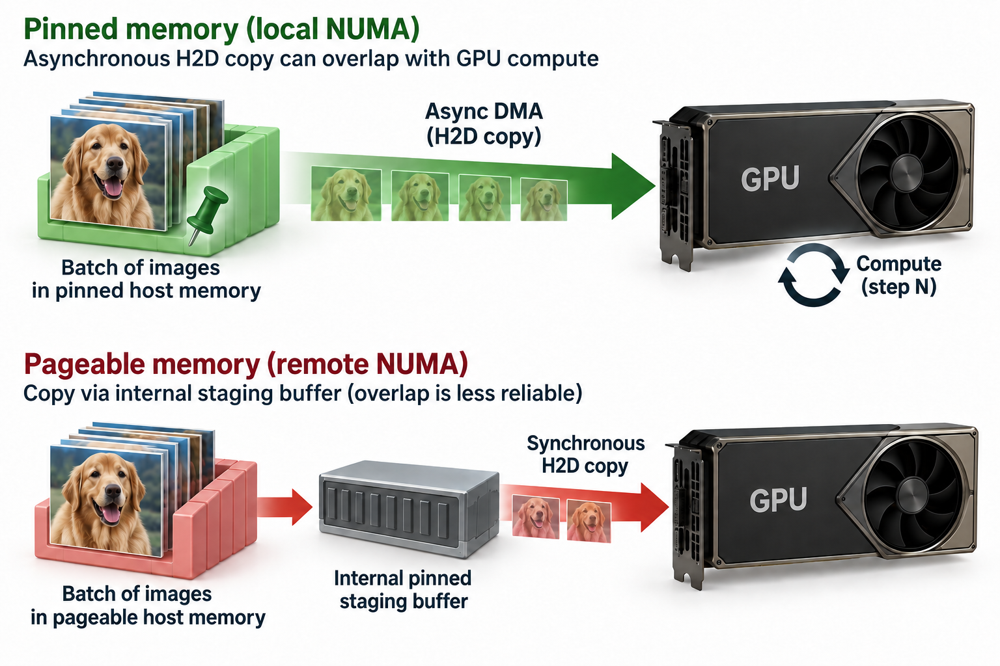
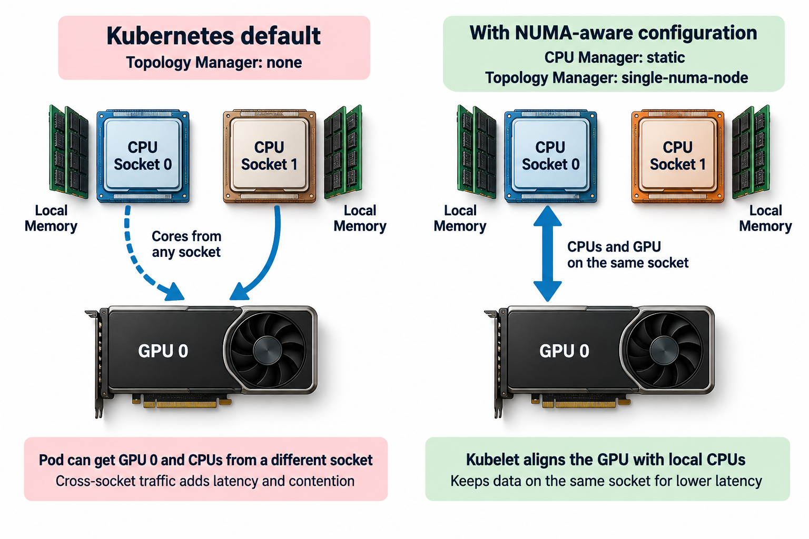

## Overview



A PCIe Gen4 x16 link can move about 26 GB/s of pinned host memory into a GPU. The exact same link, on the exact same server, delivers around 8 GB/s when the copy comes from pageable memory sitting on the wrong CPU socket. That is a 3.3x spread in host-to-device bandwidth, and not 1 dollar of hardware separates the 2 numbers. The difference is entirely software configuration: where a process runs, which DRAM its pages landed in, and whether those pages are pinned.

This article is about the cheapest performance work in AI infrastructure: host-level OS tuning. No new GPUs, no kernel rewrites, no quantization tradeoffs. Just `numactl`, a few DataLoader flags, a driver setting, and a Kubernetes policy. Individually each one is small. Together they routinely decide whether an 8-GPU node behaves like 8 GPUs or like 6.

## Deep dive

### The part of the server nobody profiles



We tend to draw an AI server as "the GPUs, plus some stuff." The stuff matters. A modern training or inference node is a dual-socket machine: 2 CPU packages, each with its own memory controllers and its own bank of DRAM, joined by an inter-socket fabric (UPI on Intel, xGMI on AMD). This is NUMA, non-uniform memory access: every core can reach all memory, but memory attached to the *other* socket costs extra latency and flows through a link with far less bandwidth than local DRAM.

The GPUs are not floating in space either. Each GPU hangs off the PCIe root complex of 1 specific socket. On a typical 8-GPU HGX box, GPUs 0-3 attach to socket 0 and GPUs 4-7 to socket 1. You can see the mapping yourself with `nvidia-smi topo -m`, which prints, for every GPU, its CPU affinity list and NUMA node.

Now trace what happens each training step. A DataLoader worker on some CPU core decodes a batch into a buffer in host DRAM. A `cudaMemcpy` then DMAs that buffer across PCIe into GPU memory. If the worker was scheduled on socket 1 while the GPU lives on socket 0, the batch was allocated in socket 1's DRAM (Linux allocates pages on the node where the touching thread runs, the "first-touch" policy). The DMA now has to pull every byte across the inter-socket link before it even reaches the PCIe lanes. The link is shared with all other cross-socket traffic, its effective bandwidth is well below local DRAM bandwidth, and your H2D copy inherits the congestion.

The Linux scheduler does not know any of this. It balances load across all cores, cheerfully migrating your data-feeding processes to whichever socket looks idle. Nothing crashes. Nothing logs a warning. The copies are just slower, forever.


There is a second, independent tax: pageable versus pinned memory. Normal `malloc`'d memory is pageable, meaning the kernel may move or swap those pages at any moment. A DMA engine cannot safely target memory that might move mid-transfer, so when CUDA copies from pageable memory it first has the CPU stage the data into an internal pinned bounce buffer, then DMAs from there. You pay for an extra memcpy, and the copy cannot be asynchronous. Allocate the buffer as pinned (page-locked) instead, via `cudaHostAlloc` or PyTorch's `pin_memory=True`, and the DMA engine reads your buffer directly at full link speed while the CPU does something useful. NVIDIA's CUDA Best Practices Guide is blunt about this: pinned memory is the prerequisite for both peak H2D bandwidth and copy/compute overlap.

2 independent taxes, 4 combinations. Let's put numbers on them.

### A worked example: 1 batch, 4 speeds



Take a concrete batch: 256 images at 3x224x224 in float32.

- Bytes per image: 3 x 224 x 224 x 4 B = 602,112 B
- Batch: 256 x 602,112 B = 154,140,672 B, call it **154 MB**

Representative achieved bandwidths on a dual-socket PCIe Gen4 box (the shape of these numbers is what matters; measure your own with CUDA's `bandwidthTest` under `numactl`):

| Configuration | Bandwidth | Copy time for 154 MB |
|---|---|---|
| pinned, local NUMA node | 26 GB/s | 154.1e6 / 26e9 = **5.9 ms** |
| pinned, remote node | 18 GB/s | **8.6 ms** |
| pageable, local node | 12 GB/s | **12.8 ms** |
| pageable, remote node | 8 GB/s | **19.3 ms** |


The copy-time delta between best and worst is 13.4 ms per step. Whether that hurts depends on overlap. Say the GPU compute for a step takes 180 ms. In the pinned+local case, the copy is asynchronous: while the GPU crunches step *N*, the DMA engine streams batch *N+1* in the background, and the 5.9 ms vanishes entirely. Step time: 180 ms.

In the pageable+remote case you lose 2 times. The copy takes 19.3 ms, *and* it cannot overlap because pageable copies synchronize through the CPU staging buffer. Step time: 180 + 19.3 = 199.3 ms. That is a 9.7% throughput loss, per GPU, across the fleet. On a 64-node cluster you have silently donated the equivalent of 6 nodes to the scheduler's ignorance of your motherboard. And 154 MB is a modest batch; multimodal and video workloads move gigabytes per step, where the same ratios turn into whole seconds.

The fixes are 1 line each:

```bash
# find the GPU's home socket and cores
nvidia-smi topo -m        # GPU0: CPU affinity 0-31, NUMA node 0

# pin the training process and its memory to that socket
numactl --cpunodebind=0 --membind=0 python train.py
```

```python
DataLoader(dataset, batch_size=256, num_workers=8,
           pin_memory=True,        # page-locked staging, async H2D
           prefetch_factor=4,      # batches each worker keeps ready
           persistent_workers=True)
```

`pin_memory=True` makes the DataLoader collate batches into pinned buffers so the later `.to(device, non_blocking=True)` is a true async DMA. `prefetch_factor` (default 2) controls how many batches each worker keeps decoded ahead of demand; raising it buys slack against jittery storage at the cost of host RAM. `numactl` keeps both the workers and their first-touched pages on the GPU's socket. For multi-GPU training, launch 1 rank per GPU and bind each rank to its own GPU's affinity list, not all ranks to socket 0.

2 more free knobs while you are logged in. `nvidia-smi -pm 1` enables persistence mode, which keeps the driver loaded when no client is connected; without it, the first CUDA call after an idle period eats seconds of driver re-initialization, which shows up as mysterious cold-start latency in inference services. And if multiple small processes share 1 GPU, MPS (Multi-Process Service) lets their kernels run concurrently instead of time-slicing, while MIG partitions an A100/H100/B200 into up to 7 isolated instances with dedicated memory and SM slices. Sharing policy is host configuration too.

### Going deeper: the container trap



Here is where modern deployment makes things worse. Teams assume containerization abstracts the host away. It does the opposite: a container inherits every property of an untuned host while adding its own throttles on top.

3 specific failure modes are worth knowing.

**Kubernetes ignores NUMA by default.** The default CPU manager gives your pod a cgroup share of *all* cores, and the default Topology Manager policy is literally `none`. Your pod gets GPU 0 from the device plugin and CPU time from whatever cores are free, socket be damned. The fix is real but requires opting in: set the CPU manager policy to `static` (so Guaranteed pods with integer CPU requests get exclusive cores), and the Topology Manager policy to `single-numa-node`, which makes kubelet reject placements where the GPU and the assigned cores live on different sockets. The kubelet then does automatically what `numactl` did manually. NVIDIA's GPU Operator and device plugin cooperate with this alignment; almost nobody turns it on.

**CFS quota throttles your DataLoader.** Setting a CPU *limit* on a pod enables the kernel's CFS bandwidth controller: the pod gets, say, 8 cores' worth of quota per 100 ms period, and when the quota runs out mid-period, every thread in the pod freezes until the next period. 8 DataLoader workers decoding JPEGs burn quota fast; the workers then stall in wall-clock terms even though the node has idle cores. The symptom is periodic dips in GPU utilization at exactly 100 ms granularity. For GPU pods, request exclusive CPUs via the static policy rather than slapping on tight limits.

**Pinned memory meets cgroup memory limits.** Page-locked allocations count against the container's memory cgroup and cannot be reclaimed under pressure. A generous `prefetch_factor` times a large batch times pinned buffers can walk a pod straight into an OOM kill that a bare-metal run never hit. Budget pinned memory deliberately: roughly `num_workers x prefetch_factor x batch_bytes` of page-locked RAM.

The general lesson: the OS and the orchestrator both make placement decisions, and by default both make them blind to GPU topology. Host tuning is the act of giving them eyes.

The benefit of pinned, local buffers is not simply a higher copy number. It is the possibility of hiding transfer behind useful work. For batch payload D, delivered link bandwidth beta, and device compute duration c, compare

$$
t_{\mathrm{serial}}\approx c+\frac{D}{\beta},\qquad
t_{\mathrm{overlapped}}\gtrsim\max\left(c,\frac{D}{\beta}\right).
$$

This assumes independent copy and compute engines, different batches, suitable streams, and correct readiness events. With 154 MB at 26 GB/s, the copy takes about 5.92 milliseconds. Against 180 milliseconds of compute, ideal overlap hides that time; it does not remove the transferred bytes or memory-controller pressure. Pageable transfers can sometimes make asynchronous progress through staging, so treat overlap as a measured outcome rather than a universal prohibition.

Prefetching buys the next batch's readiness with host memory. A rough queue budget is worker count times prefetch depth times batch payload: 8 workers and depth 2 with 154 MB batches suggest 2.46 GB of queued data before active batches and processing copies. Not every queued object is necessarily pinned. Measure resident and pinned memory separately, and test NUMA affinity against observed device topology rather than assuming the operating system automatically places GPU-facing buffers correctly.

### Common misconceptions

**"My GPUs show 95% utilization, so the host isn't the bottleneck."** `nvidia-smi` utilization only reports the fraction of time *at least 1 kernel was resident*, not how much of the chip that kernel used or whether it was waiting on data. A GPU dribbling through small kernels while starved by a 19 ms synchronous copy can post high utilization numbers all day. I covered this trap at length in [Goodput: Your "100% Utilized" Cluster Is Mostly Wasted](/blog/goodput-vs-utilization/); the honest metrics are samples per second and tokens per second, measured end to end.

**"pin_memory=True is free, always turn it on."** Pinning is a real cost, not a magic flag. Page-locked memory is unswappable, so over-pinning shrinks what the kernel can manage for page cache and everything else, and pinning pages takes CPU time at allocation. It pays off when copies are large and overlapped with compute. For tiny batches, CPU-only stages, or hosts already tight on RAM, it can be a wash or a regression. Turn it on with a measurement, and budget the pinned bytes, especially inside memory-limited containers.

**"We run on Kubernetes, so host tuning is the platform team's problem, and containers isolate us from it anyway."** Containers virtualize namespaces, not topology. Your pod's threads still run on physical cores of a physical socket, its pages still land in 1 socket's DRAM, and its GPU still hangs off 1 root complex. Default Kubernetes actively scrambles this mapping. Whoever owns the workload owns checking that `single-numa-node` alignment, static CPU policy, and persistence mode are actually configured, because the symptom (slow steps, jittery TTFT) appears in *your* dashboards, not the platform team's.

### Why this is the highest-ROI hour in the stack

This series keeps returning to 1 theme: performance is decided by data movement, not arithmetic. [The memory wall](/blog/the-memory-wall-latency-numbers/) is about the gap between compute and DRAM inside 1 chip; [the DRAM-to-HBM story](/blog/from-dram-to-hbm/) is about buying bandwidth with packaging. Host tuning is the same battle fought 1 hop further out, at the PCIe boundary, where the bandwidth is thinnest and the software defaults are worst. A B200 with 8 TB/s of HBM bandwidth still receives its input batches through a straw measured in tens of GB/s; letting misconfiguration cut that straw's diameter by 3x is malpractice.

It is also the purest example of what [an ML performance engineer actually does](/blog/what-does-an-ml-performance-engineer-do/): find the invisible tax, quantify it in milliseconds, remove it with configuration, and prove the win end to end. Kernel fusion takes weeks. `numactl` takes an afternoon, including the benchmark that convinces your team. When we scaled from 1 node to clusters in [the disaggregation story](/blog/the-prefill-decode-disaggregation-story/), every scheduling idea assumed the individual hosts underneath were sane. This is the checklist that makes them sane.

## Conclusion

- Host-to-device bandwidth on identical hardware varies about 3x with configuration: pinned memory on the GPU's local NUMA node reaches ~26 GB/s on PCIe Gen4, pageable memory on the remote socket ~8 GB/s. Check `nvidia-smi topo -m`, then bind with `numactl --cpunodebind --membind`.
- Pinned memory is what makes H2D copies asynchronous; `pin_memory=True` plus `prefetch_factor` tuning hides the copy behind compute entirely, but budget the page-locked RAM, especially under cgroup limits.
- Containers inherit an untuned host and add throttles: default Kubernetes topology policy is `none` and CPU limits cause 100 ms-period stalls. Enable the static CPU manager and `single-numa-node` Topology Manager on GPU nodes, and keep persistence mode on.

### Sources

- NVIDIA, CUDA C++ Best Practices Guide, pinned memory and async transfers: https://docs.nvidia.com/cuda/cuda-c-best-practices-guide/
- NVIDIA, Driver Persistence documentation: https://docs.nvidia.com/deploy/driver-persistence/
- NVIDIA, Multi-Process Service (MPS) documentation: https://docs.nvidia.com/deploy/mps/index.html
- NVIDIA, MIG User Guide: https://docs.nvidia.com/datacenter/tesla/mig-user-guide/
- PyTorch, `torch.utils.data` documentation (pin_memory, prefetch_factor, num_workers): https://pytorch.org/docs/stable/data.html
- Kubernetes, Topology Manager documentation: https://kubernetes.io/docs/tasks/administer-cluster/topology-manager/

*Part of the [AI Infrastructure Foundations](/series/ai-performance/) learning path. Browse its published articles by topic.*
