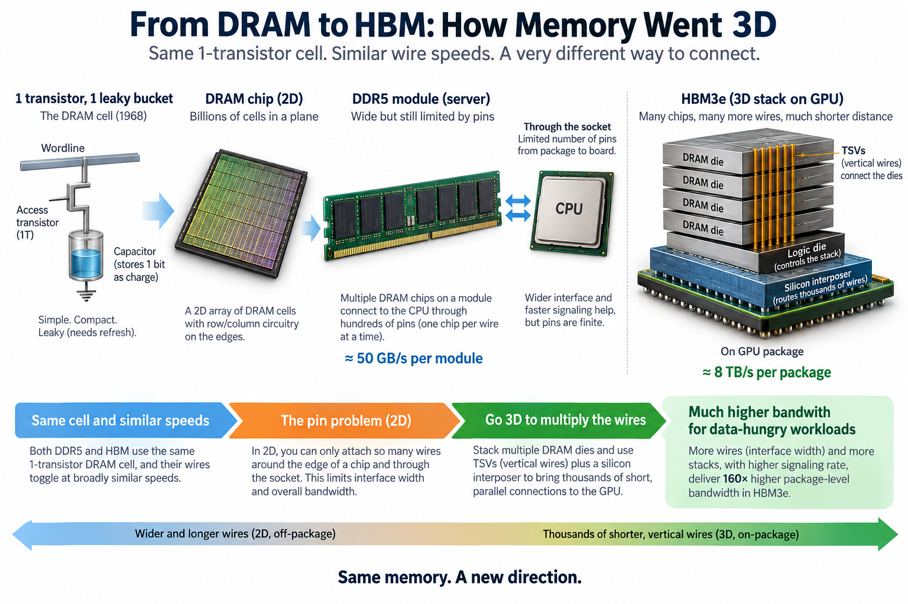
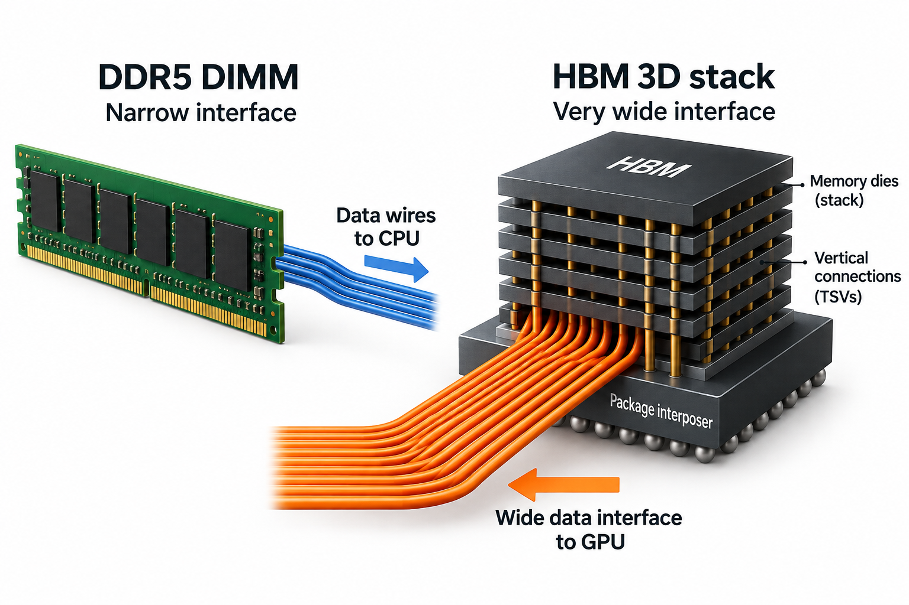
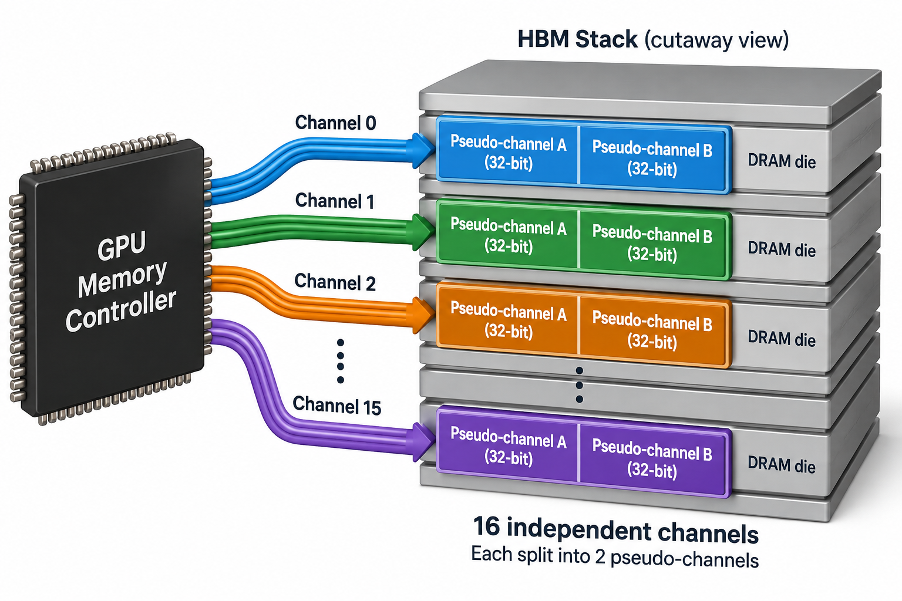
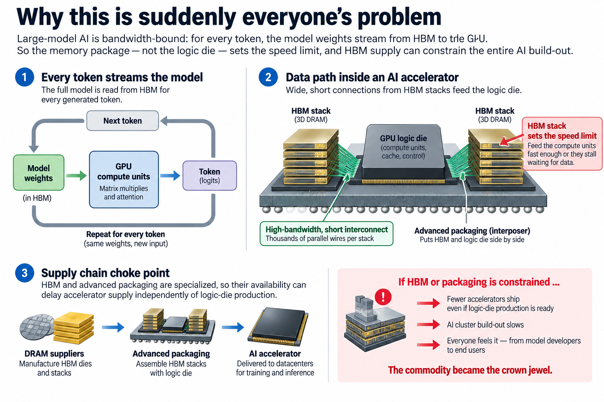

## Overview

A server-grade DDR5 module delivers about 50 GB/s. The HBM3e memory sitting on a flagship AI GPU delivers 8 TB/s per package, 160 times more. Both are built from the same 1-transistor memory cell that IBM's Robert Dennard patented in 1968, and their wires toggle at broadly similar speeds. Most of the illustrative package-level gap comes from interface width and stack count, with signaling rate also contributing. It comes down to how many wires you can attach, and how far the bits have to travel. This article walks from a single DRAM cell up to a 3D stack of silicon, and shows you the arithmetic along the way.

## Deep dive

### 1 transistor, 1 leaky bucket

Strip away every acronym and a DRAM bit is astonishingly simple: 1 transistor and 1 capacitor. The capacitor is a tiny bucket for electric charge. Full bucket means 1, empty bucket means 0. The transistor is a switch that connects the bucket to the outside world when, and only when, its row is selected.

The wiring follows a grid. A horizontal **wordline** connects to the transistor gates of every cell in a row; raising it switches all those transistors on at once. A vertical **bitline** connects to 1 cell per row and carries the charge out. This grid is why DRAM addresses come in row and column halves, and why your memory chip is physically a vast checkerboard of identical cells — billions of them per die.

The bucket is absurdly small. A modern cell capacitor holds roughly 10–30 femtofarads. Charge it to a fraction of a volt and you have stored a few tens of thousands of electrons. That is the physical entirety of 1 bit of your data: about 40,000 electrons, held in a structure etched so deep and narrow that its aspect ratio resembles a drinking straw a metre long.

3 consequences fall straight out of this design, and they shape everything above it.

First, **reads are destructive**. To read a cell, the bitline is precharged to a midpoint voltage, the wordline fires, and the capacitor's charge dribbles onto the bitline, nudging its voltage by a few tens of millivolts. A **sense amplifier** at the end of the bitline detects the nudge's direction and snaps to a full 0 or 1. The read consumes the cell's charge, so the sensed value must be written back before the row closes.

Second, **the bucket leaks**. Transistors are imperfect switches, and 40,000 electrons do not stay put. Every cell must be refreshed — read and rewritten — within 64 milliseconds per the JEDEC standard, faster when hot. The D in DRAM, *dynamic*, is a polite word for "forgets constantly."

Third, **the cell itself has barely gotten faster**. The time to open a row, sense it, and restore it is set by analog physics: tiny charge, long wires, minuscule voltage swings. Row-access latency has hovered in the tens of nanoseconds since the DDR2 era. Nearly all the improvement in memory since then has gone into moving *more bits at once*, not fetching 1 bit sooner.

### The pin problem

If cells don't get faster, bandwidth has only 2 levers:

**bandwidth = number of data wires × bits per second per wire**

A standard DDR5 module exposes 64 data wires (organized as 2 independent 32-bit subchannels). Every generation of DDR has pushed the second lever, per-wire speed: DDR3 at 1.6 Gb/s per pin, DDR4 at 3.2, DDR5 now at 6.4 and climbing. But those bits travel roughly 10 centimetres across motherboard traces, through a socket, a connector, and stub-riddled topology. At multi-gigabit rates that path behaves like a bad radio channel; it demands careful termination, equalization, and training, and each doubling costs disproportionate signal-integrity effort and energy. Sending a bit off-package over a board costs on the order of 10 picojoules or more, most of it spent just driving the wire.

The first lever, adding wires, hits a wall even sooner: pins. Every data wire needs a pin on the memory package, a trace on the board, and a pin on the processor package. A big server CPU already spends thousands of its pins on a dozen memory channels; the board around the socket is a dense forest of length-matched traces. You cannot route 10,000 data wires through a motherboard. At PCB scale, wires are a scarce resource.

So here is the trap circa 2013, when GPU designers saw compute throughput doubling on schedule while memory bandwidth crawled: cells can't clock faster, boards can't hold more wires, and per-pin speed is an expensive treadmill. The way out was to stop treating memory as a thing you plug into a board, and start treating it as a thing you build *next to the processor* — and up.

### The worked example: run the numbers yourself

Grab a napkin; the arithmetic is genuinely this short.

**DDR5-6400 module.** 64 data wires, each moving 6,400 megatransfers per second, 1 bit per transfer per wire:

> 64 wires × 6.4 Gb/s = 409.6 Gb/s = **51.2 GB/s per module**

A high-end server CPU with 12 channels of DDR5-6400 reaches 12 × 51.2 ≈ **614 GB/s**, and pays thousands of package pins for it.

**1 HBM3e stack.** The interface is 1,024 data wires — 16 times a DIMM — each running up to 9.6 Gb/s:

> 1,024 wires × 9.6 Gb/s = 9,830 Gb/s ≈ **1.2 TB/s per stack**

**1 GPU package.** A flagship accelerator surrounds its compute die with 8 stacks. Shipping parts clock slightly below the per-pin maximum, landing at:

> 8 stacks × ~1 TB/s ≈ **8 TB/s per package**

Notice what did *not* change: per-wire speed. 6.4 versus 9.6 Gb/s is a factor of 1.5; GDDR7 graphics memory actually runs its pins 3 times faster than HBM3e. The 160× package-level gap is almost entirely width, with a helping of stack count. HBM is not fast memory. HBM is *wide* memory, and the whole trick is making that width physically routable.

Let $$W$$ be data wires per stack, $$r$$ transfers per second per wire, and $$k$$ stacks. With 1 bit per transfer, peak byte bandwidth is

$$
\beta_{\mathrm{peak}}=\frac{kWr}{8}.
$$

For 1 1,024-bit interface at 9.6 billion transfers per second, the result is 1.2288 TB/s in decimal units. 8 such interfaces would theoretically provide 9.8304 TB/s before controller limits or lower configured signaling rates. The earlier 8-TB/s package illustration intentionally uses about 1 TB/s per stack; it does not combine maximum stack rates with a different product's delivered specification.

HBM works by making many short parallel connections manufacturable through stacking and dense package wiring. Relative to adding board-level DDR channels, it trades socket routing pressure for package complexity, stack yield, and thermal constraints. Attainable bandwidth is $$\beta_{\mathrm{effective}}=u\beta_{\mathrm{peak}}$$, where $$u$$ is workload-dependent service efficiency. Random bank-conflicting accesses or insufficient outstanding requests can lower it. Measure transferred useful bytes and elapsed time, not just pin count. Stacking increases aggregate byte throughput; it does not remove row activation, sensing, or refresh work inside DRAM.

### Going 3D: TSVs and the interposer

Width was unroutable on a motherboard, so HBM abandons the motherboard. 2 structural moves make 1,024-wire interfaces possible.

**Move 1: stack the dies.** An HBM package is 8 to 12 DRAM dies (16 in HBM4's tallest configurations) stacked vertically on top of a base logic die. Each DRAM die is ground down to a few tens of microns thick — thinner than a human hair — and connected to its neighbors by **through-silicon vias**, or TSVs: holes etched straight through the silicon and filled with copper, thousands of them per die, at pitches measured in tens of microns. Signals travel between dies over distances of microns rather than centimetres. The base die at the bottom of the stack collects all of it, handles test and repair logic, and presents the 1,024-bit interface to the outside.

**Move 2: shrink the board to a chip.** Even 1,024 wires from stack to processor cannot cross a normal package substrate, whose wiring pitch is too coarse. So both the GPU die and the HBM stacks are mounted on a **silicon interposer**: a slab of silicon, patterned with the same lithography used for chips, serving purely as ultra-fine wiring. Where a PCB ball-grid pitch is around 800 microns, interposer microbumps sit at roughly 50-micron pitch, a couple of 100 times more connections per unit area. The stack sits millimetres from the GPU, and 1,024 traces cross the gap without breaking a sweat. TSMC's CoWoS ("chip-on-wafer-on-substrate") is the best-known industrial version of this assembly.

The short, dense links pay a second dividend: energy. A signal crossing millimetres of interposer needs no termination resistors and a fraction of the drive strength of a board trace. HBM access energy is commonly cited around 3–4 pJ/bit against 10–15+ for board-level DDR — figures vary by generation and methodology, but the several-fold advantage is robust. When a GPU streams 8 TB/s, that difference alone is worth hundreds of watts.

### Going deeper: what the 1,024 wires actually are

It is tempting to picture an HBM stack as 1 enormously wide memory channel. It isn't, and the difference matters for performance work.

HBM3 organizes its 1,024 data wires as **16 independent channels of 64 bits each**, and each channel is further split into 2 32-bit **pseudo-channels**. Every channel has its own command and address wires and its own slice of the stacked capacity, and each can have a different row open at a different address at the same time. A better mental model: an HBM stack is 16 small, independent DRAM systems that happen to share an elevator. The memory controller earns its bandwidth by keeping all of them busy at once, which is why access *patterns* still matter enormously even with terabytes per second of headline bandwidth.

The per-pin speeds are modest *by design*. Early HBM ran 1 Gb/s per pin when DDR4 ran 2.4 and GDDR5 ran 7. Slow, short, unterminated, massively parallel links are the low-energy corner of the design space; fast narrow links are the low-pin-count corner. HBM and GDDR are the 2 corners, built from the same cells.

Stacking also concentrates the technology's oldest enemy: heat. DRAM retention worsens as temperature rises — above 85 °C the standard refresh interval halves — and an HBM stack sits millimetres from a die dissipating upward of a kilowatt. This is one reason the memory sits *beside* the processor rather than on top of it, and why cooling design and refresh management are quietly part of every HBM deployment.

The width lever keeps moving. HBM4 doubles the interface to **2,048 wires per stack**; SK hynix announced completed development in 2025 with mass production readiness, claiming over 40% better power efficiency than its predecessor (a vendor figure, not yet independently verified). Doubled width at similar pin speeds is how next-generation GPUs are slated to jump from 8 toward 20+ TB/s.

### Common misconceptions

**"HBM is fast memory — the cells or clocks must be quicker."** Backwards on both counts. The cells are the same 1T1C design as your laptop's DRAM, and per-pin signaling is *slower* than GDDR7 by roughly 3× and only modestly faster than DDR5. HBM's advantage is 1,024–2,048 wires against a DIMM's 64. If you remember 1 thing: width, not speed.

**"Stacking must have slashed latency."** It didn't, meaningfully. A random access into HBM still costs on the order of 100 nanoseconds under load, in the same neighborhood as DDR, because the dominant costs — row activation, sensing, charge restore — happen inside the same slow cell arrays. HBM attacks bandwidth, not latency. Latency is the cache hierarchy's job, which is exactly why GPUs pair enormous HBM bandwidth with large on-die SRAM and deep latency-hiding parallelism.

**"Why bother stacking? Just add more DDR channels."** Run the numbers: matching 1 package's 8 TB/s with DDR5-6400 modules would take about 160 channels — over 10,000 data pins plus address and control, on a socket and board that struggle past a dozen channels. The pin and routing budget of a motherboard makes the "just add channels" path physically impossible; that impossibility is the entire reason HBM exists.

### Why this is suddenly everyone's problem

For 20 years the DRAM industry optimized for cost per bit, and memory was the boring commodity under the heatsink. Large-model AI inverted that. Generating tokens from a large language model is bandwidth-bound — the whole model streams through the compute units for every token — so the memory package, not the logic die, now sets the speed limit. I ran that arithmetic in [Blackwell to Rubin: capacity stays flat, bandwidth nearly triples](/blog/blackwell-to-rubin-memory-math/), and the roadmap conclusion is blunt: GPU generations are now paced by HBM generations.

The industrial consequence is that HBM has become the choke point of the entire AI build-out. HBM manufacturing and advanced packaging are specialized capabilities, so stack availability and package assembly can constrain accelerator supply independently of logic-die production. Exact supplier commitments and bill-of-material fractions are commercial facts that change over time; the architectural mechanism does not depend on them. The commodity became the crown jewel.

For a performance engineer, this article is the floor under 2 earlier ones. When [a CPU's pipeline](/blog/what-a-cpu-actually-does/) stalls for hundreds of cycles on a miss, this page is what it's waiting for: a wordline, a sense amplifier, and a trip across too few wires. And when a training cluster burns FLOPs waiting on memory, the gap shows up precisely as the difference between [goodput and utilization](/blog/goodput-vs-utilization/) — the hardware is busy, the bytes just aren't there yet.

## Conclusion

- A DRAM bit is 1 transistor and 1 leaky capacitor holding ~40,000 electrons; it must be refreshed every 64 ms, reads destroy it, and its core latency has been stuck in the tens of nanoseconds for 2 decades. All progress since has come from moving more bits in parallel.
- Bandwidth is wires × speed, and boards ran out of wires: DDR5's 64 pins × 6.4 Gb/s gives 51.2 GB/s per module, while HBM3e's 1,024 pins × ~9.6 Gb/s gives ~1.2 TB/s per stack — width, not clock speed, is the entire win.
- HBM gets that width by going 3D — thinned dies, copper TSVs, and a silicon interposer with 50 µm bumps — which is also why DRAM-stack and advanced-packaging capability become critical parts of the accelerator supply chain.

### Sources

- Ulrich Drepper, *What Every Programmer Should Know About Memory* (2007) — [people.freedesktop.org/~lkml/cpumemory.pdf](https://people.freedesktop.org/~lkml/cpumemory.pdf)
- SK hynix newsroom, *SK hynix Completes World's First HBM4 Development and Readies Mass Production* (2025) — [news.skhynix.com](https://news.skhynix.com/en/sk-hynix-completes-worlds-first-hbm4-development-and-readies-mass-production/)
- JEDEC, *High Bandwidth Memory (HBM3) DRAM*, standard JESD238 — [jedec.org](https://www.jedec.org)
- Onur Mutlu et al., memory systems lectures and DRAM research, SAFARI group, ETH Zürich — [safari.ethz.ch](https://safari.ethz.ch/)
- R. H. Dennard, "Field-Effect Transistor Memory," U.S. Patent 3,387,286 (filed 1967, granted 1968)
- Colin Scott, *Interactive Latency Numbers Every Programmer Should Know* — [colin-scott.github.io](https://colin-scott.github.io/personal_website/research/interactive_latency.html)

*Part of the [Computer Architecture & ASIC](/series/comp-arch/) learning path. Browse its published articles by topic.*
