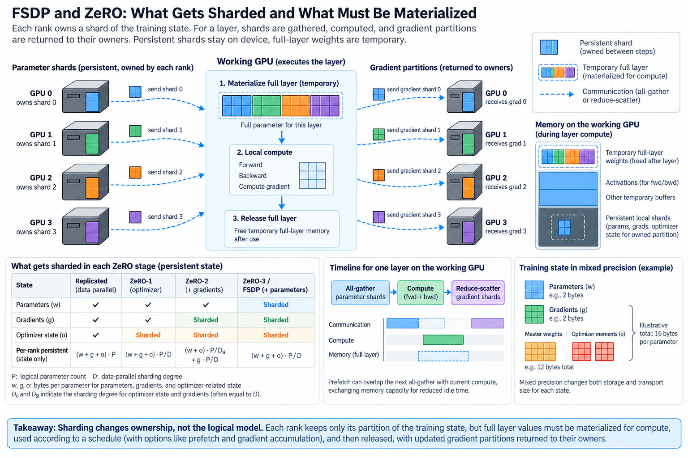
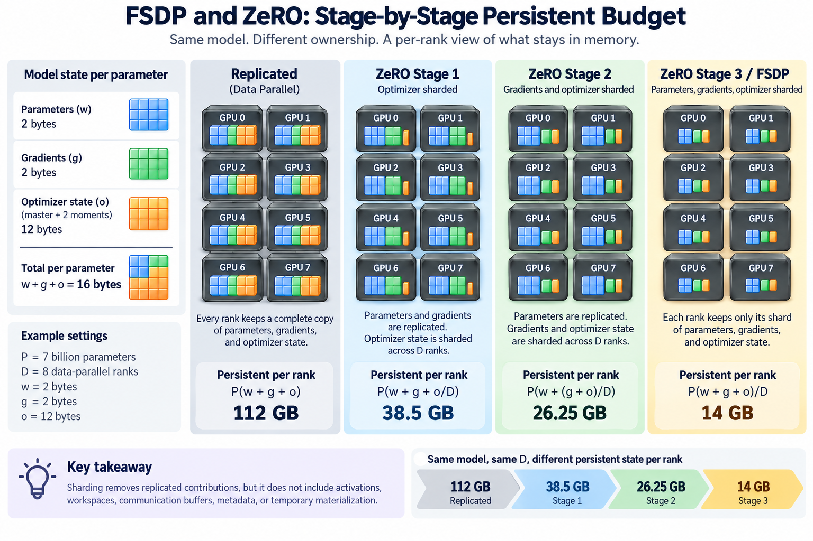
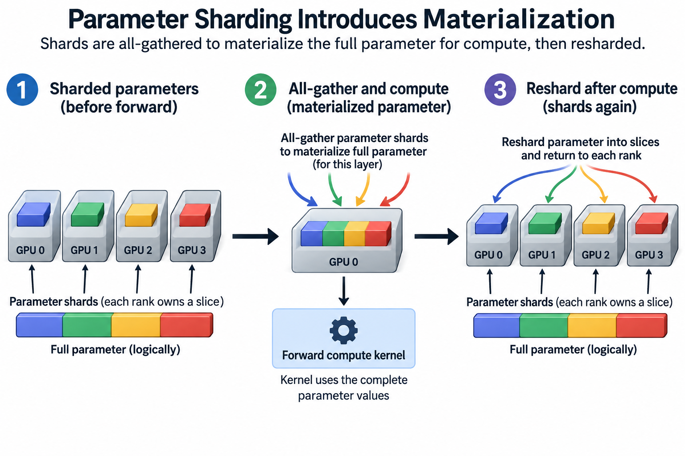
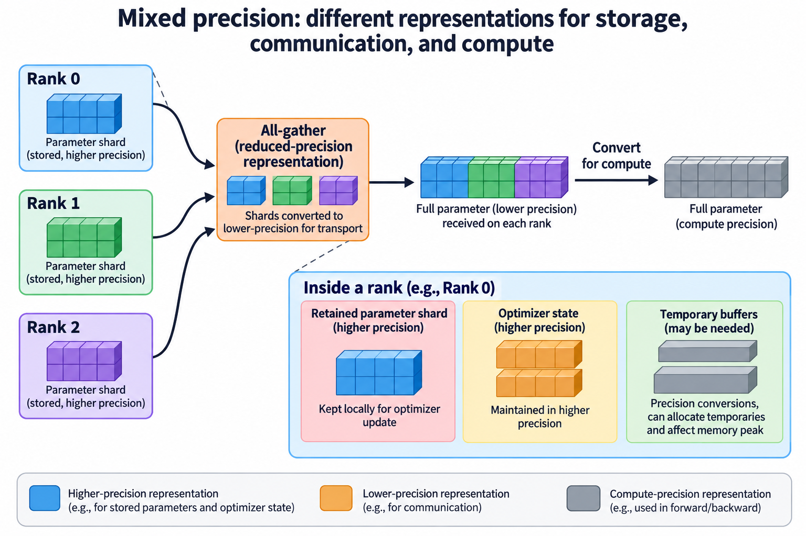

## Overview

Replicated data parallelism keeps a complete training instance on every rank. When the persistent state alone exceeds device capacity, the problem cannot be solved by sending gradients more efficiently. The ranks must change which objects they own. ZeRO and Fully Sharded Data Parallel, usually called FSDP, distribute training state while preserving the logical model and its update.

The important distinction is between ownership and availability. A rank may own only a parameter shard at rest, yet need the complete parameter values for the layer it is about to execute. Those values have to be materialized, used, and released according to an execution schedule. A theoretical persistent-state reduction is therefore only the beginning of the memory analysis.

We will account for the familiar ZeRO stages, derive a simplified per-rank budget, and examine why sharding units, all-gather prefetch, and gradient accumulation affect the peak. Framework APIs evolve; the article explains mechanisms rather than prescribing a version-independent configuration snippet.

## Deep dive

### 1. Name the state being partitioned

A conventional mixed-precision Adam example can contain compute weights, gradients, higher-precision master weights, and 2 optimizer moments. With 2-byte weights, 2-byte gradients, and 12 bytes of master and moment state, the persistent total is 16 bytes per parameter. This is an illustrative representation policy, not a mandatory property of every optimizer implementation.

Let P denote logical parameter count and D the data-parallel sharding degree. Let the byte contributions for parameters, gradients, and optimizer-related state be w, g, and o per logical parameter. Keeping those contributions separate makes it possible to describe sharding without assuming a particular precision policy.

Ownership determines which rank retains an object between computations. Communication determines which other ranks need access to it and when. Optimizer-state sharding can assign responsibility for updating a subset of parameters to each rank. Gradient sharding supplies each responsible rank with the synchronized derivative for that subset. Parameter sharding also changes which weight values remain locally available.

A logical model is still complete across the group. Sharding is not pruning parameters or reducing the amount of training data. It reorganizes storage and communication for the same computation, subject to floating-point and implementation differences that should be assessed in the usual correctness comparisons.

### 2. Derive the stage-by-stage persistent budget

A simplified ZeRO accounting model for replicated parameters and gradients with sharded optimizer state is

$$
M_1=P\left(w+g+\frac{o}{D}\right).
$$

When gradients are also partitioned, the persistent model becomes

$$
M_2=P\left(w+\frac{g+o}{D}\right),
\qquad
M_3=\frac{P(w+g+o)}{D}
$$

for the idealized fully partitioned case. These expressions omit activations, workspaces, communication buffers, metadata, uneven partitions, and temporary materialization. Their purpose is to identify which replicated contributions disappear, not to promise a complete peak-memory value.

Take P equal to 7 billion, D equal to 8, w equal to 2, g equal to 2, and o equal to 12 bytes. The replicated persistent state is 112 GB. The 3 stage estimates are 38.5 GB, 26.25 GB, and 14 GB per rank. All quantities here use decimal GB consistently.

The diminishing benefit depends on the original state mix. If an optimizer has much smaller state, optimizer sharding removes less memory. If activations dominate the measured peak, even complete persistent-state partitioning may leave the main capacity constraint intact. Begin with the actual tensor inventory rather than applying a stage number as a universal memory multiplier.

### 3. Parameter sharding introduces materialization

A compute kernel generally needs the parameter values for the operation it executes. A fully sharded schedule can all-gather the parameter shards for a chosen unit before forward, compute with the materialized values, and reshard afterward. Backward may require another all-gather, depending on what the schedule retained.

Gradients can be synchronized and partitioned using reduce-scatter, giving each rank the reduced gradient shard corresponding to its ownership. This differs from DDP’s replicated final gradient. The local optimizer can update its assigned parameter shard using locally retained optimizer state.

These operations preserve the logical data-parallel computation but alter the communication sequence. All-gathers create readiness dependencies before compute. Reduce-scatters create dependencies before updates. Prefetch can move some communication earlier, but it cannot remove the need to obtain the values or the resources required to transfer them.

The FSDP documentation describes full-shard behavior in terms of unsharding before forward and backward and resharding after those phases. Other strategies and newer APIs expose different controls. Verify the semantics of the installed version, particularly options governing retention, accumulation, and mixed precision, before mapping a profiler trace to the generic model.

### 4. The sharding unit is a scheduling decision

A sharding unit defines which parameter values are gathered together. Large units amortize collective startup and can reduce the number of communication operations. They also materialize more memory at once and can delay compute until a larger transfer finishes.

Small units reduce the size of an individual materialization, but may produce many collectives with startup and launch overhead. A very fine partition can also limit overlap if the next unit is not issued early enough. Layer boundaries are useful starting points because they reflect computational dependencies, yet they are not guaranteed to be optimal communication boundaries.

Consider a model whose idealized persistent local state is 14 GB. If the active full parameter unit needs 1 GB, one additional prefetched unit needs another 1 GB, and activation and workspace demand together peaks at 12 GB, the simple concurrent total is 28 GB. Counting only the 14-GB shard set would understate that peak by a factor of 2.

Whether those allocations really overlap is an empirical question. Some gathered storage aliases or replaces other buffers; some implementations rate-limit outstanding gathers. Use allocation lifetimes and device measurements rather than mechanically adding a parameter-shard term and a full-model term that may double-count storage.

### 5. Prefetch exchanges capacity for overlap

A useful schedule gathers the next unit while computing the current one. If communication finishes before the next unit is needed, the critical-path stall can shrink. The price is holding the prefetched values alongside the current working set.

For unit j with gather duration a_j, compute duration c_j, and a release policy that permits at most one unit of lookahead, ideal overlap can approach the larger of the gather and compute stages during steady state. Fill, drain, late issuance, and variable unit costs create exposed intervals beyond that simple bound.

$$
T_{\mathrm{stage,ideal}}\gtrsim\max(a_j,c_j),
\qquad
M_{\mathrm{active}}\approx M_{\mathrm{current}}+M_{\mathrm{prefetched}}.
$$

The 2 expressions explain the tradeoff but are not exact FSDP timing or allocation formulas. Communication and compute can share GPU execution resources, memory bandwidth, and interconnects. Prefetch can also compete with reduce-scatter work from the preceding unit. A shorter gather stall may coincide with slower compute.

Tune lookahead and unit size together under a fixed capacity limit. Record both peak memory and complete optimizer-step time. A configuration that barely fits average inputs but fails on supported long sequences is not a valid speedup for the intended workload.

### 6. Gradient accumulation can change retained state

Accumulating multiple microsteps changes when synchronized gradients and parameter materializations can be released. A configuration intended to avoid repeated communication may retain more local gradient state than the ideal steady-state sharding expression suggests.

This behavior depends on the sharding strategy and API. In particular, disabling synchronization is not simply the DDP memory story applied to a fully sharded instance. Consult the framework documentation for the specific retention and accumulation semantics, and measure the largest accumulation interval supported by the training job.

Loss normalization remains essential. Sharding state does not decide whether the desired objective averages valid tokens, examples, or ranks. Preserve the same effective global batch and weighting when comparing configurations. If one layout uses a different microbatch or accumulation factor to fit, document that change and its effect on useful work.

Gradient clipping also requires the correct global norm. The local norm of one gradient shard is not generally the norm of the entire logical gradient. Use framework-supported distributed clipping or an explicitly correct reduction of squared norms, accounting for replicated versus partitioned contributions to avoid counting some values multiple times.

### 7. Mixed precision changes both storage and transport

The representation of retained shards may differ from the representation used for compute or communication. A parameter all-gather can use a reduced-precision representation, while an optimizer update maintains a higher-precision local state. Gradient reduction policies can likewise differ from gradient accumulation policies.

Each choice affects at least 3 questions: how many bytes are retained, how many bytes cross the collective, and what numerical behavior the update has. A lower communication byte count should be computed from the actual transfer dtype, not inferred from a model configuration field alone.

For a gathered unit containing U logical parameters in b-byte transport representation, the per-rank received payload in a simple balanced all-gather is approximately U b times D minus 1 divided by D. Algorithm startup, topology, and contention remain separate contributions. The bytes sent or reported as collective bandwidth can use conventions that differ from this payload accounting.

Inspect tensor dtypes and communication traces after initialization. Some precision conversions introduce temporary buffers, and those buffers can matter at a memory peak. Evaluate training stability and held-out behavior when changing precision, rather than treating smaller transport objects as a purely mechanical performance improvement.

### 8. Checkpointing must preserve logical ownership

Saving a training job needs more than dumping whatever tensor objects happen to be visible on rank 0. The checkpoint should represent model and optimizer state in a form that can be reconstructed with the intended distributed layout. Gathering a complete state dictionary on one GPU can reintroduce the capacity problem sharding was designed to solve.

Distributed checkpoint systems can write state shards in parallel and reshard during loading. Their planners, metadata, storage writers, and supported tensor representations determine what layout changes are valid. A checkpoint written by one sharding strategy is not automatically portable to every different framework or optimizer convention.

Include the training position, data iteration state where needed, random-number state, scheduler state, and configuration alongside tensor values. Test loading and at least one subsequent optimizer step before relying on a checkpoint for a long run. Successful file creation is weaker evidence than successful reconstruction and continued useful training.

### 9. Build a feasible comparison matrix

Start with the smallest unsharded or replicated reference that fits and gives an understood update. Validate the sharded computation on a manageable model before scaling parameter count. Compare gradients or parameter updates with tolerance appropriate to the precision and collective ordering.

For the target model, list the feasible configurations under the device capacity limit. Record sharding degree, unit boundaries, prefetch settings, microbatch, accumulation, precision, checkpointing, and offload. Sweep one interacting group of choices at a time rather than changing every setting until a job happens to survive.

Separate the constraints in the final results. Persistent state explains an ownership reduction. Measured peak explains whether execution fits. Step time explains scheduling efficiency. Useful tokens and training quality explain whether the job makes comparable learning progress. A single headline such as “8 times less memory” cannot substitute for all 4.

If scale-out performance deteriorates, inspect the expensive all-gather and reduce-scatter paths. Smaller per-rank state does not imply smaller total communication, and crossing a different network boundary can erase a gain from memory capacity. Place the sharding group deliberately and connect its process topology to the physical links used by its collectives.

## Conclusion

ZeRO and FSDP change ownership of training state. Full parameter sharding also requires temporary materialization for computation, so peak memory depends on unit size, retention, and prefetch. The ideal shard budget is a useful lower layer of the analysis, not a complete execution estimate.

Choose a feasible schedule by measuring capacity and critical-path time together. Preserve the intended update, count transport representations explicitly, and test checkpoint recovery. The best configuration uses sharding to enable useful training rather than merely producing an impressive persistent-memory ratio.

### Sources

- [Rajbhandari et al., ZeRO](https://arxiv.org/abs/1910.02054): optimizer, gradient, and parameter partitioning.
- [PyTorch FSDP documentation](https://docs.pytorch.org/docs/stable/fsdp.html): sharding strategies, unsharding, prefetch, and memory behavior.
- [PyTorch FSDP2 tutorial](https://docs.pytorch.org/tutorials/intermediate/FSDP_tutorial.html): composable fully sharded training and current API guidance.
- [PyTorch Distributed Checkpoint](https://docs.pytorch.org/docs/stable/distributed.checkpoint.html): parallel save/load and load-time resharding.
