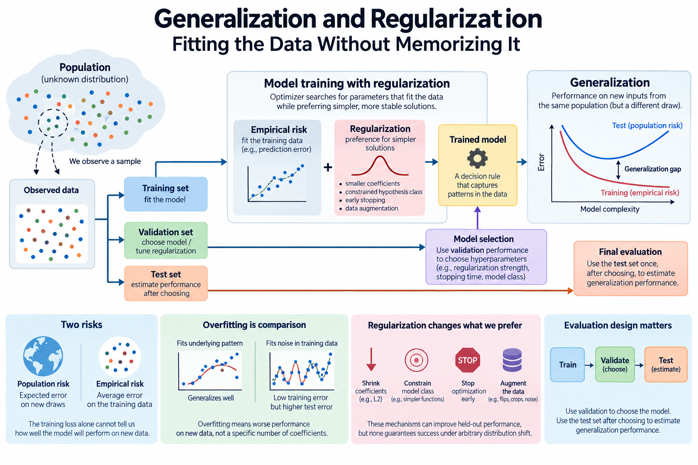
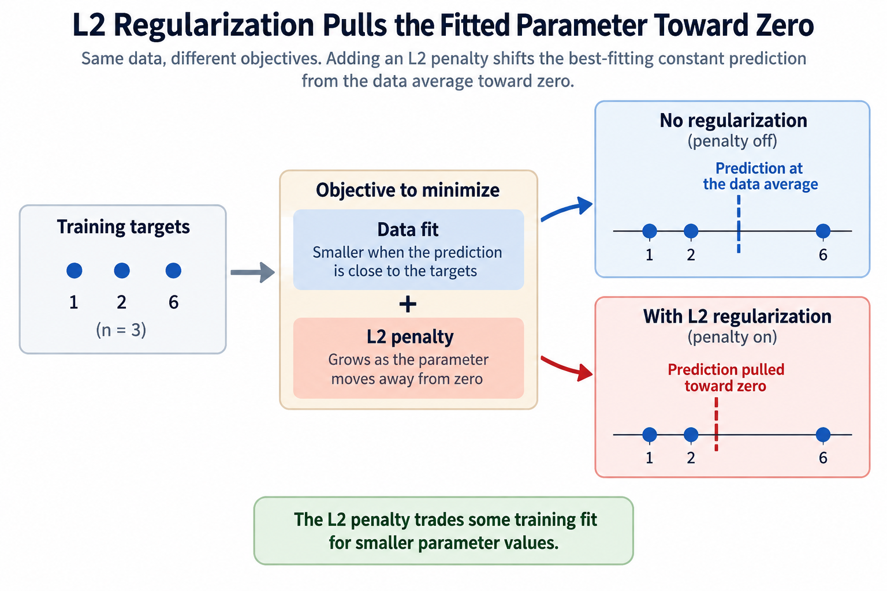
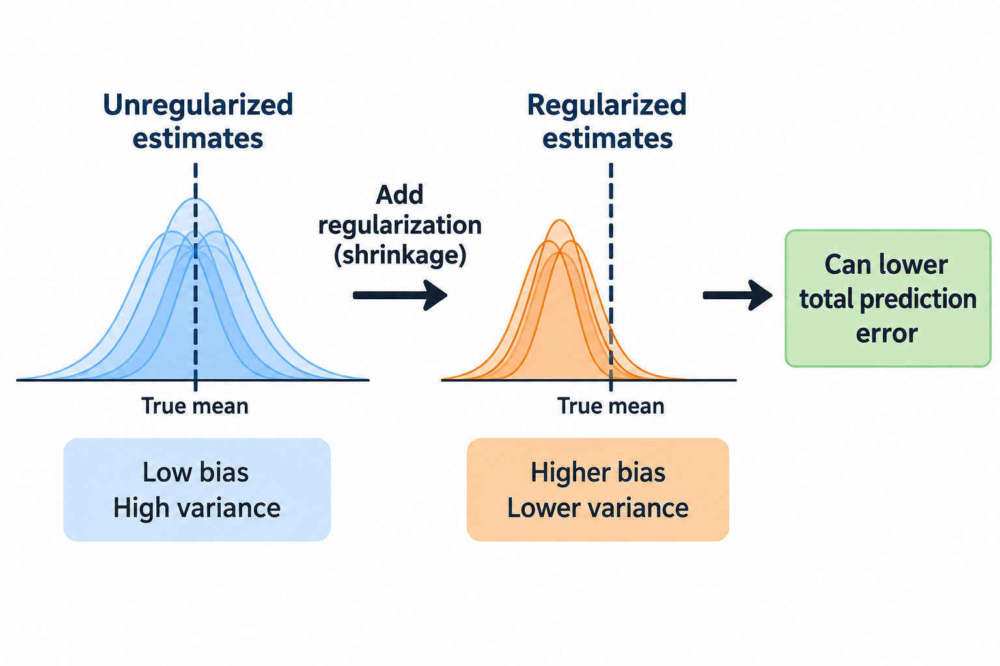
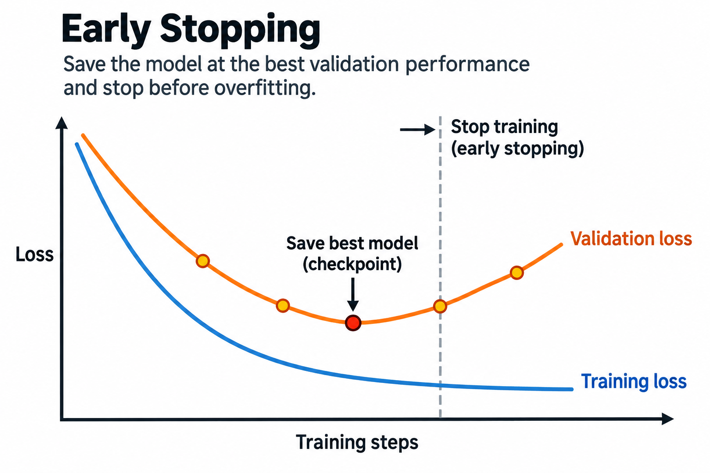

## Overview

A model can make almost no mistakes on its training examples and still fail on new inputs. Training asks an optimizer to fit observed data; generalization asks whether the resulting rule performs well on another draw from the relevant population. The second question cannot be answered by the training loss alone.

Regularization changes which fitted solutions are preferred. It can discourage large coefficients, constrain a hypothesis class, or stop optimization before it fits unstable patterns. Those mechanisms can improve held-out performance, but none guarantees that a model will work under arbitrary distribution shift. This article connects the statistical objective to a numerical example and a practical evaluation design.

## Deep dive

### Define population risk and empirical risk

Let D denote the population distribution over inputs x and targets y. A model f_theta uses parameters theta to make a prediction, and a loss function ell measures its error on 1 input-target pair. Population risk is the expected loss on a new pair drawn from D:

$$
R(\theta)=E_{(x,y)\sim D}[\ell(f_\theta(x),y)].
$$

We normally do not know D well enough to evaluate that expectation exactly. Given n training examples, empirical risk averages the observed losses:

$$
\widehat R_n(\theta)=\frac1n\sum_{i=1}^{n}\ell(f_\theta(x_i),y_i).
$$

The optimizer sees empirical risk, possibly plus other terms. Deployment cares about a relevant population risk. A model chosen to minimize the observed average may exploit accidental properties of the finite training sample. That is why the hats, averaging convention, and population definition matter.

The familiar i.i.d. assumption says examples are independent draws from the same D. Real datasets can contain repeated documents, multiple measurements from 1 person, or temporally correlated incidents. Randomly splitting such examples may leave nearly identical information in both training and evaluation. The apparent held-out result then overstates performance on genuinely new cases.

### Overfitting is a comparison, not a coefficient count

Overfitting occurs when further fitting to the observed data worsens performance on relevant unseen data, or when a flexible fitted rule captures sample-specific patterns that do not transfer. Underfitting occurs when the available model or training process cannot capture important patterns even in the observed sample.

A high-degree polynomial can pass through noisy training points and oscillate between them. A low-degree polynomial can miss a genuinely curved relation. This classical picture is useful, but parameter count alone does not determine generalization. Data quantity and diversity, optimization, architecture, implicit constraints, and task structure also matter.

Modern neural networks often have more parameters than training examples and can still generalize. That does not mean overfitting disappeared; it means a simple “more parameters always means worse test error” story is inadequate. Use matched train and validation learning curves and subgroup evaluations instead of inferring behavior from the checkpoint size alone.

The loss being compared must also match. Training can use augmentation, dropout, or label smoothing while validation disables those features or uses ordinary labels. Training loss may then exceed validation loss without demonstrating an error. State the evaluation conditions before interpreting the gap.

*Original conceptual summary based on the empirical-risk distinction; this figure contains no measured learning curve.*

### Work an L2-regularized estimator by hand

Consider the simplest regression model: every prediction is the same scalar parameter w. Our 3 illustrative targets are 1, 2, and 6. Use mean squared error with a factor one half, plus an L2 penalty with strength lambda greater than or equal to 0:

$$
J(w)=\frac{1}{2n}\sum_{i=1}^{n}(w-y_i)^2+\frac{\lambda}{2}w^2.
$$

Here n equals 3 and the sample mean y_bar equals 3. Differentiating gives J prime equal to w minus y_bar plus lambda times w. Setting the derivative to 0 yields:

$$
\widehat w_\lambda=\frac{\bar y}{1+\lambda}.
$$

Without regularization, lambda equals 0 and the fitted prediction is 3. With lambda equal to 1 half, the fitted prediction becomes 2. The penalty pulls the coefficient toward 0, accepting worse fit to the observed targets in exchange for a preference built into the objective.

Unregularized mean squared error at w equal to 3 is 14 divided by 3, about 4.667. At w equal to 2 it is 17 divided by 3, about 5.667. The regularized model has worse training fit. That is expected, not evidence that the derivative is wrong. The regularized objective includes a second term.

Suppose a tiny illustrative validation set contains targets 1 and 2. Its mean squared error is 2.5 at w equal to 3 and 0.5 at w equal to 2. In that example the regularized prediction performs better on validation. A different validation population could reverse the result. 2 held-out points are far too little evidence for a broad guarantee; the calculation demonstrates the tradeoff, not universal superiority.

*Original numerical example. Training and validation targets are illustrative and all errors are calculated in the article.*

### The penalty expresses a preference with units

L2 regularization penalizes squared parameter magnitude. For a vector w, the penalty uses the sum of squared coefficients. It prefers smaller weights relative to the chosen parameterization and feature scale. Multiplying an input feature by a large constant can permit a smaller coefficient for the same predictions, changing the effective penalty unless scaling is handled consistently.

That is why regularization strength cannot be interpreted independently of preprocessing, objective normalization, and which parameters receive the penalty. Intercepts are often excluded in classical regression; neural-network implementations may exclude bias or normalization parameters. Specify those choices before comparing 2 “weight decay” settings.

Summed data loss and averaged data loss also imply different relative strengths. If the data term is multiplied by n while the penalty is unchanged, the same lambda becomes weaker relative to the observations. Copying a hyperparameter across implementations without checking reduction conventions can therefore produce a different model preference.

A Gaussian parameter prior yields an L2-type term in a MAP objective, as derived in [MAP estimation](/blog/map-estimation-and-priors/). The coefficient depends on prior variance, observation-noise variance for Gaussian regression, and whether the likelihood loss is summed or averaged. “L2 is a Gaussian prior” is a useful connection only after those conventions are stated.

### Going deeper: bias and variance under squared error

For squared-error regression, let m(x) be the true conditional mean of y given x. Imagine repeatedly drawing training datasets and fitting a prediction function to each. At a fixed x, the average prediction across those datasets can differ from m(x); that difference is bias. Predictions can also vary across datasets; that spread is estimator variance.

Under the usual decomposition assumptions, expected squared prediction error separates into squared bias, estimator variance, and irreducible conditional noise. Regularization can increase bias while reducing variance, potentially lowering total prediction error. The irreducible noise term does not vanish merely because the model has more parameters.

The constant-model example illustrates shrinkage bias. If the true mean is 3, a penalty pulling the estimator toward 0 makes its expected prediction smaller than 3. If the sample mean is noisy, that same shrinkage can reduce variability. Which effect dominates depends on the signal, noise, sample size, and penalty strength.

This decomposition is specific to a loss and statistical setup. It is not a universal 3-number explanation for every neural network or classification metric. Nor does it imply a single smooth tradeoff curve under all modern training regimes. Use it to understand a mechanism, then measure the task and loss actually relevant to the application.

The scalar shrinkage example can quantify the bias-variance tradeoff instead of only naming it. Suppose independent targets have mean mu and variance sigma squared, and the estimator is the sample mean divided by 1 plus lambda:

$$
\operatorname{Bias}(\widehat w_\lambda)=-\frac{\lambda\mu}{1+\lambda},\qquad
\operatorname{Var}(\widehat w_\lambda)=\frac{\sigma^2}{n(1+\lambda)^2}.
$$

For a new independent target, mean squared prediction error adds squared bias, estimator variance, and irreducible sigma squared. With mu equal to 1, sigma squared equal to 9, and n equal to 3, no penalty gives error 12. Choosing lambda equal to 1 gives squared bias 0.25 and estimator variance 0.75, so total error is 10. Shrinkage improves expected prediction error in this assumed population despite biasing the estimate.

If the true mean were much farther from 0, the same penalty could hurt. That is the method's preference and its cost in explicit form. Use validation to choose lambda under the intended population rather than assuming the illustrative prior is appropriate. This derivation applies to a constant estimator with squared loss; it is not a universal quantitative model of neural-network generalization.

### Validation chooses; testing estimates after choosing

Split data into training, validation, and test roles. Training fits parameters. Validation selects hyperparameters, checkpoints, preprocessing, and other modeling choices. A test set estimates performance after those choices are fixed. Repeatedly consulting test results to choose a model turns that set into another validation source.

Hyperparameter search can overfit a validation set too. Trying many settings and keeping the best exploits noise in their estimates. Use adequate validation data, restricted search where appropriate, or nested evaluation when estimating an entire selection procedure. Do not report the best validation score as an unbiased estimate of its selected model's future performance.

Group-aware and time-aware splits often matter more than the split fractions. If deployment predicts future events, train on earlier data and evaluate on later data. If deployment handles new users or documents, keep related examples in the same split. Otherwise the model can benefit from information it would not possess in the intended use.

Preprocessing must follow the same boundary. Fit scalers, imputation rules, vocabulary choices when data-dependent, and feature selection on training data, then apply them to held-out data. Using all examples to select predictive features before splitting leaks target information even if the final parameter fit uses only the training partition.

### Early stopping, augmentation, and explicit penalties

Early stopping selects a checkpoint before additional optimization harms validation performance. It constrains the optimization path and can act as regularization. It needs a selection rule, a representative validation set, and enough patience to distinguish meaningful changes from noise. Stopping at the lowest observed value across many checks still involves model selection.

Data augmentation modifies training examples while intending to preserve their target relationship. An image translation may preserve a label, while altering a medical feature or changing the word “not” in text may not. The augmentation encodes an invariance assumption. Validate that assumption for the task rather than adopting a transformation merely because it helps another dataset.

Dropout injects randomness into selected activations during training and changes how the network distributes predictive work. Its evaluation behavior differs from its training behavior. Explain the configuration and do not equate a stochastic training loss directly with deterministic inference loss.

Weight decay and L2 penalties deserve careful naming. With ordinary gradient descent on a simple parameter vector, adding an L2 gradient produces multiplicative shrinkage alongside the data-gradient update. With adaptive optimizers, decoupled weight decay and adding an L2 term are generally different operations. Check the optimizer documentation and algorithm rather than treating their hyperparameters as interchangeable.

### Generalization is limited by distribution change

A well-regularized model can fail if the deployment distribution differs from the training and validation population. New terminology, different measurement devices, changing user behavior, and adversarial inputs can alter relevant relationships. Regularization helps manage fitting under assumptions; it does not certify robustness to every future change.

Monitor slices tied to those changes and refresh evaluation data deliberately. A single global average can hide a regression in a small but important group. If the application has asymmetric error costs, evaluate the corresponding decision metric in addition to a generic training objective.

Language models add contamination concerns: benchmark questions or close variants may appear in training data. Performance on them may measure exposure as well as transferable ability. Dataset provenance, deduplication, temporal boundaries, and carefully designed new evaluations make the generalization claim more credible.

For an operational connection, the serving system's performance benchmark also needs a representative population of requests. A model-quality validation set and a latency workload are different artifacts, but both require honest sampling and clear boundaries. Optimizing either against an unrepresentative sample produces a misleading deployment expectation.

*Redrawn from [Dive into Deep Learning, Fig. 3.6.1](https://d2l.ai/chapter_linear-regression/generalization.html#fig-capacity-vs-error). This is classical schematic intuition, not measured data or a universal law for neural networks.*

### Common misconceptions

“Regularization always improves accuracy.” It changes the fitting preference. An excessive penalty underfits, and a poorly chosen prior or invariance can hurt the relevant task. Select it using a sound validation process.

“A small train–validation gap proves success.” Both losses can be poor, or both sets can share leaked information. Compare absolute performance, split design, subgroup behavior, and the deployment population.

“More data automatically fixes shift.” More examples from the wrong population can make the wrong relationship easier to learn. Data relevance and coverage matter alongside quantity.

## Conclusion

- Empirical risk fits observed data; population risk describes a specified unseen-data process.
- Regularization trades fit against a stated preference whose scale and parameterization matter.
- Evaluation boundaries, representative splits, and distribution-change monitoring are necessary to interpret any improvement.

Connect the objective back to [MLE](/blog/maximum-likelihood-estimation/), [MAP](/blog/map-estimation-and-priors/), and [cross-entropy](/blog/cross-entropy-and-kl-divergence/), then follow its role in [pretraining and adaptation](/blog/pretraining-finetuning-rlhf/).

### Sources

- [Dive into Deep Learning: Generalization](https://d2l.ai/chapter_linear-regression/generalization.html), empirical versus generalization error, model selection, and validation.
- [Dive into Deep Learning: Weight Decay](https://d2l.ai/chapter_linear-regression/weight-decay.html), L2 penalties, shrinkage, and feature-scale considerations.
- [PyTorch AdamW documentation](https://docs.pytorch.org/docs/stable/generated/torch.optim.AdamW.html), algorithm and decoupled weight-decay behavior.
