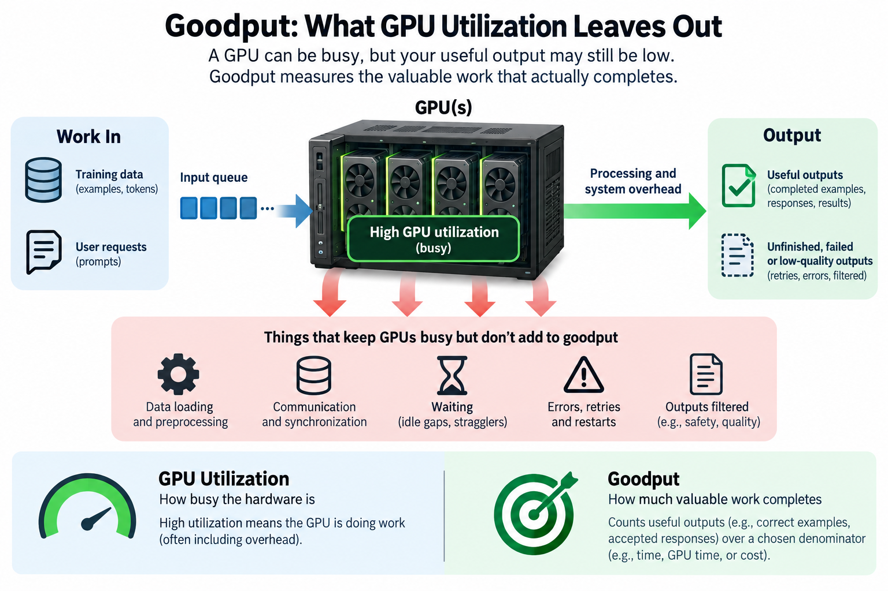
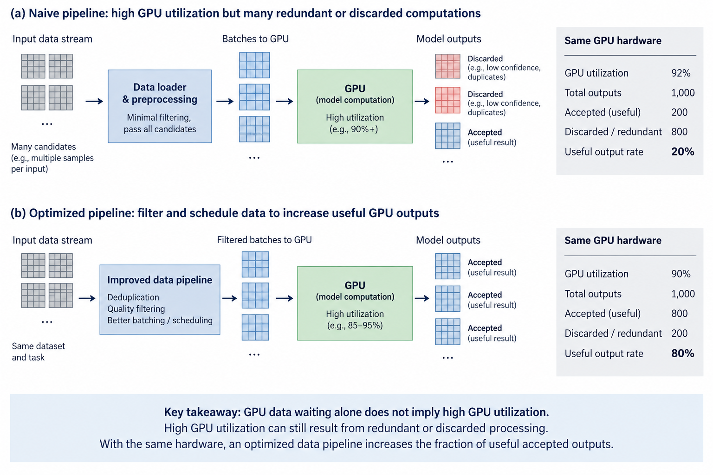
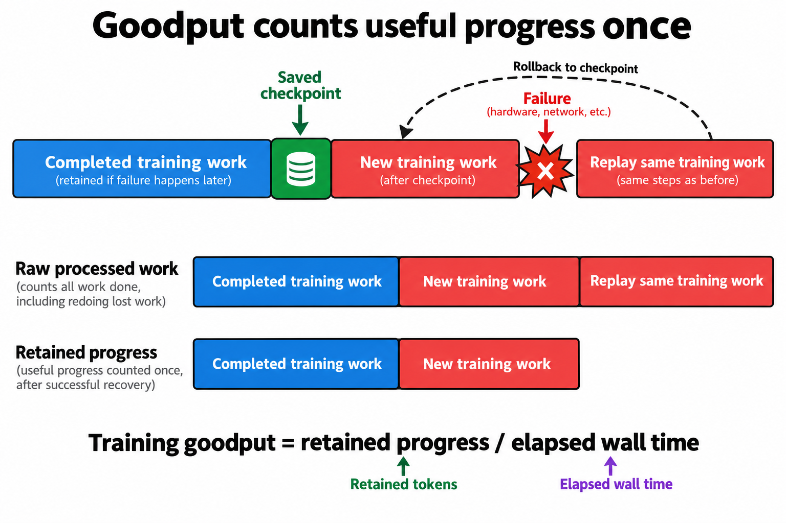
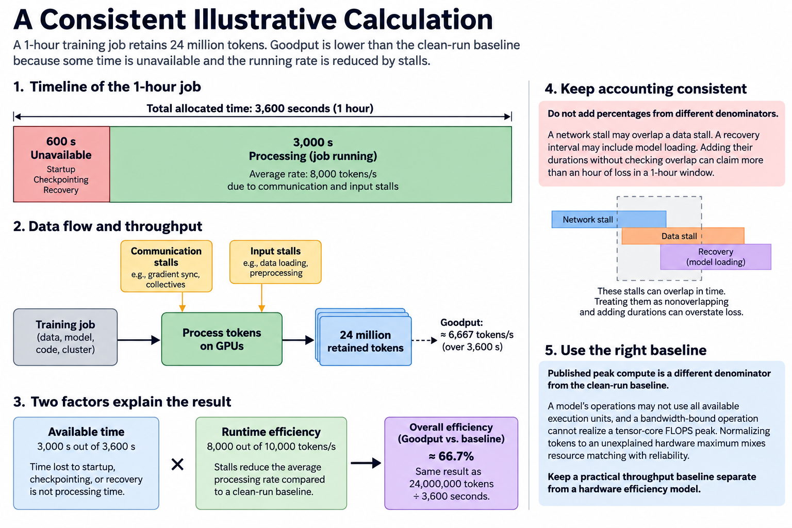
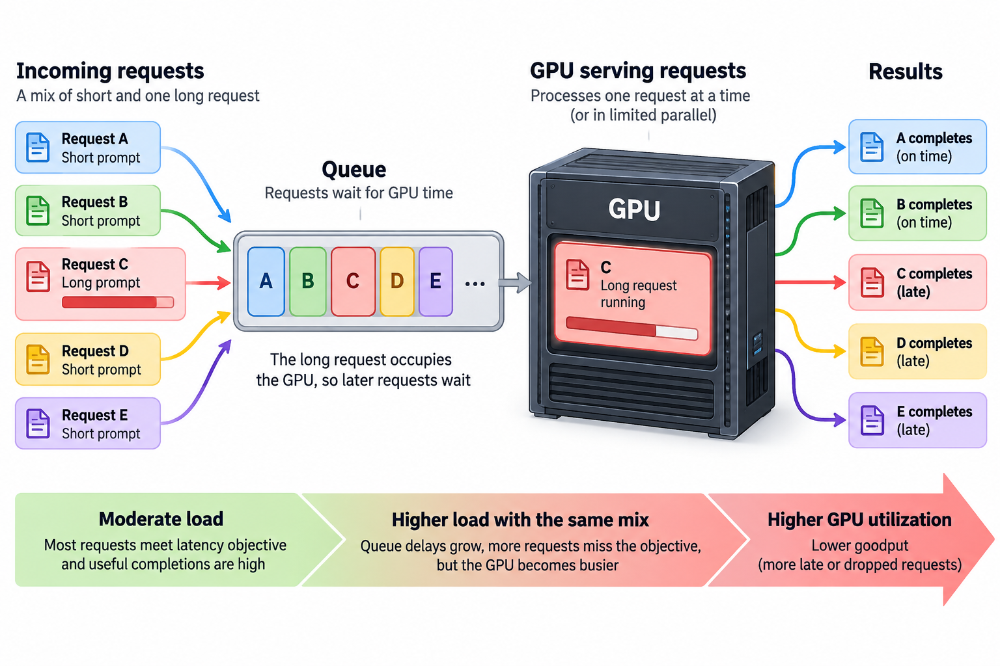

## Overview

Your GPU dashboard can report high utilization while the job makes disappointing progress or the service misses its promises.

Those 2 sentences can both be true at once, and understanding why is the single most important idea in AI performance engineering. This article is about the metric that exposes the gap: **goodput**.

## Deep dive

### Busy is not useful

"Utilization" answers 1 question: is the GPU doing *something* right now? It says nothing about whether that something moves your training run or your user's request forward.

Goodput asks the better question: **of the work this hardware could theoretically deliver, how much became useful output?** For an LLM cluster, useful output is tokens actually processed toward training or inference — after subtracting everything else:

- GPUs stalled waiting for gradient synchronization over the network
- GPUs starved because the data pipeline can't feed them fast enough
- Compute thrown away when a job fails and restarts from a checkpoint
- Preemptions, network congestion, stragglers holding back the whole cluster

Some overheads leave GPU kernels active, while others leave the device idle. Repeated work can raise activity without advancing retained progress. The dashboard stays green. The money burns.

### What Meta actually measured

Meta's infrastructure team analyzed research-cluster reliability in [Revisiting Reliability in Large-Scale Machine Learning Research Clusters](https://arxiv.org/abs/2410.21680). Their effective training time ratio evaluates reliability and job overhead at a defined scope. It should not be read as a universal claim that 70 percent of every fully utilized GPU cluster is wasted. The study motivates measuring retained progress over the full job lifecycle.

The following figure is an illustrative accounting schematic, not a reproduction of Meta's measured fleet results.

### Why this metric changes behavior

Once you track goodput instead of utilization, priorities reorder themselves:

**Utilization thinking** says: the GPUs are busy, buy more GPUs. **Goodput thinking** says: find out what the busy-ness is made of first. A caching layer for the data pipeline, overlapping communication with computation, or faster failure recovery can each be worth more than new hardware — at a fraction of the price.

This is also why the job I described in [the previous article](/blog/what-does-an-ml-performance-engineer-do/) exists at all. The gap between theoretical and useful throughput *is* the performance engineer's territory. Closing 20 points of it on a large cluster is worth millions of dollars a year — and unlike buying hardware, it compounds: every future job runs on the improved stack.

### How to start measuring it

You don't need Meta's infrastructure to begin:

1. Define a validated clean-run throughput baseline for the same model and workload; keep hardware-bound estimates separately labeled
2. Measure tokens actually completed per wall-clock hour, *including* failures and restarts
3. Divide. That ratio — not utilization — is the number to put on the team dashboard

The first time a team runs this exercise, the result is usually uncomfortable. That discomfort is the point: you can't close a gap you haven't measured.

### There is more than 1 goodput denominator

The word goodput appears in several systems contexts, and its exact definition must accompany the number. A network may count application bytes delivered after excluding protocol overhead and retransmissions. A training system may count retained progress per elapsed hour. A serving system may count requests or tokens that meet latency and quality requirements. These quantities share the idea of useful completion, but they are not interchangeable ratios.

For a training run, an operational definition is retained training tokens divided by wall-clock time. “Retained” means that repeated work after a rollback counts only once. If a run processes 1 million tokens, loses the last hundred thousand, then recomputes them, raw processed tokens exceed useful progress. Tracking checkpoint position and optimizer progress prevents the repeated computation from inflating the result.

For serving, 1 possible definition is the rate of requests that satisfy a specified service objective. If a benchmark accepts 1,000 requests during 100 seconds and only 900 meet the required latency and quality, request goodput is 9 requests per second. It is neither the offered rate of 10 requests per second nor the GPU's utilization. The failed or late requests still consumed resources, but they did not satisfy the promised service.

Token goodput is another legitimate definition, but length weighting changes the result. A long response contributes more tokens than a short response, and an aggregate token objective can conceal poor treatment of short interactive requests. Publish both the weighting and the acceptance rule so the team understands which behavior the metric rewards.

### A consistent illustrative calculation

Consider a hypothetical training job with a validated clean-run baseline of 10,000 retained tokens per second. During an hour of allocated time, 600 seconds are lost to startup, checkpointing, or recovery. During the remaining 3,000 seconds, exposed communication and input stalls reduce the average processing rate to 8,000 tokens per second. The job retains 24 million tokens:

$$
G_{\mathrm{train}} = \frac{24{,}000{,}000}{3{,}600}
\approx 6{,}667\ \text{tokens/s}.
$$

Relative to that clean-run baseline, efficiency is about 66.7 percent. The 2 factors are available time, 3,000 divided by 3,600, and runtime efficiency, 8,000 divided by 10,000. Multiplying them gives the same answer:

$$
E = \frac{3{,}000}{3{,}600}\times\frac{8{,}000}{10{,}000}
\approx 0.667.
$$

This example deliberately defines nonoverlapping categories. You cannot safely subtract percentages collected from different denominators. A network stall may overlap a data stall; a recovery interval may include model loading. Adding their durations without checking overlap can claim more than an hour of loss in a 1-hour window. A timeline and an accounting convention make the decomposition meaningful.

Published peak compute is a different denominator from the clean-run baseline. A model's operations may not use all available execution units, and a bandwidth-bound operation cannot realize a tensor-core FLOPS peak. Normalizing tokens to an unexplained hardware maximum mixes resource matching with reliability. Keep a practical throughput baseline separate from a hardware efficiency model.

### Read reliability evidence at its actual scope

The Meta reliability study analyzes a particular set of research-cluster jobs and models effective training time as a function of job and system parameters. Its effective training time ratio concerns retained training progress and the effects of reliability and job overhead. It is evidence that failures, recovery, scheduling, and job duration matter at scale. It is not evidence that every GPU fleet loses 70 percent of its compute to 1 universal set of causes.

A reliability ratio also does not directly measure kernel efficiency or model FLOPS utilization. A job can retain nearly all of its executed progress while using inefficient kernels. Another can use efficient kernels during healthy execution and lose substantial wall time to recovery. Combining these views is helpful; collapsing them into 1 unexplained percentage makes diagnosis harder.

The practical lesson is to inspect the population behind a published number: training or inference, large jobs or small jobs, allocated time or active execution, measured outcomes or modeled projections. Then choose a matching metric for your own workload. A benchmark is context for reasoning, not a substitute for local measurement.

### Why tails change the answer in serving

Suppose a service delivers 100 requests per second at moderate load, and nearly all requests meet a 2-second first-token objective. Increasing offered traffic to 130 requests per second might raise raw throughput while causing queue delays that push many requests past the objective. The hardware can become busier as the useful completion rate becomes worse.

The relationship follows from a simple queueing fact: stable operation requires average arrival demand to remain below service capacity. Near capacity, variability has little room to dissipate. Bursts accumulate, long prompts occupy resources, and 1 slow request can delay others. A steady arrival benchmark and a bursty production trace can therefore produce different goodput at the same average request rate.

Little's law relates average in-system work L, accepted arrival rate lambda, and average time in the system W, under stable conditions:

$$
L = \lambda W.
$$

If a stable service accepts 50 requests per second and each spends an average of 2 seconds in the system, it holds about 100 requests on average. The equation is not a tail-latency prediction, and it does not establish that a system overloaded by arbitrary arrivals is stable. It is a consistency check connecting concurrency, rate, and waiting time.

Admission control can protect latency by rejecting or deferring work before it overloads the service. That policy should expose both accepted goodput and the rejection rate. Otherwise a configuration can appear excellent by accepting only an easy subset of requests. An honest report includes offered load, completed load, accepted goodput, and the latency distribution.

### Measure progress across the whole lifecycle

For training, store the timestamps of allocation, startup completion, each successful checkpoint, failures, restart completion, and final durable progress. Pair those events with the retained token or optimizer-step count. Decide whether queueing before allocation belongs in the metric: a user-facing turnaround measure may include it, while an allocated-resource efficiency measure may exclude it.

For serving, record arrival and completion timestamps, input and output lengths, status, cancellation, and the latency objectives. Separate cold starts from warm operation, but report their operational impact when the product experiences them. Use representative request distributions and realistic arrival patterns. A load generator that waits for every response before sending the next request can unintentionally hide queue growth.

The dashboard should then support a concrete investigation. A fall in retained progress with unchanged healthy-run step time suggests lifecycle or reliability overhead. A rise in step time suggests an execution or resource issue. A serving goodput drop concentrated on long prompts suggests interference or capacity pressure. The metric identifies the symptom; tracing and experiments identify the cause.

### Choose the intervention by recovered output

Return to the hypothetical training example. Recovering half of the 600-second unavailable interval adds 300 seconds at 8,000 tokens per second: 2.4 million additional retained tokens per hour. Improving the active rate from 8,000 to 9,000 over the original 3,000 seconds adds 3 million tokens. Either may be worthwhile, and their engineering costs and risks can differ substantially.

The comparison makes priorities explicit. Count useful output recovered per unit of cost, and verify that a local improvement persists in the full job. Faster checkpoint writes can affect both pause duration and the best checkpoint interval. A communication change can improve step time while increasing fragility. Goodput rewards the final retained or accepted work, so those interactions belong in the measurement.

A busy GPU is still a useful observation. It tells you that some work is executing. Pair it with completion, progress, and service objectives, and it becomes part of an explanation rather than the explanation itself.

## Conclusion

- Utilization measures busy-ness; goodput measures retained or accepted output over time. Relate that output to an explicit cost boundary.
- Reliability studies quantify particular workloads and denominators; their percentages should not be generalized to every fleet.
- Track retained or accepted output against an explicitly defined baseline. The gap you find is the highest-ROI engineering work available to your team.

A goodput dashboard should expose the denominator as clearly as the numerator. Show the observation interval, admitted request count, completion count, and the exact conditions used to accept a result. If requests can be cancelled or retried, report how those events enter the calculation. Otherwise, the same serving system can appear to improve simply because difficult requests disappeared from the measured sample. Preserve a workload description alongside each comparison, including prompt lengths, output lengths, and concurrency. This makes an improvement reproducible and helps distinguish a scheduler change from a change in the traffic it happened to receive.

### Sources

- Meta — ["Revisiting Reliability in Large-Scale Machine Learning Research Clusters"](https://arxiv.org/abs/2410.21680) (effective training time / goodput measurements)
- [MLPerf benchmark results](https://mlcommons.org/benchmarks/) — reference points for achievable throughput
- [DeepSeek-V3 Technical Report](https://arxiv.org/abs/2412.19437) — communication/computation overlap as a goodput lever

---

*Part of the [AI Infrastructure Foundations](/series/ai-performance/) learning path. Browse its published articles by topic.*
